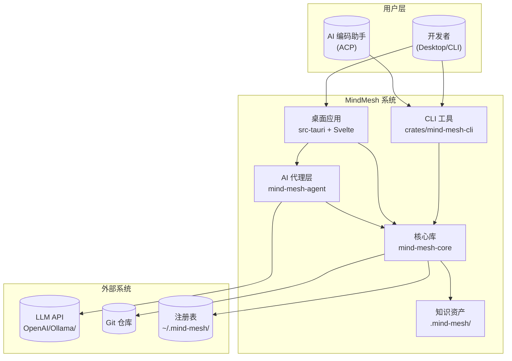

# MindMesh：AI 编码助手的工程环境管理平台

## 项目概览

MindMesh 是一个面向 AI 编码助手的**工程环境管理平台**——它能自动扫描任意代码仓库、分析项目结构、生成人类可读的架构文档（C4 模型），同时维护 AI Agent 友好的结构化知识资产。

传统上，一个新项目入职的开发者要通过阅读代码和文档来理解架构——这个过程通常需要数天甚至数周。MindMesh 将这个时间压缩到分钟级：你只需要告诉它"这是我的仓库"，它就会自动扫描源码、调用大语言模型分析架构设计、生成一套完整的 C4 模型文档（包含概述、架构、工作流、模块深度分析、接口文档和数据库概览）。

但 MindMesh 的特殊之处在于，它同时服务于**人类和 AI 两个读者**。它生成的人类友好文档用自然语言加 Mermaid 图表说明架构（适合开发者阅读），同时它生成的 Agent 友好上下文（`agent/context.md`）和源码打包（`agent/repomix.md`）是结构化的、精确的、可以直接被 AI 编码助手（如 OpenCode）读取和使用的。

MindMesh 的架构可以想象成一个"知识工厂"：**输入**是一个 Git 仓库的源码目录，**输出**是一整套结构化知识资产。工厂内部有三条主要流水线：**项目初始化**（扫描→注册→打包）把原材料拆解分类，**Litho 文档生成**（研究→编排→输出）把拆解后的信息烹饪成人类可读的知识，**DeepWiki 问答**（搜索→推理→回答）实现了"基于知识库的 AI 问答"能力。

## C4 Context 图（系统全景）

下图展示了 MindMesh 的系统上下文：开发者通过桌面应用或 CLI 与系统交互，MindMesh 调用 LLM API 进行 AI 推理，并将知识资产存储在文件系统的 `.mind-mesh/` 目录下。AI 编码助手（如 OpenCode）通过 ACP 协议调用 MindMesh 的 CLI 工具获取项目知识。

**从图中可以读出几个关键设计决策**：LLM API 是可选的——核心扫描和搜索能力完全离线运行；知识资产存储在仓库内的 `.mind-mesh/` 目录中，而非全局数据库；所有 AI 能力通过 `mind-mesh-agent` 代理层编排，核心库 `mind-mesh-core` 是纯基础设施。

## 技术选型背后的思考

MindMesh 选择 Rust 作为主力开发语言，这并不是单纯追求"高性能"。作为一个需要同时处理本地文件 IO 和远程 HTTP 调用的应用，Rust 配合 tokio 异步运行时的确在高并发下表现出色——但这更是对可靠性和安全性的考量。在 AI 集成的上下文中，系统需要处理大量 LLM API 调用、工具执行、文件读写——Rust 的所有权模型确保这些操作不会出现内存安全问题。

| 技术领域 | 具体选择 | 为什么这样选 |
|---------|---------|------------|
| 语言与运行时 | Rust (edition 2024, tokio 异步) | 内存安全 + 高性能，配合 tokio 处理 LLM 调用的密集 IO——同时管理 HTTP 请求、文件扫描和子进程通信 |
| 桌面壳框架 | Tauri v2 | 比 Electron 轻量 10 倍以上（原生 WebView），Rust 后端通过 IPC 命令直接暴露给前端，无额外通信开销 |
| 前端框架 | Svelte 5 + TypeScript + Vite + TailwindCSS | Svelte 5 编译为原生 DOM 操作，无虚拟 DOM 开销；TailwindCSS 提供原子化 CSS——适合 Markdown 渲染为主的文档型 UI |
| AI 集成框架 | adk-rust (Agent Development Kit) | 提供完整的 Agent 框架（会话管理、工具调用、流式输出）——比直接调用 LLM API 更高层，比 LangChain 更专注 |
| 源码打包 | repomix-core v2 | 专为 AI 编码助手优化的源码打包格式——比纯文本更结构化，保留符号和依赖关系 |
| 知识存储 | 文件系统（Markdown + YAML frontmatter） | 知识随代码走，不依赖中央数据库或网络服务——即使离线也能完整运行 |

## MindMesh 能做什么，不能做什么

MindMesh 的核心定位是"理解代码"，而非"编写代码"：

**它能做的事**：
- **自动生成 C4 架构文档**——扫描源码目录，调用 LLM 分析架构，输出 6 份标准文档（概述、架构、工作流、模块深度探索、边界接口、数据库概览）
- **维护 AI Agent 友好的知识资产**——生成结构化的 Agent 上下文（`agent/context.md`）和源码打包（`agent/repomix.md`），让 AI 编码助手能"读懂"项目
- **提供基于知识库的 AI 问答**——DeepWiki 面板让开发者用自然语言提问，AI 搜索知识库并回答，附源码引用
- **支持标准化工作流（SDD）**——需求澄清 → 技术方案 → 代码生成 → Code Review 的四阶段流水线
- **管理 AI 工程环境**——检测 Skills、工具链、AGENTS.md，自动集成缺失的组件

**它不做的事**：
- **不修改代码**——MindMesh 只读分析源码，不会对仓库做任何修改（SDD 的 CodeGen 阶段除外，其通过外部 ACP Agent 操作）
- **不托管外部服务**——所有数据存储在本地文件系统中，不运行 Web 服务器或数据库
- **不替代版本控制**——读取 Git 仓库的结构信息，但不替代 Git 本身
- **不存储大型二进制文件**——所有知识资产全是文本 Markdown，设计目标就是通过 Git 协作共享

---

> **置信度评分**：9/10 — 基于完整的预处理报告（源代码扫描 + 配置文件分析 + 目录结构分析），技术栈信息来自 Cargo.toml 和 package.json 的实际依赖，功能描述来自 CLI 定义、Tauri 命令列表和核心库的公共 API 签名。
