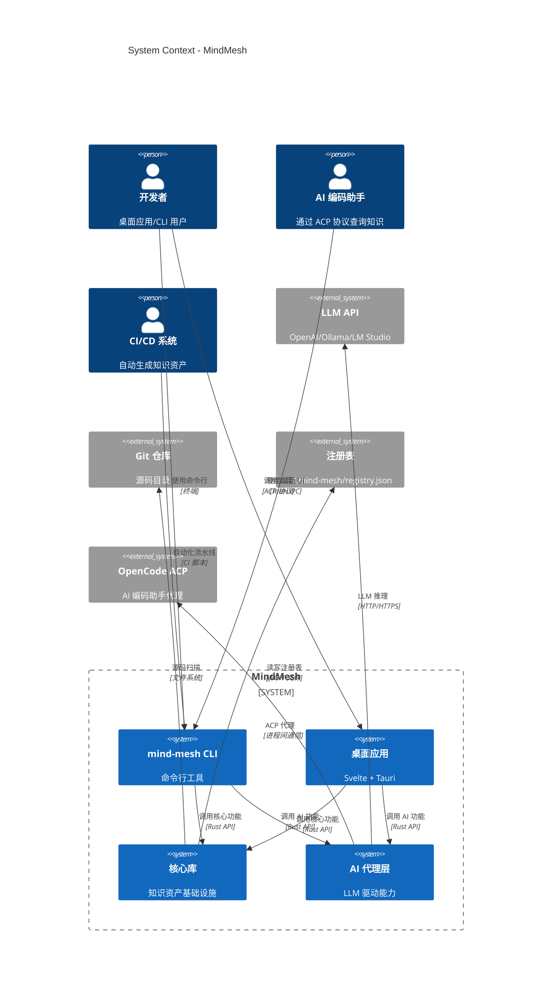
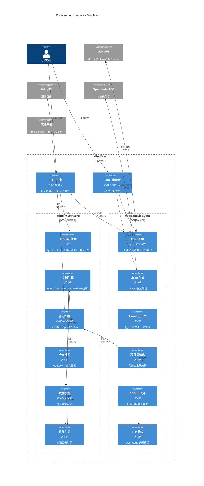
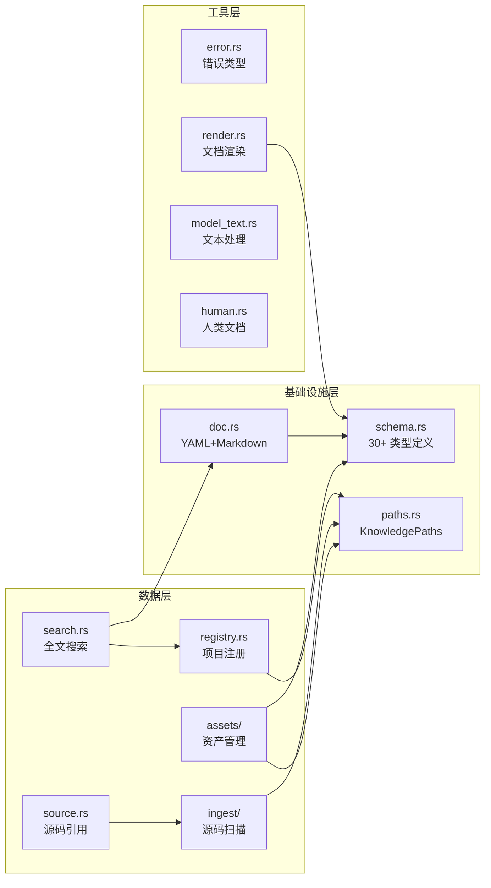
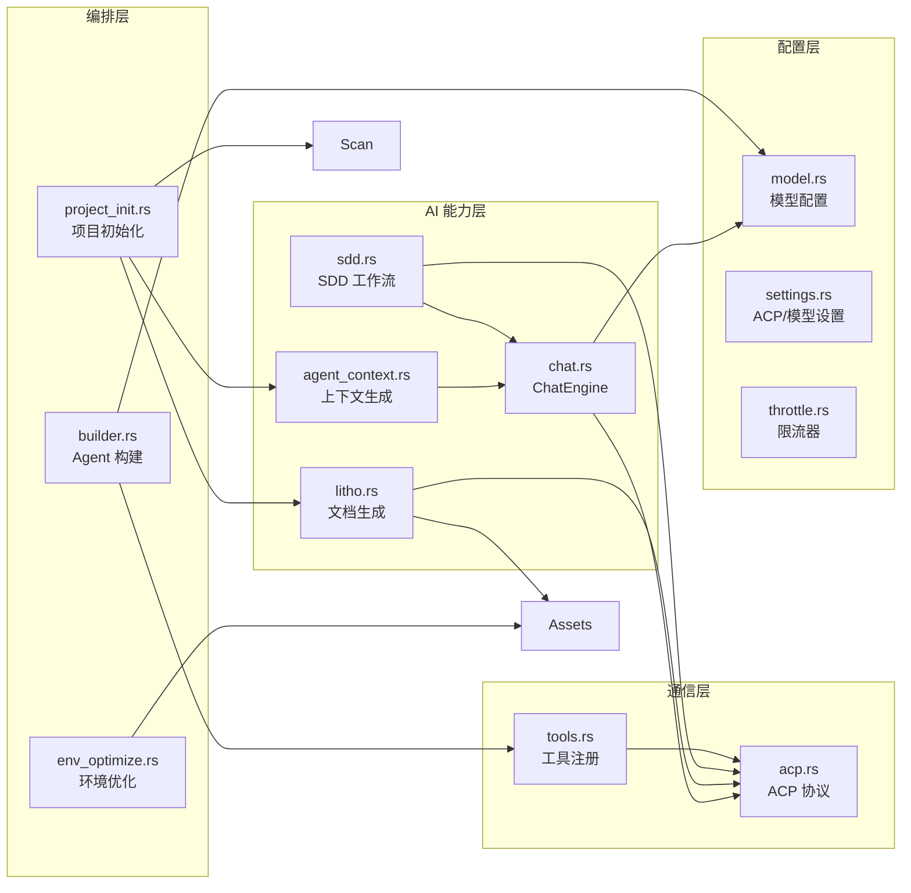
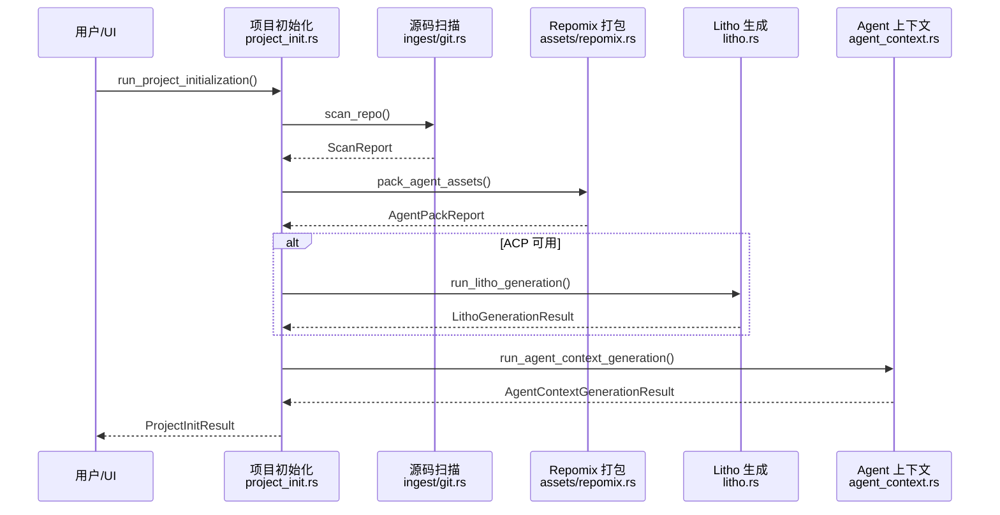
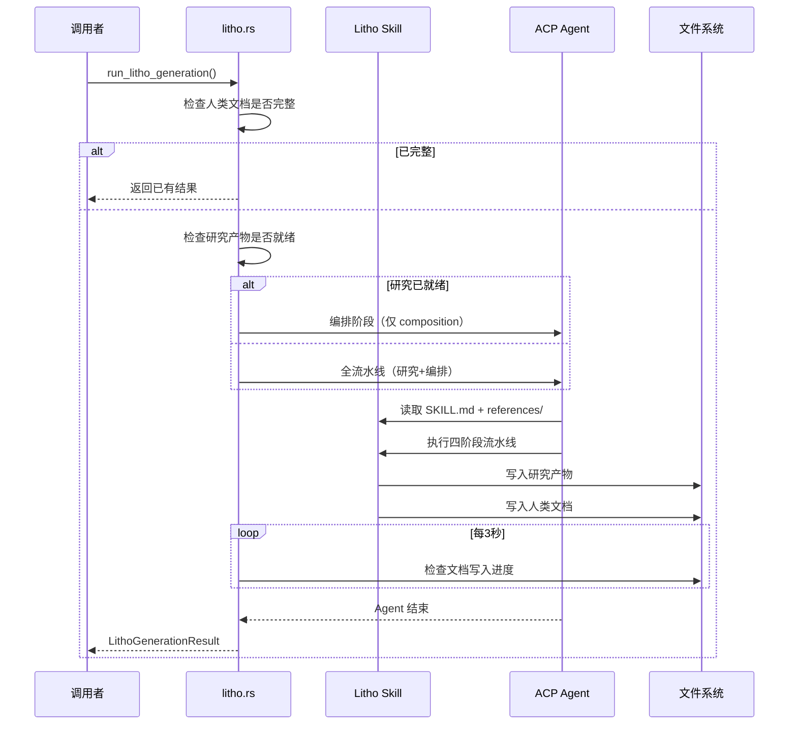

# 系统架构文档：MindMesh

**版本：** 1.0
**分类：** 内部架构文档
**生成日期：** 2026-06-14

---

## 1. 架构概述

### 1.1 设计理念

MindMesh 的设计围绕三个核心理念展开：

**1. "知识原位"原则——知识随代码走**
MindMesh 的所有知识资产存储在仓库自己的 `.mind-mesh/` 目录下，而非全局中心化存储。这意味着每个 Git 仓库自带完整的文档体系，知识随代码的分支切换而自然流转。这个设计解决了传统文档仓库"仓库里写文档→文档存在 Wiki 里"的割裂问题。代码体现：`registry::knowledge_root_for_repo()`（`crates/mind-mesh-core/src/registry.rs`）返回 `{repo_path}/.mind-mesh`——知识根路径完全由仓库路径决定。

**2. 双轨制文档——同时服务人类和 AI**
系统同时为人类和 AI Agent 生成文档。Agent 友好的 `agent/context.md` 是结构化的、精确的、可被程序化读取的；人类友好的 `human/` 文档是叙述性的、包含 Mermaid 图表的、富有上下文解释的。这种双轨制解决了"要么太啰嗦（对人类好但对 AI 不好），要么太干巴（对 AI 好但对人类不好）"的矛盾。

**3. 可恢复流水线——不浪费每次 LLM 调用**
Litho 文档生成流水线被设计为可中断/可恢复的：研究阶段产出的中间产物持久化到文件系统（`.mind-mesh/.litho-agent/`），编排阶段检测到已有研究产物时跳过预处理和研究，直接进入编排。这类似于"断点续传"——即使 LLM 调用中途超时或失败，再次运行时不会从头开始。代码体现：`litho_research_ready()`（`crates/mind-mesh-core/src/assets/litho.rs:113`）检查 6 个核心研究报告是否齐全。

### 1.2 核心架构模式

| 模式 | 实现方式 | 目的 |
|------|---------|------|
| 分层架构 | `mind-mesh-core`（基础设施层）→ `mind-mesh-agent`（AI 编排层）→ CLI/Tauri（界面层） | 每层职责清晰：Core 不依赖 Agent，Agent 依赖 Core，界面层依赖两者 |
| Agent 模式 | ACP Agent（OpenCode）执行复杂任务（文档生成/代码生成）；Native LLM 执行轻量任务（问答/上下文生成） | 将 LLM 交互抽象为 Agent 会话，支持工具调用和流式输出 |
| 流水线模式 | Litho 文档生成 = 预处理 → C4 研究 → 编排 → 输出；SDD = 需求 → 设计 → 编码 → 审查 | 每个阶段产出持久化文件，支持断点续传和人工审查 |
| 文件系统作为数据库 | 所有数据存储在 `.mind-mesh/` 和 `~/.mind-mesh/registry.json` | 零运维成本，知识随代码走，支持离线运行 |

### 1.3 技术栈概述

MindMesh 的技术选型围绕"高性能桌面工具 + AI 集成"展开。Rust 提供安全和性能基础，Tokio 异步运行时处理 LLM 调用的密集 IO，Tauri v2 提供轻量桌面壳。前端选择 Svelte 5 而非 React 或 Vue 是因为 Svelte 编译为原生 DOM 操作，零虚拟 DOM 开销——对于一个以文档渲染为主的 UI，这可以显著减少内存占用。

---

## 2. 系统上下文（C4 Level 1）

MindMesh 采用"两层核心 + 双通道用户界面"的架构：`mind-mesh-core` 提供所有数据基础设施（源码扫描、知识存储、搜索），`mind-mesh-agent` 提供所有 AI 驱动能力（LLM 调用、文档生成、对话问答），CLI 和桌面应用是两个独立的用户通道。LLM API 和 ACP 代理是外部依赖——但核心扫描和搜索功能完全离线可用。

---

## 3. 容器视图（C4 Level 2）

### 3.1 领域模块职责

| 模块/领域 | 路径 | 职责 | 关键抽象 |
|---------|------|------|---------|
| 知识资产管理 | `crates/mind-mesh-core/src/assets/` | Agent 上下文、Litho/SDD 计划、repomix 打包 | `LithoPlan`, `ContextOverview` |
| Chat 引擎 | `crates/mind-mesh-agent/src/chat.rs` | LLM 会话管理、流式输出、工具调用追踪 | `ChatEngine`, `ChatReply` |
| Litho 文档生成 | `crates/mind-mesh-agent/src/litho.rs` | C4 架构文档生成编排 | `LithoGenerationJob`, `LithoProgress` |
| Agent 上下文 | `crates/mind-mesh-agent/src/agent_context.rs` | Agent 友好上下文生成 | `AgentContextGenerationResult` |
| 项目初始化 | `crates/mind-mesh-agent/src/project_init.rs` | 完整流水线编排（扫描→打包→文档→上下文） | `ProjectInitResult` |
| ACP 协议 | `crates/mind-mesh-agent/src/acp.rs` | OpenCode ACP 代理通信 | `AcpAgentConfig` |
| SDD 工作流 | `crates/mind-mesh-agent/src/sdd.rs` | 四阶段标准化开发工作流 | `SddPhase`, `SddPlan` |
| 桌面 UI | `src-tauri/` + `src/` | Tauri 桌面壳 + Svelte 前端 | `AppState`, 18 个组件 |
| 文档引擎 | `crates/mind-mesh-core/src/doc.rs` + `render.rs` | YAML frontmatter + Markdown 解析 | `KnowledgeDoc` |
| 源码扫描 | `crates/mind-mesh-core/src/ingest/` | Git 仓库扫描 + OpenAPI 导入 | `GitScanner`, `ScanReport` |
| 全文搜索 | `crates/mind-mesh-core/src/search.rs` | Markdown 全文搜索 | `KnowledgeSearch`, `SearchHit` |
| 数据模型 | `crates/mind-mesh-core/src/schema.rs` | 30+ 核心类型定义 | `DocType`, `SddPhase`, `LithoPlan` |
| 路径布局 | `crates/mind-mesh-core/src/paths.rs` | 知识目录地图 | `KnowledgePaths` |
| CLI 接口 | `crates/mind-mesh-cli/src/main.rs` | 命令行入口 | `Cli` (clap Parser) |

---

## 4. 组件视图（C4 Level 3）

### 4.1 核心库（mind-mesh-core）组件架构

### 4.2 AI 代理层（mind-mesh-agent）组件架构

---

## 5. 关键流程

### 5.1 项目初始化流程

### 5.2 Litho 文档生成流程

---

## 6. 技术实现

### 6.1 关键架构模式

**ACP Agent 模式**：MindMesh 不直接调用 LLM API 执行文档生成，而是通过 ACP 协议委托给 OpenCode（或兼容代理）。ACP 代理运行在一个独立的进程中，有自己的上下文窗口和工具执行环境。这意味着 LLM 调用和工具执行不会阻塞主进程，主进程只需轮询文件系统的产物变化。

**流水线可恢复模式**：`litho_research_ready()`（`crates/mind-mesh-core/src/assets/litho.rs:113`）检查 6 个核心研究报告是否齐全。如果齐全，流水线跳过预处理和研究阶段，直接执行编排阶段。这通过 `run_litho_generation()`（`crates/mind-mesh-agent/src/litho.rs:269`）中的 `research_ready` 判断实现。

**双通道模式**：`ChatEngine`（`crates/mind-mesh-agent/src/chat.rs:321`）支持 Native 和 ACP 两种执行模式，通过 `AskExecution` 枚举切换。Native 模式直接调用本地 LLM，ACP 模式通过 ACP 协议代理给 OpenCode。

### 6.2 并发和并行策略

MindMesh 使用 tokio 异步运行时，所有 IO 密集型操作（LLM API 调用、文件扫描、子进程通信）都是异步非阻塞的。文档生成流水线本身是顺序执行的（阶段间有依赖），但每个阶段内部的 LLM 调用是异步的。Chat 引擎支持流式输出（SSE 模式），前端可以逐字渲染 LLM 的回复。

### 6.3 性能优化策略

- **缓存策略**：ChatEngine 缓存在 AppState 中，相同配置复用会话
- **批处理**：文件扫描使用 walkdir 的单次遍历
- **懒加载**：知识文档在读取时才解析 YAML frontmatter + Markdown
- **可恢复流水线**：研究产物持久化到文件系统，避免重复的 LLM 调用

---

## 附录：架构决策记录（ADR）

**ADR 1：知识存储在仓库内而非数据库中**
- **决策**：所有知识资产存储在仓库的 `.mind-mesh/` 目录下，项目注册表使用本地 JSON 文件（`~/.mind-mesh/registry.json`）
- **原因**：知识随代码走，不依赖中央数据库，支持离线运行和 Git 分支切换
- **后果**：知识与代码在同一仓库中，分支切换时自动切换；但跨项目的知识检索需要遍历多个仓库

**ADR 2：LLM 调用委托给 ACP Agent 而非直接调用**
- **决策**：文档生成（Litho）和代码生成（SDD CodeGen 阶段）通过 ACP 协议委托给 OpenCode 执行
- **原因**：文档生成需要大量上下文推理和工具调用——ACP Agent 有完整的工具执行环境和上下文窗口管理能力，比直接协议调用更强大
- **后果**：需要安装 OpenCode（或兼容 ACP 代理）才能使用文档生成功能；但轻量 LLM 任务（问答、上下文生成）仍使用 Native 模式

**ADR 3：Svelte 5 + Tauri 而非 Electron**
- **决策**：使用 Tauri v2 桌面壳 + Svelte 5 前端
- **原因**：Tauri 比 Electron 轻量（原生 WebView），二进制体积小 10 倍以上；Svelte 5 编译为原生 DOM 操作，无虚拟 DOM 开销，适合文档渲染为主的 UI
- **后果**：需要 Rust 生态的 Tauri Plugin 支持（dialog、shell 等）；跨平台支持受限于 WebView 版本

**ADR 4：增量生成而非一次性生成所有文档**
- **决策**：Litho 流水线分阶段进行，中间产物持久化，支持断点续传
- **原因**：LLM 调用耗时且昂贵，如果中途失败需要重来一次代价太大——持久化中间产物可以大幅节约 token 和时间
- **后果**：增加文件系统 IO 复杂度；需要管理研究产物的生命周期（何时清理）

---

> **置信度评分**：9/10 — 基于完整的架构研究报告和所有核心模块的源码分析。架构模式来自代码结构的直接观察，技术选型来自 Cargo.toml 和 package.json 的实际依赖，ADR 基于可验证的代码证据。
