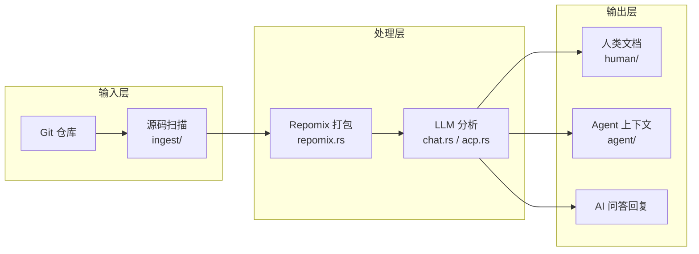
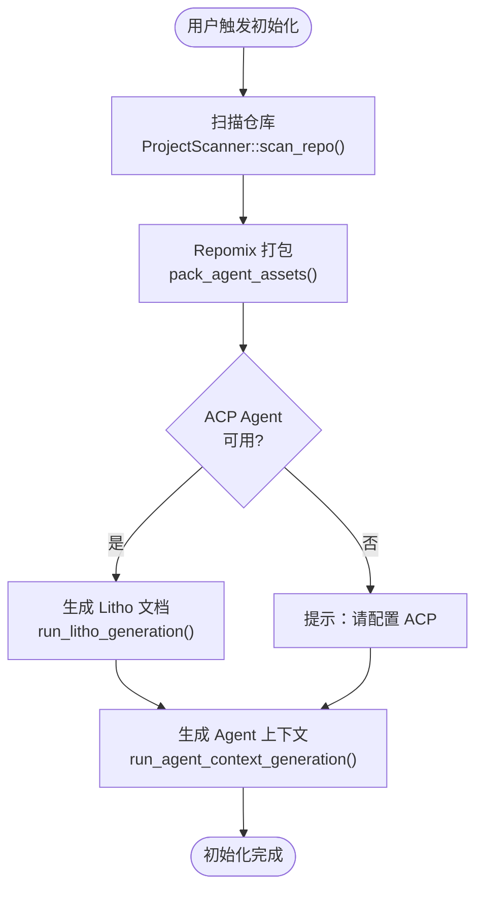
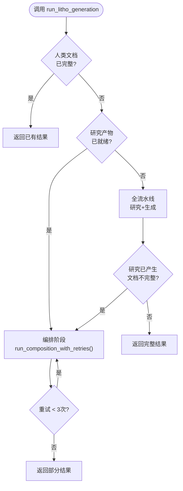
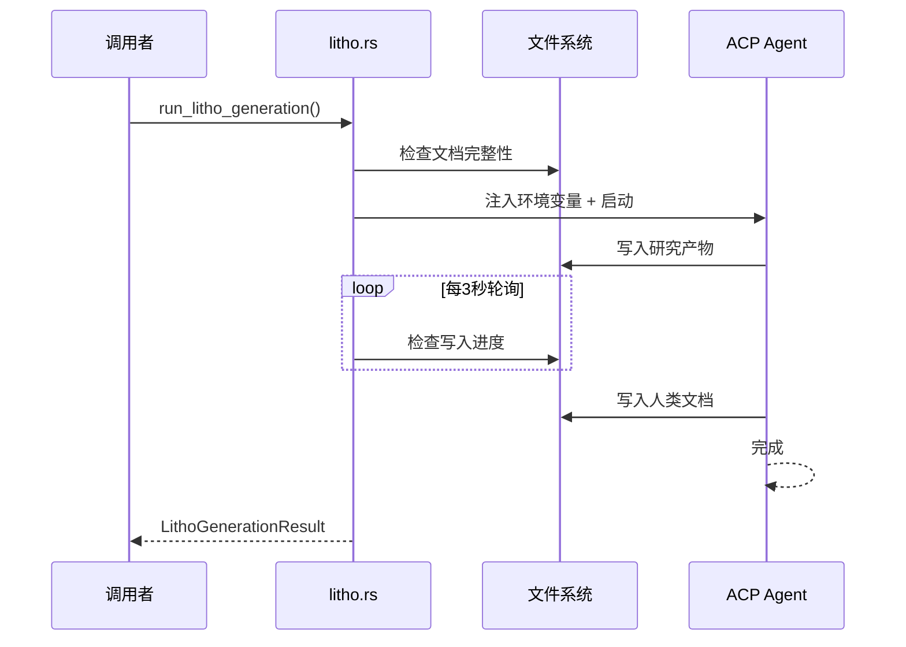

# 核心工作流

## 1. 工作流概述

### 1.1 系统架构与工作流理念

MindMesh 的工作流可以想象成一条"自动化的知识生产线"：原材料（源码）进厂后，经过扫描拆解、打包分类、烹饪分析、上菜展示四个主要环节。不同的"菜谱"（工作流）使用不同组合的环节——项目初始化使用全部四个环节，Litbo 文档生成使用后两个环节，DeepWiki 问答则像"顾客直接问厨师"——厨师（AI）随时从备好的食材（知识库）中获取信息来回答。

MindMesh 的工作流理念有几个关键点：**局部失败不应影响全局**——一条流水线的故障不会影响其他流水线；**尽可能离线完成**——扫描和搜索不依赖 LLM；**可恢复**——长耗时流水线（如 Litho 生成）支持断点续传。

### 1.2 核心执行路径

---

## 2. 主要工作流

### 2.1 项目初始化——将一个新仓库纳入 MindMesh 管理

这是最完整的工作流——从"一个裸仓库"到"被 MindMesh 完整管理的项目"。它就像工厂试运行：从原材料进厂到成品出库，全流程跑通。

**触发方式**：用户在桌面 UI 中点击"初始化项目"按钮，或在 CLI 中执行相关命令

**入口**：`run_project_initialization()` (`crates/mind-mesh-agent/src/project_init.rs:69`)

**执行步骤**：
1. **扫描仓库**（`ProjectScanner::scan_repo()` in `crates/mind-mesh-core/src/ingest/git.rs:24`）——检测技术栈，生成项目索引文档。这一步是纯本地操作，不依赖 LLM。
2. **打包 Agent 资产**（`pack_agent_assets()`）——用 repomix-core 将源码打包为 Agent 友好格式。相当于"给 AI 准备教材"。
3. **生成 Litho 文档**（`run_litho_generation()` in `crates/mind-mesh-agent/src/litho.rs:269`）——通过 ACP Agent 自动生成 C4 架构文档（最耗时，需要 LLM）。
4. **生成 Agent 上下文**（`run_agent_context_generation()` in `crates/mind-mesh-agent/src/agent_context.rs:18`）——LLM 分析结构后生成 `agent/context.md`，供 AI 编码助手使用。

**输出/结果**：`ProjectInitResult`（扫描文件数、打包 token 数、人类文档数、完整性标志）

#### 流程图

#### 阶段说明

| 阶段 | 执行者 | 输入 | 输出 | 说明 |
|------|-------|------|------|------|
| 扫描 | `ProjectScanner` | Git 仓库路径 | `project_index.md` | 纯本地，检测技术栈和目录结构 |
| 打包 | `pack_agent_assets()` | 源码目录 | `agent/repomix.md` | 源码打包为 Agent 友好格式 |
| Litho 生成 | ACP Agent | 研究产物 | `human/` 文档集 | 最耗时阶段，需要 LLM |
| 上下文生成 | ChatEngine | repomix + 文档 | `agent/context.md` | LLM 分析架构上下文 |

### 2.2 Litho 文档生成——从源码到 C4 架构文档的全自动流水线

这是 MindMesh 的"旗舰功能"。它像一个"自动化学术论文生产线"：输入一堆源码文件，输出一整套结构化的架构文档。生产过程中，AI Agent 会像一位资深架构师一样，先浏览整个项目（预处理），然后分层分析（C1→C2→C3），最后组织成完整的文档体系。

**触发方式**：`mind-mesh assets run-litho` CLI 命令，或桌面 UI 中点击"生成文档"

**入口**：`run_litho_generation()` (`crates/mind-mesh-agent/src/litho.rs:269`)

**执行步骤**：
1. **准备阶段**（`prepare_litho_generation()`）——构建 LithoPlan，生成 ACP Prompt
2. **全流水线**——ACP Agent 执行四阶段：预处理 → C4 研究 → 编排 → 输出
3. **轮询检测**——每隔 3 秒检查一次进度，检测到文档稳定（10 次无变化）或超时（45 分钟）时终止
4. **编排重试**——最多 3 次重试补齐缺失文档

**容错设计**：如果研究产物已齐全但人类文档不完整，自动进入编排阶段补齐；如果 ACP Agent 超时，已写入的文档保留，下次运行会从断点继续。

#### 流程图

#### 时序图

### 2.3 DeepWiki 问答——基于知识库的 AI 对话

**触发方式**：用户在 DeepWiki 面板中输入问题

**入口**：`ChatEngine.ask()` (`crates/mind-mesh-agent/src/chat.rs:461`)

**执行步骤**：
1. **资产准备检查**——如果项目的 repomix pack 或 context.md 缺失，自动触发
2. **构建 Prompt**——用户问题 + 预加载的架构概览 + repomix 元数据 + 目录树
3. **Agent 执行**——Native LLM 或 ACP Agent 执行，Agent 可调用工具查询知识库
4. **流式输出**——LLM 回答通过事件回调实时推送至前端
5. **引用提取**——从回答和搜索结果中提取源码引用

**工具调用三层架构**：
- **Macro 层**：预加载的架构概览（无需额外调用）
- **Meso 层**：`read_agent_context(section="xxx")` 获取特定章节
- **Micro 层**：`grep_agent_pack()` → `read_agent_pack_file()` 查询源码

### 2.4 SDD 四阶段工作流

**触发方式**：用户在 SDD 面板中依次执行四个阶段

**入口**：`run_sdd_phase()` (`crates/mind-mesh-agent/src/sdd.rs:19`)

**执行步骤**：
1. **需求澄清**（Requirements）——LLM 生成 `1.requirements.md`
2. **技术方案**（TechDesign）——LLM 生成 `2.tech-design.md`
3. **代码生成**（CodeGen）——ACP Agent 执行代码生成
4. **Code Review**（CodeReview）——LLM 生成 `4.code-review.md`

**顺序依赖**：每个阶段必须在前一阶段完成后才能执行（`sdd.rs:35-49` 检测前一阶段的输出文件是否存在）。

---

## 3. 并发与异步模型

MindMesh 使用 tokio 异步运行时管理所有 IO 密集型操作。核心设计理念是"稳优先而非快优先"：文档生成流水线本身是顺序执行的（阶段间有依赖），但每个阶段内部的 LLM 调用是异步非阻塞的。Chat 引擎支持流式输出（SSE 模式），前端可以逐字渲染 LLM 回复，给用户"AI 正在思考"的实时反馈。

ACP Agent 运行在独立进程中，通过文件系统而非进程间通信与主进程同步——这简化了并发模型，且 Agent 进程可以在主进程重启后继续工作。

---

## 4. 错误处理策略

MindMesh 的错误处理哲学："局部失败不应导致全局崩溃"

| 错误场景 | 处理方式 | 用户影响 |
|---------|---------|---------|
| Litho 生成超时（45 分钟） | 自动终止，已写入的文档保留 | 用户可重新运行，从断点继续 |
| LLM API 调用失败 | 错误通过进度回调传递至 UI | 功能降级（不生成文档），但不影响其他功能 |
| ACP Agent 不可用 | 检测到后生成引导提示 | 文档生成功能暂不可用，扫描和搜索能力不受影响 |
| 工具调用错误 | `ChatToolCallRecord.error` 记录错误 | Agent 继续执行其他工具，不对用户暴露 |
| 无效模型配置 | `llm_status()` 返回不可用状态 | 设置面板中显示错误提示 |

---

> **置信度评分**：9/10 — 基于完整的工作流研究报告和核心源码分析。主流程函数已逐行阅读，流程步骤与代码实际路径一致。
