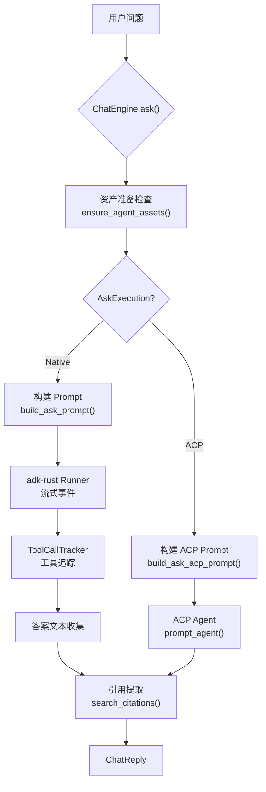

# Chat 引擎领域

**模块路径**：`crates/mind-mesh-agent/src/chat.rs`
**生成日期**：2026-06-14
**分析置信度**：9/10

---

## 这个模块在做什么

Chat 引擎是 MindMesh 的"对话大脑"——所有需要与 LLM 交互的场景都经过它。它管理 LLM 会话的生命周期，支持两种执行模式（Native LLM 和 ACP Agent），提供流式输出、工具调用追踪、引用提取等能力。DeepWiki 问答、Agent 上下文生成、SDD 的 LLM 阶段都依赖它。

它的设计类似于"通用 AI 网关"：调用者只需说"我要问这个问题"或"我要执行这个任务"，ChatEngine 负责选择 LLM 后端、管理会话、处理工具调用、清理输出格式、提取引用——调用者只需要处理最终的答案和引用。

---

## 核心功能点

1. **双模式执行**——Native 模式直接调用本地/远程 LLM（通过 adk-rust Runner），ACP 模式调用 OpenCode 的 ACP 代理执行。通过 `AskExecution` 枚举选择。Native 模式用于轻量任务（问答、上下文生成），ACP 模式用于复杂任务（文档生成）。

2. **流式输出支持**——SSE 模式流式输出 LLM 回复，支持 `on_chunk` 回调逐文本块推送。

3. **工具调用追踪**——`ToolCallTracker` 内部结构追踪每个工具调用的生命周期（Running→Ok/Error），记录开始/完成时间戳和耗时。支持流式 Partial 去重——同一个工具调用在不同 chunk 中更新参数时，只保留一个记录。

4. **会话管理**——adk-rust 的 `InMemorySessionService` 创建和恢复会话。会话通过 `session_id` 标识，`agent-ctx-*` 前缀的会话使用特殊上下文注入逻辑。

5. **引用提取**——`search_citations()` 搜索知识库获取引用，`extract_source_citations()` + `merge_citations()` 从 LLM 回复中提取引用标注并合并。

6. **自动资产准备**——Ask 模式下，如果项目的 repomix pack 或 context.md 缺失，自动触发生成。

---

## 关键组件

| 组件/类型 | 文件路径 | 核心职责 |
|---------|---------|---------|
| `ChatEngine` | `crates/mind-mesh-agent/src/chat.rs:321` | 对话引擎主结构（配置 + 执行路径） |
| `ChatReply` | `crates/mind-mesh-agent/src/chat.rs:78` | 回复结构（answer + citations + tool_calls + usage） |
| `ChatPhase` | `crates/mind-mesh-agent/src/chat.rs:69` | 对话阶段枚举（Thinking/Tools/Generating/Streaming） |
| `ToolCallTracker` | `crates/mind-mesh-agent/src/chat.rs:86` | 工具调用追踪（去重、状态、耗时） |
| `NativeBackend` | `crates/mind-mesh-agent/src/chat.rs:316` | Native LLM 执行后端（adk-rust Runner） |

---

## 内部数据流

**关键步骤说明**：
1. 资产准备：`ensure_agent_assets()` 确保 repomix pack 和 context.md 已就绪
2. Prompt 构建：将用户问题 + 预加载的上下文数据组合为 Agent 输入
3. 执行：Native 模式通过 adk-runner 流式执行，ACP 模式通过 `prompt_agent()` 同步执行
4. 引用提取：从回答和搜索结果中提取源码引用，合并去重

---

## 关键接口与扩展点

**核心接口**：`ChatEngine::ask(session_id, query, project, repo_path, on_chunk, on_tool_calls, on_phase, on_usage)` — 接受 4 个回调函数用于 UI 渲染。

**扩展点**：`AskExecution` 枚举允许在 Native 和 ACP 模式间切换。Native 模式通过 `build_agent()` 自定义 Agent 配置和工具集。

---

## 与其他模块的交互

| 交互模块 | 方向 | 接口/协议 | 说明 |
|---------|------|---------|---------|
| ACP 协议 | 依赖 | `acp_spawn_command()`, `build_acp_config()` | ACP 模式启动 OpenCode |
| 知识资产管理 | 依赖 | `ensure_agent_assets()`, `build_context_overview()` | 资产就绪检查和上下文预加载 |
| 全文搜索 | 依赖 | `KnowledgeSearch.search()` | 引用提取时搜索知识库 |
| Agent 上下文 | 被依赖 | `ChatEngine.run_turn()` | Agent 上下文生成使用 ChatEngine 执行 LLM 调用 |
| SDD 工作流 | 被依赖 | `ChatEngine.ask()` | SDD 的 LLM 阶段（需求/设计/审查）使用 ChatEngine |
| 桌面 UI | 被依赖 | Tauri IPC 事件 | DeepWiki 面板使用 ChatEngine 进行 AI 问答 |

---

## 性能考量

- **Native 模式**：adk-rust Runner 管理 LLM 会话，流式事件通过 tokio 异步管道推送给调用者
- **ACP 模式**：ACP Agent 运行在独立子进程中，ChatEngine 同步等待结果
- **会话缓存**：`AppState` 中缓存 `ChatEngine` 实例，配置无变化时复用（`src-tauri/src/lib.rs:42-45`）
- **超时控制**：Native 模式 1200 秒超时（`ASK_TIMEOUT`），ACP 模式无独立超时（由 Litho 生成的时间控制在 45 分钟）

---

> **分析置信度说明**：9/10 — 完整阅读了 chat.rs 全部 1063 行源码，包含所有核心函数和测试用例。
