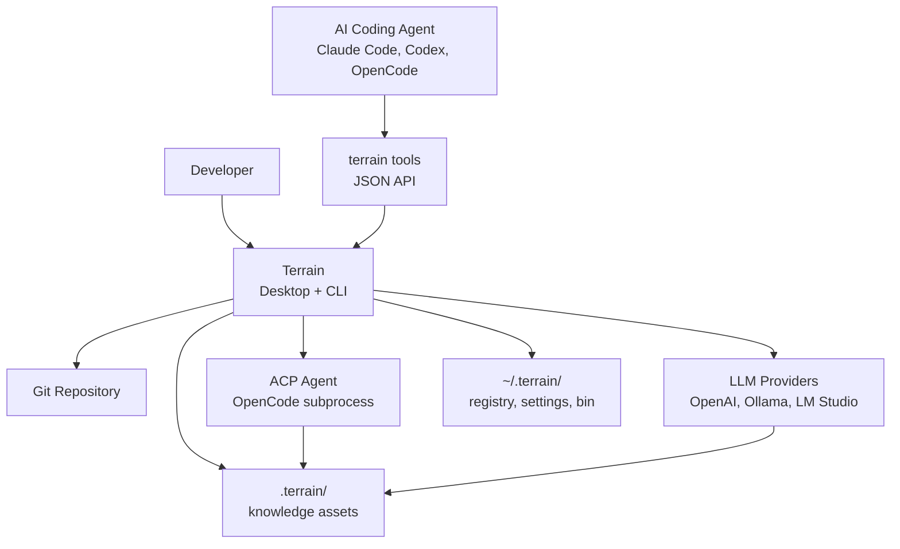

# Terrain

Terrain prepares the ground so agents don't have to guess where to stand. It is an **agent-first engineering environment platform** that transforms a Git repository into a living knowledge base — narrative C4 architecture docs for humans, structured context for AI agents, and a standardized toolchain (Skills, CLIs, `AGENTS.md`) that every coding assistant can follow consistently.

Born as the successor to **Litho** (deepwiki-rs), Terrain keeps the proven "generate docs from code" thesis and hardens it into a full platform: incremental updates, multi-language support, freshness tracking, DeepWiki Q&A, and ACP integration for external agents.

## What It Can Do

Terrain's capabilities orbit three pillars — **map** (knowledge), **roads** (agent environment), and **trail markers** (SDD workflow):

**Engineering knowledge generation** — A four-phase Litho pipeline (preprocessing → C4 research → composition → output) produces six standard human docs plus `agent/context.md` and a grep-friendly `repomix.md` source pack. The pipeline runs via an ACP subprocess agent that reads the Litho document skill, persists research artifacts under `.terrain/.litho-agent/`, and writes final Markdown to `.terrain/human/`. See `crates/terrain-core/src/assets/litho.rs:34-59` for the generation prompt builder.

**Knowledge-grounded Q&A (DeepWiki)** — Ask natural-language questions against the knowledge base with citations and tool-call traces. The Ask engine (`crates/terrain-agent/src/workflows/ask.rs:11`) streams answers through native LLM or ACP, with tools like `read_agent_context`, `grep_agent_pack`, and `search_knowledge` defined in `crates/terrain-agent/src/tools.rs`.

**Standardized AI environment** — `terrain env apply` installs preset Skills, deploys bundled tools (CodeGraph, RTK, terrain CLI) to `~/.terrain/bin/`, and patches `AGENTS.md` snippets — giving every agent the same "knowledge contract."

**Freshness tracking** — Git drift scoring (`crates/terrain-core/src/freshness/mod.rs`) flags stale assets. Agents should down-weight macro context when `freshness_score < 50` (`MACRO_PRELOAD_THRESHOLD`).

**SDD workflow** — A four-phase standardized development path (requirements → tech design → codegen → code review) producing reviewable Markdown artifacts.

## C4 Context Diagram

The diagram below shows Terrain's position in the developer ecosystem: humans interact via desktop or CLI; external coding agents connect through `terrain tools` (JSON stdout); knowledge is produced from Git and consumed by both audiences.

Terrain reads source from Git, writes knowledge back into the repo (`.terrain/` travels with branches), and delegates heavy document generation to ACP while handling scan, pack, search, and freshness offline in `terrain-core`.

## Technology Choices

Terrain is built as a Rust workspace monorepo where responsibilities are deliberately split: `terrain-core` runs without an LLM, `terrain-agent` owns all AI orchestration, and Tauri provides the desktop shell.

| Domain | Choice | Why |
|--------|--------|-----|
| Language & runtime | Rust 2024 + Tokio | Memory-safe single binary; async for ACP polling and IO-heavy pack operations |
| Desktop shell | Tauri 2 | Native GUI with Rust backend sharing agent runtime (`src-tauri/src/lib.rs:35`) |
| CLI framework | clap 4 | Structured subcommands for CI/CD and scripting (`crates/terrain-cli/src/cli.rs`) |
| LLM abstraction | adk-model | Unified OpenAI/Ollama/LM Studio interface |
| Agent protocol | ACP (Agent Client Protocol) | Subprocess delegation for Litho and SDD codegen — tool-using agents produce better docs |
| Source packing | repomix-core | Grep-friendly source index for agent micro-layer access |
| Knowledge storage | File-based `.terrain/` | Knowledge travels with Git branches; no database dependency |

## What Terrain Does and Does Not Do

Understanding Terrain's boundaries prevents misaligned expectations:

**It does**: Scan repositories, generate and incrementally update C4 docs, produce agent-ready context packs, answer knowledge questions with citations, deploy agent tooling, track freshness, and orchestrate SDD workflows.

**It does not**: Edit source code directly (SDD codegen delegates to external ACP agents), host knowledge in a central cloud service, maintain a database, or provide IDE plugins (agents use the `terrain tools` JSON API instead).

The knowledge trust hierarchy when sources conflict: **repomix source > CodeGraph > context.md > human docs** — live code beats narrative summaries.
