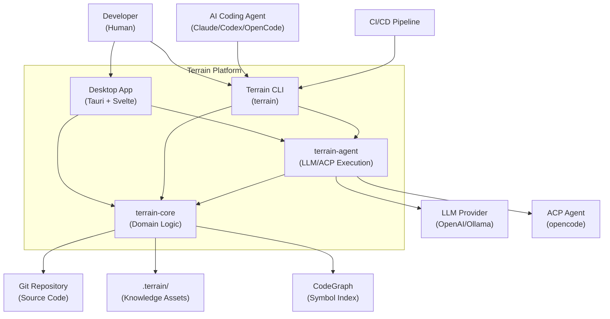

# Terrain

Terrain is an **agent-first engineering environment platform** built for the age of AI-assisted development. Its tagline captures the intent: *"Terrain prepares the ground so agents don't have to guess where to stand."* Point it at a Git repository and it delivers auto-generated C4 architecture docs, a structured agent context pack, source indexing, freshness tracking, and knowledge-grounded Q&A — all stored in-repo under `.terrain/` so knowledge travels with your branches.

Born from **Litho** (the open-source [deepwiki-rs](https://github.com/sopaco/deepwiki-rs) documentation generator), Terrain hardens that proven doc-generation core into a full platform with incremental updates, a desktop app, CLI, and ACP integration for external coding agents.

## What It Can Do

Terrain's capabilities orbit three pillars — a **map** (engineering knowledge), **roads** (standardized agent environment), and **trail markers** (SDD workflow conventions).

**Engineering knowledge assets** — A four-phase Litho pipeline analyzes your codebase and produces six standard human docs (overview, architecture, workflows, deep module exploration, boundary interfaces, database overview) plus a structured `agent/context.md` and a grep-friendly `agent/repomix.md` source pack. Both humans and AI agents consume the same knowledge factory output.

**DeepWiki Ask Q&A** — Natural-language questions over the knowledge base with source citations and tool-call traces. The three-layer retrieval model (macro context → meso docs → micro source pack) ensures answers are grounded in actual code, not hallucinated architecture.

**Standardized AI environment** — One command (`terrain env apply`) installs Skills, CodeGraph, RTK, and `AGENTS.md` snippets so every coding agent reads your repo the same way instead of blind-grepping.

**SDD workflow** — A four-phase standardized development path (Requirements → Tech Design → Code Generation → Code Review), each producing reviewable Markdown artifacts.

**Freshness tracking** — Git HEAD and working-tree monitoring score knowledge assets. When `freshness_score < 50`, agents should down-weight macro context and verify with repomix.

## C4 Context Diagram

The diagram below shows Terrain's position in the developer ecosystem — who uses it, what it talks to, and where knowledge lives.

Terrain sits between developers/agents and the repository. It reads source code (never writes, except during SDD CodeGen), produces knowledge in `.terrain/`, and delegates heavy reasoning to LLM providers and ACP subprocesses.

## Technology Choices

Terrain's stack reflects a deliberate bet on Rust for the core, lightweight native UI, and ecosystem compatibility for agents.

| Domain | Choice | Rationale |
|--------|--------|-----------|
| Core logic | Rust 2024 + Tokio | Memory safety, async IO for LLM calls, single-binary distribution |
| Desktop shell | Tauri 2 | Native performance without Electron overhead; Rust backend shares types with core |
| Frontend | Svelte 5 + Vite 8 | Small bundle, runes for reactive state, fast HMR during development |
| Agent framework | ADK Rust 1.0 | Unified tool/model/session abstractions; supports both native LLM and ACP |
| Source indexing | repomix-core 2.0 | Grep-friendly markdown pack — agents search code without loading entire repos |
| Type sharing | ts-rs 10 | Rust IPC types are source of truth; TypeScript types generated at build time |
| External agents | agent-client-protocol 0.11.1 | Standard protocol so Litho/SDD can delegate to any ACP-compatible agent |

## What Terrain Does and Does Not Do

Understanding boundaries prevents misplaced expectations.

**Terrain does:**
- Scan Git repos and generate dual-track knowledge (human C4 docs + agent context)
- Answer architecture questions with citations via DeepWiki Ask
- Deploy agent enhancement tools (Skills, CodeGraph, RTK) into developer environments
- Track knowledge freshness against Git drift and symbol-level changes
- Expose a JSON `terrain tools` API for ACP agents

**Terrain does not:**
- Host remote knowledge servers — everything is local/in-repo
- Modify your source code directly (except SDD CodeGen phase via delegated ACP agent)
- Replace your IDE or coding agent — it prepares the ground they stand on
- Guarantee deterministic doc output — generated assets are non-deterministic and marked `-merge` in `.gitattributes`
