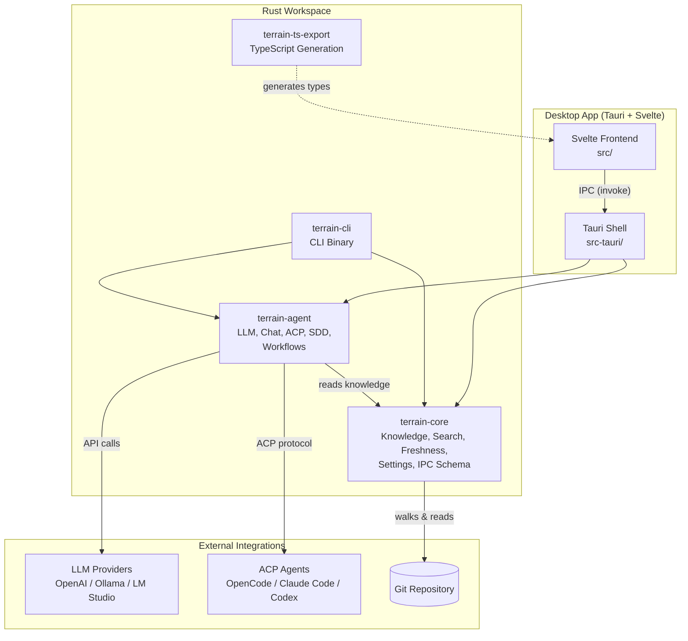

# Terrain — Overview

## What is Terrain

Terrain is an AI-first engineering environment that turns Git repositories into living knowledge bases. Every time a developer runs a scan, Terrain walks the source tree, extracts structure, and writes machine-readable Markdown into a `.terrain/` directory that sits right alongside the code. That directory serves two audiences simultaneously: human engineers who want fast orientation in an unfamiliar codebase, and AI coding agents who need reliable, up-to-date context to produce useful patches.

The problem Terrain solves is structural, not cosmetic. Most teams积累了thousands of lines of domain knowledge scattered across READMEs, Slack threads, and senior engineers' heads. When an AI agent is pointed at a fresh clone, it sees files but not meaning — it does not know which module is the data pipeline, which crate owns the IPC schema, or which config file controls the LLM provider. Terrain closes that gap by generating a structured knowledge layer that is version-controlled alongside the source, refreshed on demand, and consumed natively by the agent tools developers already use.

Terrain ships as a desktop application (Tauri + Svelte) and a companion CLI (`terrain`), backed by a Rust workspace of three crates — `terrain-core`, `terrain-agent`, and `terrain-cli` — plus a TypeScript export bridge (`terrain-ts-export`) that keeps the frontend type system in lockstep with the Rust backend. There is no database. Knowledge lives as files in `.terrain/`, travels with the repository in Git, and can be read, searched, or regenerated by any tool that speaks Markdown.

## What it can do

**Dual-track knowledge generation.** Terrain scans a Git repo and produces two parallel knowledge layers: an `agent/` track optimized for AI consumption (dense, structured, machine-parsable) and a `human/` track (narrative C4-style architecture docs generated by the Litho engine). Both live in `.terrain/` and are committed to version control.

**Agent context assembly.** The `agent/context.md` file is a composite document built from the repo's structure, selected knowledge assets, and project metadata. It is the single file an AI agent reads to understand a project. Terrain manages its lifecycle — generation, incremental updates, freshness tracking, and size enforcement (`assets` module in `terrain-core`).

**Freshness tracking.** Terrain maintains a freshness ledger (`.meta/freshness.json`) that scores how current each knowledge asset is relative to the latest Git HEAD. The `freshness` module (`crates/terrain-core/src/freshness.rs`) computes change sets, drift factors, and trust thresholds so agents know when to distrust stale context.

**Full-text search.** The `search` module provides a lightweight full-text index across all knowledge documents in a project. It is exposed via both the CLI (`terrain search`) and the Tauri IPC layer, allowing agents and humans to locate relevant docs without grep.

**LLM-powered Q&A (Ask).** Terrain can answer questions about a project using the project's own knowledge assets as grounding context. The Ask workflow (`crates/terrain-agent/src/workflows/ask.rs`) retrieves relevant documents, assembles a prompt, and streams tokens from a configurable LLM provider (OpenAI-compatible, Ollama, or LM Studio).

**ACP integration.** Terrain implements the Agent Client Protocol to delegate tasks to external coding agents — OpenCode, Claude Code, or Codex — while remaining the source of truth for project context. The `acp` module (`crates/terrain-agent/src/acp.rs`) manages spawning, configuration, and session lifecycle.

**SDD workflow.** The Standardized Development Workflow is a four-phase gated process (Requirements → Tech Design → Code Generation → Code Review) that enforces structure on feature development. Each phase produces artifacts that the next phase consumes, and the whole flow is orchestrated through `crates/terrain-agent/src/workflows/sdd.rs`.

**Desktop UI.** The Tauri-based desktop app provides a graphical interface for scanning projects, browsing knowledge assets, running Ask sessions, configuring LLM providers, and monitoring token usage. The frontend is Svelte 5 + Tailwind CSS, and the IPC boundary is defined by Rust types exported to TypeScript via `terrain-ts-export` (`src/lib/generated/`).

**Environment integration.** The `Env` subsystem manages deployment of AI toolchains (bundled binaries, preset skills, `AGENTS.md` files) into the repository. It ensures that when an agent opens a project, all required tools, skills, and context files are in place.

## Architecture at a glance

## Technology choices

| Component | Technology | Why this |
|-----------|-----------|----------|
| Backend language | Rust (2024 edition, 1.94+) | Memory safety without GC; rich async ecosystem; single-binary distribution via Tauri |
| Desktop framework | Tauri 2 | Smaller bundle than Electron; native OS integration; Rust backend runs in-process |
| Frontend | Svelte 5 + Vite 8 | Compile-time reactivity eliminates runtime framework overhead; excellent TypeScript support |
| Styling | Tailwind CSS 4 | Utility-first CSS aligns with rapid UI iteration; Vite plugin integration |
| LLM client | OpenAI-compatible API surface | Covers OpenAI, Ollama, LM Studio, NVIDIA NIM, and any OpenAI-derivative with one code path |
| Agent protocol | ACP (Agent Client Protocol) | Vendor-neutral interface for coding agents; avoids lock-in to any single agent runtime |
| Knowledge format | Markdown files in `.terrain/` | Human-readable; Git-friendly; searchable; no external dependencies |
| IPC type bridge | ts-rs | Rust structs auto-generate TypeScript types; prevents type drift between backend and frontend |
| Source indexing | repomix-core | Packs repository source into compressed Markdown chunks for LLM context windows |
| Diagram rendering | Mermaid (via `mermaid` npm) | Renders architecture diagrams client-side from text definitions; no server dependency |

## What Terrain can and cannot do

### Can do

- Scan a Git repository and produce structured, version-controlled knowledge assets for both humans and AI agents.
- Maintain freshness scores that tell agents when knowledge is stale and needs regeneration.
- Answer project-specific questions using the project's own knowledge as grounding context.
- Delegate coding tasks to ACP-compatible agents (OpenCode, Claude Code, Codex) with full project context.
- Enforce a four-phase development workflow (SDD) that structures requirements through code review.
- Deploy AI toolchains and preset skills into repositories so agents are productive on first open.
- Track LLM token usage across sessions and providers.
- Operate without any external database — all state is files on disk.

### Cannot do

- Replace a full-featured IDE or code editor; Terrain is a knowledge and agent-orchestration layer, not a code editing environment.
- Guarantee the correctness of AI-generated code; SDD review is advisory, not a formal verification step.
- Ingest non-Git repositories or remote-only sources; it operates on local clones.
- Provide real-time collaborative editing or multi-user concurrent knowledge updates.
- Replace dedicated CI/CD systems; it complements them by providing context to AI agents, not by running builds or deployments.

## Key file references

| File | What it contains |
|------|-----------------|
| `crates/terrain-core/src/lib.rs:1-162` | Module declarations and public API surface of the core knowledge engine |
| `crates/terrain-agent/src/lib.rs:1-56` | Agent crate module tree — ACP, chat engine, LLM model resolution, SDD and Ask workflows |
| `crates/terrain-cli/src/cli.rs:1-376` | CLI command definitions (clap) — List, Scan, Init, Refresh, Search, Ask, SDD, Usage, Tools, Env |
| `src-tauri/src/lib.rs:1-116` | Tauri application setup — IPC handler registration, state initialization, tray integration |
| `crates/terrain-core/src/settings.rs:1-277` | LLM provider defaults, ACP settings, model configuration persistence |
| `package.json:1-38` | Frontend dependency manifest — Svelte 5, Vite 8, Tailwind, Mermaid, Tauri plugins |
