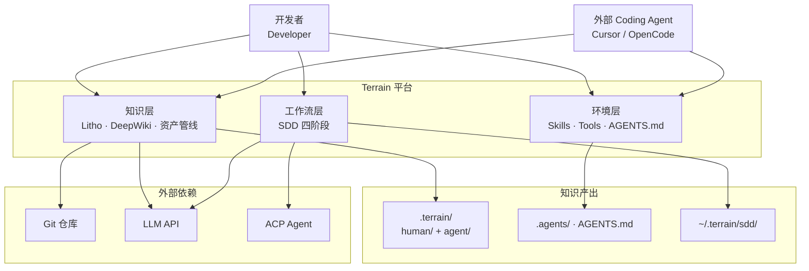

# Terrain

Terrain 是面向 AI 编码助手时代的**工程环境管理平台**。它的核心理念可以用一句话概括：**Terrain prepares the ground so agents don't have to guess where to stand**——为开发者和 AI 助手准备好一片"有地图、有路标、有规范"的工程领地，而不是让他们在陌生代码库中盲目摸索。

当你把一个 Git 仓库注册到 Terrain，它会自动扫描代码结构、生成 C4 架构文档（Litho）、维护双轨知识资产（人类可读的 `human/` 叙述文档 + 机器友好的 `agent/` 压缩上下文），并通过 DeepWiki 问答与 SDD 四阶段工作流，让人类开发者与外部 Coding Agent 共享同一套知识契约。知识存放在仓库内的 `.terrain/` 目录，随 Git 分支流转——不是中心化数据库，而是"知识跟着代码走"。

## 它能做什么

Terrain 的核心能力可以概括为"从源码到知识契约的全自动流水线"。

**智能代码分析**——Terrain 不是简单地扫描文件名，而是通过 `ProjectScanner` 采集 Git 元数据、导入 OpenAPI 规范，并调用 repomix-core 将源码打包成 grep 友好的索引包（`agent/repomix.md`），为后续的 AI 推理提供结构化的原材料。

**C4 架构文档生成（Litho）**——四阶段流水线（预处理→C4 研究→编排→输出）自动产出六份标准人类文档，含 Mermaid 图表。中间研究产物持久化在 `.terrain/.litho-agent/`，支持中断恢复。

**DeepWiki 知识问答**——三层检索模型（Macro 预载 context.md → Meso 搜索 human/knowledge 文档 → Micro grep/read repomix 包），回答附带来源引用。`ChatEngine` 支持 Native LLM 与 ACP 子进程双后端。

**SDD 标准化开发**——四阶段工作流（需求→技术设计→代码生成→代码审查），每个阶段产出可审查的 Markdown 产物。轻量文档阶段走 Native LLM，代码生成委托 ACP Agent。

**环境集成**——自动检测并安装 Skills（terrain-knowledge、repomix、codegraph、rtk）、CLI 工具链和 `AGENTS.md` 片段，让外部 Coding Agent 知道如何正确使用 Terrain 的知识层。

## C4 Context 图（系统全景）

下图展示了 Terrain 在开发者工作流中的定位：人类通过桌面应用或 CLI 使用，外部 Agent 通过 ACP 协议接入，所有知识资产最终沉淀在仓库内的 `.terrain/` 目录。

从图中可以读出三个关键设计决策：知识资产版本化存放在仓库内（而非云端）、人类与 Agent 消费同一套知识契约、重工具调用工作委托给外部 ACP Agent 而非内置实现。

## 技术选型背后的思考

Terrain 选择 Rust 作为核心开发语言，配合 Tauri 2 构建桌面壳，这不仅仅是追求性能——作为一个需要大量调用外部 LLM API 和处理文件系统 IO 的工具，Rust 的内存安全保证和 Tokio 异步运行时让并发请求管理变得可靠。前端选择 Svelte 5 是因为其轻量的响应式模型适合面板化的桌面 UI。

| 技术领域 | 具体选择 | 为什么这样选 |
|---------|---------|------------|
| 核心语言 | Rust 2024 (workspace) | 内存安全 + 高性能，CLI 与桌面共享 crate |
| 桌面框架 | Tauri 2 | 轻量跨平台，Rust 后端零 FFI 开销 |
| 前端 | Svelte 5 + Vite + TypeScript | 响应式面板 UI，Bun 构建 |
| Agent 协议 | ACP (agent-client-protocol 0.11) | 标准化外部 Agent 子进程通信 |
| LLM 集成 | adk-model (OpenAI/Ollama/LM Studio) | 统一 Provider 抽象，多 Profile 支持 |
| 源码打包 | repomix-core 2.0 | grep 友好索引，Ask ACP 模式唯一源码来源 |
| 类型同步 | ts-rs + terrain-ts-export | Rust IPC 类型自动导出到前端 |

## Terrain 能做什么，不能做什么

明确系统边界对于正确使用 Terrain 至关重要。

**它能做的事**：扫描 Git 仓库并建立知识索引；自动生成 C4 架构文档；维护双轨知识资产（human/ + agent/）；基于知识库的自然语言问答；SDD 四阶段标准化开发；环境集成（Skills/Tools/AGENTS.md）；新鲜度追踪与漂移检测；CLI 与桌面双通道访问。

**它不做的事**：不托管 Git 仓库（仅读取本地克隆）；不提供中心化数据库或云端知识库；不替代 IDE 的代码编辑能力；不直接执行业务代码（SDD CodeGen 委托 ACP Agent）；不在 ACP Ask 模式下读取活仓库文件系统（仅通过 repomix 包检索）。
