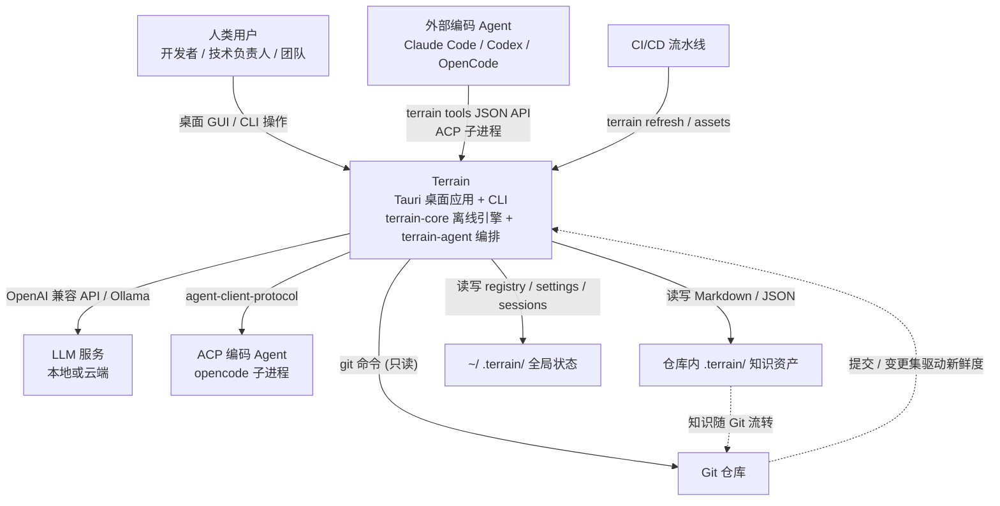

# Terrain

Terrain 是一款 **AI 友好的工程环境管理器**（版本 0.9.7），它以桌面应用（Tauri 2）+ CLI 的混合形态存在，核心主张只有一句话：**从代码生成文档、保持同步，让 Agent 就绪**。现代软件工程最普遍的痛点并不是"没有文档"，而是架构知识散落在过期的 Wiki、Slack 和资深工程师的脑海中，新上手的开发者与 AI 编码助手只能对着实时仓库盲目 grep。Terrain 尝试给出的答案，是把"用一个仓库做事"这件事标准化为三样可以自动产出、随 Git 流动的资产：双轨的工程知识（给人看的 `human/` 叙述性文档 + 给 Agent 看的 `agent/context.md` 结构化上下文 + `agent/repomix.md` 源码索引）、统一的 Agent 契约（Skills、`AGENTS.md`、JSON 化的 `terrain tools` 接口），以及一条命令即可部署到 `~/.terrain/bin/` 的工具链（CodeGraph、RTK、Terrain CLI 本身）。

Terrain 的思想脉络可以追溯到 deepwiki-rs / Litho —— "从代码生成并保持同步的架构文档"这一论点 —— 但它在平台化方向上走得更远：补齐了**增量更新**（git diff 驱动，避免每次提交都付全量生成成本）、**多语言适配**（en / zh-CN）、**ACP 子进程访问**（把外部编码 Agent 接进知识契约）与 **桌面化阅读**（Svelte 5 前端 + 源码切片引用面板），并在此基础上新增了环境与工作流这一整层。在系统内部，它坚持一条严格的纪律：**凡是能离线完成的能力（扫描、打包、检索、新鲜度、环境集成）绝不依赖 LLM**，Rust 原生内核保证这些环节可测试、可复用、无网络也能跑；只有真正需要智能的生成式任务（Litho 文档、Agent 上下文、DeepWiki 问答、SDD 开发流程）才进入 `terrain-agent` 编排层，并且永远以"可复核、可降级、失败不覆盖好资产"的方式执行。

## 它能做什么

Terrain 的能力可以分成"离线的能力"与"智能的能力"两半，它们的分界恰好与模块架构的分层一致：前半部分不需要任何外部服务，后半部分则由可插拔的 LLM / ACP 后端支撑。如果你打开桌面应用，看到的其实是这七个能力面板的编排。

**扫描与打包（Scan & Pack）**——把任意 Git 仓库注册到 `~/.terrain/registry.json`，`ProjectScanner::scan_repo` 会生成 `index.md`、`modules/`、`interfaces/`、`routes/`、`events/` 等结构化知识文档，并调用 `repomix-core` 把源码打包成 `agent/repomix.md` 源码索引。这是整个知识流水线的"源"，一切后续能力都建立在它之上。

**双轨知识资产（Knowledge Assets）**——`human/` 给人看、`agent/context.md` 给 Agent 看，外加 `knowledge/` 存放人工维护的私域知识。人类文档由 Litho 引擎生成（四阶段研究流水线 + C4 模型），Agent 上下文则是一份浓缩的架构叙述，两者都随仓库版本化、可 diff、可评审。知识资产通过 `.terrain/.gitignore` 与 `.gitattributes` 决定哪些入 Git、哪些是本地衍生物，避免协作冲突。

**新鲜度评估（Freshness）**——回答"这份知识还信得过吗"。系统以 git 提交为基线，把变更集折算成 0–100 的新鲜度评分（`FRESH=80` / `VERIFY=70` / `MACRO_PRELOAD=50` 三档阈值），并用 CodeGraph 做独立的、基于 git 的交叉验证。评分低于 50 时，Agent 会被要求主动降权宏观上下文、转向源码交叉验证。

**DeepWiki 式问答（Ask）**——在知识库上做带引用、带工具调用记录的问答。Agent 通过"宏观预载 → 中观按需（`search_knowledge` / `read_doc`）→ 微观 grep（`grep-pack` / `read-pack-file`）"三层检索知识，回答中每个引用都能点击跳转到实时源码切片。值得强调的是它的**降级能力**：即使没有配置任何 LLM，`fallback_search_reply` 也会用纯检索结果给出带引用的回答，而不是报错。

**Litho 文档生命周期**——最重的生成流水线。它本质是"研究（preprocessing → C4 研究 → 模块深度）→ 编排（composition → 输出）"的两段式过程，支持 Auto（增量 / UpToDate 只重打基线）与 FullRebuild（清空重来）两种运行模式，传输层在"纯 ACP / ACP+原生 LLM 降级 / 纯原生"三态之间切换。整份文档（包括你正在读的这本）就是它的产物。

**SDD 标准化开发工作流**——把"用 AI 从需求到代码落地"变成一条可审计、可断点续跑的四阶段产线：`1.requirements.md → 2.tech-design.md → 3.implementation.md → 4.code-review.md`。文档阶段走原生 LLM，CodeGen 阶段强制交给 ACP Agent（因为写代码需要 shell 能力），任何阶段的产物都能被人中断、编辑、续跑。

**Agent 环境集成与 Token 用量监控**——把 Terrain 的"AI 工程环境"装进目标仓库：按依赖顺序部署 Skills、CodeGraph、RTK 到 `~/.terrain/bin/`，patch 受管理的 `AGENTS.md` 片段；`usage` 模块则调用本地 `ccusage`，离线、只读地汇总 Claude Code / OpenCode / Codex 的 Token 用量（120s 缓存，跨平台降级链）。

## C4 Context 图（系统全景）

下面的图展示了 Terrain 在生态中的定位：它自身是一个桌面 + CLI 的混合应用，与人类用户、外部编码 Agent、LLM / ACP 服务、Git 以及文件系统交互，而知识资产内嵌于被索引的仓库内。注意注册表只存"指针"，知识正文永远躺在仓库的 `.terrain/` 里。

从这张图能读出 Terrain 最关键的几个设计决策：**LLM / ACP 是可选的**（没有它们也能跑离线骨架与检索兜底问答）；**与 Git 是"只读 + 转录"的关系**（绝不 push、不改 config、不跳 hooks，它只读取提交历史来驱动同步与评分）；**一切数据落在本地文件系统**（无自有云端、无数据库），知识资产与仓库强绑定、随分支流转。

## 技术选型背后的思考

Terrain 的技术选型几乎是围绕"单二进制、离线优先、知识随 Git 走"这三个约束推导出来的，而非简单地追赶潮流。选 Rust 与 Tauri，是因为扫描、打包、检索、Git 操作都是计算与 I/O 密集型的活，且必须在无网络环境下稳定运行；选 Svelte 5 + Vite 8，则是因为桌面 UI 主要做"展示与状态编排"而非重型业务逻辑，轻量框架带来的启动速度与开发体验更贴合。

| 技术领域 | 具体选择 | 为什么这样选 |
|---------|---------|------------|
| 语言与运行时 | Rust 2024 edition，MSRV 1.94，Tokio 全流程 async | 需要安全的子进程管理与高密度 I/O；单二进制可分发性好；无 GC 内存占用低 |
| 桌面壳 | Tauri 2（插件 dialog + shell） | 体积小、系统托盘与 IPC 开箱即用；前端用 Web 技术降低 UI 迭代成本 |
| 前端 | Svelte 5 + Vite 8 + TailwindCSS 4 + TypeScript | UI 是"面板编排"形态，细粒度响应式状态管理更贴合；mermaid/marked/highlight.js 负责文档渲染 |
| 智能后端 | `adk-*`（adk-model）+ ACP（agent-client-protocol 1.3.0）双通道 | 既不绑死某家 LLM，也不绑死某种 Agent；原生 LLM 管文档起草、ACP Agent 管需要写盘/改代码的活 |
| 源码打包 | `repomix-core`（Rust 内嵌） | 文档生成的底料必须可离线获取；关闭 `repomix` feature 时整个 Agent 微层平滑降级 |
| IPC 类型 | ts-rs 10，Rust 为唯一真源 | 跨语言 IPC 字段漂移是常见 bug 源，把 `Option<T>` 与 `T \| null` 的语义差异在生成期消灭 |
| 持久化 | 纯文件系统（JSON / Markdown），无数据库 | 知识资产必须人可读、可 diff、可 PR；数据库二进制 blob 无法参与人类协作（见数据库概览文档） |

## Terrain 能做什么，不能做什么

理解系统的边界与技术选型同等重要。Terrain 的核心定位是"知识流水线 + 工作流框架"，而不是一个包罗万象的开发者工具集——它在哪些地方克制地"不做"，恰好保住了它的架构纯粹性与协作安全性。

**它能做的事**：把任意本地 Git 仓库注册、扫描成结构化知识库；以增量+显式跳过的方式保持知识资产与代码同步；提供带引用、可降级的 DeepWiki 式问答；执行可中断、可续跑的 SDD 四阶段开发流程；把一整套 Agent 工具链和约定（Skills、AGENTS.md、`terrain tools` JSON API）部署进仓库；离线监控多个编码 Agent 的 Token 用量。

**它不做的事**：**不做代码托管 / 推送**——它只读 Git 状态做同步与评分，绝不 `git push`、改 `git config` 或跳过 hooks；**不做 IDE**——桌面端不是编辑器，只读文档与受严格路径约束的源码切片；**不做通用 CI/CD 系统**——它不承接任务调度，只是流水线中的一步，对外输出 JSON，由外部流水线驱动 `terrain refresh`；**不做通联网关 / 共享服务**——无自有云端、无数据库，数据 100% 落在本地；**不替代编程助手**——代码生成委托给 ACP Agent / 原生 LLM，Terrain 只提供知识上下文与工作流框架。这些边界并非能力不足，而是刻意选择：它们每一处都为"可审计、可协作、不污染用户仓库"让路。