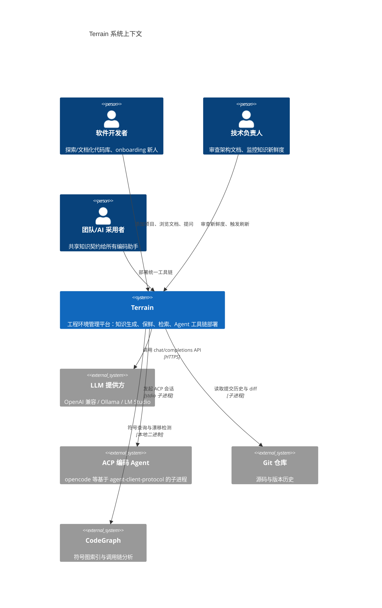

# Terrain

Terrain 是一个面向软件开发者与 AI 编码助手的**工程环境管理平台**。它解决了一个长期困扰工程团队的问题：代码库的架构知识散落在 Wiki、Slack 和资深工程师的脑中，而代码却在不断演进，文档永远跟不上。与此同时，每个 AI 编码助手——Claude Code、Codex、OpenCode、Cursor——都只能盲目地 grep 实时文件系统，无法以一致的视角理解仓库结构。

Terrain 的解法简洁而有力：你只需把一个 Git 仓库指向它，它就会自动产出双轨知识资产——面向人类的叙述性 C4 架构文档（`.terrain/human/`）和面向 Agent 的结构化上下文（`.terrain/agent/context.md`），同时一键部署统一的 Agent 工具链。知识跟随 Git 分支流转，并通过一套新鲜度评分系统告诉你"这份文档还值不值得信"。

从 Litho（deepwiki-rs，1.7k★）演进而来的 Terrain，在其基础上增加了增量更新、新鲜度评分与 ACP 桥接，使其从一个"一次性文档生成器"进化为一个可持续维护的知识基础设施。

## 它能做什么

Terrain 的核心能力可以概括为"从源码到可持续知识基础设施的全自动流水线"。简单来说，你给它一个项目的源码目录，它就能帮你分析代码结构、识别核心模块、梳理依赖关系，然后利用大语言模型把所有这些信息组织成一套专业的 C4 模型架构文档，同时为 AI 编码助手准备好结构化的工作上下文。

**智能代码分析与文档生成**——Terrain 不是简单地扫描文件名，而是真正去解析代码结构。它内置了对 14 种语言的处理器，通过 repomix 将源码打包为带行号的结构化索引，再交给 Litho 引擎（基于 ACP 协议的子进程）进行四阶段深度研究——从系统上下文（C1）到领域模块（C2）再到模块深度探索——最终生成叙述性的 C4 架构文档。整个过程支持增量更新，小提交只需重做变更部分。

**知识保鲜与信任评分**——文档生成一次就完事了吗？Terrain 说不。它内置了一套基于 Git 提交历史与 CodeGraph 符号图的双源交叉验证保鲜系统。每次你刷新知识资产，它都会计算一个 0-100 的新鲜度分数，并明确告诉你"这份文档落后于代码多少"。基准不可达（rebase/squash/force-push）时，它宁可保守地标记为"不新鲜"也不会误报"最新"——这是"fail-closed"的设计哲学。

**统一 Agent 工具链**——每个 AI 编码助手都需要理解代码库，但它们各有各的方式。Terrain 通过 `terrain env apply` 一键部署统一的 AGENTS.md 管理段、预设 Skills（Litho、SDD、Ask 等）和工具二进制（RTK、CodeGraph），确保所有 Agent 用同一套知识与工具契约工作。CLI 和桌面 GUI 共享同一套核心逻辑，外部 Agent 也可以通过 `terrain tools` JSON API 消费同一知识层。

**DeepWiki 问答与 SDD 开发工作流**——基于知识库的问答（Ask）支持三层检索策略：宏观（`agent/context.md`）、中观（`human/` + `knowledge/`）、微观（`agent/repomix.md`），并可根据新鲜度自动决策预加载层级。SDD（Standard Development Driven）则提供从需求文档到代码审查的四阶段标准化开发流程，文档阶段用 Native LLM 精修，代码阶段委派 ACP 编码 Agent 直接在仓库中编写。

## C4 Context 图（系统全景）

下面这张图展示了 Terrain 在整个开发生态中的位置——它连接了人类开发者、多种 AI 编码助手、Git 仓库和 LLM 服务，充当"知识中枢"的角色。

从图中可以读出一个关键设计决策：Terrain 不试图替代 Git、LLM 或编码 Agent，而是把自己定位为它们之间的"知识粘合层"——负责生成、保鲜和分发知识，而不直接参与代码编辑或模型推理。

## 技术选型背后的思考

Terrain 的技术选型围绕"一个 Rust 原生二进制 + 外部 Agent 执行 + Git 原生集成"展开。选择 Rust 不仅仅是为了"高性能"——作为一个需要大量调用外部 LLM API 的 IO 密集型工具，Rust 配合 Tokio 异步运行时可以高效地管理并发请求和缓存读写，同时单一静态二进制便于分发（桌面和 CI 两条通道共用同一 core）。

| 技术领域 | 具体选择 | 为什么这样选 |
|---------|---------|------------|
| 语言与运行时 | Rust（edition 2024，rust-version 1.94）+ tokio | 内存安全 + 高性能处理密集 IO；单一二进制便于分发 |
| 桌面壳 | Tauri 2（plugin-dialog/shell，capabilities ACL） | 前端用 Web 技术（Svelte）而 core 保持 Rust，减少体积与安全问题 |
| Agent 运行时 | ADK Rust 2.2 + agent-client-protocol 1.3 | 直接在 Rust 里驱动 LLM 与 ACP，无需外部补丁 crate |
| LLM 路由 | OpenAI 兼容 + Ollama + LM Studio，`OpenAiApiMode` 切换 | 兼容多种本地/云端模型，满足"本地优先 + 可换远端" |
| 源码索引 | repomix-core 2.0 | 将源码打包为带行号的 Markdown，供 Agent grep/读取（非实时 FS） |
| IPC 类型 | ts-rs 10 + schemars | 从 Rust 生成 TypeScript 类型，杜绝前后端类型漂移 |
| 符号图谱 | CodeGraph（SQLite）+ RTK | 调用链分析 + Shell 输出压缩节省 token |
| 存储 | `.terrain/`（版本化）+ `~/.terrain/`（本地配置） | 知识随 Git 流转；全局配置不外泄 |

选择"外部 ACP 子进程"而非"进程内全权 Agent"来执行文档生成，是因为 Litho 编排需要真实文件系统与工具调用能力——这正是富工具 Agent 的强项；Terrain 自己则承担注入与守护（墙钟超时 + 进度轮询），形成一种"worker 模式"。

## Terrain 能做什么，不能做什么

理解系统的边界和理解它的能力同样重要。Terrain 的核心定位是"知识基础设施"，而非通用 IDE 或代码编辑器。

**它能做的事**：扫描 Git 仓库并自动产出双轨知识资产（人类 C4 文档 + Agent 上下文）；用新鲜度评分告诉你文档是否过时，并支持增量刷新只重做变更部分；一键部署统一的 Agent 工具链和 AGENTS.md 管理段；提供基于知识库的 DeepWiki 问答（支持流式输出）；驱动四阶段 SDD 标准化开发流程；通过 CLI 和桌面 GUI 两种形态服务不同场景。

**它不做的事**：不替代 IDE 或通用代码搜索（不实时索引整个文件系统）；不修改目标仓库代码（SDD CodeGen 阶段除外，那是显式授权）；不托管多人协作的服务端或提供云端知识库；不缓存或代理 LLM 请求本身（只做 200ms 节流与用量统计）；不替代 Git（rebase/force-push 等历史重写正是新鲜度系统要检测的漂移来源）。

---

*Terrain v0.9.5 | Rust workspace + Tauri 2 + Svelte 5 | 从 Litho (deepwiki-rs 1.7k★) 演进*
