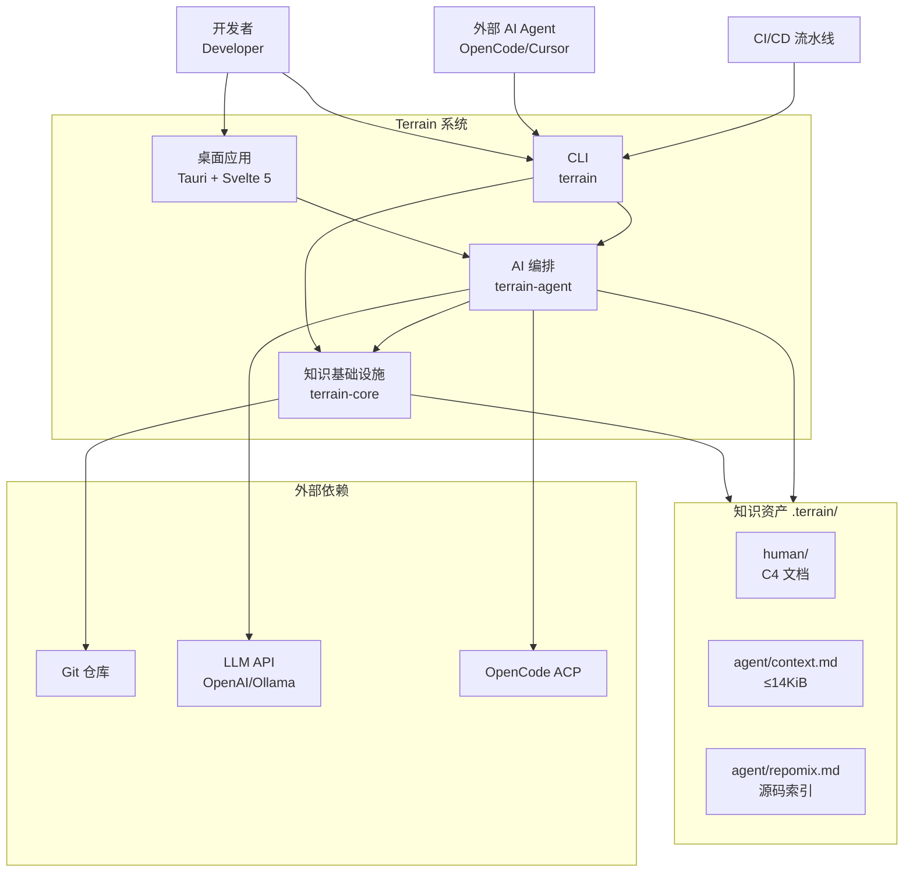

# Terrain

Terrain 是一个面向 AI 编码助手时代的**工程环境管理平台**。当你把 Terrain 指向一个 Git 仓库，它会自动扫描代码结构、生成 C4 架构文档、维护双轨知识资产，并通过 DeepWiki 问答和 SDD 标准化工作流，让人类开发者和外部 AI Agent 共享同一套知识契约。

简单来说，Terrain 解决的是「新成员或 AI 助手面对陌生代码库时，不知道该信什么、该读什么」的痛点。它把架构知识从分散的 Wiki、Slack 和资深工程师脑中，压缩成随代码分支流转的结构化资产。

## 它能做什么

Terrain 的核心能力可以概括为「从源码到知识的全自动工厂」。你给它一个 Git 仓库，它就帮你完成扫描、文档生成、上下文压缩和环境集成四件事。

**智能代码扫描**——Terrain 不只是列文件名，而是通过 `ProjectScanner` 检测技术栈、采集 Git 元数据、导入 OpenAPI 规范，并用 repomix-core 将源码打包为可检索的 `agent/repomix.md`（`crates/terrain-core/src/ingest/mod.rs:52`）。

**C4 架构文档生成（Litho）**——四阶段流水线（预处理→C4 研究→编排→输出）自动产出六份人类友好文档，中间研究产物持久化在 `.terrain/.litho-agent/` 以支持断点续传（`crates/terrain-agent/src/litho.rs:45`）。

**双轨知识资产**——`human/` 存放叙述性 C4 文档（含 Mermaid 图表），`agent/context.md` 存放 ≤14 KiB 的压缩架构摘要，repomix 包按需检索源码细节。这放弃了「一份文档两用」的方案，因为人类和 Agent 的阅读需求截然不同。

**DeepWiki 知识问答**——基于三层检索模型（Macro 预载 context → Meso 按章节读取 → Micro grep/read repomix），让 AI 回答架构问题时有据可查（`crates/terrain-agent/src/chat/mod.rs:53`）。

**SDD 标准化开发**——四阶段工作流（需求→设计→代码生成→审查）产出可审查的 Markdown 产物，CodeGen 阶段委托 ACP Agent 执行（`crates/terrain-agent/src/sdd.rs:19`）。

**AI 工程环境集成**——自动检测并安装 Skills、CodeGraph、RTK 等工具，写入 `AGENTS.md` 片段，引导外部 Agent 正确使用知识层。

## C4 Context 图（系统全景）

下图展示了 Terrain 在 AI 辅助开发生态中的定位：人类通过桌面应用或 CLI 使用，外部 Agent 通过 `terrain tools`（JSON stdout）访问同一套知识。

从图中可以读出三个关键设计决策：知识资产存储在仓库内（随分支流转）、外部 Agent 不直接读活仓库（走 `terrain tools` 三层访问）、长时 AI 任务（Litho/SDD CodeGen）委托 ACP 进程而非直接调 LLM API。

## 技术选型背后的思考

Terrain 选择 Rust 作为核心语言，不仅是为了性能——作为一个需要大量文件 IO、子进程通信和 HTTP 调用的平台，Rust 配合 Tokio 异步运行时可以高效管理并发。Tauri v2 提供了轻量跨平台桌面壳，避免了 Electron 的资源开销。repomix-core 的 Rust 绑定让源码打包无需 Node.js 依赖。

| 技术领域 | 具体选择 | 为什么这样选 |
|---------|---------|------------|
| 核心语言 | Rust 2024 edition | 内存安全 + 高性能 IO，统一 CLI/Agent/Core |
| 桌面壳 | Tauri v2 | 轻量跨平台，Rust 后端直连 terrain-agent |
| 前端 | Svelte 5 + Vite | Runes 响应式，快速迭代 UI 面板 |
| 异步运行时 | Tokio | 统一 Chat/Litho/SDD 的 async 模型 |
| LLM 抽象 | adk-rust | 统一 OpenAI/Ollama/LM Studio 接口 |
| ACP 通信 | agent-client-protocol 0.11.1 | OpenCode 标准，Windows 补丁隐藏控制台 |
| 源码打包 | repomix-core 2.0 | Rust 原生，避免 Node 运行时依赖 |
| 存储 | 文件系统（Markdown/JSON） | 知识随 Git 分支流转，人类可直接审阅 |

## Terrain 能做什么，不能做什么

理解系统边界很重要——Terrain 的定位是「知识工厂」而非「代码编辑器」或「CI 平台」。

**它能做的事**：
- 扫描 Git 仓库并建立结构化知识索引
- 自动生成 C4 架构文档（六份标准人类文档 + 深度模块探索）
- 为 AI Agent 生成压缩架构上下文和源码检索包
- 基于知识库回答架构问题（DeepWiki），并提供源码引用
- 运行 SDD 四阶段标准化开发工作流
- 集成 AI 编码环境（Skills、工具、AGENTS.md）
- 追踪知识资产新鲜度，提示 Agent 降权信任过期内容

**它不做的事**：
- 不替代 Git 或 IDE 进行代码编辑（SDD CodeGen 委托外部 ACP Agent）
- 不托管中心数据库或云端知识同步（知识存在仓库 `.terrain/` 内）
- 不保证 LLM 回答的绝对正确性（提供引用和新鲜度机制辅助判断）
- 不直接管理 LLM API 的计费和配额（仅提供本地用量快照）
