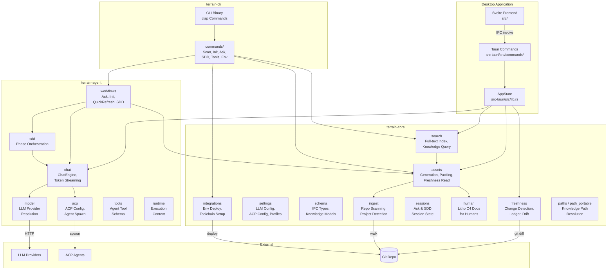
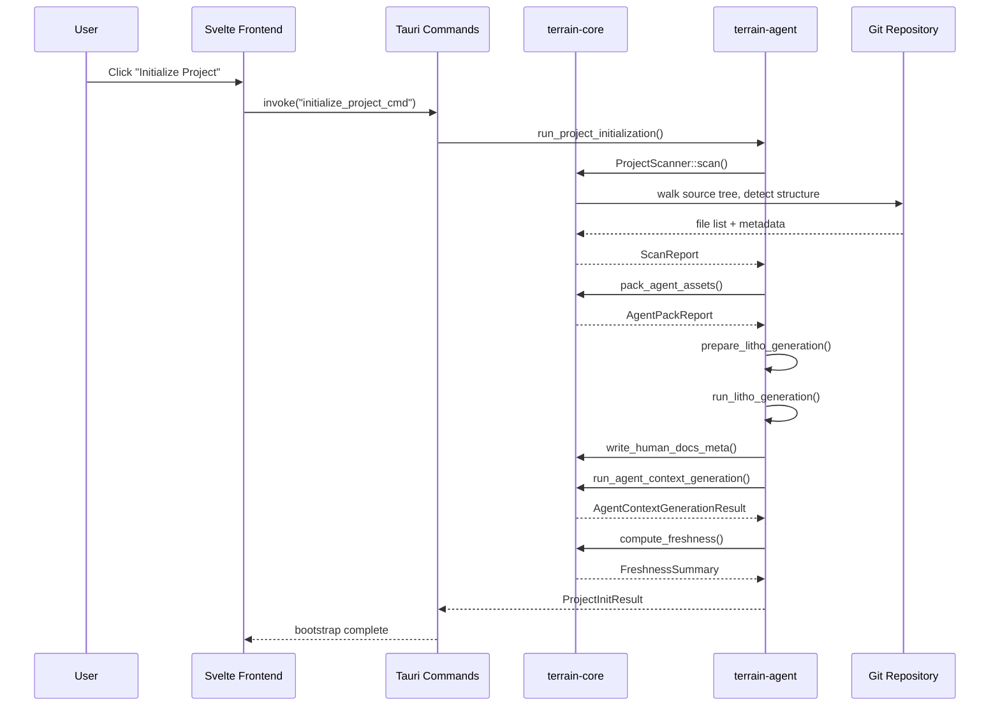
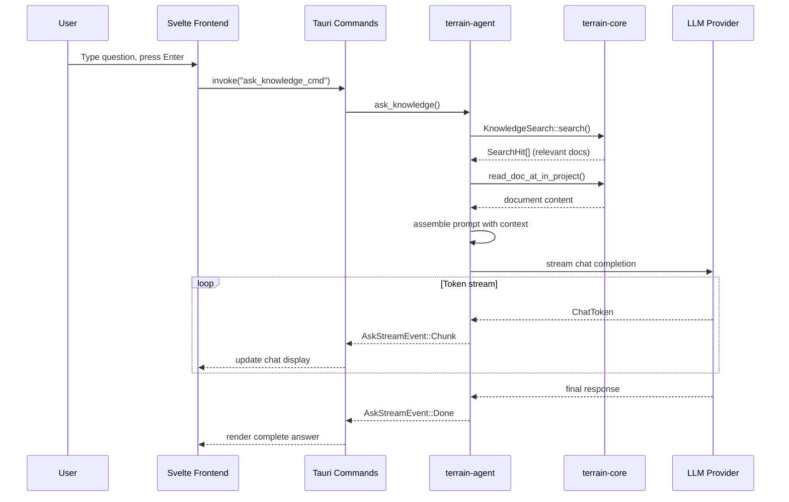
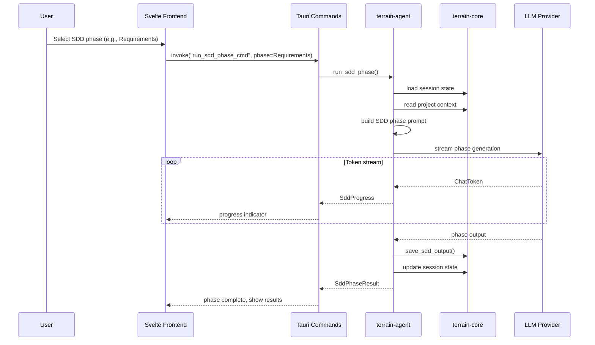
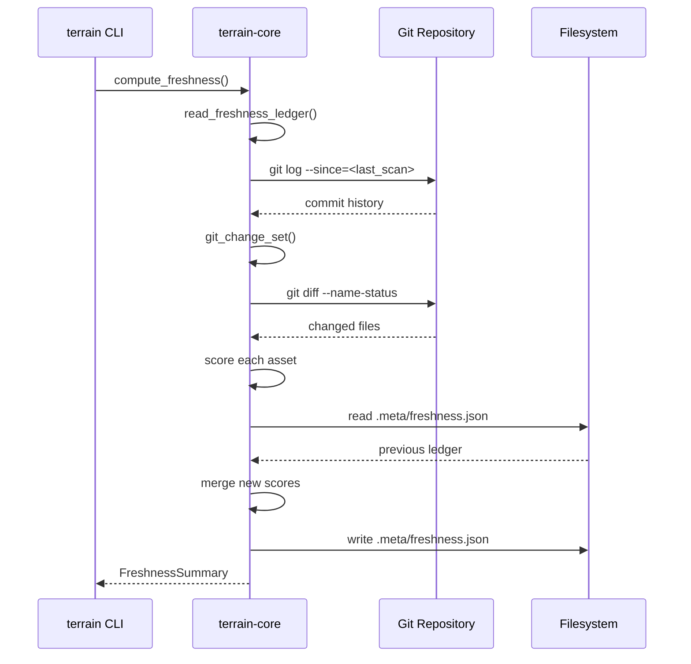

# Terrain — Architecture

## Design principles

**Knowledge as code, not a service.** Terrain stores all generated knowledge as Markdown files in a `.terrain/` directory inside the repository. There is no external database, no cloud sync, and no background daemon. This is a deliberate choice: knowledge travels with the code in Git, survives branch switches, and can be read by any tool that understands the filesystem. The tradeoff is that concurrent writes from multiple agents require coordination at the Git level rather than the database level — Terrain accepts this because most development workflows are single-developer-per-branch.

**Rust as the single source of truth for types.** The IPC boundary between the Rust backend and the Svelte frontend is defined entirely by Rust structs annotated with `ts-rs`. TypeScript types in `src/lib/generated/` are produced by `terrain-ts-export`, never hand-edited. This eliminates an entire class of bugs where the backend evolves a payload shape and the frontend silently breaks. The cost is a build-time dependency on the Rust compiler for type generation, which is acceptable in a Tauri workflow where the Rust toolchain is already present.

**Agents are first-class citizens, not afterthoughts.** The `.terrain/agent/` track is not a human doc with a different filename — it is a purpose-built artifact shaped for LLM context windows: dense, structured, size-enforced, and freshness-scored. The `assets` module in `terrain-core` manages its entire lifecycle from generation through incremental update to freshness decay. This reflects the reality that AI agents consume project context differently than humans do, and conflating the two produces documents that serve neither audience well.

**Composition over inheritance in the agent stack.** The `terrain-agent` crate does not own the LLM client, the chat protocol, or the tool runtime. It composes them from the `adk-*` family of crates (adk-acp, adk-agent, adk-core, adk-model, adk-runner, adk-session, adk-tool) and adds project-specific context assembly on top. This keeps the agent crate focused on Terrain-specific logic while delegating generic LLM and agent concerns to reusable libraries.

## Core architecture patterns

| Pattern | Where | Rationale |
|---------|-------|-----------|
| Workspace crates | `Cargo.toml` workspace with 5 members | Compile-time isolation between knowledge engine, agent logic, CLI, type export, and Tauri shell; each crate can be built, tested, and reasoned about independently |
| IPC via Tauri commands | `src-tauri/src/commands/` | Rust functions annotated as Tauri commands are callable from the Svelte frontend via `invoke()`; keeps the type boundary explicit |
| ts-rs type bridge | `crates/terrain-ts-export/` | Rust structs generate TypeScript definitions; prevents drift between backend payloads and frontend consumers |
| File-based knowledge store | `.terrain/` directory | No database; all state is Markdown, JSON, and YAML files; Git is the persistence and collaboration layer |
| Freshness ledger | `.meta/freshness.json` | Time-stamped snapshot of asset staleness; agents consult it before trusting context; recomputed on demand via CLI or desktop app |
| Workflow orchestration | `crates/terrain-agent/src/workflows/` | Ask, Init, QuickRefresh, and SDD are discrete workflow modules that compose the chat engine, knowledge retrieval, and LLM calls into complete user-facing flows |
| Provider abstraction | `crates/terrain-agent/src/model.rs` | A single `ModelConfig` struct drives OpenAI-compatible, Ollama, and LM Studio providers; provider-specific logic is isolated behind a common interface |

## Technology stack

| Layer | Technology | Version | Role |
|-------|-----------|---------|------|
| Core engine | `terrain-core` | Rust 2024 / 1.94+ | Knowledge generation, search, freshness, settings, IPC schema definitions |
| Agent engine | `terrain-agent` | Rust 2024 / 1.94+ | LLM integration, chat engine, ACP delegation, SDD workflow, Ask workflow |
| CLI | `terrain-cli` | Rust 2024 / 1.94+ | Headless interface for CI, scripting, and agent tooling (JSON output mode) |
| Type export | `terrain-ts-export` | Rust 2024 / 1.94+ | Generates TypeScript type definitions from Rust structs via ts-rs |
| Desktop shell | Tauri 2 | 2.11+ | Native desktop wrapper; manages IPC, system tray, file dialogs, shell plugin |
| Frontend | Svelte 5 | 5.56+ | Reactive UI for knowledge browsing, Ask sessions, settings, usage monitoring |
| Build tooling | Vite 8 | 8.1+ | Dev server, HMR, production bundling for the Svelte frontend |
| Styling | Tailwind CSS 4 | 4.3+ | Utility-first CSS; Vite plugin integration |
| Agent protocol | ACP | 0.11.1 | Vendor-neutral protocol for delegating tasks to external coding agents |
| LLM abstraction | adk-model | 1.0.0 | Unified LLM client supporting OpenAI and Ollama backends |
| Source indexing | repomix-core | 2.0 | Packs repository source into compressed Markdown chunks for LLM consumption |
| IPC type bridge | ts-rs | 10 | Derive macro that generates TypeScript definitions from Rust structs |
| Schema validation | schemars | 1 | JSON Schema generation for Rust types; used for settings validation |
| Async runtime | tokio | 1.x | Async I/O, process spawning, and task orchestration across all Rust crates |

## Container diagram

## Domain module responsibilities

### terrain-core

| Module | Path | Responsibility |
|--------|------|---------------|
| `assets` | `crates/terrain-core/src/assets.rs` | Generates `agent/context.md`, manages repomix packing, enforces size limits, builds generation plans, and coordinates incremental updates |
| `freshness` | `crates/terrain-core/src/freshness.rs` | Computes freshness scores by diffing Git history against knowledge asset timestamps; maintains the `.meta/freshness.json` ledger; detects CodeGraph drift |
| `search` | `crates/terrain-core/src/search.rs` | Full-text search across knowledge documents; returns ranked hits with file paths and line references |
| `settings` | `crates/terrain-core/src/settings.rs` | Loads, validates, and persists LLM provider settings, ACP configuration, and knowledge preferences; defines provider defaults |
| `schema` | `crates/terrain-core/src/schema.rs` | All IPC and knowledge data types (AgentContextMeta, FreshnessSummary, SddPhase, etc.) annotated with ts-rs for TypeScript export |
| `ingest` | `crates/terrain-core/src/ingest/` | Walks a Git repository, detects project structure, and produces scan reports; `ProjectScanner` and `ScanReport` types |
| `sessions` | `crates/terrain-core/src/sessions/` | Manages Ask and SDD session state — creation, listing, message persistence, active session tracking |
| `human` | `crates/terrain-core/src/human.rs` | Lists, reads, and counts Litho-generated human-facing architecture docs in `.terrain/human/` |
| `integrations` | `crates/terrain-core/src/integrations/` | Deploys bundled tools, preset skills, and environment configuration into repositories; manages the `Env` subsystem |
| `prompts` | `crates/terrain-core/src/prompts/` | Builds LLM prompts for Ask, SDD phase execution, and Litho generation; plans SDD workflows |
| `paths` | `crates/terrain-core/src/paths.rs` | Resolves `.terrain/` directory paths for a given repository; central path configuration |
| `git_policy` | `crates/terrain-core/src/git_policy.rs` | Enforces Git-related policies for knowledge asset management |
| `language` | `crates/terrain-core/src/language.rs` | Detects system locale and resolves language settings for CLI output and knowledge generation |
| `citations` | `crates/terrain-core/src/citations.rs` | Extracts and merges source code citations from generated knowledge documents |
| `source` | `crates/terrain-core/src/source.rs` | Reads live source code slices from the repository for citation and context |
| `model_text` | `crates/terrain-core/src/model_text.rs` | Prepares and normalizes Markdown text for LLM consumption (strips reasoning, repairs fences) |
| `process` | `crates/terrain-core/src/process.rs` | Spawns async child processes with cross-platform console window hiding |
| `usage` | `crates/terrain-core/src/usage.rs` | Token usage tracking and aggregation across providers and sessions |
| `agent_tools_deploy` | `crates/terrain-core/src/agent_tools_deploy.rs` | Deploys agent tool binaries into project directories |
| `bundled_tools` | `crates/terrain-core/src/bundled_tools.rs` | Manages bundled tool binaries shipped with Terrain |
| `preset_skills` | `crates/terrain-core/src/preset_skills.rs` | Resolves and deploys preset skill definitions for AI agents |

### terrain-agent

| Module | Path | Responsibility |
|--------|------|---------------|
| `chat` | `crates/terrain-agent/src/chat/` | `ChatEngine` — streams LLM responses, manages conversation state, handles tool calls, tracks token usage |
| `acp` | `crates/terrain-agent/src/acp.rs` | Configures and spawns ACP-compatible agents (OpenCode, Claude Code, Codex); manages delegation lifecycle |
| `model` | `crates/terrain-agent/src/model.rs` | Resolves `ModelConfig` from settings; builds LLM clients for OpenAI-compatible, Ollama, and LM Studio providers |
| `workflows` | `crates/terrain-agent/src/workflows/` | Orchestrates user-facing flows: `ask_knowledge`, `run_project_initialization`, `run_quick_refresh`, `run_sdd_phase` |
| `sdd` | `crates/terrain-agent/src/sdd.rs` | SDD phase execution logic — Requirements, Tech Design, Code Generation, Code Review |
| `builder` | `crates/terrain-agent/src/builder.rs` | Constructs the `AgentConfig` and `Runtime` from environment and settings |
| `runtime` | `crates/terrain-agent/src/runtime.rs` | Holds the execution context (paths, model config) for agent operations |
| `tools` | `crates/terrain-agent/src/tools.rs` | Defines the tool schema exposed to the LLM during Ask and SDD sessions |
| `context_generator` | `crates/terrain-agent/src/context_generator.rs` | Drives `agent/context.md` generation from the agent side, coordinating with `terrain-core::assets` |
| `agent_assets` | `crates/terrain-agent/src/agent_assets.rs` | Ensures agent-specific assets are present and up to date |
| `litho` | `crates/terrain-agent/src/litho.rs` | Prepares and runs Litho generation — LLM-driven production of human-facing architecture docs |
| `throttle` | `crates/terrain-agent/src/throttle.rs` | Rate-limits LLM API calls to stay within provider quotas |
| `settings` | `crates/terrain-agent/src/settings.rs` | Agent-specific settings overlay; re-exports shared types from `terrain-core` |
| `tool_session_cache` | `crates/terrain-agent/src/tool_session_cache.rs` | Caches tool session state to avoid redundant LLM round-trips |
| `compat_tool` | `crates/terrain-agent/src/compat_tool.rs` | Backward compatibility shims for tool schema evolution |

### terrain-cli

| Module | Path | Responsibility |
|--------|------|---------------|
| `cli` | `crates/terrain-cli/src/cli.rs` | Clap-based CLI definition — all commands and subcommands (List, Scan, Init, Refresh, Search, Read, Ask, SDD, Usage, Tools, Assets, Env) |
| `commands` | `crates/terrain-cli/src/commands/` | Command implementations — each subcommand maps to a handler module |
| `main` | `crates/terrain-cli/src/main.rs` | Entry point; initializes tracing, parses args, dispatches to command handlers |
| `util` | `crates/terrain-cli/src/util.rs` | Shared CLI utilities (path resolution, output formatting) |

### Frontend (`src/`)

| Module | Path | Responsibility |
|--------|------|---------------|
| `App.svelte` | `src/App.svelte` | Root component; layout, navigation, session management |
| `main.ts` | `src/main.ts` | Application entry point; bootstraps Svelte app |
| `lib/api.ts` | `src/lib/api.ts` | Typed wrappers around Tauri `invoke()` calls; the frontend's RPC layer |
| `lib/generated/` | `src/lib/generated/` | Auto-generated TypeScript types from Rust structs (via terrain-ts-export) |
| `lib/stores/` | `src/lib/stores/` | Svelte stores for application state (projects, settings, active sessions) |
| `lib/types.client.ts` | `src/lib/types.client.ts` | Frontend-only type extensions that compose generated IPC types with UI-specific fields |
| `lib/components/` | `src/lib/components/` | UI components — project list, knowledge viewer, Ask chat, SDD panel, settings |

## Key flows

### Project initialization

### Ask knowledge question

### SDD phase execution

### Freshness computation

## Architecture decision records

### ADR-001: File-based knowledge store over database

**Decision:** All knowledge assets are stored as Markdown and JSON files in `.terrain/`, with no external database.

**Alternatives considered:**
- SQLite embedded database — faster queries, but breaks Git portability and adds a dependency.
- Cloud-based knowledge service — enables multi-user, but introduces network dependency and privacy concerns.

**Reason:** Terrain's knowledge is meant to travel with the codebase. Developers should be able to clone a repo, see the `.terrain/` directory, and immediately understand the project. A database would create a disconnect between the code and its context. File-based storage also means agents can read knowledge assets with simple file I/O — no database client required.

### ADR-002: Rust as the backend language

**Decision:** The entire backend is written in Rust (2024 edition), including the core knowledge engine, agent logic, and CLI.

**Alternatives considered:**
- TypeScript/Node.js — faster iteration, but no native binary distribution; requires Node runtime on user machines.
- Go — good binary distribution, but weaker async ecosystem for the ACP integration and less ergonomic type generation via ts-rs.

**Reason:** Rust provides single-binary distribution (critical for Tauri), memory safety for the file-heavy knowledge operations, and first-class support for the ts-rs type bridge that keeps the frontend in sync. The async ecosystem (tokio) handles the LLM streaming and ACP protocol without blocking.

### ADR-003: Dual human/agent knowledge tracks

**Decision:** Terrain generates two separate knowledge tracks — `agent/` for AI consumption and `human/` for human consumption — rather than a single unified document.

**Alternatives considered:**
- Single knowledge document with formatting markers — simpler generation, but produces documents that are neither optimal for humans nor for agents.
- Agent-only knowledge — sufficient for AI use, but leaves human developers without orientation docs.

**Reason:** AI agents and human developers consume information differently. Agents need dense, structured, machine-parsable context that fits within token budgets. Humans need narrative prose, diagrams, and progressive disclosure. Forcing both into one format produces a document that serves neither well. The cost is maintaining two generation pipelines, but each pipeline is simpler and produces better output for its target audience.

### ADR-004: ACP for agent integration over proprietary API

**Decision:** Terrain uses the Agent Client Protocol (ACP) to delegate tasks to external coding agents, rather than implementing a proprietary integration for each agent.

**Alternatives considered:**
- Direct API integration with each agent (OpenCode, Claude Code, Codex) — deeper control, but maintenance cost scales linearly with agent count.
- Plugin system with per-agent adapters — flexible, but adds complexity without eliminating protocol fragmentation.

**Reason:** ACP provides a vendor-neutral interface that works with any compliant agent. When a new coding agent implements ACP, Terrain gets support automatically. The protocol handles session management, tool delegation, and streaming — all of which Terrain would otherwise need to reimplement per agent. The patched `agent-client-protocol-tokio` crate (hiding console windows on Windows) demonstrates the small cost of working around ACP quirks.

### ADR-005: ts-rs for IPC type safety

**Decision:** All IPC types are defined in Rust and exported to TypeScript via ts-rs. Frontend types in `src/lib/generated/` are never hand-edited.

**Alternatives considered:**
- Hand-maintained TypeScript types mirroring Rust structs — simpler tooling, but guaranteed to drift over time.
- JSON Schema generation with runtime validation — comprehensive, but adds runtime overhead and still requires manual TypeScript type authoring.
- gRPC/Protobuf — strong type safety, but heavy dependency for a desktop app IPC boundary.

**Reason:** ts-rs generates TypeScript types directly from Rust struct definitions at build time. This makes type drift a compile-time error rather than a runtime surprise. The `terrain-ts-export` crate centralizes the export logic, and `bun run gen:types` regenerates all frontend types in one step. The tradeoff is that Rust must be compiled to update frontend types, but this is already required in the Tauri build workflow.

## Key file references

| File | What to look at |
|------|----------------|
| `crates/terrain-core/src/lib.rs:1-162` | Full module tree and public API surface of the knowledge engine — start here to understand what terrain-core exposes |
| `crates/terrain-agent/src/lib.rs:1-56` | Agent crate composition — ACP, chat, model, workflows, SDD; start here to understand the agent layer |
| `crates/terrain-agent/src/workflows/mod.rs:1-13` | Workflow dispatch — the four user-facing flows (Ask, Init, QuickRefresh, SDD) and their public APIs |
| `crates/terrain-cli/src/cli.rs:1-376` | Complete CLI surface — every command, subcommand, and argument definition |
| `src-tauri/src/lib.rs:1-116` | Tauri application bootstrap — AppState construction, plugin registration, and the full IPC handler table |
| `crates/terrain-core/src/settings.rs:1-60` | LLM provider defaults and ACP configuration types — the knobs that control agent behavior |
| `crates/terrain-core/src/freshness.rs` | Freshness scoring engine — change detection, drift factors, trust thresholds |
| `crates/terrain-core/src/assets.rs` | Asset generation pipeline — context assembly, repomix packing, size enforcement, incremental updates |
| `Cargo.toml:1-59` | Workspace configuration — all crate dependencies, workspace members, and the ACP tokio patch |
| `package.json:1-38` | Frontend dependency manifest — Svelte, Vite, Tailwind, Mermaid, and Tauri plugin versions |
