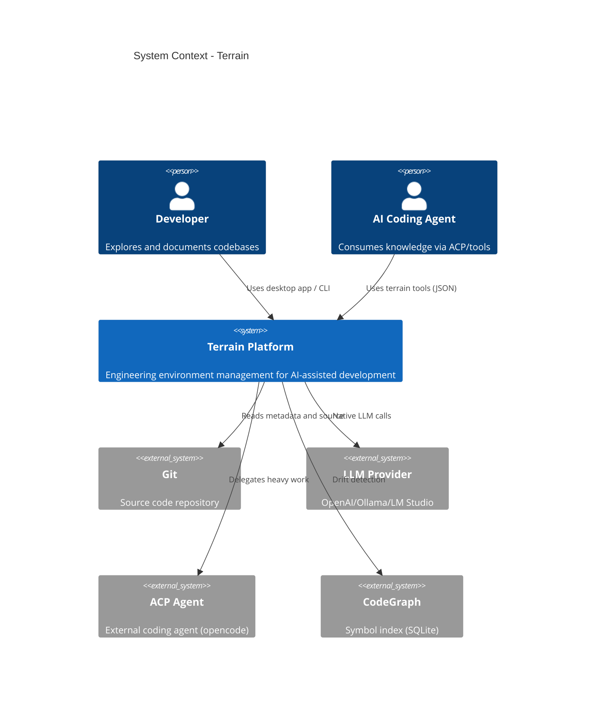
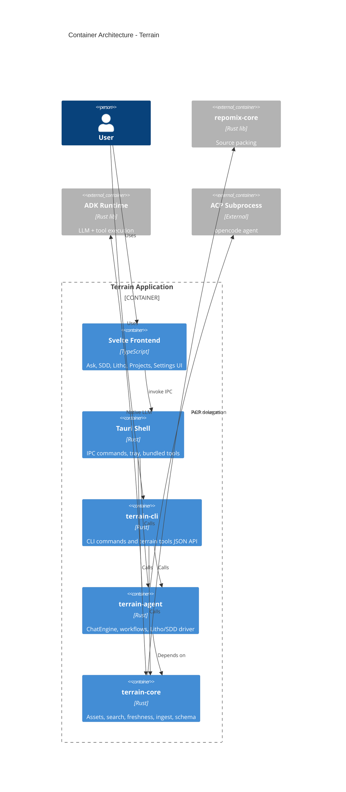
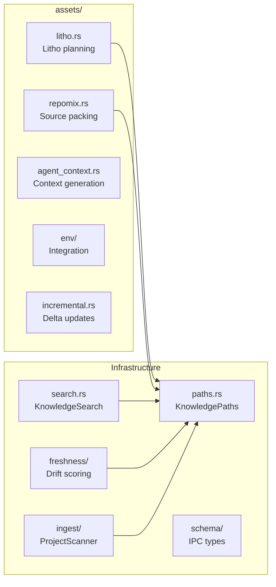
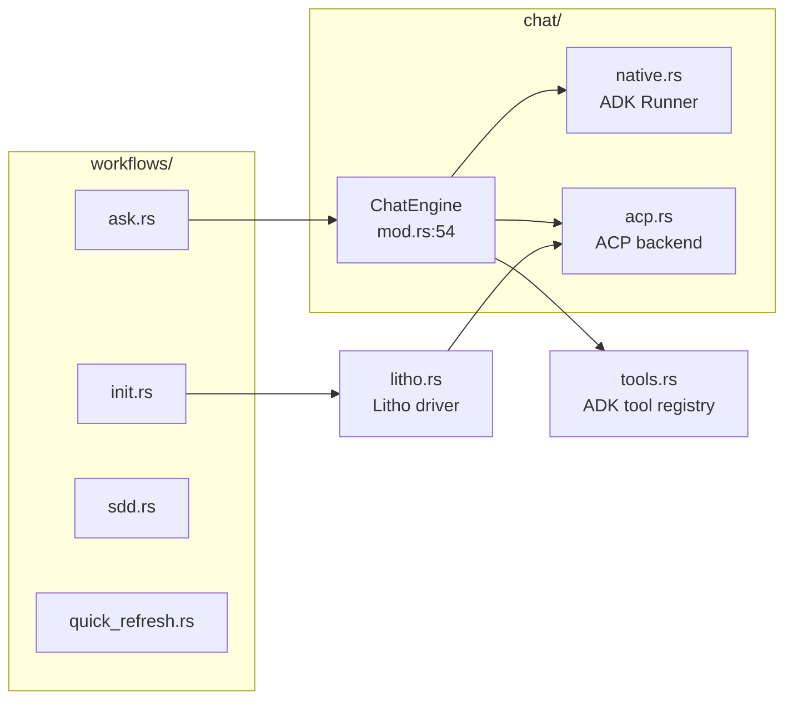
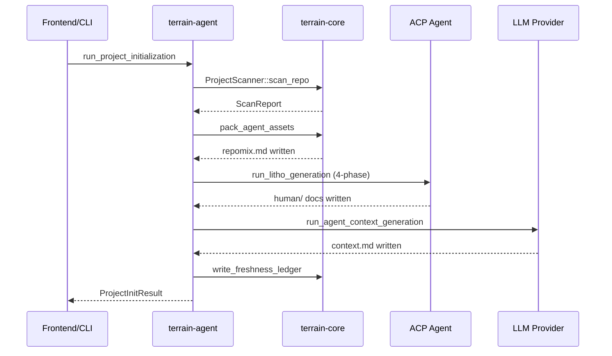
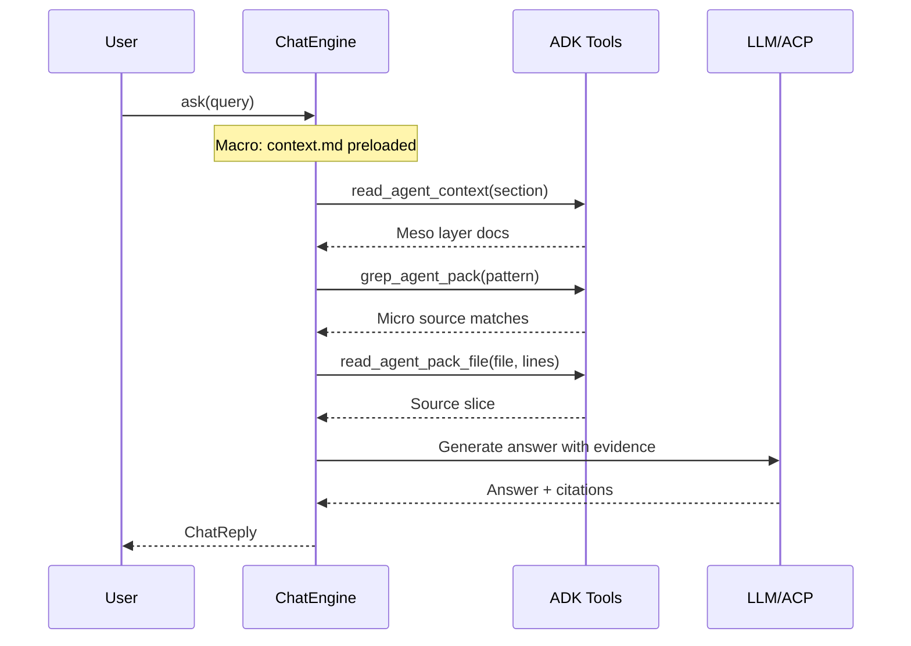

# System Architecture: Terrain

**Version:** 1.0
**Classification:** Internal architecture documentation
**Generated:** 2026-08-22

---

## 1. Architecture Overview

### 1.1 Design Philosophy

Terrain's architecture is built around one central idea: **separate what you know from how you execute**. The domain core (`terrain-core`) holds all knowledge logic — scanning, packing, searching, freshness scoring, Litho planning — without ever calling an LLM. The execution layer (`terrain-agent`) handles the messy work of talking to language models and ACP subprocesses. Three entry points (desktop app, CLI, `terrain tools`) are just different doors into the same kitchen.

This separation delivers three concrete benefits:

**1. Testability without LLM dependencies** — Core logic runs in unit tests with no API keys. Freshness scoring, path resolution, and search indexing are fully deterministic.

**2. Single source of truth** — Rust types flow through ts-rs to TypeScript. The frontend never invents its own data shapes; it consumes what the backend defines.

**3. Agent ecosystem compatibility** — Heavy tool-using work (Litho generation, SDD codegen) delegates to external ACP agents via a standard protocol, rather than embedding all capabilities in-process.

### 1.2 Core Architecture Patterns

| Pattern | Implementation | Purpose |
|---------|---------------|---------|
| Layered architecture | core → agent → UI/CLI | Strict dependency direction; core has zero LLM imports |
| Pipeline-filter | Litho 4-phase, SDD 4-phase | Resumable stages with checkpoint files in `.litho-agent/` |
| Dual-track knowledge | `human/` + `agent/` from one factory | Same source analysis, different output formats for different audiences |
| Filesystem event store | `.terrain/` per repo | Knowledge travels with Git branches; no sync server |
| Strategy (ChatEngine) | Native ADK vs ACP backend | Runtime-selectable execution without code changes |

### 1.3 Technology Stack

| Layer | Technology | Version |
|-------|-----------|---------|
| Core runtime | Rust + Tokio | edition 2024, rust 1.94 |
| Desktop shell | Tauri | 2.x |
| Frontend | Svelte 5 + Vite 8 + Tailwind 4 | — |
| Agent framework | ADK Rust (adk-core/agent/runner/tool/model) | 1.0 |
| ACP protocol | agent-client-protocol | 0.11.1 |
| Source packing | repomix-core | 2.0 |
| Type export | ts-rs | 10 |
| CLI parsing | clap | — |

---

## 2. System Context (C4 Level 1)

---

## 3. Container View (C4 Level 2)

### 3.1 Domain Module Responsibilities

The table below maps each major module to its path, responsibility, and key abstractions. Together they form Terrain's complete capability surface.

| Module | Path | Responsibility | Key Abstractions |
|--------|------|----------------|------------------|
| terrain-core | `crates/terrain-core/src/` | Domain logic: assets, search, freshness, ingest | `KnowledgePaths`, `KnowledgeSearch`, `ProjectScanner` |
| terrain-agent | `crates/terrain-agent/src/` | LLM/ACP execution, workflows, tool registry | `ChatEngine`, `Runtime`, `LithoRunMode` |
| terrain-cli | `crates/terrain-cli/src/` | CLI and `terrain tools` JSON API | `Cli`, `Commands`, `ToolsCommands` |
| desktop-app | `src-tauri/src/` | Tauri IPC shell, tray, bootstrap | `AppState`, invoke commands |
| frontend | `src/` | Svelte 5 UI panels and state | `App.svelte`, `api.ts`, stores |
| agent-tools | `preset_skills/`, `env-catalog/`, `packages/` | Skills, bundled CLIs, env catalog | Litho/SDD/Ask skills, CodeGraph, RTK |

---

## 4. Component View (C4 Level 3)

### 4.1 terrain-core Component Architecture

terrain-core is organized into focused submodules, each owning a slice of the knowledge lifecycle.

**Component responsibilities:**
- `assets/litho.rs` — Plans Litho jobs, builds ACP prompts, checks doc completeness (`litho_human_complete_with_research` at line 256)
- `assets/repomix.rs` — Packs repository source into grep-friendly `agent/repomix.md`
- `freshness/compute.rs` — Aggregates git drift + codegraph drift into 0–100 scores
- `ingest/mod.rs` — `ProjectScanner::scan_repo` orchestrates Git + OpenAPI collectors
- `search.rs` — `KnowledgeSearch` provides full-text search with `SearchHit` results

### 4.2 terrain-agent Component Architecture

---

## 5. Key Flows

### 5.1 Project Initialization Sequence

### 5.2 Ask Q&A Three-Layer Retrieval

---

## 6. Technical Implementation

### 6.1 Key Design Patterns

**KnowledgePaths resolver** — Every `.terrain/` path is computed through `KnowledgePaths` (`crates/terrain-core/src/paths.rs:10`), never hardcoded. This centralizes layout changes and supports both registry-based and workspace-based resolution.

**Incremental Litho updates** — When only a few source files change, `build_litho_update_prompt` (`crates/terrain-core/src/assets/litho.rs:97`) instructs the ACP agent to edit existing docs in place rather than regenerating the full set. The change list routes directly to affected `4.Deep-Exploration/{module}.md` files.

**Tool session cache** — `tool_session_cache.rs` in terrain-agent deduplicates identical tool calls within a single Ask session, preventing redundant repomix reads.

### 6.2 Concurrency Strategy

Tokio async runtime handles all IO-bound work. ACP subprocesses run in isolated processes (trust boundary). Litho generation polls with heartbeat progress events (`POLL_INTERVAL_SECS=3` in `crates/terrain-agent/src/litho.rs:37`). ChatEngine stream callbacks use `Mutex` for thread-safe event emission.

### 6.3 Performance Optimizations

- Repomix pack cached with baseline HEAD tracking — repack only when source drifts
- Freshness ledger persisted in `.meta/freshness.json` — avoids recomputing on every UI load
- Knowledge-only Git commits excluded from drift scoring (`freshness/mod.rs:35-48`)
- Frontend `appBootstrap.ts` deduplicates bootstrap IPC across windows

---

## Appendix: Architecture Decision Records

**ADR 1: Filesystem over database**
- **Decision**: Store all knowledge in `.terrain/` directory tree
- **Alternative rejected**: SQLite or remote knowledge server
- **Rationale**: Knowledge travels with Git branches; no sync infrastructure needed
- **Consequence**: No cross-machine knowledge sharing without Git push/pull

**ADR 2: ACP delegation for heavy work**
- **Decision**: Litho and SDD CodeGen run via external ACP subprocess
- **Alternative rejected**: Embed all tool-use in native ADK Runner
- **Rationale**: Ecosystem compatibility with opencode, Claude Code, Codex
- **Consequence**: Requires ACP agent installation; adds subprocess overhead

**ADR 3: Rust as IPC source of truth**
- **Decision**: All types defined in Rust, exported to TypeScript via ts-rs
- **Alternative rejected**: Shared JSON schema or hand-written TS types
- **Rationale**: Compile-time safety; single definition prevents drift
- **Consequence**: Requires `bun run gen:types` after Rust type changes

**ADR 4: Non-deterministic generated assets**
- **Decision**: Mark `.terrain/agent/` and `.terrain/human/` as `-merge` in `.gitattributes`
- **Alternative rejected**: Deterministic generation or gitignored outputs
- **Rationale**: LLM output varies; manual merge conflicts are worse than choosing one version
- **Consequence**: Regenerate rather than hand-merge conflicting knowledge assets
