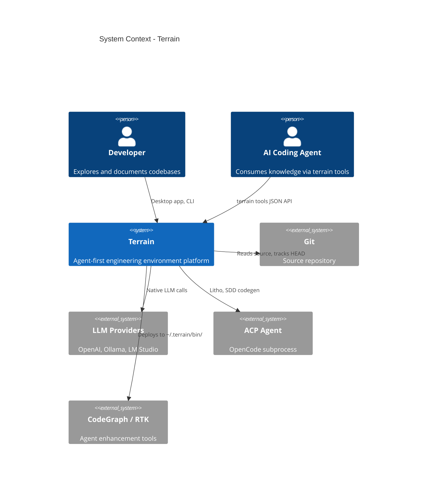
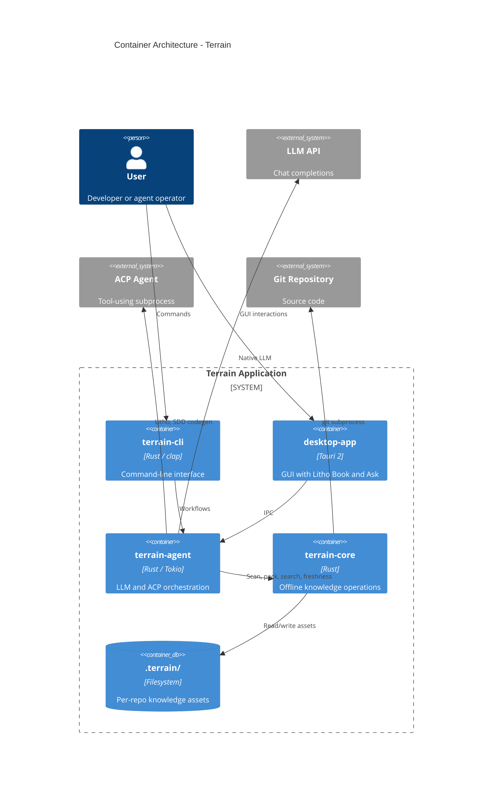
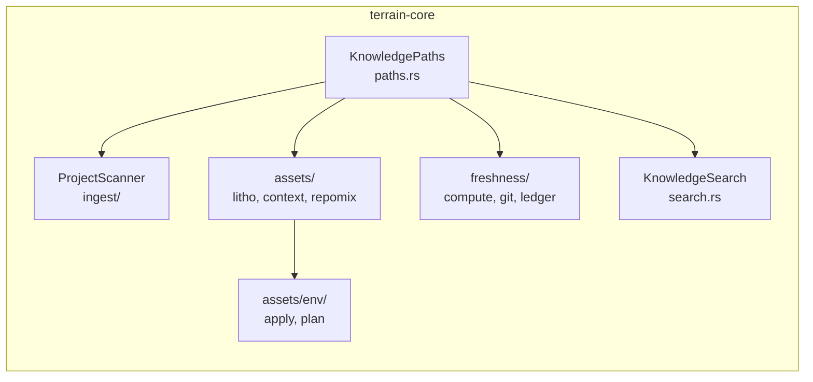
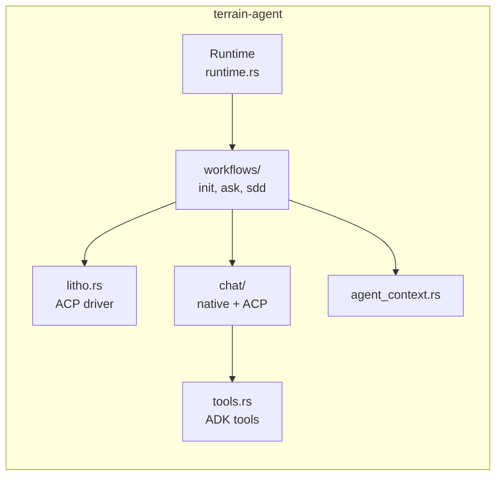
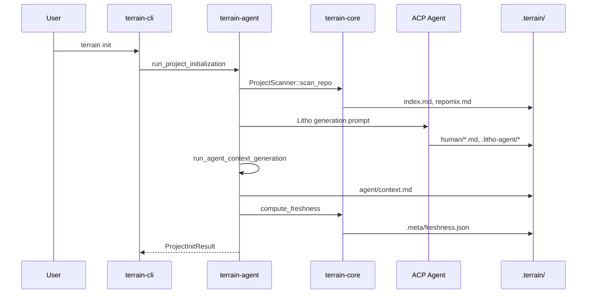
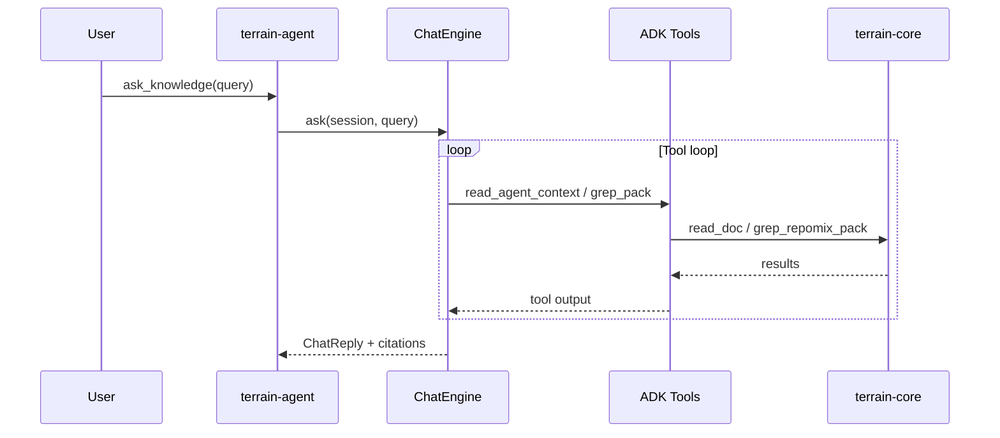

# System Architecture: Terrain

**Version:** 1.0  
**Classification:** Internal architecture document  
**Generated:** 2026-08-24

---

## 1. Architecture Overview

### 1.1 Design Philosophy

Terrain is architected around a simple but powerful idea: **separate what machines can do offline from what requires AI reasoning**. The `terrain-core` crate handles file scanning, packing, searching, and freshness math without ever calling an LLM. The `terrain-agent` crate owns every AI interaction — native LLM for lightweight summarization, ACP subprocess for heavy tool-using work like Litho document generation.

This split means you can scan a repo, search its knowledge base, or check freshness scores even when no LLM is configured. It also keeps the CLI and desktop app lean: they share one `Runtime` (`crates/terrain-agent/src/runtime.rs`) that wraps both crates.

**1. Knowledge travels with Git**  
All assets live at `{repo}/.terrain/`, not on a central server. The global registry (`~/.terrain/registry.json`, `registry.rs`) stores only slug→path pointers. When you branch or open a PR, your knowledge branches with you.

**2. Pipeline-filter knowledge factory**  
Scan → pack → context (LLM) → docs (ACP/Litho) → freshness tracking. Each stage writes artifacts that downstream stages consume. Incremental logic (`assets/incremental.rs`) skips expensive stages when Git drift is small.

**3. Dual execution paths**  
Lightweight tasks (context overview, SDD requirements/review) use `ChatEngine::new_native`. Heavy tool-using work (Litho, SDD codegen) spawns an ACP subprocess (`acp.rs`, `litho.rs:114-143`).

**4. Layered knowledge access**  
Macro (`agent/context.md`) → Meso (`human/`, `knowledge/`) → Micro (`agent/repomix.md`). Trust order: repomix > CodeGraph > context.md > human docs.

### 1.2 Core Architecture Patterns

| Pattern | Implementation | Purpose |
|---------|---------------|---------|
| Layered libraries | `terrain-core` → `terrain-agent` → CLI/Tauri | Core works offline; agent adds LLM/ACP |
| Pipeline-filter | `workflows/init.rs` chains scan → litho → context | Staged knowledge production with checkpoints |
| Strategy (execution) | `AgentExecution` / `AskExecution` settings | Choose native LLM vs ACP per task type |
| Registry | `KnowledgePaths` + `registry.rs` | Resolve project slugs to repo paths |
| Incremental update | `plan_incremental_update`, `LithoRunMode::Auto` | Avoid full regeneration on small diffs |

### 1.3 Technology Stack

| Layer | Technology | Rationale |
|-------|-----------|-----------|
| Language | Rust 2024 | Memory safety, single-binary distribution |
| Async runtime | Tokio | ACP polling, concurrent pack operations |
| Desktop | Tauri 2 (`src-tauri/`) | Cross-platform GUI sharing Rust backend |
| CLI | clap 4 (`cli.rs`) | Structured subcommands for scripting |
| LLM | adk-model | Unified OpenAI/Ollama/LM Studio |
| ACP | adk-acp + agent-client-protocol 0.11 | Subprocess agent delegation |
| Source pack | repomix-core | Token-efficient grep-friendly index |
| Serialization | serde + schemars | JSON IPC and tool parameter schemas |

---

## 2. System Context (C4 Level 1)

---

## 3. Container View (C4 Level 2)

### 3.1 Domain Module Responsibilities

| Module | Path | Responsibility | Key abstractions |
|--------|------|----------------|------------------|
| terrain-core | `crates/terrain-core/` | Offline knowledge ops | `KnowledgePaths`, `ProjectScanner`, `KnowledgeSearch` |
| terrain-agent | `crates/terrain-agent/` | LLM/ACP orchestration | `Runtime`, `ChatEngine`, `LithoRunMode` |
| terrain-cli | `crates/terrain-cli/` | CLI surface | `Cli`, `Commands` |
| desktop-app | `src-tauri/` | Tauri GUI + IPC | `AppState`, `commands::*` |
| agent-tools | `agent_tools_deploy.rs` | Tool deployment | `AgentToolPaths`, `DeployOptions` |

---

## 4. Component View (C4 Level 3)

### 4.1 terrain-core Components

**Component responsibilities:**
- `KnowledgePaths` — resolves `{repo}/.terrain/` subdirectories (`paths.rs:93-110`)
- `ProjectScanner` — orchestrates Git + OpenAPI + repomix collectors (`ingest/mod.rs:52`)
- `assets/litho` — plans and prompts Litho generation (`assets/litho.rs:17`)
- `freshness/compute` — aggregates per-asset drift scores
- `assets/env` — Skills/tools/AGENTS.md integration

### 4.2 terrain-agent Components

---

## 5. Key Flows

### 5.1 Project Initialization

### 5.2 DeepWiki Ask

---

## 6. Technical Implementation

### 6.1 Concurrency and Parallelism

- Tokio async runtime for all agent workflows
- ACP subprocess runs independently; parent polls with `tokio::select!` (`litho.rs:139`)
- Tool session cache deduplicates identical calls within an Ask session (`tool_session_cache.rs`)
- Freshness computation is synchronous Git subprocess + file I/O

### 6.2 Performance Optimizations

- **Incremental updates**: `plan_incremental_update` avoids full Litho/context regeneration when < 20 files changed
- **Pack text cache**: `read_pack_text_cached` avoids re-reading large repomix files
- **Knowledge-only commit exclusion**: `.terrain/` commits don't penalize freshness (`freshness/mod.rs:35`)
- **Adaptive ACP polling**: 3s active / 6s stable intervals (`litho.rs:37-39`)

### 6.3 Error Handling

- `CoreError` / `TerrainError` with structured bodies (`error.rs`)
- Ask degrades to plain search when LLM unavailable (`ask.rs:23-30`)
- Litho wall timeout aborts hung ACP sessions (`litho.rs:131-137`)
- `reject_incremental_document` prevents doc shrinkage on bad incremental updates

---

## Appendix: Architecture Decision Records

**ADR 1: File-based knowledge over database**  
- **Decision**: Store all knowledge in `{repo}/.terrain/`  
- **Reason**: Knowledge must travel with Git branches; no sync lag with a central DB  
- **Consequence**: No query engine; search is full-text over Markdown files

**ADR 2: ACP subprocess for Litho**  
- **Decision**: Delegate Litho to external ACP agent with document skill  
- **Reason**: Tool-using agents produce higher-quality C4 docs; skill is independently versioned  
- **Consequence**: Requires ACP agent configuration; 45-minute wall timeout needed

**ADR 3: Core/agent crate split**  
- **Decision**: `terrain-core` has zero LLM dependencies  
- **Reason**: Enable offline scan/search/freshness without API keys  
- **Consequence**: Two crates to maintain; clear dependency direction

**ADR 4: Freshness excludes knowledge commits**  
- **Decision**: Commits touching only `.terrain/` don't count as source drift  
- **Reason**: Regenerating knowledge advances HEAD but shouldn't mark assets stale  
- **Consequence**: More accurate freshness scores; tested in `freshness/mod.rs:35-100`
