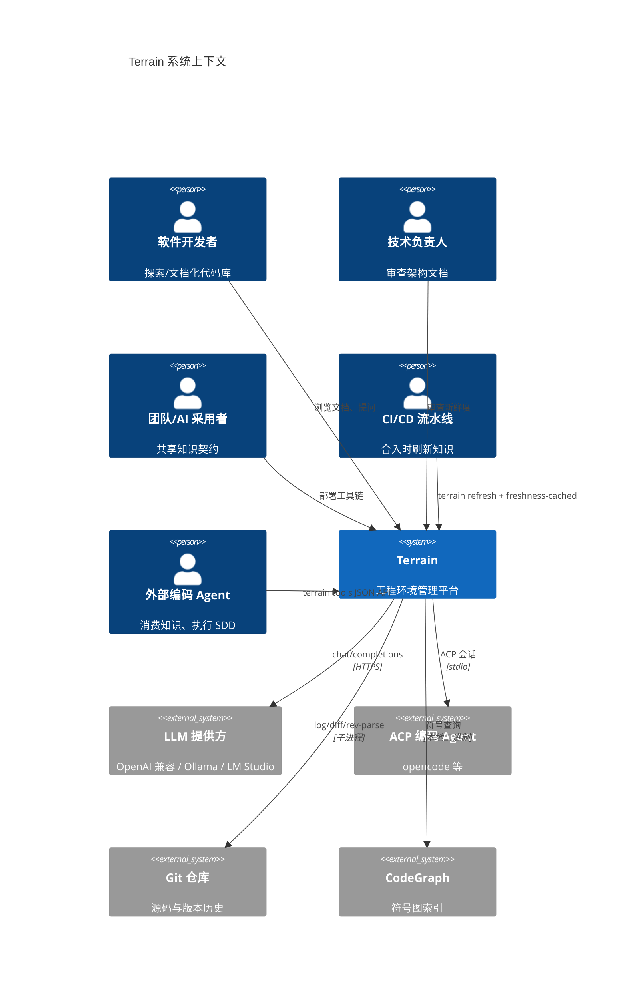
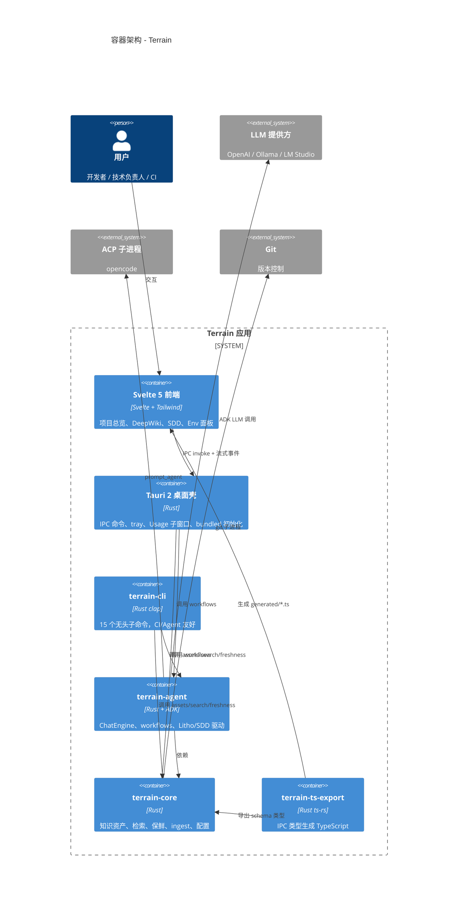
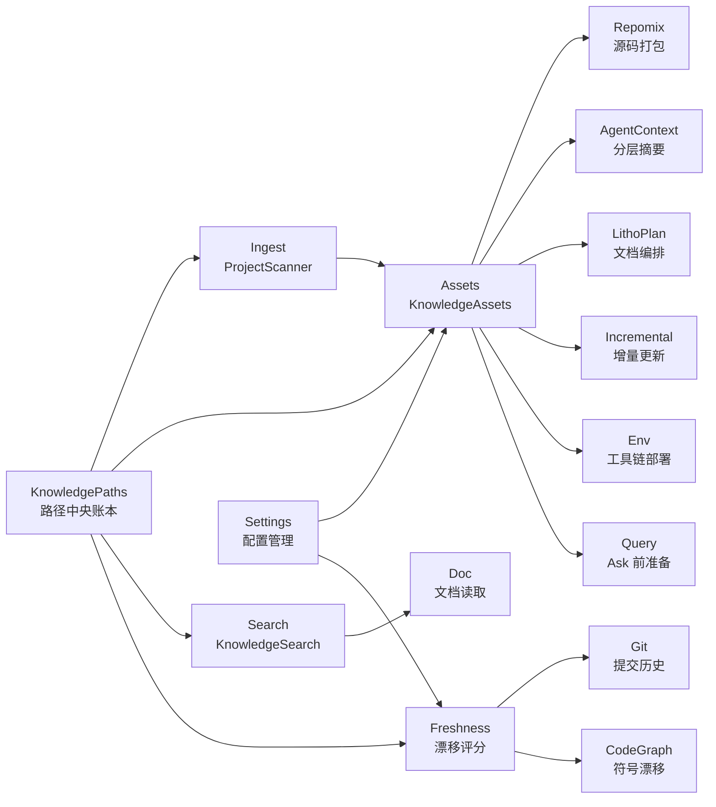
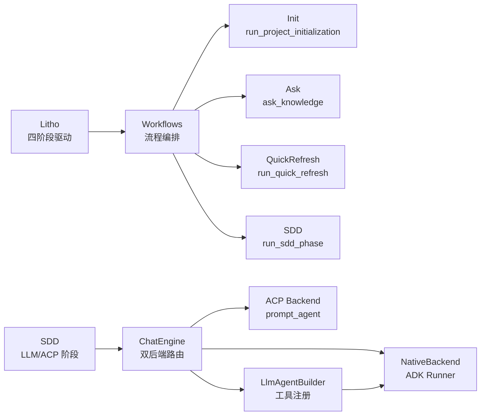
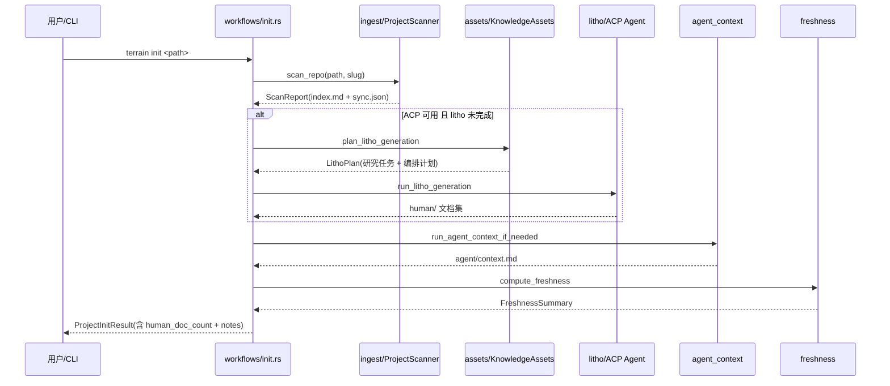
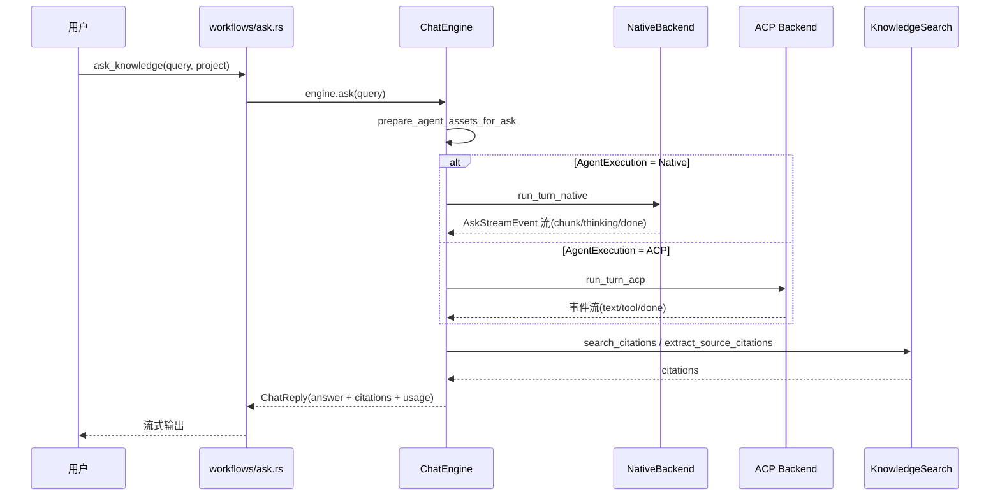
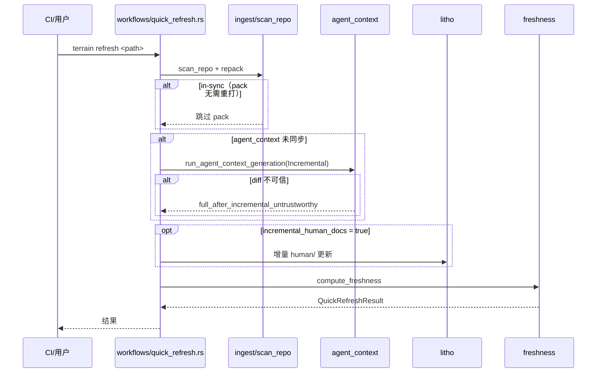

# 系统架构文档：Terrain

**版本：** 1.0
**分类：** 内部架构文档
**生成日期：** 2026-09-15

---

## 1. 架构概述

### 1.1 设计理念

Terrain 的架构可以用一个比喻来理解：它是一家**知识工厂**，把"源码仓库"作为原材料，经过多道工序（扫描、打包、研究、编排、保鲜）加工成人类和 AI 都能消费的知识产品。这家工厂有两条核心设计原则贯穿始终——**知识逻辑与执行严格分离**，以及**生成资产必须可持续维护而非一次性交付**。

**1. 知识逻辑与执行的物理隔离**

`terrain-core` 是只读图纸的"车间主任"——它决定"该产出什么、怎么保鲜、如何被检索"，但绝不下场调用 LLM。`terrain-agent` 是"一线工人"，真正驱动 ChatEngine、ACP 子进程去生成和更新知识。`terrain-cli` 与 `src-tauri` 是面向用户的"两个展台"——一个对着终端、一个对着桌面，共享同一套车间。这种分离的直接收益是：核心逻辑可以被 Tauri 与 CLI 复用、无 LLM 时扫描/搜索/保鲜/打包仍然完全可用（`terrain-core` 编译不依赖任何模型），且外部 Agent 通过 `terrain tools` 走到的是与桌面端完全一致的知识层。

分层证据：`crates/*` 依赖方向严格单向（agent → core；tauri/cli → 两者），见 `crates/terrain-core/src/lib.rs` 与 `crates/terrain-agent/src/lib.rs` 的 re-export 风格。

**2. 生成资产的可持续性设计**

LLM 生成的文档天然具有非确定性——同一份代码两次生成措辞都不同。Terrain 把这个约束变成了设计特征：`.terrain/.gitattributes` 把生成资产标记为 `-merge`（禁用自动合并），`.terrain/.gitignore` 防止本机衍生物误入库。当 Git 冲突时，正确的做法不是手工合并（合并结果会是"既不是 A 也不是 B"的自相矛盾文档），而是保留任一版本后重新运行 scan 基于合并后的代码重生成。

**3. Fail-closed 保鲜哲学**

新鲜度系统在"无法度量"时按**不新鲜**处理，而不是误报"零漂移"。记录在案的基准提交不可达（rebase/squash/amend/force-push/浅克隆）时，直接按 stale 计分（`freshness/scoring.rs:58-78`）。背后的逻辑是：在无法验证的那一刻恰好把文档当作最新，是最危险的。

**4. 增量优先，退化有据**

默认启用增量刷新（`KnowledgeSettings.incremental_refresh=true`，`settings.rs:82-93`）。只有少量文件漂移时按 git diff 增量更新，太大或基准不可达则退回全量重建并给出稳定 reason 字符串（`assets/incremental.rs:76-139`），以便诊断和 UI 展示。

### 1.2 核心架构模式

| 模式 | 实现方式 | 目的 |
|------|---------|------|
| 分层架构（Layered） | terrain-core（知识逻辑）→ terrain-agent（LLM/ACP 执行）→ terrain-cli/src-tauri（用户界面） | 依赖单向、核心可独立测试、无 LLM 环境可用 |
| Worker 模式（外部 Agent） | ACP 子进程（默认 opencode）以独立会话执行 Litho/SDD/CodeGen | 富工具 Agent 可执行需真实文件操作的深度任务 |
| 双后端路由 | `AgentExecution` 枚举决定 Native ADK / 纯 ACP | 灵活适配不同场景：多轮会话用 Native，深度工具用 ACP |
| 知识仓库模式 | `.terrain/` 目录随 Git 流转 | 知识随分支流转、增量 diff 天然可用、无中心化服务端 |
| 增量更新 | `plan_incremental_update` 按 git diff 分组变更文件 | 小提交秒级完成，避免每次全量重建 |
| Fail-closed 守卫 | 基准不可达 → stale（非零漂移） | 宁可保守也不误导用户 |

### 1.3 技术栈概述

Terrain 的技术栈横跨 Rust 后端、Web 前端和外部工具三个层面。Rust 是核心语言（edition 2024，rust-version 1.94），配合 tokio 异步运行时处理密集 IO；桌面壳用 Tauri 2，前端用 Svelte 5（runes）+ Vite 8 + Tailwind 4；Agent 运行时基于 ADK Rust 2.2（adk-core/agent/runner/session/tool/model + adk-acp）；源码索引用 repomix-core 2.0；IPC 类型导出用 ts-rs 10；符号图谱用 CodeGraph（SQLite）+ RTK（Shell 输出压缩）。

**外部依赖的控制**：全仓无数据库 crate（.sql 文件或 ORM 框架），持久化完全由 `.terrain/`（版本化知识资产）+ `~/.terrain/`（本机配置）+ Git 本身构成。LLM 调用通过 OpenAI 兼容 API（chat/completions 或 responses）+ Ollama + LM Studio 三种后端路由。

---

## 2. 系统上下文（C4 Level 1）

这张系统上下文图揭示了 Terrain 的生态定位：它不是孤立工作的，而是作为多个角色（开发者、技术负责人、CI、外部 Agent）与多个外部系统（LLM、ACP Agent、Git、CodeGraph）之间的**知识中枢**。所有交互都是单向或双向的数据流，但核心逻辑始终在 Terrain 内部闭环。

---

## 3. 容器视图（C4 Level 2）

容器视图清晰地展示了 Terrain 的分层结构：前端和 CLI 是两个"展台"，共享同一个"车间"（core + agent）。Tauri 壳不仅是桌面 UI 的载体，还承担了 bootstrap（启动时探测环境、部署工具链）和流式事件分发的职责。

### 3.1 领域模块职责

| 模块/领域 | 路径 | 职责 | 关键抽象 |
|---------|------|------|---------|
| assets | `crates/terrain-core/src/assets/` | 知识资产生成：repomix pack、agent context、Litho/SDD/Ask 资产、增量刷新、env 集成 | `KnowledgeAssets`、`LithoPlan`、`KnowledgeUpdateMode` |
| freshness | `crates/terrain-core/src/freshness/` | Git + CodeGraph 漂移评分、fail-closed 漂移判定、台账 | `FreshnessSummary`、`DataDrift` |
| chat | `crates/terrain-agent/src/chat/` | ChatEngine 双后端（Native ADK / ACP）、Ask 工具注册、会话状态 | `ChatEngine`、`NativeBackend`、`AskStreamEvent` |
| workflows | `crates/terrain-agent/src/workflows/` | Init / Ask / QuickRefresh / SDD 流程编排 | `ProjectInitResult`、`QuickRefreshResult` |
| ingest | `crates/terrain-core/src/ingest/` | ProjectScanner、Git 元数据、OpenAPI 导入、index.md | `ProjectScanner`、`ScanReport`、`SyncMeta` |
| sdd | `crates/terrain-agent/src/sdd.rs` | SDD 四阶段会话与产物、LLM/ACP 派发 | `SddRunCommandPayload` |
| search | `crates/terrain-core/src/search.rs` | KnowledgeSearch 全文检索、read_doc_at | `KnowledgeSearch`、`SearchHit` |
| env | `crates/terrain-core/src/assets/env/` | 环境集成：Status/Plan/Apply、CATALOG、工具部署、AGENTS.md 片段 | `EnvStatus`、`EnvPlan`、`EnvApplyResult` |
| settings | `crates/terrain-core/src/settings.rs` | 模型/ACP/知识配置、ProviderProfile、默认值 | `AcpSettings`、`ModelSettings`、`KnowledgeSettings` |
| cli / tauri | `crates/terrain-cli/` + `src-tauri/` | 无头入口与桌面壳：IPC 命令面、clap 子命令 | Tauri `invoke_handler`（约 60 个命令） |

---

## 4. 组件视图（C4 Level 3）

### 4.1 terrain-core 知识核心组件架构

`terrain-core` 是整个系统的知识逻辑中枢，它不依赖任何 LLM，确保在无模型环境下扫描/搜索/保鲜/打包仍然完全可用。

**组件职责**：

- **Ingest（`crates/terrain-core/src/ingest/mod.rs`）**：原料进厂——扫描 Git 仓库、采集元数据、写入 `index.md` 和 `.meta/sync.json`，同时触发 repomix pack。`ProjectScanner` 持有 `KnowledgeContext`，是整个 ingest 管线的入口。
- **Assets（`crates/terrain-core/src/assets/mod.rs`）**：知识资产的中央调度器，决定每种资产该在何时生成、以何种方式更新。下辖 repomix 打包、agent context 生成、Litho 编排、增量更新等子模块。
- **Freshness（`crates/terrain-core/src/freshness/mod.rs`）**：用 Git 提交史与 CodeGraph 符号图做独立交叉验证的保质期质检台，输出 0-100 的新鲜度评分。
- **Search（`crates/terrain-core/src/search.rs`）**：全文检索器，在知识根目录的文档内容中匹配关键词并返回带路径和行号的命中结果。
- **Settings（`crates/terrain-core/src/settings.rs`）**：全局配置的中央抽屉，从 `~/.terrain/settings.json` 一处读取、多处消费。

### 4.2 terrain-agent 执行层组件架构

执行层负责所有涉及 LLM/ACP 的工作——它依赖 core，但把"调用模型"和"编排流程"的逻辑封装在一起。

**组件职责**：

- **Workflows（`crates/terrain-agent/src/workflows/`）**：生产计划科——按固定顺序（scan → docs → context → freshness）串联 core 的各个车间，负责任务级错误处理、进度上报与结果组装。
- **ChatEngine（`crates/terrain-agent/src/chat/mod.rs:54`）**：Ask 的统一入口，根据 `AgentExecution` 配置路由到 Native ADK 或纯 ACP 后端。
- **Litho（`crates/terrain-agent/src/litho.rs:388`）**：四阶段文档生成驱动器——计划 → 研究 → 编排 → 产物稳定检测，带墙钟超时（45min）和最多 3 次重试。
- **SDD（`crates/terrain-agent/src/sdd.rs`）**：四阶段标准化开发流程，文档阶段走 Native LLM、代码阶段委派 ACP 子进程。

---

## 5. 关键流程

### 5.1 项目初始化流程

项目初始化是最核心的端到端流程，它把一个裸 Git 仓库变成拥有完整知识资产的项目。

这条流程体现了"知识工厂"的核心逻辑：先扫描原料（ingest），再按需启动文档车间（Litho ACP），然后生成 Agent 上下文，最后给所有产品贴新鲜度标签。每个步骤的输出都是下一步的输入，但任何单步失败都不会导致全局中断。

### 5.2 DeepWiki Ask 问答流程

Ask 是用户与知识库交互的主要方式，它把"提问"这个动作拆解成检索、推理、引用三个阶段。

在每次 turn 开始前，`prepare_agent_assets_for_ask` 会检查 pack/context 是否与当前 HEAD 同步——这是"带着最新地图再上路"的设计哲学。如果 LLM 不可用，系统不会报错，而是降级为 `fallback_search_reply`，返回纯检索到的引用作为回答。

### 5.3 快速刷新流程

快速刷新是日常使用中最频繁的操作——提交后跑一下，几秒钟就能让知识资产追上代码变更。

快速刷新的关键优化是"渐进式"策略：只有在 `incremental_human_docs` 开启时才更新 human/ 文档（因为文档生成是最慢的一步），默认跳过。增量更新结果不可信时自动提升为 Full 重做，避免"增量吃了脏数据"。

---

## 6. 技术实现

### 6.1 关键架构模式

**Memory Scope 隔离**——知识资产之间的数据传递使用 `MemoryScope` 而非全局 HashMap 共享。这就像"快递站的分区域管理"，每个区域只收自己的包裹，防止阶段间数据互相覆盖，让数据流可追踪。

**Agent 统一抽象**——`LlmAgentBuilder`（`crates/terrain-agent/src/builder.rs:159`）为所有 Agent 提供标准化的工作台：工具注册（`grep_agent_pack`/`read_agent_pack_file`/`read_agent_context`/`search_knowledge`/`read_doc`）、max_iterations=50、max_output_tokens=64000。工人只需要声明"我要什么工具"，工作台自动准备。

**ThrottledLlm 节流**——所有 LLM 调用一律套 `ThrottledLlm`（`crates/terrain-agent/src/throttle.rs`）做会话间 200ms 冷却，减少 429 错误。这是"稳优先而非快优先"的策略。

### 6.2 并发和并行策略

整个执行层构建在 tokio 之上。长耗时的 LLM/ACP 会话（Ask 上限 1200s、Litho 默认墙钟 45 分钟）以 `tokio::spawn` 后台任务运行，主任务用 `tokio::select!` + 固定间隔轮询。Litho 甚至实现了"文档集检测完整 → 提前结束等待"的启发式与"稳定样本计数"的渐进轮询节奏（`litho.rs:163-292`）。

选择"稳优先"而非"快优先"：进度可以轮询，但单次会话必须可控地在墙钟内结束（超时则 abort 并报错）。这保证了即使 LLM 服务异常，系统也不会陷入无限等待。

### 6.3 性能优化策略

| 优化手段 | 实现位置 | 效果 |
|---------|---------|------|
| repomix in-sync 跳过 | `ingest/mod.rs` 扫描时检查 | 未变更时不重新打包源码 |
| 增量 agent context | `assets/incremental.rs` | 按 git diff 分组，只更新变更部分 |
| ThrottledLlm 冷却 | `throttle.rs` | 200ms 会话间冷却，减少 429 |
| MACRO_PRELOAD_THRESHOLD | `freshness/mod.rs` | 新鲜度 < 50 时不预载宏观上下文，减少无效 IO |
| Litho 启发式提前结束 | `litho.rs:163-292` | 检测文档集完整后立即结束等待 |
| RTK Shell 压缩 | 外部工具 | 压缩冗长 shell 输出，节省 Agent token |

---

## 附录：架构决策记录（ADR）

**ADR 1：知识逻辑与执行层分离**
- **决策**：把"知识逻辑"（terrain-core，零 LLM）与"执行"（terrain-agent）拆成两个 crate
- **放弃了什么**：一个单一大 crate 的简单性
- **为什么**：扫描/保鲜/搜索在无 LLM 环境完全可运行且可独立测试；CLI 和 Tauri 可以分别选择需要的能力集
- **后果**：`terrain-core` 编译不依赖任何模型 crate，CI 构建更快；但跨 crate 的类型传递需要额外的 re-export 设计

**ADR 2：文档/代码生成交给 ACP 子进程**
- **决策**：Litho 编排和 SDD CodeGen 由 ACP 子进程（默认 opencode）以 worker 模式执行
- **放弃了什么**：进程内全权 Agent 的紧密集成
- **为什么**：这些任务需要真实文件系统与工具调用能力（写文件、跑命令、调 CLI），正是富工具 Agent 的强项；Terrain 承担注入与守护（墙钟超时 + 进度轮询）
- **后果**：ACP 中途失败时产物仍在 `.litho-agent/`，下次可续传；但需要维护环境变量注入的完整性

**ADR 3：IPC 类型以 Rust 为真源（ts-rs）**
- **决策**：所有跨 Rust↔TS 的数据结构都在 Rust 侧定义并加 `ts-export` 注解，由 `terrain-ts-export` 生成 `src/lib/generated/`
- **放弃了什么**：前端手写类型或双方各写一份的自由
- **为什么**：解决"前后端类型漂移"这一长期痛点——改结构体 → 跑 `bun run gen:types` → 编译期对齐
- **后果**：`src/lib/generated/` 禁止手改；Rust `Option<T>` 生成 `T | null`，前端判空必须与此一致

**ADR 4：存储用 Git 仓库内部的 `.terrain/`**
- **决策**：知识资产存储在 `.terrain/` 目录，随 Git 流转
- **放弃了什么**：中心化知识库的便利
- **为什么**：知识随分支流转、增量 diff 天然可用、无服务端运维
- **后果**：`.terrain/` 体积随知识增长，但 repomix pack 与增量刷新使其可控；无多人并发编辑冲突（每人各自生成）

**ADR 5：保鲜 fail-closed（基准不可达 → stale）**
- **决策**：台账基准不可达时按 stale 处理，而非"无法测量时按零漂移"
- **放弃了什么**：在无法验证时假装一切正常的心安感
- **为什么**：历史 bug 证明后者会在最该怀疑文档时给它满分（`freshness/mod.rs:161-221`）
- **后果**：用户可能看到"不新鲜"的误报，但不会被过时文档误导；重新 scan 即可恢复
