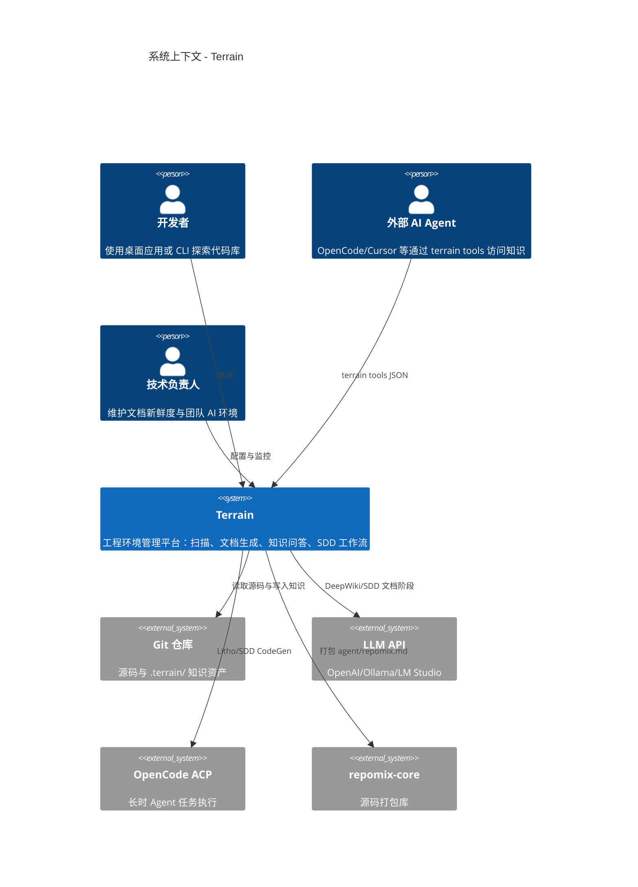
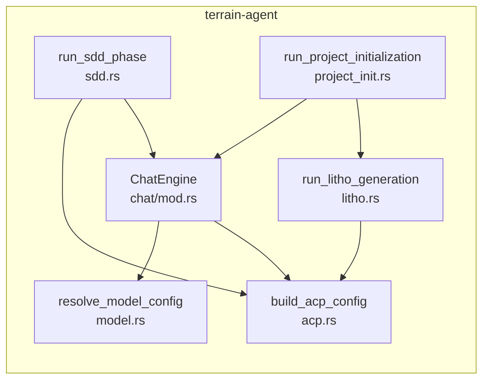
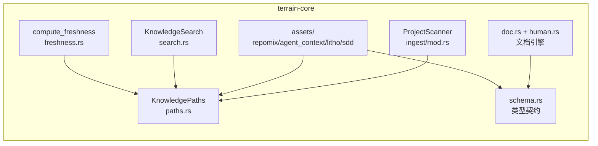
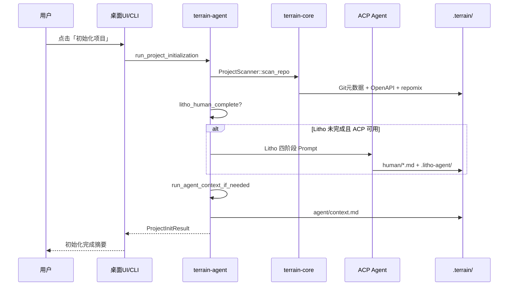
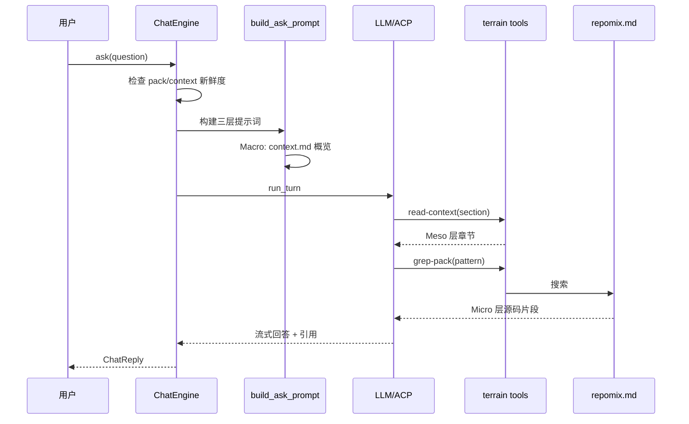

# 系统架构文档：Terrain

**版本：** 1.0  
**分类：** 内部架构文档  
**生成日期：** 2026-07-15

---

## 1. 架构概述

### 1.1 设计理念

Terrain 的架构可以用一座「知识工厂」来理解：Git 源码是原材料，从扫描车间进入，经 Litho 文档车间和 Agent 压缩车间逐站加工，最终产出人类可读 C4 文档与 AI 友好上下文两条产品线。工厂的控制室（`terrain-agent`）调度 LLM 与 ACP 工人，基础设施层（`terrain-core`）提供统一的路径、schema 和搜索能力。

以下四个设计原则贯穿整个代码库，决定了模块边界与数据流向。

**1. 知识随代码走**

`.terrain/` 目录与 Git 分支绑定，放弃了中心数据库方案。知识资产可以随 PR 流转、随分支演进，代价是每个仓库需维护独立的知识目录。路径解析集中在 `KnowledgePaths`（`crates/terrain-core/src/paths.rs:10`），全局注册表 `~/.terrain/registry.json` 仅存 slug→repo 指针。

**2. 双轨知识分离**

`human/` 面向人类叙述性 C4 文档（含 Mermaid 图表），`agent/` 面向 ≤14 KiB 压缩上下文 + repomix 按需检索。放弃了「一份文档两用」的方案——人类需要图表和叙述，Agent 需要结构化摘要和精确源码索引。

**3. 三层知识访问（Macro→Meso→Micro）**

Macro 预载 `context.md` 概览，Meso 按章节 `read-context`，Micro 通过 `grep-pack`/`read-pack-file` 深入源码。这避免了 Agent 一次性加载整个 repomix 包（可能数十万 token），像快递站的分区域管理——每个区域只收自己的包裹。

**4. ACP 与 Native LLM 双执行模式**

长时任务（Litho、SDD CodeGen）委托 ACP Agent，短文档生成（SDD 需求/设计/审查）可走 Native LLM。放弃了「全部走 LLM API」的方案，因为 Litho 需要数十次文件写入和工具调用，外部 ACP Agent 更适合。

### 1.2 核心架构模式

Terrain 采用**分层容器 + 管道-过滤器**混合架构。下表总结了主要模式在代码中的落地方式。

| 模式 | 实现方式 | 目的 |
|------|---------|------|
| 分层容器 | UI/CLI → terrain-agent → terrain-core | 界面与编排分离，核心能力可复用 |
| 管道-过滤器 | Litho 四阶段、项目初始化链式执行 | 阶段间数据通过文件系统传递，支持断点续传 |
| 策略模式 | `AgentExecution::Acp` / `AcpNative` | 按任务特性选择 LLM 或 ACP 后端 |
| 注册表模式 | `registry.json` + `KnowledgePaths` | 多项目管理而不引入中心数据库 |
| 新鲜度降权 | `FreshnessSummary` + trust block | 过期知识降权而非阻断服务 |

### 1.3 技术栈概述

Terrain 选择 Rust 2024 edition 作为核心语言，配合 Tokio 异步运行时处理密集 IO（文件扫描、子进程通信、HTTP 调用）。Tauri v2 提供轻量跨平台桌面壳，Svelte 5 驱动前端面板。LLM 抽象通过 adk-rust 统一 OpenAI/Ollama/LM Studio 接口，ACP 通信遵循 agent-client-protocol 0.11.1 标准。

| 层次/领域 | 技术选型 | 选择理由 |
|---------|---------|---------|
| 核心语言 | Rust 2024 edition | 内存安全 + 高性能，统一 CLI/Agent/Core |
| 桌面壳 | Tauri v2 | 轻量跨平台，Rust 后端直连 terrain-agent |
| 前端 | Svelte 5 + Vite | Runes 响应式，快速迭代 UI 面板 |
| 异步运行时 | Tokio | 统一 Chat/Litho/SDD 的 async 模型 |
| LLM 抽象 | adk-rust | 统一 OpenAI/Ollama/LM Studio 接口 |
| ACP 通信 | agent-client-protocol 0.11.1 | OpenCode 标准，Windows 补丁隐藏控制台 |
| 源码打包 | repomix-core 2.0 | Rust 原生，避免 Node 运行时依赖 |
| IPC 类型 | ts-rs | Rust→TS 单向导出，避免手写类型 |
| 存储 | 文件系统（Markdown/JSON） | 知识随 Git 分支流转，人类可直接审阅 |

---

## 2. 系统上下文（C4 Level 1）

下图展示 Terrain 在 AI 辅助开发生态中的定位：人类通过桌面应用或 CLI 使用，外部 Agent 通过 `terrain tools`（JSON stdout）访问同一套知识。



从图中可以读出三个关键边界决策：知识资产存储在仓库内（随分支流转）、外部 Agent 不直接读活仓库（走 `terrain tools` 三层访问）、长时 AI 任务委托 ACP 进程而非直接调 LLM API。

---

## 3. 容器视图（C4 Level 2）

下图将 Terrain 拆分为主要运行时容器，展示它们之间的依赖关系。

```mermaid
C4Container
    title 容器架构 - Terrain

    Person(user, "用户")

    System_Boundary(terrainApp, "Terrain 应用") {
        Container(desktop, "桌面应用", "Tauri + Svelte 5", "主交互界面，40+ IPC 命令")
        Container(cli, "CLI", "Rust clap", "terrain 命令行与 ACP JSON 工具")
        Container(agent, "terrain-agent", "Rust + Tokio", "AI 编排：Chat/Litho/SDD/ACP")
        Container(core, "terrain-core", "Rust", "知识基础设施：路径/扫描/搜索/资产")
    }

    System_Boundary(knowledge, "知识资产 .terrain/") {
        ContainerDb(human, "human/", "Markdown", "C4 人类文档")
        ContainerDb(agentCtx, "agent/", "Markdown/JSON", "context.md + repomix.md")
        ContainerDb(meta, ".meta/", "JSON", "同步与新鲜度元数据")
    }

    System_Ext(gitRepo, "Git 仓库", "源码")
    System_Ext(llmApi, "LLM API", "推理服务")
    System_Ext(acpProc, "ACP Agent", "OpenCode 子进程")

    Rel(user, desktop, "使用")
    Rel(user, cli, "使用")
    Rel(desktop, agent, "IPC 调用")
    Rel(desktop, core, "IPC 调用")
    Rel(cli, core, "直接调用")
    Rel(cli, agent, "直接调用")
    Rel(agent, core, "依赖")
    Rel(agent, llmApi, "HTTP")
    Rel(agent, acpProc, "stdio JSON")
    Rel(core, gitRepo, "读取")
    Rel(core, knowledge, "读写")
    Rel(agent, knowledge, "读写")
```

### 3.1 领域模块职责

以下表格列出了 Terrain 识别到的核心领域模块及其职责。每个模块在 `4.Deep-Exploration/` 下有独立的深度探索文档。

| 模块/领域 | 路径 | 职责 | 关键抽象 |
|---------|------|------|---------|
| terrain-core | `crates/terrain-core/src/` | 知识基础设施：路径、扫描、搜索、资产、schema | `KnowledgePaths`、`ProjectScanner` |
| terrain-agent | `crates/terrain-agent/src/` | AI 编排：Chat、Litho、SDD、ACP、工具 | `ChatEngine`、`run_litho_generation` |
| Litho文档生成 | `crates/terrain-agent/src/litho.rs` | C4 文档四阶段流水线 | `LithoPlan`、`litho_human_complete_with_research` |
| Chat引擎 | `crates/terrain-agent/src/chat/` | DeepWiki 问答（Native/ACP 双后端） | `ChatEngine::ask`、`build_ask_prompt` |
| SDD工作流 | `crates/terrain-agent/src/sdd.rs` | 四阶段标准化开发 | `run_sdd_phase`、`SddPhase` |
| 项目初始化 | `crates/terrain-agent/src/project_init.rs` | 扫描→Litho→上下文一站式初始化 | `run_project_initialization` |
| 知识资产管理 | `crates/terrain-core/src/assets/` | Agent 上下文、repomix、元数据输入 | `pack_agent_assets`、`build_agent_context_prompt` |
| 源码扫描 | `crates/terrain-core/src/ingest/` | Git/OpenAPI/repomix 采集 | `ProjectScanner::scan_repo` |
| ACP协议 | `crates/terrain-agent/src/acp.rs` | OpenCode 进程通信配置 | `build_acp_config`、`execution_pure_acp` |
| 环境集成 | `crates/terrain-core/src/assets/env/` | Skills/工具/AGENTS.md 安装 | `apply_env_integration` |
| Agent上下文 | `crates/terrain-core/src/assets/agent_context.rs` | ≤14KiB 架构摘要生成 | `write_agent_context`、`split_context_sections` |
| 全文搜索 | `crates/terrain-core/src/search.rs` | 知识库全文检索 | `KnowledgeSearch::search` |
| 新鲜度追踪 | `crates/terrain-core/src/freshness.rs` | Git 漂移检测与信任评分 | `compute_freshness`、`FreshnessSummary` |
| CLI接口 | `crates/terrain-cli/` | 六组命令 + ACP JSON 工具 | `Cli`、`Commands` |
| 桌面UI | `src/` + `src-tauri/` | Tauri 壳 + Svelte 5 面板 | `AppState`、IPC commands |
| 数据模型 | `crates/terrain-core/src/schema.rs` | 跨模块类型定义 | `DocType`、`FreshnessLedger` |
| 路径布局 | `crates/terrain-core/src/paths.rs` | `.terrain/` 目录解析 | `KnowledgePaths`、`register_project` |
| 源码引用 | `crates/terrain-core/src/citations.rs` | 回答中的源码切片 | `extract_source_citations`、`resolve_source_citation` |
| 文档引擎 | `crates/terrain-core/src/doc.rs` | Markdown/JSON 读写渲染 | `read_doc`、`list_human_docs` |
| 模型配置 | `crates/terrain-agent/src/model.rs` | LLM Provider 与执行模式 | `resolve_model_config`、`AgentExecution` |

---

## 4. 组件视图（C4 Level 3）

### 4.1 terrain-agent 组件架构

`terrain-agent` 是 AI 编排层，负责把用户意图转化为 LLM 或 ACP 调用。下图展示其核心组件关系。



**组件职责：**

- `ChatEngine`：DeepWiki 问答统一入口，按 `AgentExecution` 路由到 Native 或 ACP 后端
- `run_litho_generation`：Litho 四阶段文档生成，含轮询早停与编排重试
- `run_sdd_phase`：SDD 四阶段状态机，文档阶段走 LLM、CodeGen 走 ACP
- `run_project_initialization`：一键 onboarding，串联扫描→Litho→上下文
- `build_acp_config`：拼装 ACP 子进程配置，注入工作流环境变量
- `resolve_model_config`：从 settings.json 或环境变量解析 LLM 配置

### 4.2 terrain-core 组件架构

`terrain-core` 是知识基础设施层，为 agent 和 UI 提供确定性能力。



**组件职责：**

- `KnowledgePaths`：所有 `.terrain/` 子路径的统一解析入口
- `ProjectScanner`：Git/OpenAPI/repomix 采集编排
- `assets/`：repomix 打包、Agent 上下文、Litho/SDD 计划与 prompt 契约
- `KnowledgeSearch`：WalkDir 全文搜索与文档读取
- `compute_freshness`：三层资产新鲜度评分与账本持久化
- `schema.rs`：跨 crate、跨 IPC 的类型契约层

---

## 5. 关键流程

### 5.1 项目初始化

项目初始化是用户接入 Terrain 的「首次体检」流程，按固定顺序串联扫描、Litho 与 Agent 上下文生成。



### 5.2 DeepWiki 问答

DeepWiki 问答展示三层知识访问模型的实际运作：Macro 预载 → Meso 分段 → Micro grep/read。



---

## 6. 技术实现

### 6.1 关键架构模式

**文件系统即数据库**：所有知识资产以 Markdown/JSON 存储在 `{repo}/.terrain/`，`read_doc`/`write_doc`（`crates/terrain-core/src/doc.rs`）提供原语，`schema.rs` 定义字段契约。这放弃了 SQLite/PostgreSQL，因为知识需要 Git 版本控制和人类直接审阅。

**Agent 上下文体积硬限**：`AGENT_CONTEXT_SAVE_MAX_CHARS = 16KiB`（`context_layers.rs:6`），生成 prompt 要求 ≤14000 字符产出。宏观层 `build_context_overview` 截取 ≤4500 字符供 Ask 预加载，细节通过工具按需拉取。

**ACP 轮询早停**：Litho 生成通过 `prompt_agent_with_doc_poll`（`litho.rs:109`）每 3–6 秒检查磁盘产出，完整文档集落盘且连续 10 次无变化时主动 abort 会话，以磁盘事实为准而非信任 Agent 结束信号。

### 6.2 并发和并行策略

全系统基于 Tokio 异步运行时。Chat 流式输出使用 SSE，Litho 生成通过 ACP 子进程异步通信 + 文件轮询。`tokio::select!` 在 Agent 会话与定时轮询间切换，UI 能实时看到进度。工具调用缓存（`tool_session_cache.rs`）避免同会话重复读取相同 context 章节。`throttle::wrap_llm` 控制 LLM 请求频率。

项目初始化严格串行（扫描 → Litho → 上下文），因为上下文 prompt 依赖人类文档摘要与 pack 元数据——并行会导致竞态。

### 6.3 性能优化策略

- **Pack 文本缓存**：`PACK_TEXT_CACHE` 以 path+mtime+len 为键，重复 grep/read 不反复读盘
- **增量 Repomix**：`maybe_pack_agent_assets` 在 Git 干净且 HEAD 未变时跳过打包
- **新鲜度账本缓存**：`resolve_freshness_summary` 在 HEAD/dirty 未变时直接返回缓存
- **Registry 缓存**：`REGISTRY_CACHE` 按文件 mtime 失效，避免重复读 `registry.json`
- **Litho 跳过重复研究**：`litho_research_ready` 为真时直接走编排阶段，显著缩短二次运行时间
- **搜索目录剪枝**：跳过 `agent/`、`.litho-agent/` 等目录，仅保留 `context.md`

---

## 附录：架构决策记录（ADR）

**ADR 1：文件系统即数据库**

- **决策**：选择 Markdown/JSON 文件存储知识资产
- **放弃了什么**：SQLite/PostgreSQL 中心数据库
- **原因**：知识资产需要 Git 版本控制、随 PR 审查、被人类直接编辑
- **后果**：跨项目联合查询能力有限，通过 `registry.json` 和 `terrain list` 提供基本多项目管理

**ADR 2：Agent 上下文 14KiB 硬限制**

- **决策**：严格压缩 `context.md` 体积，宏观层预载、细节按需检索
- **放弃了什么**：完整架构文档预载到 LLM 上下文
- **原因**：LLM 上下文窗口宝贵，repomix 可按需 grep/read
- **后果**：Ask 首轮可能需要额外工具调用读取 Meso/Micro 层

**ADR 3：ACP 轮询而非回调**

- **决策**：Litho 生成通过文件轮询检测完成，磁盘稳定后早停
- **放弃了什么**：WebSocket 推送或 ACP 回调通知
- **原因**：ACP 协议以 prompt-response 为主，磁盘产出是最可靠的完成信号
- **后果**：轮询有 3–6 秒延迟，但避免了 Agent 挂起

**ADR 4：新鲜度降权而非阻断**

- **决策**：`freshness_score < 50` 时 Agent 降权信任，不拒绝服务
- **放弃了什么**：过期知识完全阻断 Ask
- **原因**：平衡可用性与准确性，用户仍可提问但会收到信任警告
- **后果**：Agent 需在 prompt 中注入 `format_freshness_trust_block` 强制规则

**ADR 5：Hybrid 执行模式**

- **决策**：`AgentExecution::AcpNative` 让文档阶段走 Native LLM、CodeGen 走 ACP
- **放弃了什么**：全部任务统一走单一后端
- **原因**：轻量文档起草用 in-process LLM 延迟低，重任务需要 ACP 的文件编辑能力
- **后果**：配置复杂度增加，需在 settings 中正确设置 `agent_execution`
