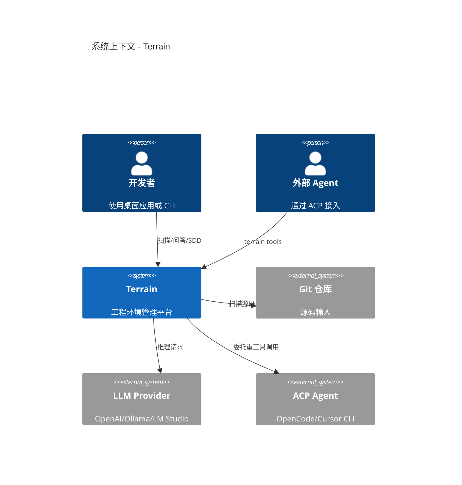
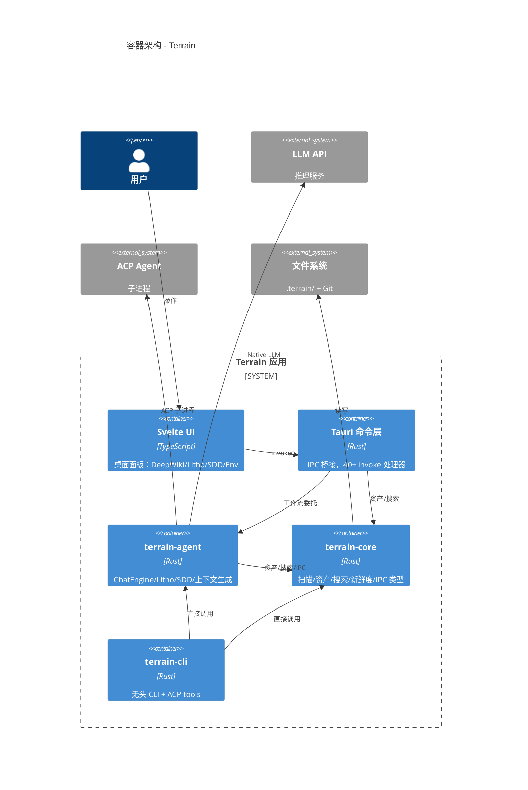
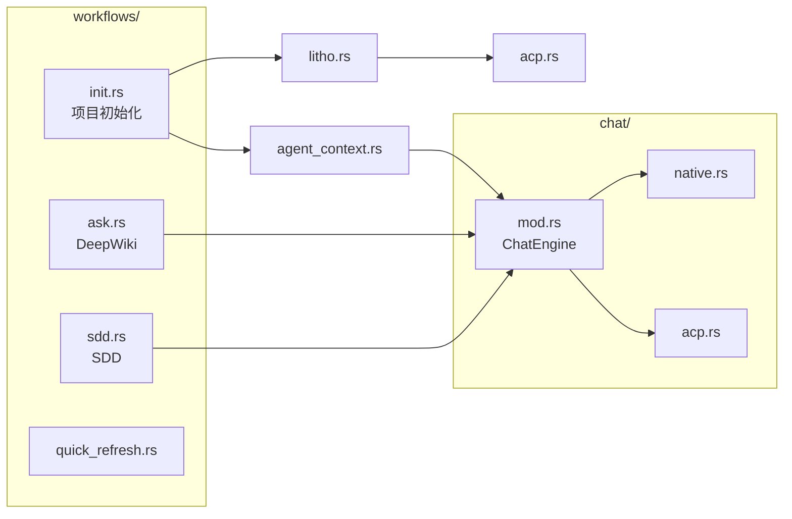
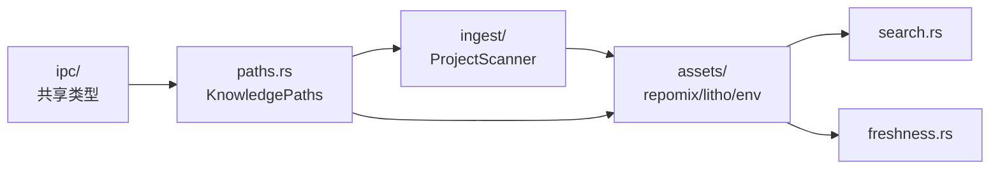
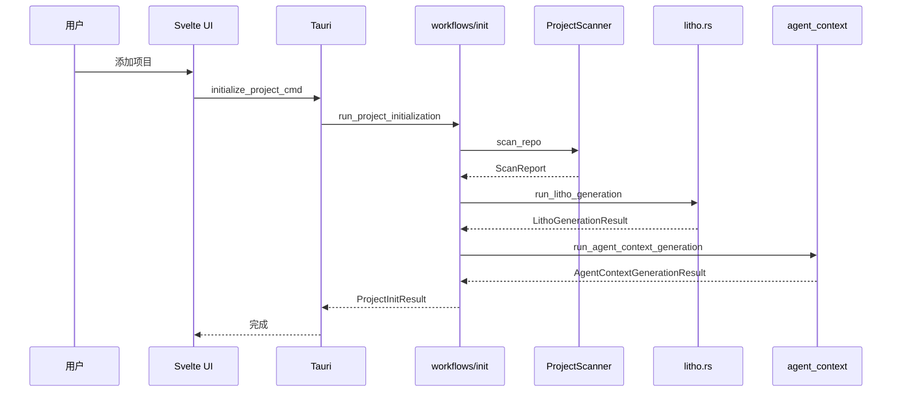
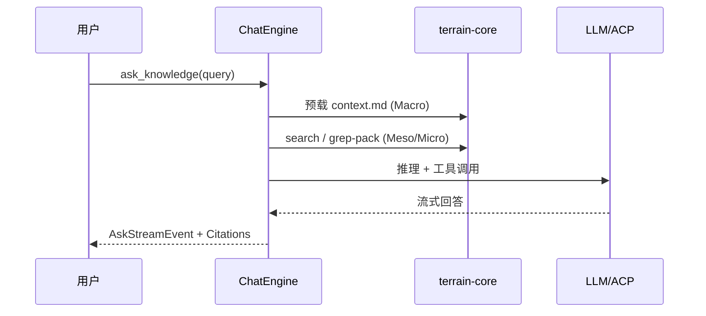

# 系统架构文档：Terrain

**版本：** 1.0  
**分类：** 内部架构文档  
**生成日期：** 2026-07-22

---

## 1. 架构概述

### 1.1 设计理念

Terrain 的架构围绕三个核心理念构建，每个理念都直接对应代码中的设计决策。

**知识随仓库流转**——所有知识资产存放在 `{repo}/.terrain/` 目录，随 Git 分支版本化。`KnowledgePaths`（`crates/terrain-core/src/paths.rs`）是所有路径操作的根抽象，确保 CLI 与桌面应用访问同一套目录布局。

**Core 无 UI 依赖**——`terrain-core` crate 不依赖 Tauri 或任何前端框架，纯粹的领域逻辑。`terrain-agent` 在此基础上编排 LLM 工作流。这种分层让 CLI（`crates/terrain-cli/`）与桌面应用（`src-tauri/`）共享同一套业务逻辑，避免重复实现。

**双轨知识 + 三层检索**——`human/` 面向人类叙述，`agent/` 面向机器压缩。Ask 引擎通过 Macro（context.md 预载）→ Meso（human/knowledge 搜索）→ Micro（repomix grep/read）三层模型检索知识，定义在 `crates/terrain-core/src/assets/context_layers.rs`。

### 1.2 核心架构模式

| 模式 | 实现方式 | 目的 |
|------|---------|------|
| 分层架构 | core → agent → cli/tauri → ui | 关注点分离，CLI/桌面共享 core |
| 管道-过滤器 | Litho 四阶段、三层检索 | 阶段性处理，中间产物可恢复 |
| 策略模式 | ChatEngine Native/ACP 双后端 | 按任务复杂度选择执行引擎 |
| 文件系统即存储 | `.terrain/` 目录布局 | 知识随 Git 分支流转 |

### 1.3 技术栈概述

Rust workspace（edition 2024）包含 5 个 crate：`terrain-core`（领域逻辑）、`terrain-agent`（LLM 工作流）、`terrain-cli`（命令行）、`terrain-ts-export`（类型导出）、`src-tauri`（桌面壳）。前端为 Svelte 5 + Vite + TypeScript，通过 Tauri `invoke()` 调用 Rust 后端。Agent 执行依赖 ADK 生态（adk-model、adk-acp、adk-runner）和 ACP 协议。

---

## 2. 系统上下文（C4 Level 1）

---

## 3. 容器视图（C4 Level 2）

### 3.1 领域模块职责

| 模块/领域 | 路径 | 职责 | 关键抽象 |
|---------|------|------|---------|
| terrain-core | `crates/terrain-core/` | 扫描、资产、搜索、新鲜度 | `KnowledgePaths`, `ProjectScanner` |
| terrain-agent | `crates/terrain-agent/` | LLM 工作流编排 | `ChatEngine`, `Runtime` |
| terrain-cli | `crates/terrain-cli/` | CLI 入口 | `Cli`, `Commands` |
| Tauri 命令层 | `src-tauri/src/commands/` | IPC 桥接 | `*_cmd` 处理器 |
| Svelte 前端 | `src/lib/` | 桌面 UI | `api.ts`, 面板组件 |
| preset_skills | `preset_skills/` | Agent 技能 | Litho/SDD/Ask skill |
| env-catalog | `env-catalog/` | 环境集成目录 | `catalog.json` |

---

## 4. 组件视图（C4 Level 3）

### 4.1 terrain-agent 组件架构

**组件职责：**
- `workflows/init.rs`：编排扫描→Litho→context 的完整初始化流水线
- `chat/mod.rs`：`ChatEngine` 根据 `AgentExecution` 模式路由至 Native 或 ACP 后端
- `litho.rs`：Litho 四阶段 ACP 生成，轮询研究产物与 human 文档
- `agent_context.rs`：生成 ≤16 KiB 的 `agent/context.md` 压缩架构摘要

### 4.2 terrain-core 组件架构

---

## 5. 关键流程

### 5.1 项目初始化时序

### 5.2 DeepWiki 问答时序

---

## 6. 技术实现

### 6.1 关键架构模式

**双后端 ChatEngine**：`ChatEngine::with_settings`（`chat/mod.rs:72`）根据 `AgentExecution` 枚举决定构建 Native 后端还是 ACP 后端。Native 用于轻量文档生成（SDD Requirements/TechDesign、context 生成），ACP 用于需要工具调用的重任务（Litho 编排、SDD CodeGen）。

**IPC 类型共享**：`crates/terrain-core/src/ipc/` 定义所有跨边界类型（`LithoGenerationJob`、`AskStreamEvent`、`SddPhaseResult` 等），通过 `#[cfg_attr(feature = "ts-export", derive(ts_rs::TS))]` 自动导出到 `src/lib/generated/`。

### 6.2 并发和并行策略

全栈 Tokio 异步。Litho 生成 spawn ACP 子进程并轮询文件系统（`litho.rs:97`）；初始化流程中扫描与 Litho 串行但 Litho 内部 ACP 异步执行；桌面 Tauri 命令全部 `async fn` 非阻塞。

### 6.3 性能优化策略

- **repomix 包缓存**：`agent_pack_ready` 检测避免重复打包
- **新鲜度预载阈值**：`MACRO_PRELOAD_THRESHOLD = 50`（`freshness.rs:19`），低于此分跳过 context 预载
- **context.md 字符限制**：`AGENT_CONTEXT_SAVE_MAX_CHARS = 16 * 1024`（`context_layers.rs:6`）
- **Litho 轮询退避**：稳定后从 3s 增至 6s 轮询间隔（`litho.rs:14-15`）

---

## 附录：架构决策记录（ADR）

**ADR 1：文件系统替代数据库**
- **决策**：所有知识资产以 Markdown/JSON 文件存储
- **原因**：知识需随 Git 分支版本化，Markdown 天然适合 diff 和 review
- **后果**：无 SQL 查询能力，全文搜索依赖自建 `search.rs`

**ADR 2：ACP 子进程委托重工具调用**
- **决策**：Litho 编排和 SDD CodeGen 委托外部 ACP Agent
- **原因**：内置 LLM 工具调用能力有限，ACP 提供隔离的执行环境
- **后果**：依赖用户配置 ACP 二进制（OpenCode/Cursor CLI）

**ADR 3：agent-client-protocol-tokio 本地 patch**
- **决策**：patch crates-io 版本隐藏 Windows CREATE_NO_WINDOW
- **原因**：上游未处理，每次 ACP 调用闪黑窗口影响体验
- **后果**：需维护 `crates/agent-client-protocol-tokio-patched/`
