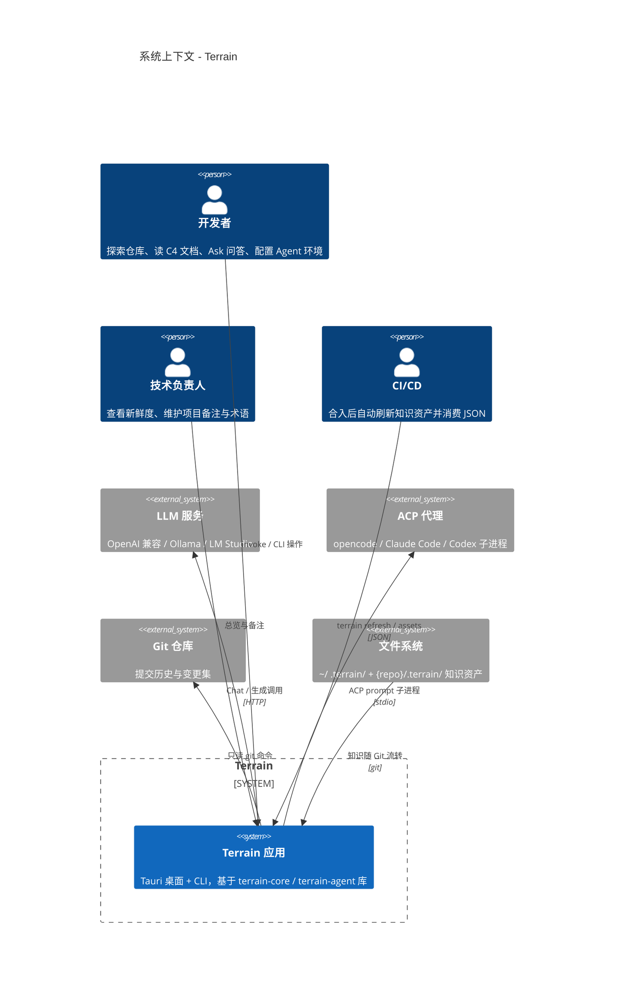
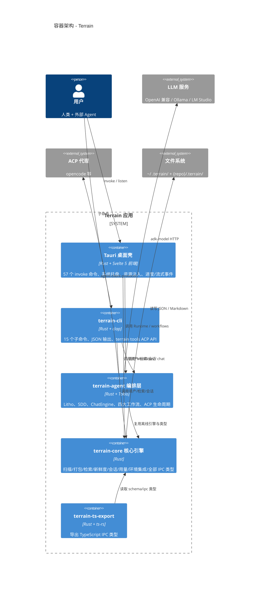
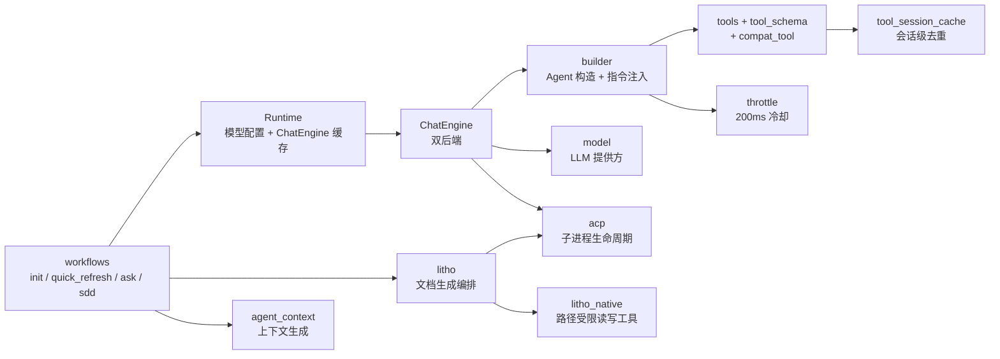
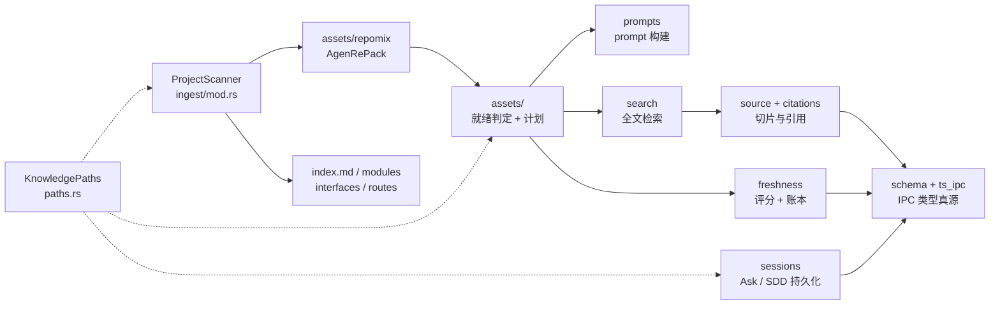
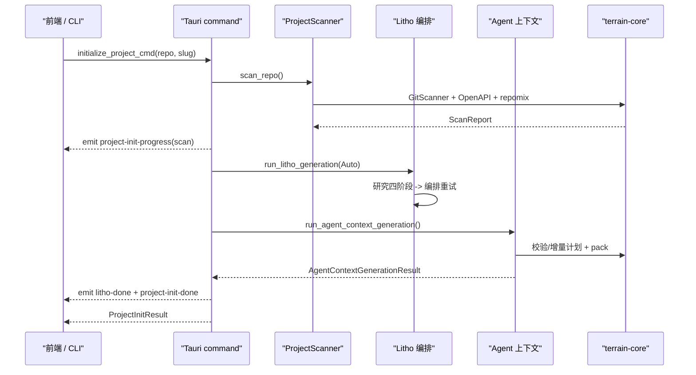
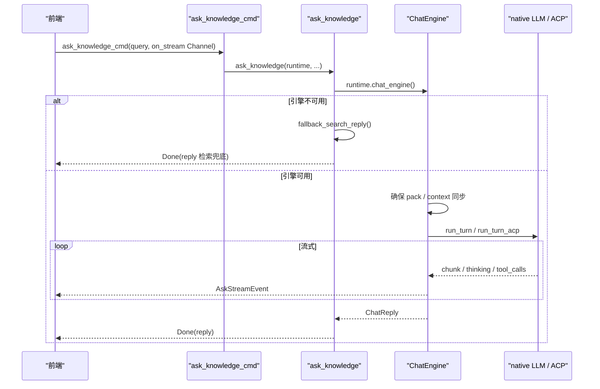

# 系统架构文档：Terrain

**版本：** 1.0
**分类：** 内部架构文档
**生成日期：** 2026-09-21

---

## 1. 架构概述

Terrain 是一个"桌面应用（Tauri GUI）+ CLI"的混合形态的 AI 友好工程环境管理器。它对外交付两种操控入口，背后却是同一套 Rust 代码库。理解它架构的关键，是先建立三条心理模型：**严格的单向分层**（外壳 → 编排 → 核心引擎）、**文件系统为缓冲的管道流水线**（扫描 → 生成 → 保鲜），以及**离线与在线能力的清晰分界**（能离线完成的事绝不引入 LLM）。

### 1.1 设计理念

**1. 离线与在线严格分层**
凡是能离线完成的（扫描、打包、检索、新鲜度、环境集成）绝不引入 LLM；只有生成式任务（Litho 文档、Agent 上下文、问答、SDD）才进入 `terrain-agent`。代码证据很直接：`terrain-core/src/lib.rs` 的模块清单里没有任何 `chat`/`model`/`workflows`，而 LLM 相关模块全部集中在 `terrain-agent/src/`。结果是核心引擎可测试、可被 CLI 复用、无网络也能跑骨架流程。

**2. IPC 类型单一真源（Rust → ts-rs → TypeScript）**
Tauri IPC 载荷以 Rust 为唯一真源，前端类型由 `terrain-ts-export`（ts-rs）生成到 `src/lib/generated/`，禁止手写漂移。每个 `schema/*.rs` 结构体都带着 `#[cfg_attr(feature = "ts-export", derive(ts_rs::TS))]` 注解。这消灭了一整类跨语言 bug：字段重命名、`Option<T>` 是 `null` 而非 `undefined` 的语义差异，都在生成期被统一。

**3. 增量优先、失败保守回退**
默认走增量，结果不可信时自动回退全量，且回退对用户可见（`refresh_reason` / `notes`），绝不静默覆盖好资产。三处代表性实现：`plan_incremental_update` 在变更过大时返回 `Full { reason: "too_many_changed_files" }`；`agent_context.rs` 用 `reject_incremental_document` 校验增量回复是"基线超集"否则回退全量；Litho 的 `run_litho_incremental_or_skip` 三态判定（UpToDate / Incremental / Full）。

**4. 可恢复检查点与文件系统持久化**
不引入数据库，全部落盘到 `.terrain/` 与 `~/.terrain/`；长流程通过检查点文件断点续跑（Litho 研究稿、baseline 元数据、FreshnessLedger 账本都是此类文件）。

### 1.2 核心架构模式

| 模式 | 实现方式 | 目的 |
|------|---------|------|
| 分层架构 | 单向依赖：前端/Svelte → Tauri 壳 → terrain-agent → terrain-core | 依赖方向单一，核心引擎与智能层解耦，可分别测试与复用 |
| 管道-过滤器 | 每条产出线以 `.terrain/` 文件为缓冲，各阶段读取上游产物、写入新文件、用"是否需要跑"的前置条件过滤冗余工作 | 支持断点续跑、增量跳过、失败不中断 |
| 事件驱动 | 长任务通过 `AppHandle::emit` 广播 `progress`/`done` 事件，Ask 通过 `Channel<AskStreamEvent>` 逐 token 流式推送 | 长耗时工作流不阻塞 UI，进度对用户完全可见 |
| 可插拔后端 + 优雅降级 | `AgentExecution::{Acp, AcpNative}` 双后端，Litho 用 `LithoTransport`（AcpStrict/AcpWithFallback/Native）三态选择，Ask 失败降级为 `fallback_search_reply` | 环境千差万别，系统在任何配置下都能工作而非报错 |

### 1.3 技术栈概述

Rust 是骨架：2024 edition、MSRV 1.94，Tokio 提供异步运行时。桌面壳是 Tauri 2（dialog + shell 插件）。前端是 Svelte 5 + Vite 8 + TailwindCSS 4 + TypeScript，配合 mermaid/marked/highlight.js 渲染文档。智能层用 `adk-*` 2.2.0（native LLM 运行时）与 agent-client-protocol 1.3.0（ACP 子进程协议）双通道。源码打包用内嵌的 `repomix-core`，IPC 类型导出用 `ts-rs`，CLI 解析用 clap。错误处理上应用层用 anyhow、核心层用 thiserror。**持久化刻意留白（纯文件系统），没有数据库依赖。**

---

## 2. 系统上下文（C4 Level 1）

Terrain 的用户是人（键盘前）、外部编码 Agent（通过 `terrain tools` JSON API 与 ACP 子进程）、以及 CI/CD 流水线；依赖方有 LLM 服务、ACP 代理、Git、文件系统与操作系统。值得反复强调的是，LLM 与 ACP 都是"可选增强"，缺失时的降级路径是设计的一部分而非事故。



---

## 3. 容器视图（C4 Level 2）

Terrain 内部由五个可独立替换的容器构成：桌面壳 `src-tauri`、CLI `terrain-cli`、编排层 `terrain-agent`、核心引擎 `terrain-core` 与类型导出器 `terrain-ts-export`。GUI 与 CLI 是"两个点菜窗口"，背后共用同一套厨房（core + agent）；这一对称性保证了"GUI 里看到的结果，流水线里跑出的结果一致"。



### 3.1 领域模块职责

下表把 19 个领域模块与它们各自的路径、职责、关键抽象对齐。粗看规模，复杂度呈"两头大中间小"分布：真正复杂的不是检索（约 580 行的朴素评分器），而是把 LLM 编排成可靠、可增量、可降级的流水线的那些模块（litho 1117 行、usage 871 行、freshness/drift_factors 812 行、source 719 行、assets/agent_context 688 行）。

| 模块/领域 | 路径 | 职责 | 关键抽象 |
|---------|------|------|---------|
| ingest（扫描） | `crates/terrain-core/src/ingest/{mod,git,openapi}.rs` | Git 扫描 + OpenAPI 导入 → index.md 等 + repomix 打包 | `ProjectScanner`、`ScanReport` |
| assets（知识资产工厂） | `crates/terrain-core/src/assets/*.rs` | 资产就绪判定、生成规划、prompt 构建、产出写入、pack 字节缓存 | `LithoPlan`、`IncrementalPlan`、`AssetGenerationPlan` |
| freshness | `crates/terrain-core/src/freshness/*.rs` | git drift → 多层新鲜度评分 + CodeGraph 交叉验证 | `FreshnessSummary`、`FreshnessLedger` |
| search | `crates/terrain-core/src/search.rs` | 知识库全文本地检索 | `KnowledgeSearch`、`SearchHit` |
| usage | `crates/terrain-core/src/usage.rs` | 基于 ccusage 的 Token 用量探测与快照 | `UsageSnapshot`、`UsageProbeResult` |
| source + citations | `crates/terrain-core/src/{source,citations}.rs` | 源码安全切片 + 引用双向解析（防目录穿越） | `SourceSlice`、`SourceCitation`、`resolve_source_citation` |
| sessions | `crates/terrain-core/src/sessions/mod.rs`（实现在 `assets/{ask,sdd}.rs`） | Ask/SDD 会话与 active 指针持久化 | `AskSessionInfo`、`SddSessionInfo`、`SddStatus` |
| schema + ipc + ts_ipc | `crates/terrain-core/src/{schema,ipc,ts_ipc.rs}` | 全部 IPC/状态类型真源，ts-rs 导出 | `DocFrontmatter`、`AskStreamEvent`、`ProjectOverview` |
| settings | `crates/terrain-core/src/settings.rs` | 模型/ACP/知识/语言设置载入归一化 | `ModelSettings`、`AcpSettings`、`KnowledgeSettings` |
| project + registry + paths | `crates/terrain-core/src/{project,registry,paths,repo,path_portable}.rs` | 项目登记表、overview 汇编、知识路径解析 | `KnowledgePaths`、`ProjectOverview` |
| prompts | `crates/terrain-core/src/prompts/mod.rs`（实现在 `assets/*.rs`） | Litho / SDD / context 生成的 prompt 构建 | `build_litho_generation_prompt`、`build_sdd_phase_prompt` |
| integrations + env | `crates/terrain-core/src/{integrations,assets/env/,agent_tools_deploy,bundled_tools,preset_skills}.rs` | 环境目录、工具链部署、AGENTS.md patch | `EnvPlan`、`DeployOptions`、`BundledTools` |
| git_policy + repo_walk | `crates/terrain-core/src/{git_policy,repo_walk}.rs` | `.terrain/` Git 策略文件生成 + gitignore 感知遍历 | `GIT_POLICY_VERSION`、`discover_repo_walk` |
| litho | `crates/terrain-agent/src/litho.rs` | Litho 执行编排：传输选择、轮询、超时、增量/全量 | `run_litho_generation`、`LithoTransport`、`LithoRunMode` |
| workflows | `crates/terrain-agent/src/workflows/{init,quick_refresh,ask,sdd}.rs` | 顶层业务流程编排 | `run_project_initialization`、`run_quick_refresh`、`ask_knowledge`、`run_sdd_phase` |
| chat（ChatEngine） | `crates/terrain-agent/src/chat/{native,acp,prompt,tracker,types}.rs` | 问答引擎：Agent 循环 / ACP 子进程双后端 + 流式 | `ChatEngine`、`NativeBackend`、`build_ask_prompt` |
| model | `crates/terrain-agent/src/model.rs` | LLM 提供方解析、探活、`build_llm` | `LlmProvider`、`ModelConfig`、`probe_llm` |
| acp | `crates/terrain-agent/src/acp.rs` | ACP 命令解析/探测/配置生成、执行模式判定 | `build_acp_config`、`execution_pure_acp`、`agent_execution_ready` |
| context_generator + agent_context | `crates/terrain-agent/src/{context_generator,agent_context}.rs` | `agent/context.md` 生成/增量更新/就绪保证 | `AgentContextGenerator` trait、`run_agent_context_generation` |
| cli | `crates/terrain-cli/src/{cli,main,commands/*,util}.rs` | 命令行入口与 15 个子命令分派 | `Cli`/`Commands` 枚举、`SddPhaseArg` |
| tauri 壳 | `src-tauri/src/{lib,commands/*,tray,env_catalog,preset_skills,bundled_tools}.rs` | 57 个 IPC 命令、托盘、资源注入 | `AppState`、`invoke_handler` 清单、`Runtime` |
| frontend | `src/{App,UsageWindow,main.ts}` + `src/lib/*` | Svelte 5 桌面 UI：五个 Tab + 引用面板 | `stores/chat.svelte`、`lib/api.ts`、`resolveSource.ts` |

---

## 4. 组件视图（C4 Level 3）

### 4.1 编排层组件架构（terrain-agent）

`terrain-agent` 以 `Runtime` 为进程级单例，持有路径、模型配置与缓存的 `ChatEngine`；四大工作流（init / quick_refresh / ask / sdd）是顶层入口，它们按需调度下面这些子系统：Litho（文档生成）、ChatEngine（问答与文档起草）、agent_context（上下文生成）、ACP（子进程生命周期）、model（LLM 提供方）与 builder（Agent 构造）。值得注意的细节是 `ThrottledLlm` / `ThrottledTool` 给每次调用加 200ms 冷却，`tool_session_cache` 在会话内对相同工具参数去重——这两者共同构成"token 纪律"。



**组件职责：**
- **Runtime**（`crates/terrain-agent/src/runtime.rs`）：进程级单例，`Mutex<Option<Arc<ChatEngine>>>` 缓存引擎，配置变化即失效重建；Tauri `AppState` 与 CLI ask 都建立其上。
- **workflows**（`workflows/mod.rs`）：只暴露四个成品函数 + 一组进度类型，编排结构不外泄。
- **ChatEngine**（`chat/mod.rs:54-237`）：`ask` 先确保资产同步，`run_turn` 按执行模式分派到 native / acp。
- **builder**（`builder.rs`）：把 DeepWiki 版系统指令与知识工具装配进 `adk_agent::LlmAgentBuilder`，可把 ACP 嵌入为 `acp_agent` 工具。
- **litho / litho_native**：文档生成的两条执行路径（ACP 优先、原生 LLM 降级）。

### 4.2 核心引擎组件架构（terrain-core）

`terrain-core` 是"离线知识引擎"，`KnowledgePaths` 是所有路径解析的贯穿体。`ProjectScanner` 是源头，它产出 repomix 包与文档；`assets/` 是知识工厂的状态决策层；`search`/`source` 提供检索与切片；`freshness` 负责质保；`sessions`/`usage` 是辅助设施；`schema`/`ts_ipc` 是所有 IPC 类型的唯一出海口。



**组件职责：**
- **KnowledgePaths**（`paths.rs`）：`ensure_project_layout` 统一建立 `.terrain/` 目录布局，是"文件系统即存储"的寻址根。
- **ProjectScanner**（`ingest/mod.rs:39-111`）：`scan_repo(repo_path, slug) -> ScanReport`，Git + OpenAPI + repomix 三合一。
- **assets**：`agent_pack_ready`、`litho_human_complete`、`plan_incremental_update`、`build_litho_generation_prompt` 等，让智能环节可被"增量 + 显式跳过"驱动。
- **search / source**：检索的朴素评分器与受路径约束的切片器，是 Ask 中观/微观层的执行基础。
- **freshness**：`compute_freshness` 汇总评分，`read_freshness_ledger` 读写账本。

---

## 5. 关键流程

### 5.1 项目初始化（Scan → Litho → Agent 上下文）

初始化是最能体现"依赖顺序"的流程：repack 必须在 context/Litho 之前（两者都需要源码索引当底料），Litho 必须在 context 之前（context 是 Litho 文档的浓缩摘要）。更微妙的联动是 `litho_ran → force_refresh`：Litho 刚重写过 `human/`，就强制 context 全量重建，因为"把它浓缩成摘要的叙事已经换了底稿，增量修补没有锚点"。



### 5.2 DeepWiki 问答（流式 + 降级）

问答流程在源头就做好了退化设计：`runtime.chat_engine()` 构造失败（没配模型、ACP 不可用）时不下传错误，而是直接用 `fallback_search_reply` 做纯检索回答并诚实标注"LLM 不可用，通过搜索找到 N 条引用"。真正可用的路径里，`ChatEngine::ask` 会先补资产（pack/context 过期则自动生成），再按执行模式跑 native 循环或 ACP 子进程，把 chunk / thinking / tool_calls / phase / usage 逐事件送往前端 Channel。



### 5.3 SDD 四阶段工作流

SDD 与异步问答的气质完全不同：它强调**流程纪律**。上一阶段的产物文件不存在，本阶段入口直接 `bail`，没有任何通融。产出文件即契约：`1.requirements.md → 2.tech-design.md → 3.implementation.md → 4.code-review.md`，顺序化文件名即依赖声明。

```mermaid
sequenceDiagram
    participant UI as "前端 / CLI"
    participant CMD as "run_sdd_phase_cmd"
    participant SDD as "run_sdd_phase"
    participant LLM as "ChatEngine / ACP"
    participant FS as "outputs/ 目录"

    UI->>CMD: run_sdd_phase_cmd(phase, session_id, input)
    CMD->>SDD: plan_sdd_workflow()
    SDD->>SDD: 校验上一阶段产物存在?
    alt 前置缺失
        SDD-->>UI: bail "Complete X before Y"
    else 通过
        I: SDD 选择后端 (CodeGen或纯ACP -> ACP)
        SDD->>LLM: build_sdd_*_prompt + ask
        LLM-->>SDD: 阶段文档 / 代码
        SDD->>FS: save_sdd_output 写盘
        FS-->>SDD: 空内容则 bail
        SDD-->>UI: SddPhaseResult + sdd-progress
    end
```

---

## 6. 技术实现

### 6.1 关键架构模式

- **命令薄层（Tauri）**：`src-tauri/src/commands/*` 只做参数校验、状态注入与事件桥接，业务全部下沉到 core/agent。这保证了 CLI 与 GUI 行为一致——同一个 `ProjectScanner::scan_repo` 在 `commands/knowledge.rs:22-24` 与 GUI `commands/project.rs:35-38` 之间被对称复用。
- **文件存在性即状态（SDD / freshness）**：SDD 阶段完成度就是 `outputs/` 下有没有对应文件（`build_phase_infos` 只 stat + 读 mtime）；freshness ledger 的缓存有效性由"git HEAD 没变 + 工作树没脏 + 无资产 meta 更新"三条廉价规则判定。文件系统本身充当状态机与数据库。
- **traget：Agent API 契约化**：`terrain tools` 九个 JSON 子命令（list-projects / pack-meta / grep-pack / read-pack-file / read-context / search / read-doc / freshness / codegraph-drift）让外部 Agent 与 Terrain 共享同一份知识，而非各 grep 各的。

### 6.2 并发和并行策略

- 所有工作流入口都是 `async fn`；长任务用 `tokio::spawn` 跑成独立任务，再用 `tokio::select!` 与轮询/心跳竞速。Litho 有两条等待策略：全量用 `await_litho_turn_with_doc_poll`（每 3s 轮询文档数，检测完整后连续 10 个稳定 tick 提前结束），增量用 `await_litho_turn_with_heartbeat`（不做提前完成启发，因为增量是原地编辑、文档数不增长）。
- 阻塞型工作（ccusage 用量解析）用 `tokio::task::spawn_blocking` 隔离（`commands/usage.rs:14`），避免占用异步执行器。
- `Runtime` 用 `Mutex<Option<Arc<ChatEngine>>>` 缓存共享引擎、`RwLock<ModelConfig>` 存配置，`Arc` 让多个并发工作流共享同一引擎；配置不变则零重建。

### 6.3 性能优化策略

- **增量优先**：小提交只付一次"diff 驱动回合"的成本，而不是完整架构走查。`plan_incremental_update` 在变更文件超过 `incremental_max_changed_files`（默认 60）时才回退全量。
- **懒加载与缓存**：Agent 资产按需生成（`prepare_agent_assets_for_ask` 首次提问才跑 repack/context）；usage 快照 120s TTL 内存缓存；registry 有 mtime 缓存。
- **token 纪律**：`ThrottledLlm`/`ThrottledTool` 每次调用加 200ms 冷却（`TERRAIN_LLM_COOLDOWN_MS` 可调）以减少 429；`tool_session_cache` 以 `session:tool:fingerprint` 为键去重同一工具调用；`read_agent_pack_file` 走字节偏移切片（≤150 行）。
- **文件系统层面的裁剪**：`MAX_ASK_SESSIONS = 50` 裁剪会话总量；全文搜索跳过 agent/env/meta 目录且命中即 `truncate(limit)`。

---

## 附录：架构决策记录（ADR）

**ADR 1：Rust 微内核 + 双外壳，而非纯 Node 工具链**
- **决策**：核心能力落在 `terrain-core`（Rust），上叠 `terrain-agent`（LLM 编排）与两个外壳（Tauri 桌面、terrain-cli）。
- **原因**：文档生成、打包、检索、Git 操作是计算与 I/O 密集型，且需无网络运行；单份核心逻辑被 GUI 与 CLI 复用（`terrain-cli` 直接调用 `run_project_initialization`）；性能与单二进制可分发性更好。
- **后果**：前后端跨语言，必须靠 ts-rs 维持一致性（见 ADR 4）；贡献门槛高于纯 TS。

**ADR 2：文件系统持久化，而非引入数据库**
- **决策**：不引入数据库。所有状态落盘为 Markdown/JSON：`.terrain/`（知识、会话、账本、检查点）、`~/.terrain/registry.json`（项目登记）。
- **原因**：知识资产必须能人读、能 diff、能 PR、能三方合并（`AGENTS.md` 明确区分入库与本地衍生物）；数据库二进制 blob 无法参与人类协作。工作区唯一的 SQLite 出现在 vendored 的 codegraph 第三方包中。
- **后果**：缺乏事务与索引；新鲜度用"账本 + 重算"代替查询；并发写靠约定与单用户直觉保证。

**ADR 3：ACP 子进程与内置 LLM 双后端，可运行时降级**
- **决策**：定义 `AgentExecution::{Acp, AcpNative}`。纯 ACP 模式严格失败并暴露诊断；hybrid 模式先试 ACP，运行时失败再降级内置 LLM（`LithoTransport::AcpWithFallback`），降级对用户可见。
- **原因**：预检无法发现"二进制在 PATH 但不支持 ACP"，只有实际跑一轮才知道（`litho.rs:86-119` 注释）；且墙钟超时**不**触发降级——重跑一遍 45 分钟是错的。
- **后果**：两条代码路径都要维护；native 只有只读工具的差异需要文档化。

**ADR 4：ts-rs 生成 TypeScript 类型，Rust 为唯一真源**
- **决策**：所有 IPC/状态类型定义在 Rust（`schema/`、`ipc/`、`chat/types.rs`），由 `terrain-ts-export` 导出到 `src/lib/generated/`，前端 `types.ts` 只 re-export，UI 专用字段放 `types.client.ts`。
- **原因**：消灭跨语言字段漂移；用 `ts(rename = "...")` 保持前端可读性（如 `ChatReply → AskKnowledgeReply`）。
- **后果**：改类型要跑生成命令并提交生成物；`Option<T>` → `T | null` 的前端判空习惯需对齐。

**ADR 5：增量优先 + 保守基线 + 失败回退全量**
- **决策**：以 Git HEAD 为基线，用 `git diff` 驱动增量更新；文档不完整、变更过大、无基线时跑全量。增量结果必须是基线超集，否则拒绝并回退（`reject_incremental_document`）。UpToDate 时只重打基线、不调模型。
- **原因**：小提交成本从"完整架构走查"降到"一次 diff 驱动回合"；保守校验避免 LLM 用摘要覆盖整篇好文档。
- **后果**：实现复杂（三态判定 + 恢复 + 文案），基线本身需要落盘维护。