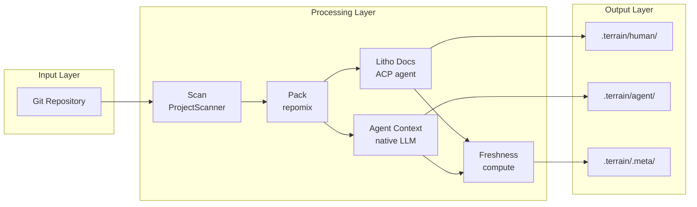
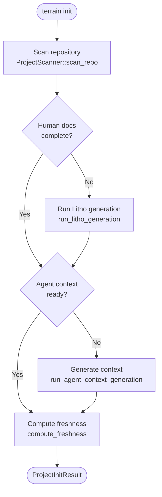
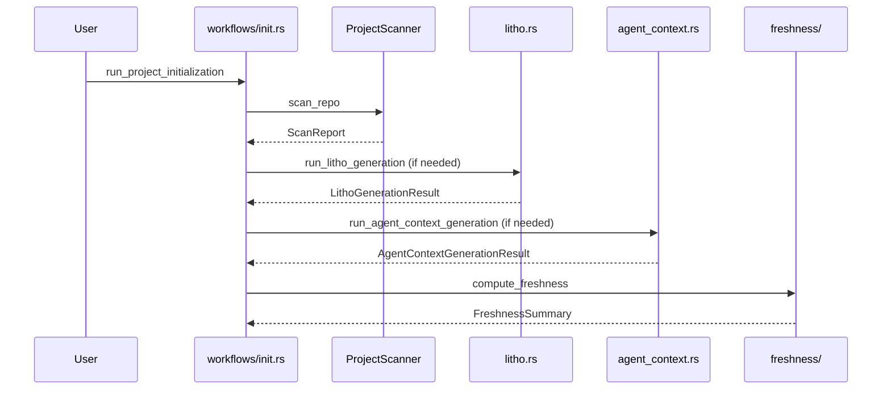
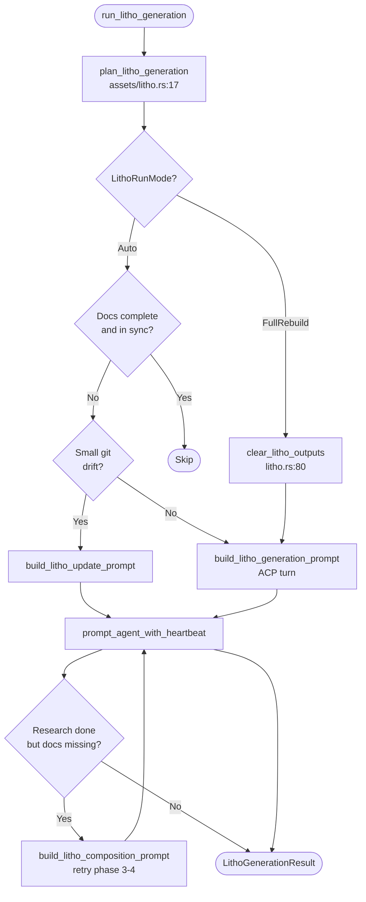
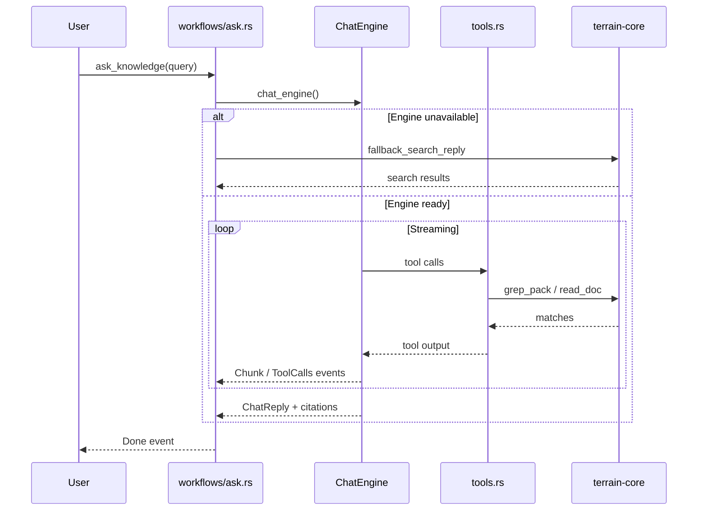

# Core Workflows

## 1. Workflow Overview

### 1.1 The Assembly Line Metaphor

Terrain's workflows can be understood as a factory assembly line. Raw material (a Git repository) enters at the scan station, gets indexed and packed into structured artifacts, then flows through two parallel production lines: one produces narrative human docs via the Litho ACP agent, the other produces structured agent context via native LLM. A quality-control station at the end stamps every asset with a freshness score so consumers know how much to trust it.

The key insight is that not every workflow runs the full line. **Quick refresh** stops after scan + repack. **Incremental updates** send only changed docs back through composition, not the full C4 research pipeline.

### 1.2 Core Execution Path

---

## 2. Main Workflows

### 2.1 Project Initialization

This is the "full factory run" — everything from empty repo to complete knowledge base. It matters because it's the first experience for every new project and sets up all three knowledge layers.

#### Flowchart

#### Sequence Diagram

#### Phase Details

| Phase | Executor | Input | Output | Source |
|-------|----------|-------|--------|--------|
| Scan | `ProjectScanner` | Git repo path | `index.md`, optional `repomix.md` | `ingest/mod.rs:52` |
| Litho | ACP agent | Litho skill prompt | 6 human docs + research artifacts | `litho.rs`, `assets/litho.rs:34` |
| Agent context | Native LLM or ACP | Litho docs + meta | `agent/context.md` | `agent_context.rs:26` |
| Freshness | `compute_freshness` | Git HEAD + asset baselines | `freshness.json` | `freshness/compute.rs` |

**Entry point**: `run_project_initialization` at `crates/terrain-agent/src/workflows/init.rs:105`

---

### 2.2 Litho Document Generation

Litho is the most complex workflow — a four-phase pipeline (preprocessing → C4 research → composition → output) executed by an ACP subprocess agent reading the Litho document skill. Terrain's role is orchestration: plan paths, build prompts, spawn the agent, poll for completion, and handle incremental retries.

#### Flowchart

**Key constants** (`litho.rs:37-41`):
- Poll interval: 3s active, 6s stable
- Wall timeout: 45 minutes (override via `TERRAIN_LITHO_TIMEOUT_SECS`)
- Max composition retries: 3

---

### 2.3 DeepWiki Ask

Ask is the interactive workflow — a user poses a question, the chat engine loops through knowledge tools, and streams back an answer with citations. It gracefully degrades to plain search when no LLM is configured.

#### Sequence Diagram

**Available tools** (`tools.rs:42+`): `list_projects`, `read_agent_context`, `grep_agent_pack`, `read_agent_pack_file`, `search_knowledge`, `read_human_doc`

---

### 2.4 Quick Refresh

A lightweight workflow for keeping repomix and freshness current without the cost of Litho regeneration.

**Entry**: `run_quick_refresh` in `crates/terrain-agent/src/workflows/quick_refresh.rs`  
**Steps**: Scan → repack agent assets → optional agent context refresh → freshness update  
**Skips**: Litho document generation entirely

---

### 2.5 SDD Workflow

Four sequential phases, each producing a reviewable Markdown artifact in `~/.terrain/sdd/{project}/sessions/{id}/outputs/`.

| Phase | Engine | Output file | Source |
|-------|--------|-------------|--------|
| Requirements | Native LLM | `1.requirements.md` | `workflows/sdd.rs` |
| Tech Design | Native LLM | `2.tech-design.md` | `assets/sdd.rs` |
| Code Generation | ACP agent | `3.implementation.md` + repo changes | ACP subprocess |
| Code Review | Native LLM | `4.code-review.md` | `assets/sdd.rs` |

---

## 3. Concurrency and Async Model

Terrain uses **Tokio** as its async runtime throughout `terrain-agent`. The design philosophy is "stability over raw speed" for ACP interactions:

- **ACP subprocess isolation**: Litho and SDD codegen run in separate processes; the parent polls rather than blocking
- **Adaptive polling**: Faster checks early in a Litho session (3s), slower when stable (6s) to reduce CPU
- **Wall timeout**: Prevents zombie ACP sessions from consuming resources indefinitely
- **Tool session cache**: Mutex-protected dedup cache prevents redundant pack reads within one Ask session
- **Stream events**: Ask uses `Mutex<FnMut>` callback for thread-safe NDJSON streaming (`ask.rs:19`)

Core operations (scan, search, freshness) are largely synchronous Git subprocess + file I/O, called from async contexts via `tokio::task` where needed.

---

## 4. Error Handling Strategy

Terrain's error philosophy is **"local failure should not cause global interruption"** — a failed Litho run doesn't corrupt existing docs; an unavailable LLM falls back to search.

| Scenario | Strategy | Source |
|----------|----------|--------|
| LLM unavailable for Ask | `fallback_search_reply` returns search results | `ask.rs:23-30` |
| ACP Litho timeout | Abort agent handle, return error | `litho.rs:131-137` |
| Incremental doc shrinkage | `reject_incremental_document` blocks bad updates | `assets/incremental.rs` |
| Knowledge-only Git commits | Excluded from freshness drift | `freshness/mod.rs:35` |
| ACP unavailable for context | Skip with user-facing note | `workflows/init.rs:35-64` |
| Tool call dedup | Return cached response with notice | `tool_session_cache.rs` |

Structured errors flow through `CoreError` and `TerrainError` (`error.rs`), with IPC-friendly string serialization via `ipc_string`.
