# 3. Workflows

## 1. Overview

Terrain's internal machinery resembles a car factory on an assembly line. Raw ore — your source code — enters through the intake dock (Git scanning and indexing), passes through stamping presses (repomix packing and freshness scoring), moves down the line through paint shops (LLM-powered context generation and Litho documentation), and finally rolls off the end as a finished vehicle: a complete, queryable knowledge base that agents can drive. Each station along the line has a clear entry condition, a bounded set of responsibilities, and an exit gate that decides whether the product moves forward or gets reworked.

The factory metaphor extends to the error-recovery model: a paint defect does not scrap the whole car — the station reworks just that panel. Similarly, an incremental knowledge refresh edits only the sections invalidated by a Git diff, leaving the rest byte-for-byte identical. When rework is impossible (the diff is too large, the baseline is unreachable), the line resets and regenerates from scratch.

---

## 2. Core Execution Path

Every user-facing workflow in Terrain converges on a small number of foundational operations. The diagram below shows how the major flows compose from these primitives.

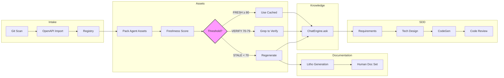

---

## 3. Project Initialization (Scan → Init)

### 3.1 Narrative

Initialization is the intake dock. When you point Terrain at a repository for the first time, the `GitScanner` walks the working tree and catalogues every source file, while the `OpenApiImporter` (when an OpenAPI spec is detected) ingests API surface metadata. The results are written to `.terrain/scan/` as a structured file index. A registry entry is created in `~/.terrain/registry.json` so the project appears in future listings. The agent pack (`repomix`) is then generated — a compressed, token-efficient snapshot of the entire codebase that the LLM can reference without reading thousands of individual files. Finally, if Litho is enabled, a human-document generation pass is triggered through ACP.

### 3.2 Flowchart

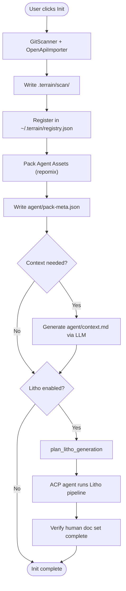

### 3.3 Sequence Diagram

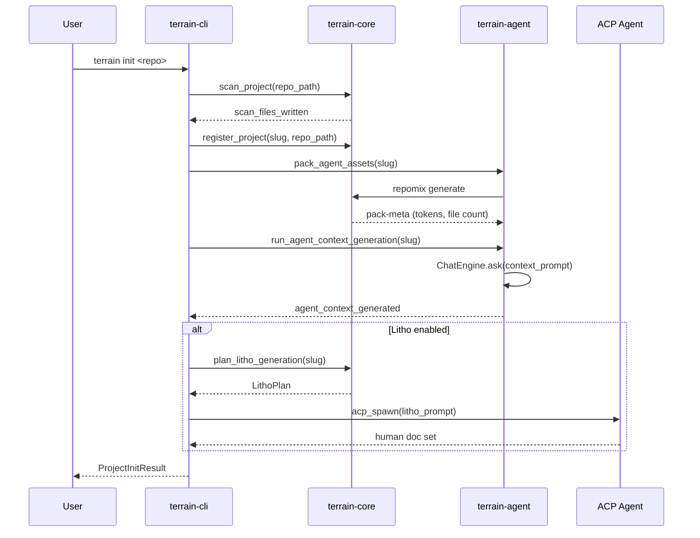

### 3.4 Phases

| Phase | Entry Condition | Action | Exit Gate |
|-------|----------------|--------|-----------|
| Git Scan | Repository path valid | `GitScanner` walks tree, `OpenApiImporter` reads specs | `.terrain/scan/` written |
| Registry | Scan complete | Add/update entry in `~/.terrain/registry.json` | Slug resolvable |
| Pack Agent Assets | Registry entry exists | Generate `agent/repomix.md` + `agent/pack-meta.json` | `agent_pack_ready()` returns true |
| Agent Context | Pack ready | LLM generates `agent/context.md` from pack + metadata | `agent_context_ready()` returns true (≥500 chars, ≥4 sections) |
| Litho Generation | Context ready (optional) | ACP agent runs 4-phase Litho pipeline | `litho_human_complete()` returns true |

**File references:**
- `crates/terrain-core/src/assets/agent_context.rs:17` — `agent_context_ready()` readiness check
- `crates/terrain-agent/src/workflows/init.rs` — orchestration of init steps
- `crates/terrain-core/src/assets/litho.rs:237-243` — `LITHO_REQUIRED_HUMAN_FILES` constant defining the required doc set

---

## 4. Knowledge Query (Ask)

### 4.1 Narrative

The Ask workflow is the factory's quality-control station — it takes a user's question, prepares the freshest possible knowledge context, and passes it through the `ChatEngine` for a synthesized answer. Before the LLM is even invoked, Terrain checks whether the agent pack and context are synchronized with the current Git HEAD. If they are stale, a preparation phase runs (repacking or regenerating) transparently. The engine then dispatches to one of two backends: **native** (direct LLM via `adk-rust`) or **pure ACP** (delegates to OpenCode). Tools are available to the model — `search_knowledge`, `read_agent_context`, `grep_agent_pack`, `read_agent_pack_file` — and each is wrapped in a session cache that short-circuits identical calls. Streaming events (`Chunk`, `ThinkingChunk`, `ToolCalls`, `Phase`, `Usage`, `Done`) are forwarded to the UI in real time. If the LLM is entirely unavailable, a `fallback_search_reply` gracefully degrades to keyword search with citations.

### 4.2 Flowchart

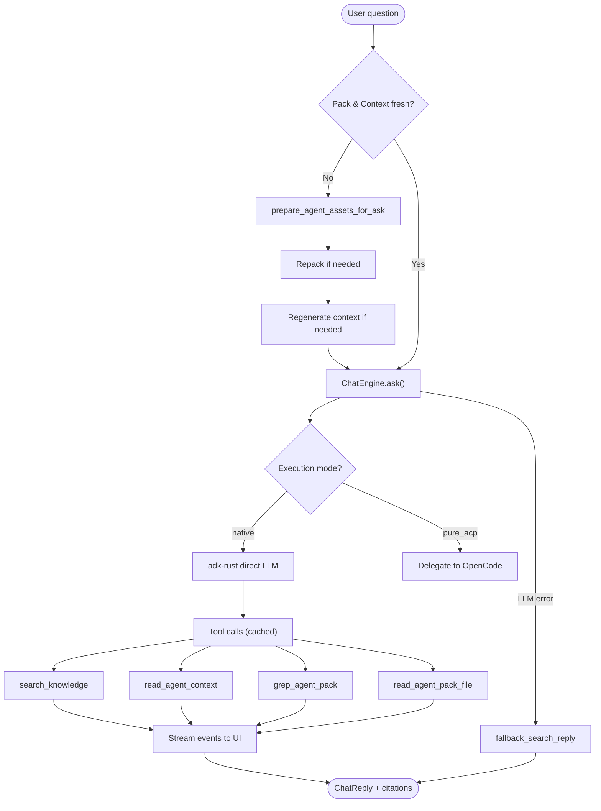

### 4.3 Sequence Diagram

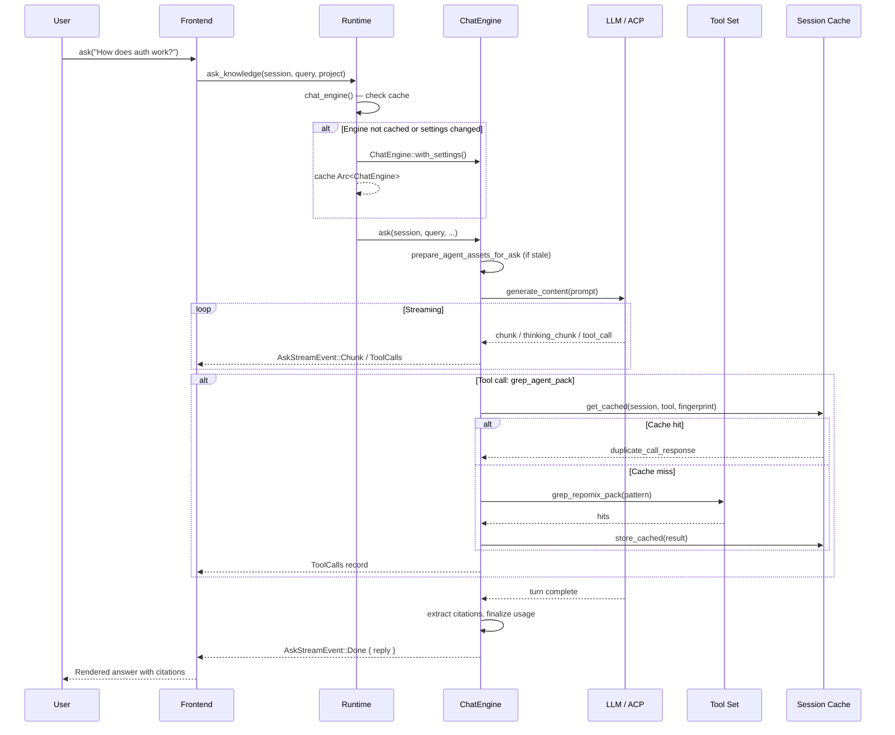

### 4.4 Phases

| Phase | Entry Condition | Action | Exit Gate |
|-------|----------------|--------|-----------|
| Prepare Assets | Pack or context stale with HEAD | Re-run repack / context generation | `agent_pack_synced_with_head` && `agent_context_synced_with_head` |
| Backend Selection | Engine ready | Choose native or pure ACP based on `AgentExecution` setting | Backend initialized |
| Tool Execution | LLM requests tool call | Dispatch to tool, check session cache, store result | Tool response returned (or cached duplicate) |
| Streaming | LLM generating | Forward chunks, thinking, tool calls, phase changes | Turn complete |
| Fallback | LLM unavailable | `fallback_search_reply` runs keyword search | `ChatReply` with citations or "no matches" message |

**File references:**
- `crates/terrain-agent/src/workflows/ask.rs:11-77` — `ask_knowledge` entry point and streaming event dispatch
- `crates/terrain-agent/src/workflows/ask.rs:79-144` — `fallback_search_reply` graceful degradation
- `crates/terrain-agent/src/chat/mod.rs:115-160` — `ChatEngine::ask` asset preparation and backend dispatch
- `crates/terrain-agent/src/tool_session_cache.rs:16-19` — `get_cached` session-level cache lookup

---

## 5. Litho Documentation Generation

### 5.1 Narrative

Litho is the paint shop — it transforms the raw stamped metal of the repomix pack into the glossy, human-readable finish of project documentation. The pipeline has four phases: **preprocessing** (file-tree analysis and language detection), **C4 research** (system context, domain modules, container, and component diagrams), **composition** (writing the actual Markdown documents), and **output validation** (verifying the full doc set exists). The entire pipeline runs inside an ACP agent session, with Terrain polling for completion. If research artifacts already exist from a prior run, the system can skip directly to composition — a significant time saver on repeated runs.

### 5.2 Flowchart

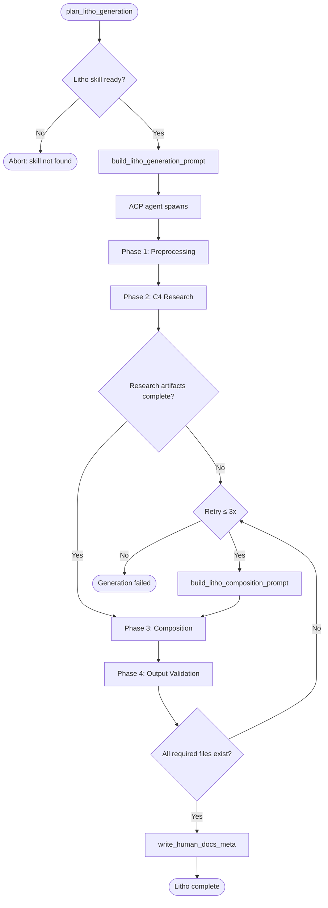

### 5.3 Sequence Diagram

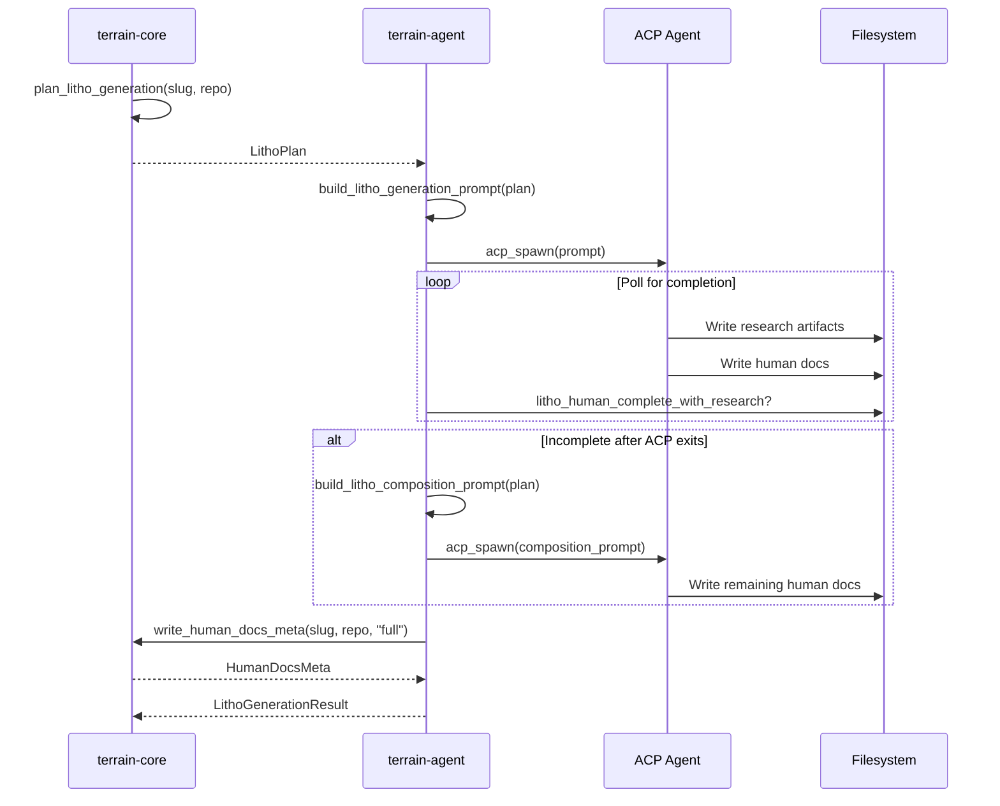

### 5.4 Phases

| Phase | Entry Condition | Action | Exit Gate |
|-------|----------------|--------|-----------|
| Preprocessing | ACP session started | File-tree walk, language detection, structure analysis | Research artifacts begin appearing |
| C4 Research | Preprocessing done | System context, domain modules, container/component analysis | Core research files exist under workspace |
| Composition | Research ready (or retried) | Write final Markdown per Litho skill templates | `litho_human_complete_with_research()` true |
| Output Validation | Composition done | Verify all required files exist, count modules vs deep-dives | File count ≥ `LITHO_REQUIRED_HUMAN_FILES` length |

**File references:**
- `crates/terrain-core/src/assets/litho.rs:17-31` — `plan_litho_generation` builds the `LithoPlan`
- `crates/terrain-core/src/assets/litho.rs:34-60` — `build_litho_generation_prompt` prompt construction
- `crates/terrain-core/src/assets/litho.rs:256-288` — `litho_human_complete_with_research` completeness check

---

## 6. Litho Incremental Update

### 6.1 Narrative

Most commits do not rewrite the entire codebase — they touch a handful of files. The incremental update workflow exploits this by computing a `git diff` between the doc set's baseline commit and HEAD, then handing the diff to the model with strict editing instructions: preserve every untouched section verbatim, revise only what the changed paths invalidate. This is the factory's spot-repair station: instead of repainting the whole car, a technician touches up only the scratched panel. The workflow deliberately refuses to run when the diff is too large (default threshold: 60 files), when the baseline is unreachable (rebase/shallow clone), or when the asset does not yet exist.

### 6.2 Flowchart

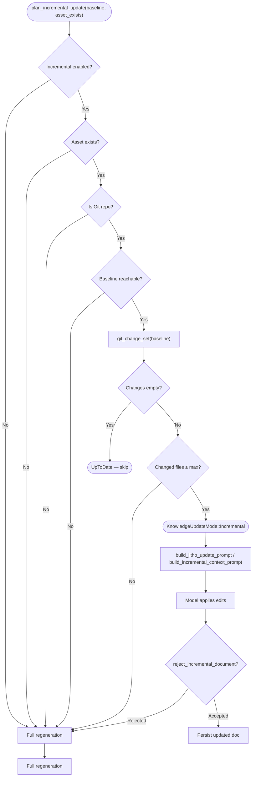

### 6.3 Sequence Diagram

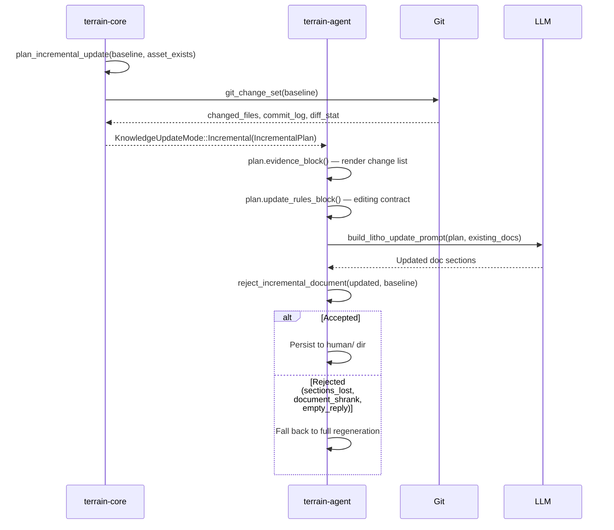

### 6.4 Phases

| Phase | Entry Condition | Action | Exit Gate |
|-------|----------------|--------|-----------|
| Diff Analysis | Baseline known, asset exists | `git_change_set` computes commits/files changed | `IncrementalPlan` with evidence block |
| Threshold Check | Diff computed | Compare touched files against `max_changed_files` | Decision: incremental or full |
| Prompt Assembly | Incremental mode selected | Build update prompt with evidence + rules + existing docs | Prompt ready |
| Model Application | Prompt sent | Model edits docs in-place (Litho) or replies full doc (context) | `reject_incremental_document` validation passes |
| Persistence | Validation passed | Write updated file, update baseline metadata | File persisted, meta updated |

**File references:**
- `crates/terrain-core/src/assets/incremental.rs:76-139` — `plan_incremental_update` decision logic
- `crates/terrain-core/src/assets/incremental.rs:167-264` — `evidence_block` and `update_rules_block` prompt construction
- `crates/terrain-core/src/assets/incremental.rs:282-305` — `reject_incremental_document` safety validation
- `crates/terrain-core/src/assets/litho.rs:97-149` — `build_litho_update_prompt` for Litho incremental updates

---

## 7. SDD Workflow (Spec-Driven Development)

### 7.1 Narrative

SDD is Terrain's four-bay garage for turning a requirement into reviewed code. Each bay produces a reviewable Markdown artifact before the car moves to the next: **Requirements** clarifies goals and acceptance criteria, **TechDesign** produces architecture decisions and implementation plans, **CodeGen** delegates to an ACP agent to write the actual code, and **CodeReview** audits the implementation against the original spec. Every phase reads the artifacts of prior phases as context, and each output is persisted under `~/.terrain/sdd/<session>/outputs/` so it can be reviewed, edited, and fed back as human feedback.

### 7.2 Flowchart

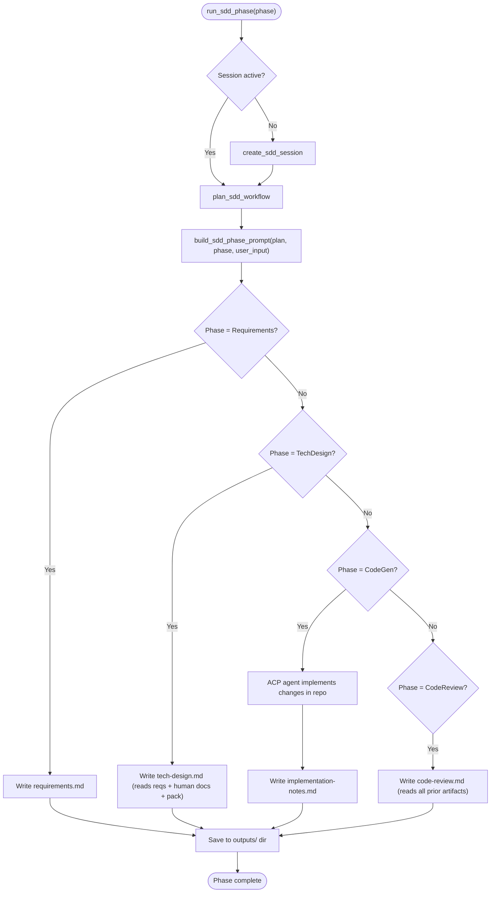

### 7.3 Sequence Diagram

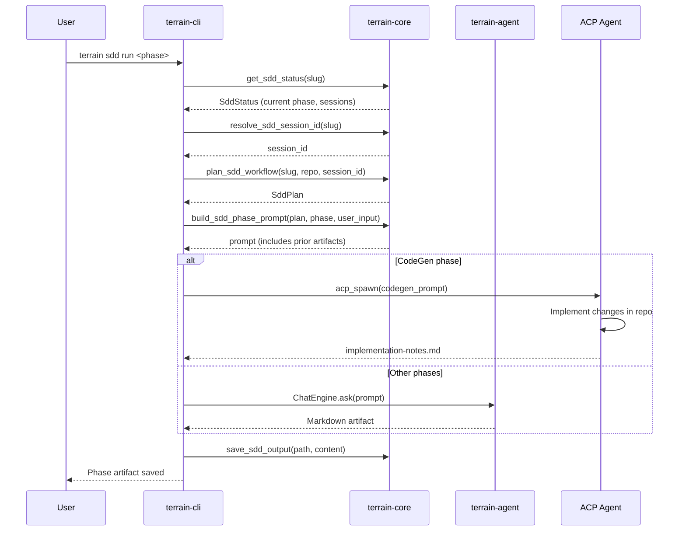

### 7.4 Phases

| Phase | Entry Condition | Action | Exit Gate |
|-------|----------------|--------|-----------|
| Requirements | Session created | ACP/LLM produces structured requirements doc | `outputs/requirements.md` exists |
| TechDesign | Requirements complete | Reads reqs + human docs + pack, produces technical design | `outputs/tech-design.md` exists |
| CodeGen | TechDesign approved | ACP agent implements code changes in the repository | Code changes applied, `outputs/implementation-notes.md` written |
| CodeReview | CodeGen complete | Audits implementation against requirements and design | `outputs/code-review.md` exists |

**File references:**
- `crates/terrain-core/src/assets/sdd.rs:194-218` — `plan_sdd_workflow` builds the `SddPlan`
- `crates/terrain-core/src/assets/sdd.rs:311-403` — `build_sdd_phase_prompt` constructs phase-specific prompts with prior artifact context

---

## 8. Quick Refresh

### 8.1 Narrative

Quick refresh is the factory's overnight maintenance cycle — it re-scans the repo, regenerates the repomix pack, and optionally refreshes the agent context, but deliberately skips the slow Litho pipeline. The goal is to keep the knowledge base current with minimal disruption: a fast scan catches new or deleted files, a repack updates the token-efficient snapshot, and the freshness score is recalculated so the UI green/yellow/red indicator stays accurate. Litho docs are only updated when the user explicitly triggers a full refresh or when incremental Litho updates are enabled in settings.

### 8.2 Flowchart

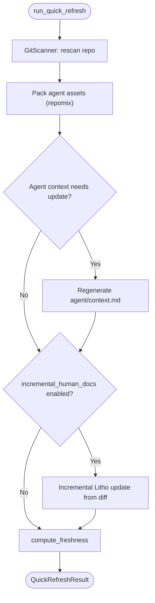

### 8.3 Sequence Diagram

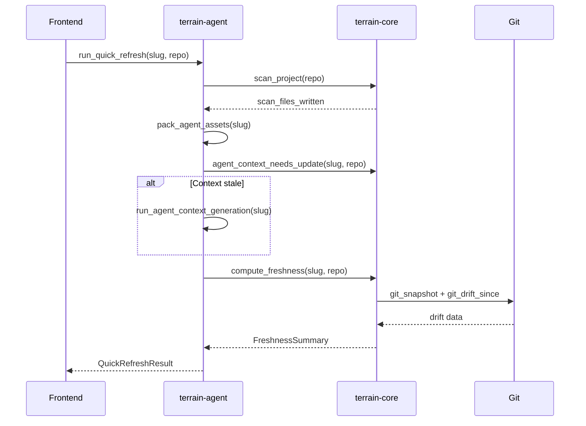

### 8.4 Phases

| Phase | Entry Condition | Action | Exit Gate |
|-------|----------------|--------|-----------|
| Rescan | Repo path valid | `GitScanner` walks working tree | `.terrain/scan/` updated |
| Repack | Scan complete | Generate fresh `agent/repomix.md` | Pack tokens recorded |
| Context Update | Pack ready, context stale | LLM regenerates `agent/context.md` (full or incremental) | `agent_context_ready()` true |
| Litho Update | `incremental_human_docs` enabled | `plan_incremental_update` → model edits existing docs | Docs updated or skipped |
| Freshness Score | All assets updated | `compute_freshness` recalculates all scores | `FreshnessSummary` persisted |

**File references:**
- `crates/terrain-agent/src/workflows/quick_refresh.rs` — quick refresh orchestration
- `crates/terrain-core/src/freshness/compute.rs:30-250` — `compute_freshness` full freshness computation

---

## 9. Environment Integration

### 9.1 Narrative

Environment integration is the factory's toolroom — it equips the repository with the auxiliary systems that make the main line run smoothly. The three-step cycle (`status → plan → apply`) inspects what is already deployed (Skills, CodeGraph index, RTK wrapper, AGENTS.md), computes a delta plan of what needs to be installed or updated, and then applies those changes. The catalog of available integrations lives under the Terrain preset skills directory, and each integration item tracks whether it is optional, locked (cannot be overwritten), or depends on another item.

### 9.2 Flowchart

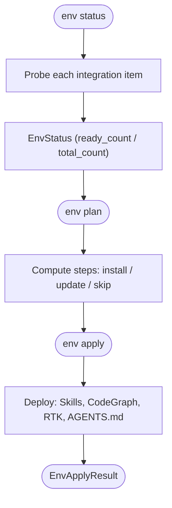

### 9.3 Sequence Diagram

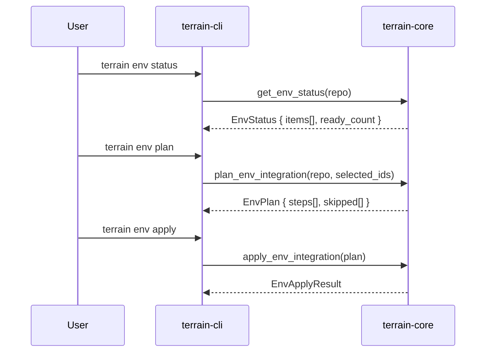

### 9.4 Phases

| Phase | Entry Condition | Action | Exit Gate |
|-------|----------------|--------|-----------|
| Status | Repository path valid | Probe each catalog item, check deployment state | `EnvStatus` with per-item `integrated: bool` |
| Plan | Status computed | User selects items, compute install/update/skip steps | `EnvPlan` with ordered steps |
| Apply | Plan approved | Execute each step: copy Skills, generate AGENTS.md, etc. | `EnvApplyResult` with success/failure per step |

---

## 10. Concurrency Model

Terrain's concurrency is built on a layered architecture of `tokio` async, `RwLock`, and `Mutex`:

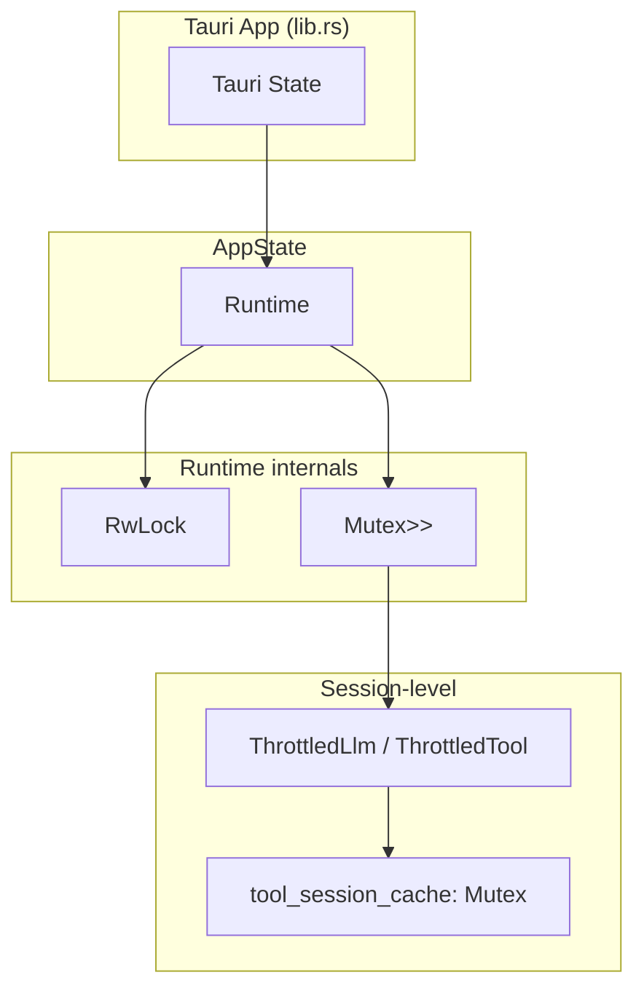

**Key concurrency primitives:**

| Primitive | Location | Purpose |
|-----------|----------|---------|
| `RwLock<ModelConfig>` | `Runtime` in `runtime.rs:13` | Allows concurrent reads of model config; exclusive write on settings change |
| `Mutex<Option<Arc<ChatEngine>>>` | `Runtime` in `runtime.rs:14` | Lazy initialization; `Arc` allows sharing engine across async tasks |
| `Mutex<HashMap>` (static) | `tool_session_cache.rs:7-9` | Session-scoped cache prevents duplicate identical tool calls |
| `Mutex<HashMap>` (static) | `throttle.rs:37-40` | Tracks wall-clock tool execution times |
| `OnceLock<Mutex>` | `throttle.rs:6` | One-time initialization of cooldown store |
| `tokio::time::sleep` | `throttle.rs:176` | Post-call cooldown to avoid 429 rate limits |

The `Runtime` (`crates/terrain-agent/src/runtime.rs:11-76`) is the central coordination point. It holds the model configuration behind an `RwLock` so that UI reads never block, while settings saves acquire a write lock and invalidate the cached `ChatEngine`. The engine itself is wrapped in `Arc` so it can be shared across concurrent `ask_knowledge` calls from different IPC invocations without rebuilding.

---

## 11. Error Handling Strategy

Terrain employs three defensive layers:

### 11.1 Fallback Search Reply

When the LLM is completely unavailable (wrong API key, network error, model not found), `fallback_search_reply` (`crates/terrain-agent/src/workflows/ask.rs:79-144`) degrades gracefully: it runs a keyword search against the knowledge base, attaches any matching documents as citations, and returns a `ChatReply` explaining the LLM failure. This ensures the user always gets *something* useful, even if it is not a synthesized answer.

### 11.2 Tool Session Cache

The tool session cache (`crates/terrain-agent/src/tool_session_cache.rs:16-25`) is keyed by `session_id:tool_name:fingerprint`. When the model makes an identical tool call within the same session, the cache returns the previous result flagged with `duplicate_call: true` and a message instructing the model not to repeat itself. This prevents wasted tokens and avoids the model getting stuck in tool-call loops.

### 11.3 Incremental Rejection Guard

`reject_incremental_document` (`crates/terrain-core/src/assets/incremental.rs:282-305`) validates that an incremental update result is plausible. It rejects empty replies, documents that lost `##`-level sections, or documents that shrank below 60% of the baseline length. A rejected incremental result triggers a fallback to full regeneration, preventing the knowledge base from being corrupted by a partial or hallucinated update.

### 11.4 Throttle Layer

The throttle layer (`crates/terrain-agent/src/throttle.rs:18`) wraps both the LLM and every tool with a configurable cooldown (default 200ms, overridable via `TERRAIN_LLM_COOLDOWN_MS`). This prevents 429 rate-limit errors from fast-repeated calls, particularly during multi-turn tool-calling sequences.

---

## 12. Freshness Thresholds

The freshness scoring system (`crates/terrain-core/src/freshness/mod.rs:20-27`) defines three critical thresholds that govern system behavior:

| Threshold | Score | Behavior |
|-----------|-------|----------|
| `FRESH_THRESHOLD` | ≥ 80 | UI shows green; architecture context is trusted as-is |
| `VERIFY_THRESHOLD` | 70–79 | UI shows yellow; agent must verify claims with `grep_agent_pack` before answering |
| `MACRO_PRELOAD_THRESHOLD` | < 50 | Macro context is not preloaded; agent must use `grep_agent_pack` + `read_agent_pack_file` exclusively |

Scores are computed per asset (agent_pack, agent_context, human_docs) and combined into an overall score via `overall_freshness_score`. The scoring formula accounts for commits since baseline, changed file count relative to total files, age in days, and working-tree dirty state — while deliberately excluding commits that only touch `.terrain/` knowledge assets (`crates/terrain-core/src/freshness/mod.rs:36-48`).
