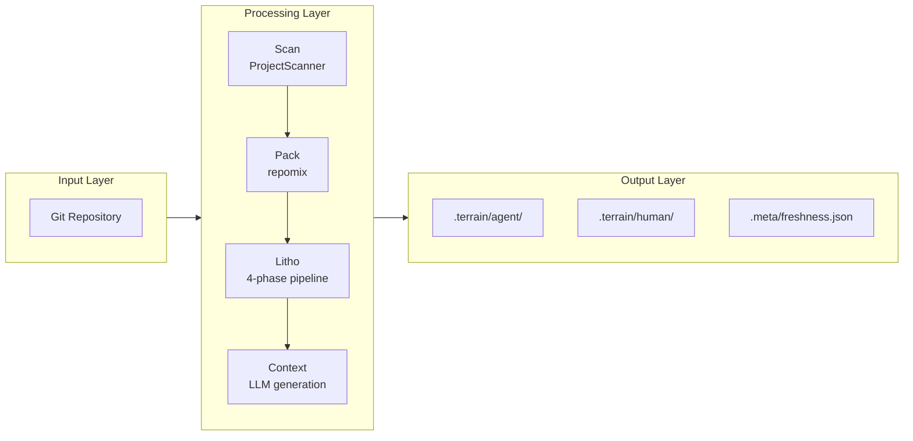
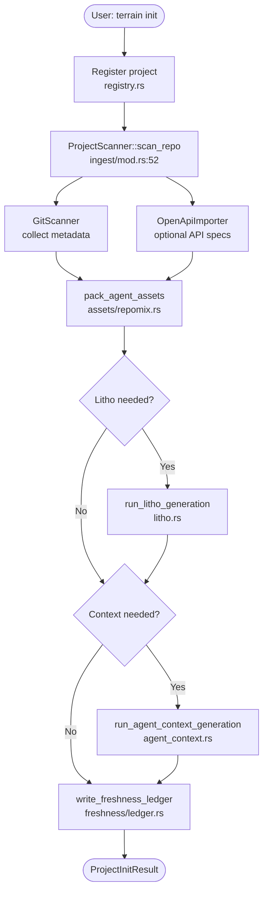
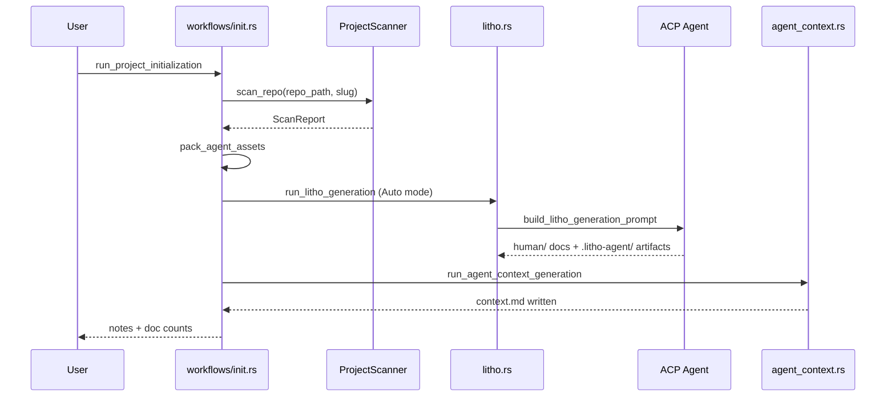
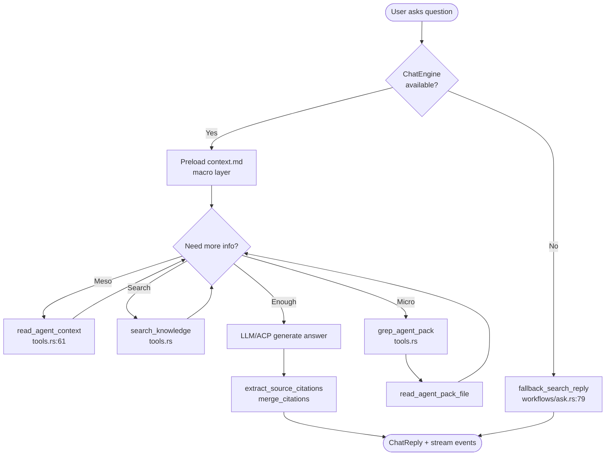
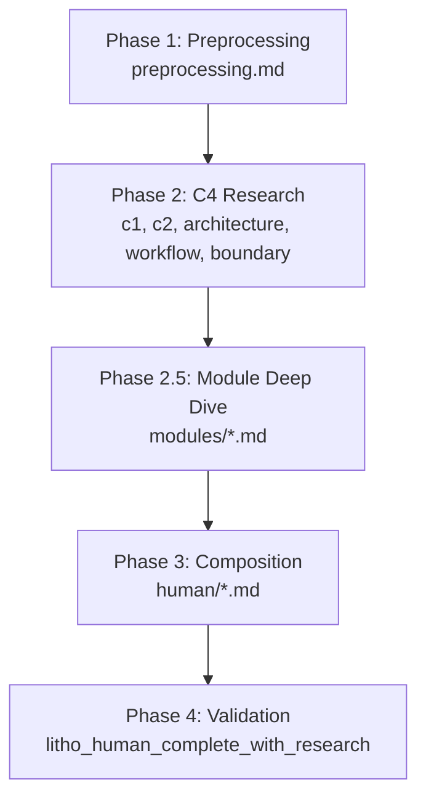
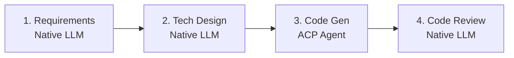
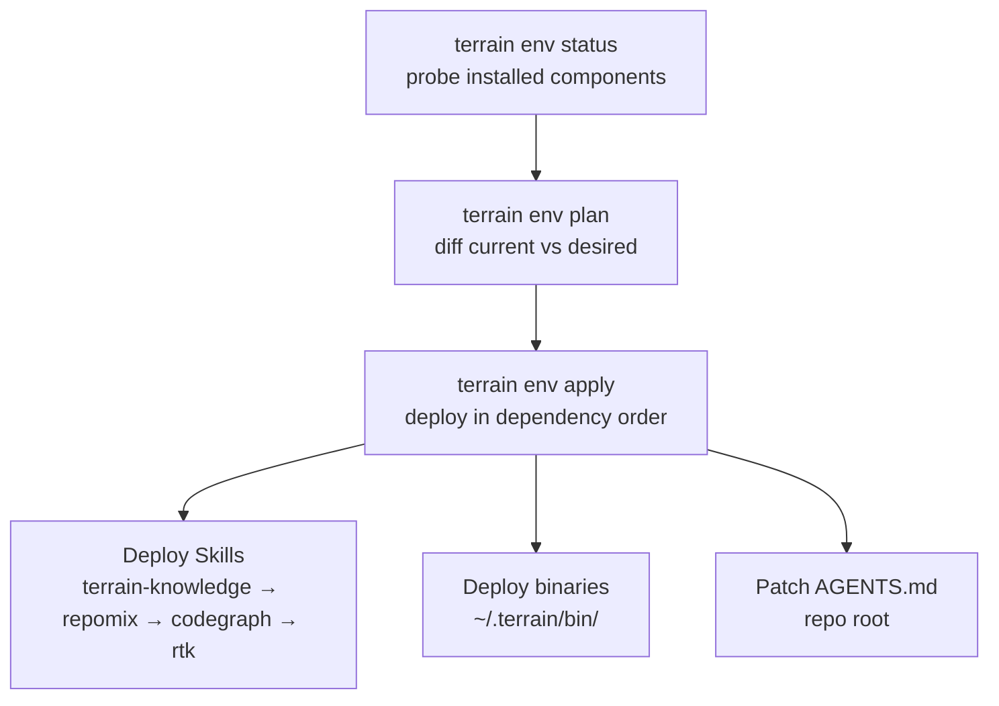

# Core Workflows

Think of Terrain's workflows as a **production line** — raw material (source code) enters at one end, passes through specialized stations (scan, pack, research, compose), and finished knowledge products roll off at the other. Some workflows are the full line (project initialization); others are express lanes (quick refresh) that skip the slowest stations. This document walks through each major workflow with enough detail to trace any step back to its source function.

---

## 1. Workflow Overview

### 1.1 Design Philosophy

Terrain favors **resumable, checkpointed pipelines** over monolithic batch jobs. Litho research artifacts persist in `.terrain/.litho-agent/` so a failed composition phase can resume without repeating preprocessing and C4 research. SDD sessions store phase outputs locally so developers can review artifacts between phases. Freshness scoring provides a continuous signal about whether the knowledge line's output still matches the raw material.

### 1.2 Core Execution Path

---

## 2. Main Workflows

### 2.1 Project Initialization

This is the full production line — everything a new repository needs to become agent-ready.

#### Flowchart

#### Sequence Diagram

#### Phase Details

| Phase | Executor | Input | Output | Notes |
|-------|----------|-------|--------|-------|
| Register | `registry::register_project` | repo path, slug | registry entry | Pointer only in `~/.terrain/registry.json` |
| Scan | `ProjectScanner` | repo path | `index.md`, sync meta | Git + optional OpenAPI |
| Pack | `pack_agent_assets` | repo source | `agent/repomix.md` | Grep-friendly source index |
| Litho | ACP + Litho skill | repo + skill dir | `human/` C4 docs | 4-phase pipeline, up to 45min |
| Context | `AgentContextGenerator` | human docs + repomix | `agent/context.md` | Hard cap 16 KiB |
| Freshness | `write_freshness_ledger` | git HEAD | `.meta/freshness.json` | Baseline for future drift |

**Entry point**: `run_project_initialization` in `crates/terrain-agent/src/workflows/init.rs`

---

### 2.2 Ask Knowledge Q&A (DeepWiki)

DeepWiki is Terrain's knowledge-grounded Q&A — like having a senior engineer who has read all the architecture docs and can grep the source code on demand.

#### Flowchart

#### Three-Layer Retrieval Model

| Layer | Source | Tool | When Used |
|-------|--------|------|-----------|
| Macro | `agent/context.md` | Preloaded in prompt | Every Ask — overview, architecture, module map |
| Meso | `human/`, `knowledge/` docs | `read_agent_context`, `search_knowledge` | When question needs doc detail |
| Micro | `agent/repomix.md` | `grep_agent_pack` → `read_agent_pack_file` | When question needs source code evidence |

**Entry point**: `ask_knowledge` in `crates/terrain-agent/src/workflows/ask.rs:11`

**Fallback**: When ChatEngine cannot initialize (no LLM/ACP configured), `fallback_search_reply` performs keyword search and returns snippets without LLM synthesis.

---

### 2.3 Litho Document Generation

Litho transforms source code into human-readable C4 architecture documentation through a four-phase pipeline executed by an ACP agent following the Litho document skill.

#### Modes

| Mode | Enum | Behavior |
|------|------|----------|
| Auto | `LithoRunMode::Auto` | Skip if complete and in sync; incremental update on small drift |
| Full Rebuild | `LithoRunMode::FullRebuild` | Wipe `human/` and `.litho-agent/`, run full pipeline |

Defined in `crates/terrain-agent/src/litho.rs:17-24`.

#### Four Phases

Research artifacts persist in `TERRAIN_LITHO_WORKSPACE` (`.terrain/.litho-agent/`). If research completes but composition fails, a composition-only prompt (`build_litho_composition_prompt` at `crates/terrain-core/src/assets/litho.rs:63`) resumes without repeating phases 1–2.

**Polling**: 3-second interval during active generation, 6-second when stable, 45-minute wall timeout (`DEFAULT_WALL_TIMEOUT_SECS=2700`).

**Completeness check**: `litho_human_complete_with_research` (`crates/terrain-core/src/assets/litho.rs:256`) verifies core files exist in any supported language AND `4.Deep-Exploration/` covers all modules in the research workspace.

---

### 2.4 SDD Standardized Development

SDD defines a repeatable four-phase development path, each producing a reviewable Markdown artifact.

| Phase | Engine | Output Path |
|-------|--------|-------------|
| Requirements | Native LLM | `1.requirements.md` |
| TechDesign | Native LLM | `2.tech-design.md` |
| CodeGen | ACP subprocess | `3.implementation.md` + repo changes |
| CodeReview | Native LLM | `4.code-review.md` |

Sessions stored at `~/.terrain/sdd/{project}/sessions/{id}/outputs/` (local, not versioned).

**Entry point**: `run_sdd_phase` in `crates/terrain-agent/src/workflows/sdd.rs`

---

### 2.5 Quick Refresh

The express lane — re-scan and repack without Litho. Triggered by `terrain refresh` or the desktop quick-refresh button.

**Entry point**: `run_quick_refresh` in `crates/terrain-agent/src/workflows/quick_refresh.rs`

Skips Litho generation; optionally refreshes agent context if human docs changed.

---

### 2.6 Environment Integration

Deploys agent enhancement tools into the developer's environment.

**Entry points**: `plan_env_integration` and `apply_env_integration` in `crates/terrain-core/src/assets/env/`

---

## 3. Concurrency and Async Model

Terrain uses Tokio throughout for IO-bound operations. Key concurrency decisions:

- **ACP subprocess isolation** — Litho and SDD CodeGen run external agents in separate processes. This is a deliberate trust boundary: ACP agents can spawn arbitrary commands.
- **Stream event mutex** — Ask Q&A wraps progress callbacks in `Mutex` (`workflows/ask.rs:19`) because the ChatEngine may emit events from multiple async tasks.
- **Litho heartbeat polling** — Unlike early-completion heuristics, incremental Litho updates use heartbeat-only polling because doc counts don't grow during in-place edits (`litho.rs:111-113`).

## 4. Error Handling Strategy

Terrain's error philosophy is **graceful degradation over hard failure**:

- **Ask without LLM** — Falls back to keyword search (`fallback_search_reply`) rather than returning an error
- **Litho composition retry** — Up to 3 composition attempts (`MAX_COMPOSITION_ATTEMPTS=3`) before reporting failure
- **Structured IPC errors** — `TerrainErrorBody` provides machine-readable error details to the frontend
- **User-facing display** — `errorFormat.ts` splits errors into summary + expandable detail; `ErrorNotice.svelte` renders them consistently across panels
- **Freshness warnings** — Scores below 50 trigger UI warnings; agents should verify with repomix before trusting macro context
