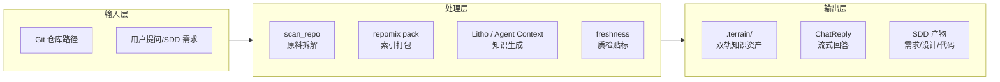
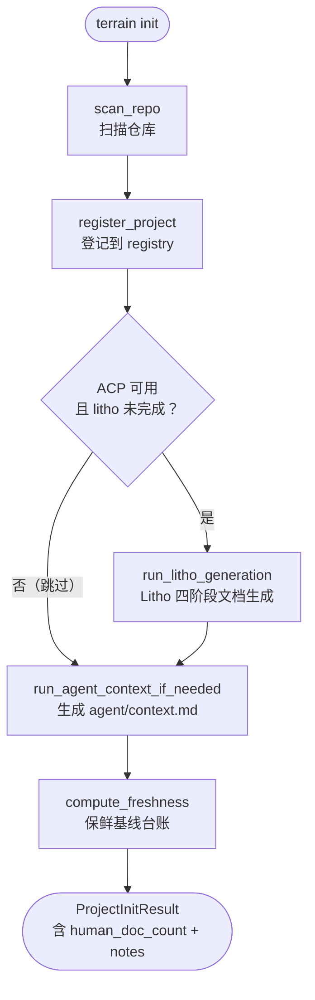
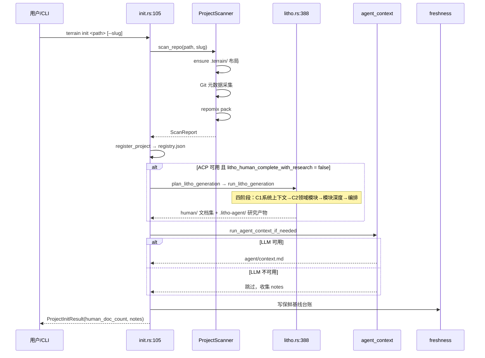
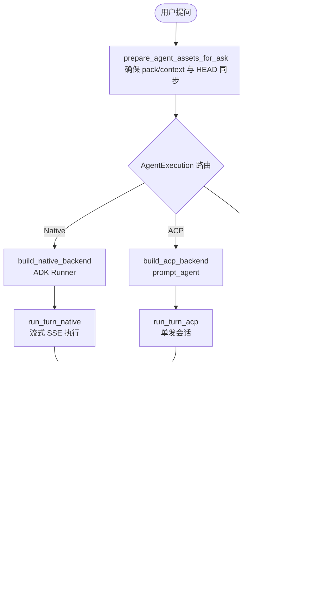
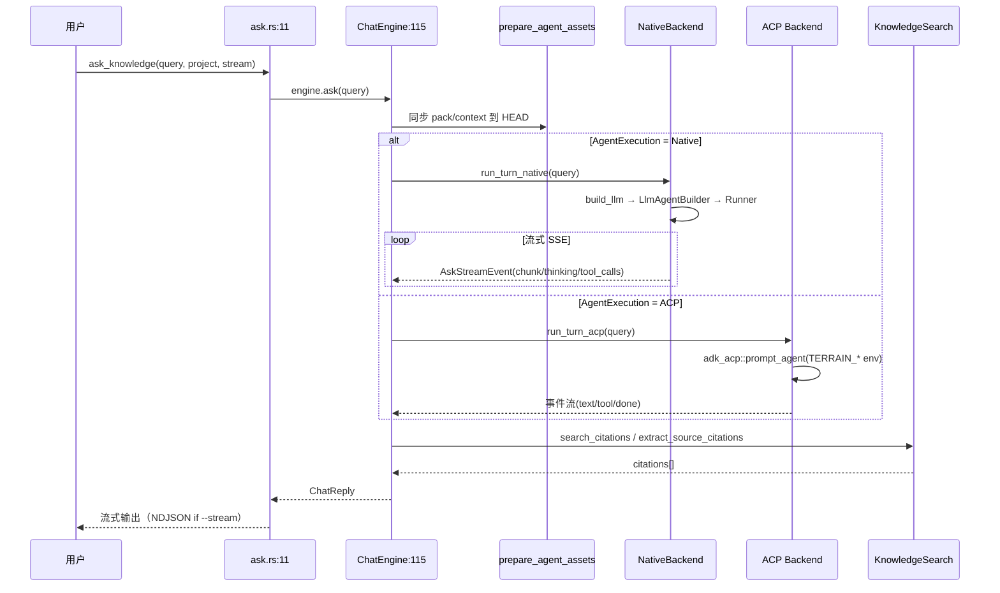
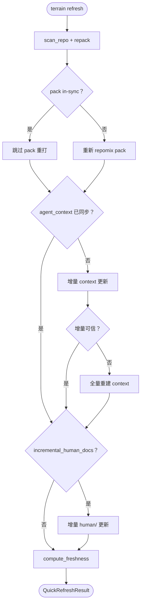
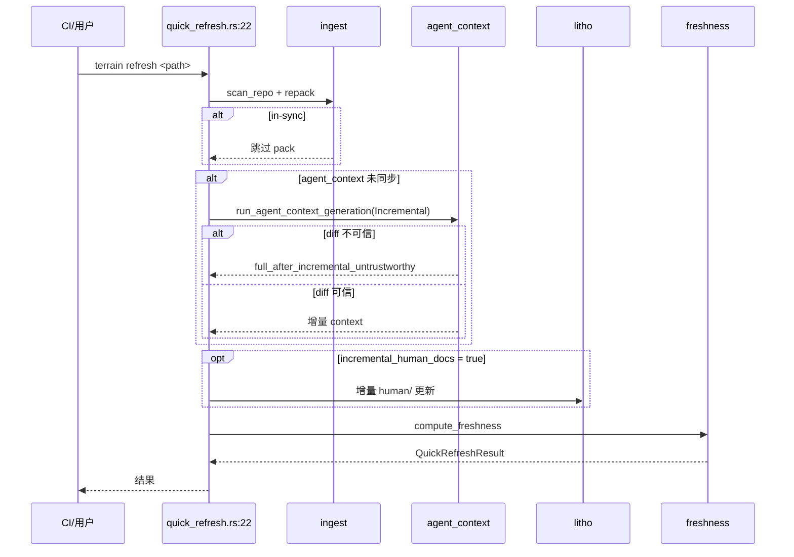
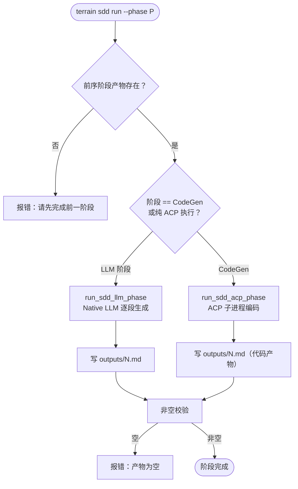
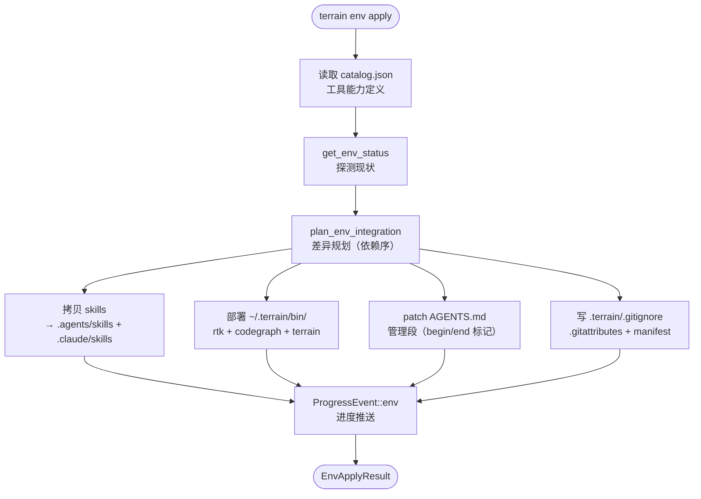

# 核心工作流

## 1. 工作流概述

### 1.1 系统架构与工作流理念

Terrain 的工作流可以用一个简单的比喻来理解：它就像一条**知识工厂的生产线**——原材料（源码仓库）进厂后，先在扫描车间拆解分类，再由打包机生成可检索索引，随后"人类文档车间"（Litho ACP）产出叙述性 C4 文档、"Agent 上下文车间"（LLM）产出结构化摘要，最后质检车间（freshness）给每批产品贴新鲜度标签。并且支持"只重做变更的那一小段"（增量更新），而不是每次整厂重建。

这种设计理念的核心是**顺序固定、局部失败可恢复**。五个核心工作流共享同一个 Runtime（包含 paths、model_config、agent_executor），确保无论从 CLI 还是桌面 GUI 发起，行为完全一致。每个工作流都设计了明确的降级路径：LLM 不可用时 Ask 降级为纯检索回答、ACP 不可用时 Litho/SDD 跳过并收集 notes、增量更新不可信时自动退回全量重建。

### 1.2 核心执行路径

---

## 2. 主要工作流

### 2.1 项目初始化（Init）

#### 为什么需要这个工作流

项目初始化是 Terrain 最核心的"一键启动"操作——它把一个裸 Git 仓库变成拥有完整知识资产的项目。无论是通过桌面端"添加项目"按钮还是 CLI `terrain init <path>` 发起，背后都是同一套逻辑。这个工作流的重要性在于，它一次性完成了扫描、文档生成、Agent 上下文准备和保鲜基线设置四件事，让用户从"零"到"可用"只需一次操作。

#### 流程图

#### 时序图

#### 阶段说明

| 阶段 | 执行者 | 输入 | 输出 | 说明 |
|------|-------|------|------|------|
| 扫描 | `ProjectScanner::scan_repo`（`ingest/mod.rs:52`） | 仓库路径 + slug | `ScanReport`（index.md + sync.json） | 纯离线，无 LLM；同时触发 repomix pack |
| 登记 | `register_project`（`registry.rs`） | 项目元数据 | `~/.terrain/registry.json` 条目 | 确保后续 CLI/UI/tools 能用 slug 定位 |
| Litho 文档生成 | `run_litho_generation`（`litho.rs:388`） | 研究计划 | `.terrain/human/` C4 文档集 | 条件执行；ACP 可用时才运行；产物保留在 `.litho-agent/` |
| Agent 上下文 | `run_agent_context_if_needed`（`init.rs:16`） | 模块扫描结果 | `agent/context.md`（≤16KiB） | LLM 不可用时跳过并记录 notes |
| 保鲜基线 | 写入 `.meta/sync.json` + `.meta/freshness.json` | HEAD commit | 基线台账 | 后续 freshness 评分的起点 |

### 2.2 DeepWiki Ask 问答

#### 为什么需要这个工作流

Ask 是用户与知识库交互的最自然方式——用自然语言提问，系统基于已生成的知识资产给出带引用的回答。它不是简单的"搜索"，而是结合了三层检索策略（宏观/中观/微观）和 LLM 推理的深度问答。关键设计是"双后端"：Native ADK 适合多轮对话和低延迟场景，ACP 子进程适合需要深度工具调用的复杂推理。

#### 流程图

#### 时序图

#### 阶段说明

| 阶段 | 执行者 | 输入 | 输出 | 说明 |
|------|-------|------|------|------|
| 资产同步 | `prepare_agent_assets_for_ask`（`assets/query.rs`） | 当前 HEAD | 确保 pack/context 最新 | "带着最新地图再上路" |
| 路由决策 | `ChatEngine::ask`（`chat/mod.rs:115`） | AgentExecution 配置 | 后端选择 | Native 或 ACP |
| 执行 | `run_turn_native` 或 `run_turn_acp` | 用户消息 | 流式事件 | ASK_TIMEOUT=1200s 墙钟 |
| 引用组装 | `extract_source_citations` / `search_citations` | 工具命中 | citations 列表 | 源码引用 + 搜索引用 |
| 降级 | `fallback_search_reply`（`ask.rs:79`） | query | 纯检索回答 | LLM 不可用时触发 |

### 2.3 快速刷新（QuickRefresh）

#### 为什么需要这个工作流

代码在不断演进，知识资产也需要跟上。快速刷新是日常使用中最频繁的操作——提交后跑一下，几秒钟就能让知识资产追上代码变更。它的设计哲学是"能增量就增量"：按 git diff 分组变更文件，只更新受影响的部分。只有在增量结果不可信时（diff 太大或基准不可达）才退回全量重建。

#### 流程图

#### 时序图

#### 阶段说明

| 阶段 | 执行者 | 输入 | 输出 | 说明 |
|------|-------|------|------|------|
| 扫描+重打包 | `scan_repo`（`ingest/mod.rs:52`） | 仓库路径 | index.md + sync.json + pack | in-sync 时 pack 跳过 |
| 增量 context | `run_agent_context_generation`（Incremental 模式） | git diff 文件集 | 更新后的 context.md | diff 不可信则自动 Full 重做 |
| 增量 human | `run_litho_generation`（增量模式） | 变更文件 | 更新后的 human/ 文档 | 仅 `incremental_human_docs=true` 时执行 |
| 保鲜重算 | `compute_freshness` | 当前 HEAD + 台账 | `QuickRefreshResult` | 刷新新鲜度评分 |

### 2.4 SDD 四阶段开发

#### 为什么需要这个工作流

SDD（Standard Development Driven）把 Terrain 的知识资产变成"从需求文档走到经过评审的代码"的标准化流水线。每个阶段都落盘成可回溯的文件，阶段之间以"产物存在性"强制执行顺序——这是一种简单的"签入/签出"机制，确保不会跳步。

#### 流程图

#### 阶段说明

| 阶段 | 执行者 | 产物文件 | 执行方式 | 说明 |
|------|-------|---------|---------|------|
| requirements | `run_sdd_llm_phase`（`sdd.rs:96`） | `outputs/1.md` | Native LLM | 需求分析文档 |
| tech-design | `run_sdd_llm_phase` | `outputs/2.md` | Native LLM | 技术设计文档 |
| code-gen | `run_sdd_acp_phase`（`sdd.rs:130`） | `outputs/3.md` | ACP 子进程 | 代码生成（注入 TERRAIN_SDD_* 环境变量） |
| code-review | `run_sdd_llm_phase` | `outputs/4.md` | Native LLM | 代码审查报告 |

### 2.5 环境集成（Env）

#### 为什么需要这个工作流

环境集成是 Terrain 的"装修工"——它把 Terrain 的工具契约（Skills、AGENTS.md 片段、CLI 工具）一键落到用户机器与仓库里。核心设计是"探测→规划→应用"三步走，确保操作幂等且不破坏用户自己的配置。

#### 流程图

---

## 3. 并发与异步模型

整个执行层构建在 tokio 之上，采用"后台任务 + 墙钟超时"的模式处理长耗时操作。LLM/ACP 会话以 `tokio::spawn` 后台任务运行，主任务用 `tokio::select!` + 固定间隔轮询监控进度。

| 场景 | 超时 | 并发策略 |
|------|------|---------|
| Ask 会话 | 1200s（20 分钟） | tokio::spawn + select! 轮询 |
| Litho 文档生成 | 45 分钟（默认） | 渐进轮询 + 稳定样本计数 + 提前结束启发式 |
| SDD 阶段 | 由 ACP/LLM 决定 | 单发会话，产物落盘后返回 |
| 快速刷新 | 无显式超时 | 顺序执行，增量优先 |

Litho 的渐进轮询是值得特别说明的：它不是简单地每 N 秒检查一次，而是实现了"稳定样本计数"——当连续若干轮检测到文档集没有新增文件时，提前结束等待（`litho.rs:163-292`），避免无谓的空转。

所有 LLM 调用一律套 `ThrottledLlm`（`throttle.rs`）做会话间 200ms 冷却，减少 429 错误。这是"稳优先而非快优先"的策略体现。

## 4. 错误处理策略

核心理念是"**局部失败不应导致全局中断**，且失败的路径要说清楚原因"：

| 失败场景 | 处理策略 | 用户感知 |
|---------|---------|---------|
| LLM 不可用 | Ask 降级为 `fallback_search_reply`（返回检索引用） | 看到搜索结果而非报错 |
| ACP 不可用/LLM 未配置 | 生成流程跳过，notes 收集故障信息 | 初始化成功，notes 中有说明 |
| 增量更新结果不可信 | 自动提升为 Full 重做 | 无感知，只是慢一点 |
| Litho 文档不完整 | 编排阶段最多重试 3 次（`MAX_COMPOSITION_ATTEMPTS=3`） | 最终给出完整错误 |
| 保鲜基准不可达 | 按 stale 计分（fail-closed） | 看到"不新鲜"提示，重新 scan 即可 |
| SDD 前序阶段未完成 | 直接报错拒绝执行 | 明确告知需要先完成哪一步 |
| SDD 产物为空 | 报错不静默通过 | 看到具体阶段的错误信息 |

"fail-closed"保鲜是最典型的"宁可保守也不误导"的错误处理：在无法验证的那一刻恰好把文档当作最新，是最危险的。Terrain 选择让用户看到"不新鲜"而非被过时文档误导。
