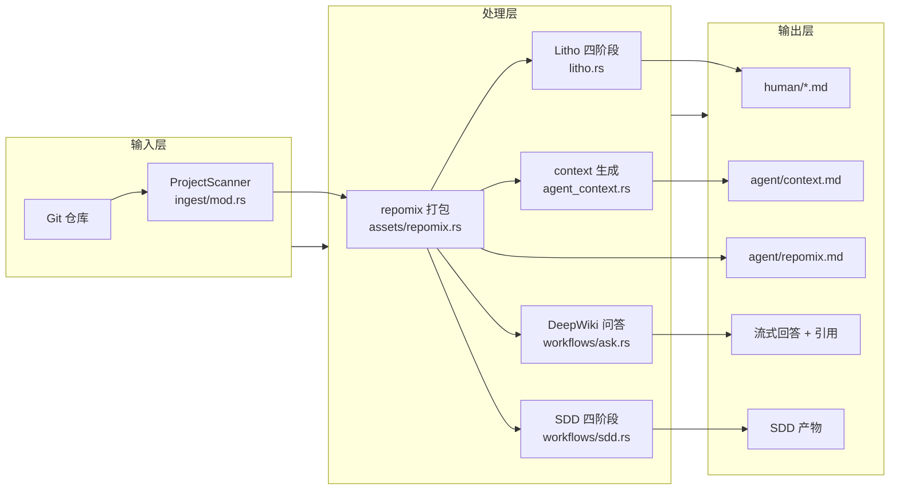
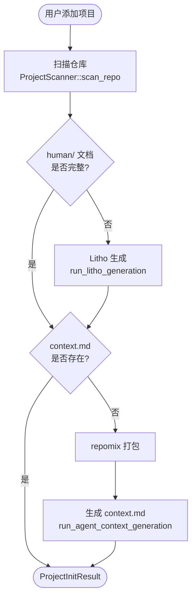
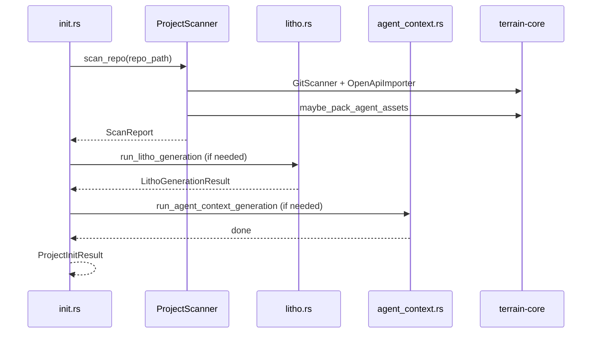
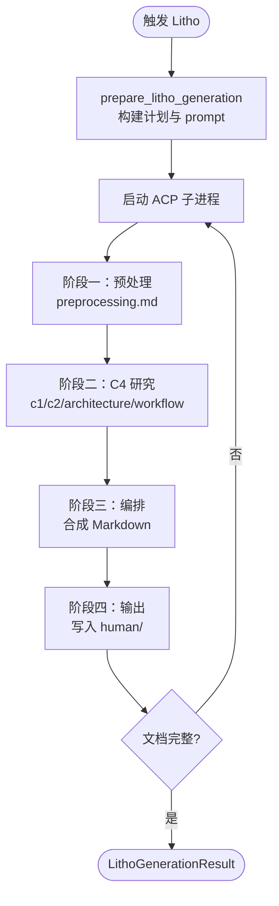
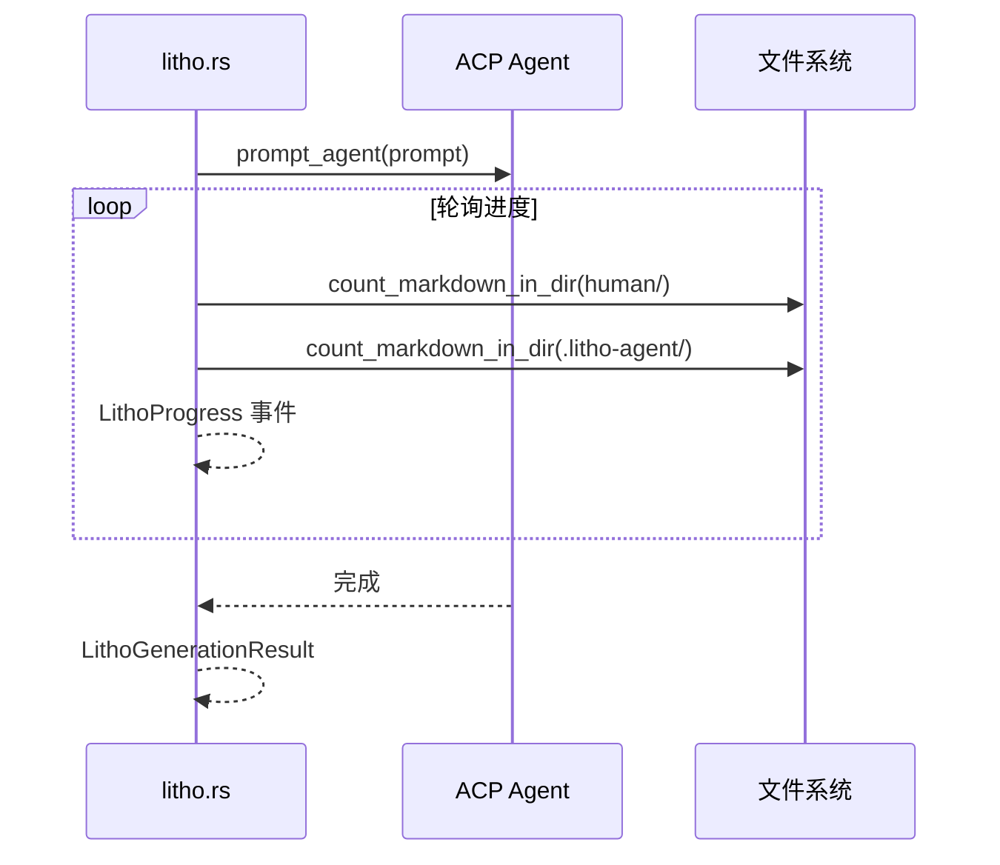
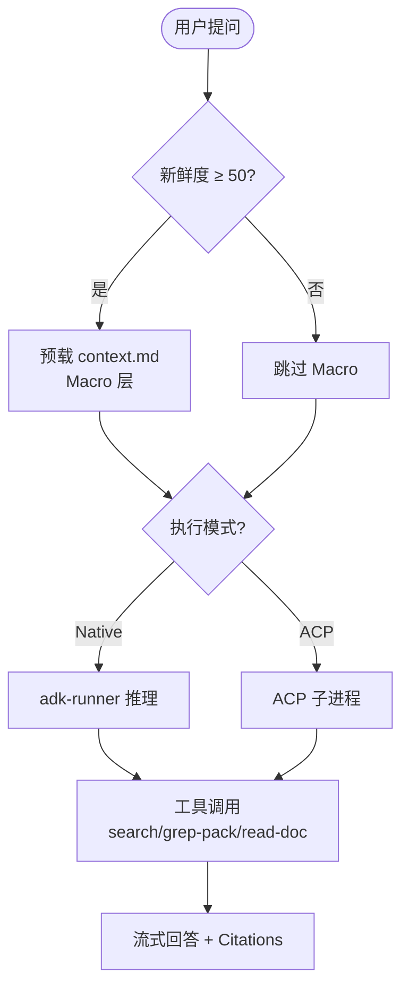

# 核心工作流

## 1. 工作流概述

### 1.1 系统架构与工作流理念

Terrain 的工作流可以用"汽车生产线"来理解：原材料（Git 仓库源码）进厂后，先在预处理车间拆解分类（扫描与 repomix 打包），再在各专业车间加工（Litho 文档研究、DeepWiki 问答、SDD 开发），最后质检出厂（新鲜度追踪确保知识资产与代码同步）。每条流水线都有明确的入口函数、进度回调和产物路径，支持中断恢复。

### 1.2 核心执行路径

---

## 2. 主要工作流

### 2.1 项目初始化

项目初始化是 Terrain 的"一站式 onboarding"——从新仓库到完整知识资产，一次调用搞定。

#### 流程图

#### 时序图

#### 阶段说明

| 阶段 | 执行者 | 输入 | 输出 | 说明 |
|------|-------|------|------|------|
| 扫描 | `ProjectScanner` | Git 仓库路径 | `ScanReport` | Git 元数据 + OpenAPI + repomix |
| Litho | `litho.rs` | 仓库 + skill 目录 | `human/*.md` | ACP 四阶段，可跳过若已完整 |
| Context | `agent_context.rs` | Litho 文档 + repomix | `agent/context.md` | ≤16 KiB 压缩摘要 |

入口：`run_project_initialization`（`crates/terrain-agent/src/workflows/init.rs:62`）

### 2.2 Litho C4 文档生成

#### 流程图

#### 时序图

入口：`run_litho_generation`（`crates/terrain-agent/src/litho.rs`），轮询间隔 3s（稳定后 6s），墙钟超时默认 45 分钟。

### 2.3 DeepWiki 知识问答

#### 流程图

入口：`ask_knowledge`（`crates/terrain-agent/src/workflows/ask.rs`），超时 1200 秒（`chat/mod.rs:32`）。

### 2.4 SDD 标准化开发

| 阶段 | 执行引擎 | 产物 | 入口 |
|------|---------|------|------|
| Requirements | Native LLM | `1.requirements.md` | `run_sdd_phase(Requirements)` |
| Tech Design | Native LLM | `2.tech-design.md` | `run_sdd_phase(TechDesign)` |
| CodeGen | ACP Agent | `3.implementation.md` + 代码变更 | `run_sdd_phase(CodeGen)` |
| Code Review | Native LLM | 审查报告 | `run_sdd_phase(CodeReview)` |

入口：`run_sdd_phase`（`crates/terrain-agent/src/workflows/sdd.rs`），产物存储在 `~/.terrain/sdd/{project}/sessions/{id}/outputs/`。

---

## 3. 并发与异步模型

Terrain 全栈基于 Tokio 异步运行时。关键并发点：

- **Litho ACP 子进程**：`tokio::spawn` 启动，`select!` 轮询与超时（`litho.rs:97-119`）
- **ChatEngine 流式推理**：Native 后端通过 adk-runner 流式返回 token
- **Tauri 命令**：全部 `async fn`，不阻塞 UI 线程
- **初始化进度**：`ProgressEvent` 回调链，桌面 UI 通过事件流更新进度条

设计哲学是"稳优先而非快优先"——Litho 轮询有退避策略，ACP 有墙钟超时保护，Ask 有 `fallback_search_reply` 降级。

## 4. 错误处理策略

核心理念：**局部失败不应导致全局中断**。

- 初始化中 Litho 失败记录 `notes` 继续生成 context（`init.rs:24-38`）
- Ask 模式 LLM 不可用时降级为纯搜索回复（`fallback_search_reply`）
- 新鲜度 < 50 时跳过 Macro 预载而非报错（`freshness.rs:19`）
- Litho 超时 abort ACP 子进程并报告已生成文档数（`litho.rs:112-118`）
- ACP 不可用时初始化跳过 context 生成并提示配置（`init.rs:28-38`）
