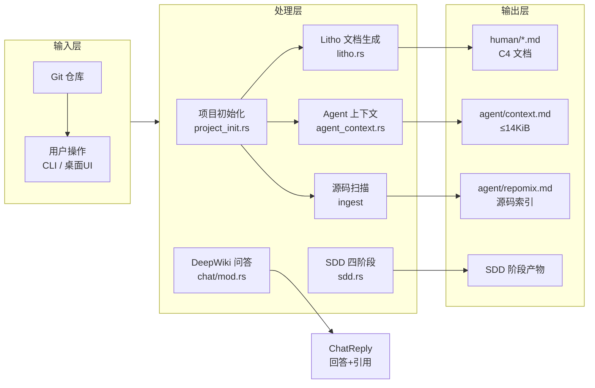
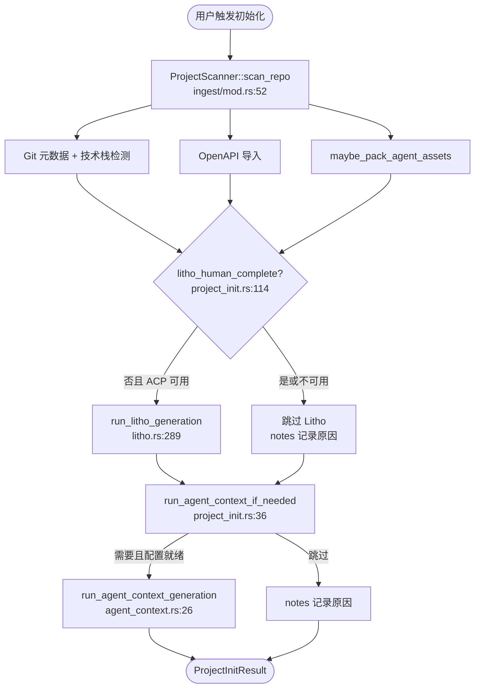
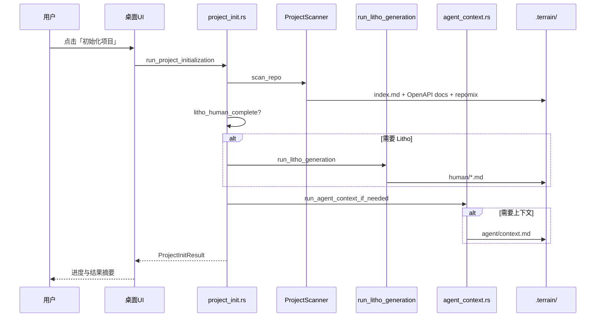
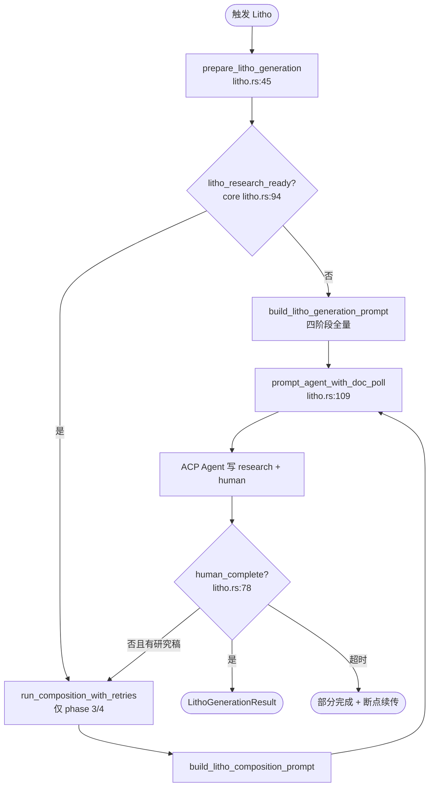
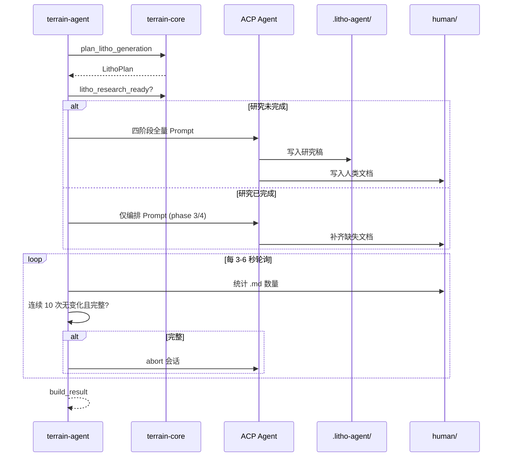
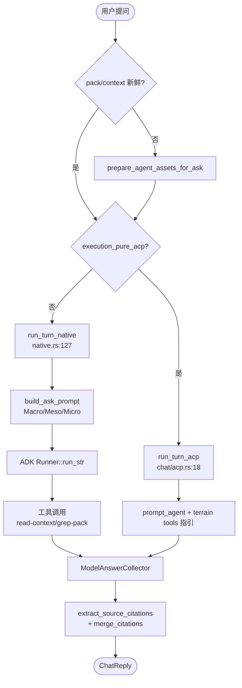
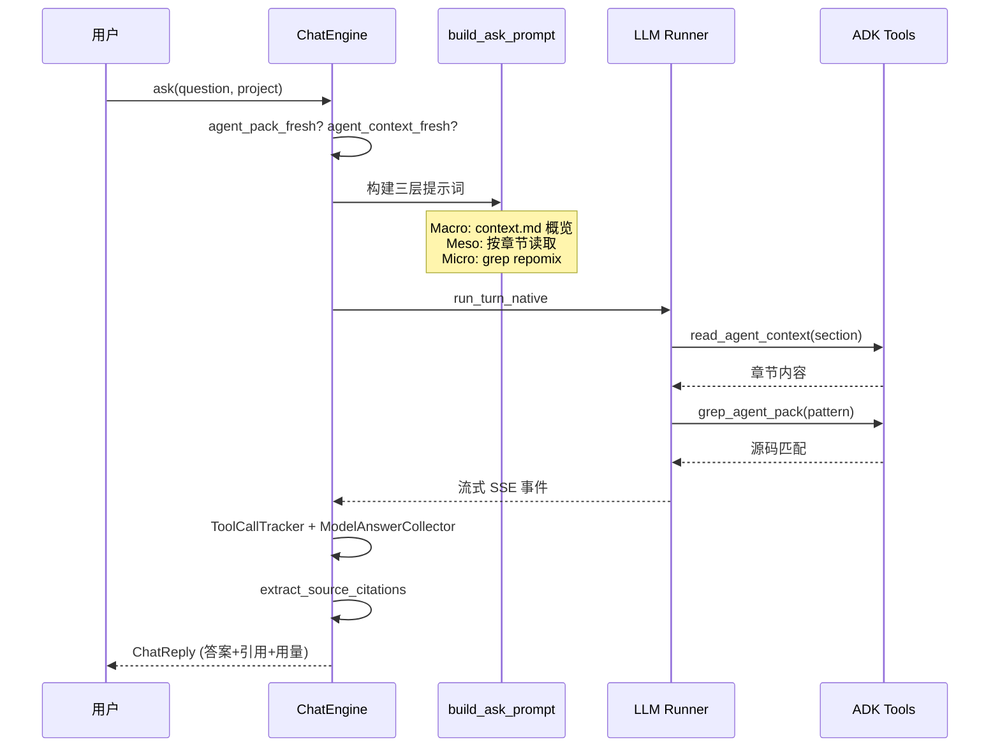
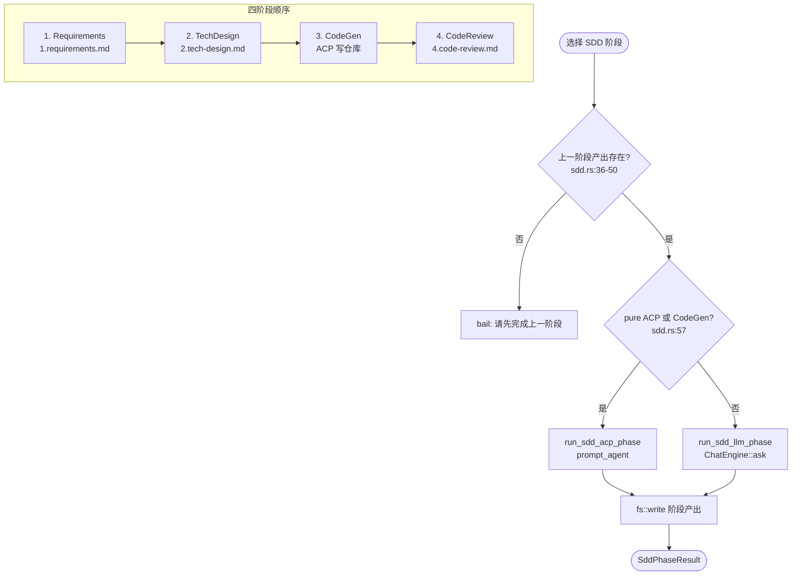
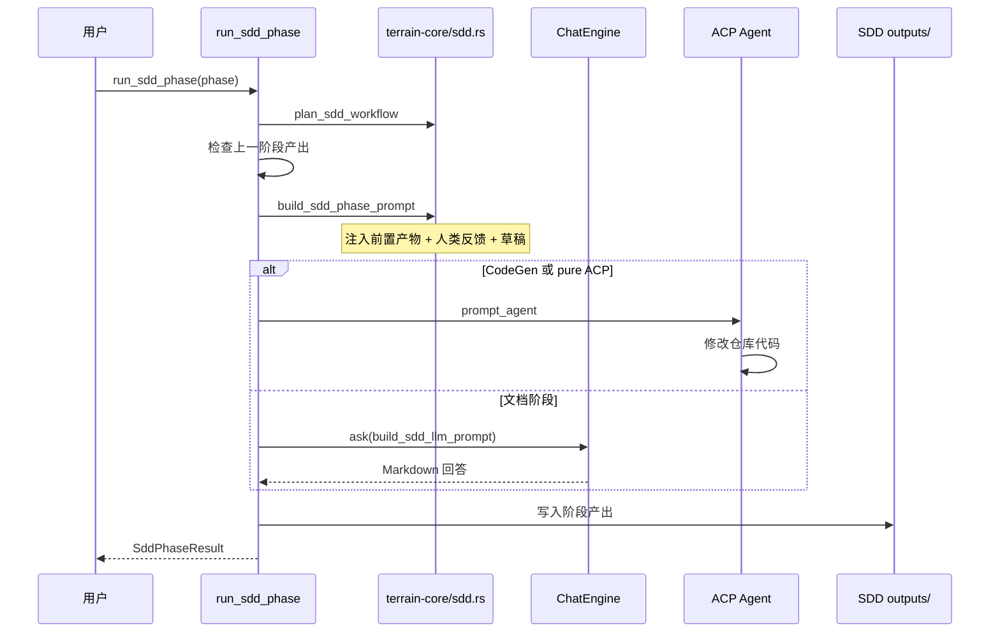

# 核心工作流

## 1. 工作流概述

### 1.1 系统架构与工作流理念

Terrain 的工作流可以用一条「知识工厂流水线」来理解：原材料（Git 源码）进厂后，先在预处理车间拆解分类（源码扫描），再分别进入 Litho 文档车间和 Agent 压缩车间，最终产出人类可读文档和 AI 友好上下文两条产品线。控制室（`terrain-agent`）根据任务特性调度 LLM 工人或 ACP 工人，而质检站（新鲜度追踪）持续监控知识资产与源码的同步程度。

工作流设计的核心理念是「局部失败不应导致全局中断」：Litho 失败不阻断 repomix 扫描；Agent 上下文在 LLM/ACP 未配置时记录 notes 而非 panic；研究产物持久化在 `.litho-agent/` 支持断点续传。每条主流程都有明确的入口函数、跳过条件和降级策略。

### 1.2 核心执行路径

下图展示了 Terrain 四条主工作流在系统中的位置关系。

---

## 2. 主要工作流

### 2.1 项目初始化

项目初始化解决的是「如何把一个新仓库接入 Terrain」的问题。它是用户 onboarding 的核心路径，按固定顺序串联扫描、Litho 与 Agent 上下文，每步都有跳过条件。

#### 流程图

#### 时序图

#### 阶段说明

| 阶段 | 执行者 | 输入 | 输出 | 说明 |
|------|-------|------|------|------|
| 仓库扫描 | `ProjectScanner` | Git 仓库路径 | `index.md`、OpenAPI 文档、repomix | 注册 slug、写 sync_meta |
| Litho 生成 | `run_litho_generation` | 仓库 + Litho skill | `human/*.md`、`.litho-agent/` | 已有完整文档则跳过 |
| Agent 上下文 | `run_agent_context_generation` | 人类文档 + repomix | `agent/context.md` | Litho 刚跑完时 force_refresh |
| 结果汇总 | `run_project_initialization` | 各阶段状态 | `ProjectInitResult` | notes 记录非致命失败 |

---

### 2.2 Litho 文档生成

Litho 是 Terrain 将源码转化为 C4 架构文档的四阶段流水线。它不直接在 Rust 里写 Markdown，而是编排外部 ACP Agent 执行预处理→C4 研究→编排→输出，并通过磁盘轮询检测完成。

#### 流程图

#### 时序图

#### 阶段说明

| 阶段 | 执行者 | 输入 | 输出 | 说明 |
|------|-------|------|------|------|
| 计划 | `plan_litho_generation` | skill 目录、仓库路径 | `LithoPlan` | 解析输出与工作区路径 |
| 预处理 | ACP Agent | 源码目录 | `preprocessing.md` | 技术栈与结构分析 |
| C4 研究 | ACP Agent | 预处理报告 | `c1/c2/architecture/workflow/boundary/database` + `modules/` | 持久化到 `.litho-agent/` |
| 编排输出 | ACP Agent | 研究稿 | `human/*.md` | 六份标准人类文档 |
| 质检重试 | `run_composition_with_retries` | 缺失文档列表 | 补齐文件 | 最多 3 次重试 |

---

### 2.3 DeepWiki 问答

DeepWiki 问答是 Terrain「Ask」体验的核心，通过三层检索模型让 AI 回答架构问题时有据可查。

#### 流程图

#### 时序图

#### 阶段说明

| 阶段 | 执行者 | 输入 | 输出 | 说明 |
|------|-------|------|------|------|
| 资产保鲜 | `ChatEngine::ask` | 项目 slug | 新鲜 pack/context | 过期则自动重建 |
| 提示词构建 | `build_ask_prompt` | 问题 + freshness | 三层规则 prompt | 低分时 withheld 宏观层 |
| 推理执行 | Native/ACP 后端 | prompt | 流式回答 | 1200 秒超时保护 |
| 引用提取 | `extract_source_citations` | 回答文本 | `SourceCitation[]` | 合并工具调用引用 |

---

### 2.4 SDD 四阶段工作流

SDD（Structured Design & Development）把「从需求到代码」拆成四个有序阶段，每阶段产出 Markdown 落盘，下一阶段自动读取前置产物。

#### 流程图

#### 时序图

#### 阶段说明

| 阶段 | 执行者 | 输入 | 输出 | 执行方式 |
|------|-------|------|------|---------|
| Requirements | `run_sdd_llm_phase` | 用户需求描述 | `1.requirements.md` | Native LLM |
| TechDesign | `run_sdd_llm_phase` | 需求文档 + Litho 人类文档 | `2.tech-design.md` | Native LLM |
| CodeGen | `run_sdd_acp_phase` | 设计文档 + repomix | 代码变更 + notes | ACP Agent |
| CodeReview | `run_sdd_llm_phase` | 代码变更摘要 | `4.code-review.md` | Native LLM |

---

## 3. 并发与异步模型

Terrain 全系统基于 Tokio 异步运行时，但不同工作流的并发策略各有侧重。

**Chat 流式输出**：`Runner::run_str` 以 SSE 模式消费 LLM 事件流，`tokio::time::timeout` 包裹 1200 秒超时。`ToolCallTracker` 在流式 FunctionCall 碎片间去重，`ModelAnswerCollector` 在工具执行后选取最终答案段落。

**Litho 轮询与早停**：`tokio::select!` 在 ACP 会话与定时轮询间切换。有产出变化时 3 秒一轮，稳定后降至 6 秒。完整文档集落盘且连续 10 次无变化时主动 abort 会话。

**项目初始化串行**：扫描 → Litho → 上下文严格顺序执行，因为上下文 prompt 依赖人类文档摘要与 pack 元数据。前一步的产出是后一步的输入，并行会导致竞态。

**新鲜度缓存**：`resolve_freshness_summary` 在 HEAD/dirty 未变时直接返回账本缓存，UI 轮询不会重复触发多次 git 子进程。

**工具会话缓存**：`tool_session_cache.rs` 避免同会话重复读取相同 context 章节，减少 LLM 工具调用往返。

---

## 4. 错误处理策略

Terrain 的错误处理核心理念是「局部失败不应导致全局中断」，同时在关键路径上保持严格门禁。

**优雅降级**：
- 项目初始化中 Litho 失败不阻断 repomix 扫描，notes 数组记录原因
- Agent 上下文生成在 LLM/ACP 未配置时记录 notes 而非 panic
- 无 `opencode` feature 时 `build_acp_config` 编译期降级

**严格门禁**：
- SDD 阶段 `phase.order() > 0` 时检查上一阶段输出文件是否存在，防止跳步执行
- `agent_context_ready` 要求 body ≥500 字符且至少 4 个 `##` 章节
- `litho_human_complete_with_research` 校验人类文档集完整性

**断点续传**：
- Litho 研究产物持久化在 `.litho-agent/`，`litho_research_ready` 为真时跳过研究直接编排
- Litho 超时（默认 45 分钟）后返回部分完成状态，支持续跑
- SDD 阶段完成度由文件存在性判定，重启后状态自然恢复

**新鲜度降权**：
- `freshness_score < 50` 时 Agent 降权信任而非拒绝服务
- Ask prompt 注入 `format_freshness_trust_block` 强制规则
- 低分时 withheld 宏观架构预加载，引导 Agent 走 grep 验证路径
