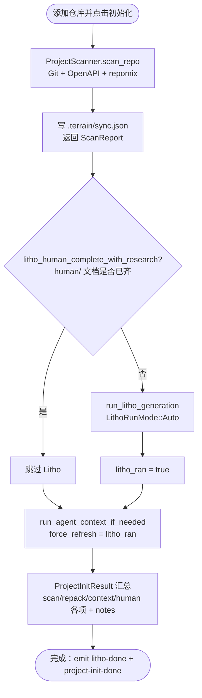
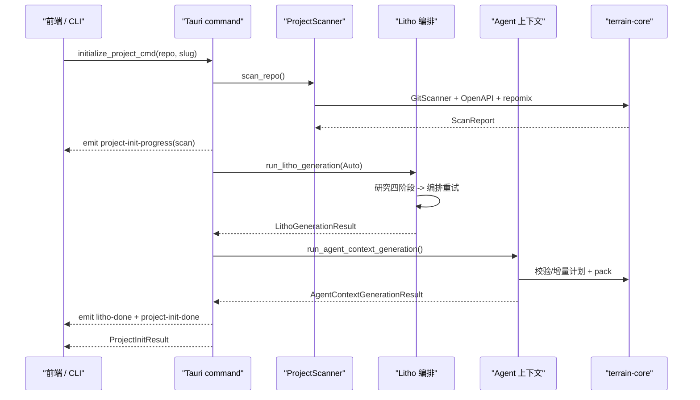
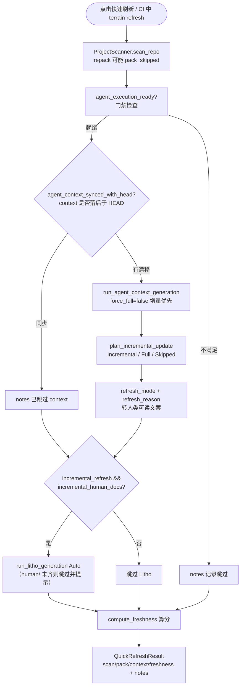
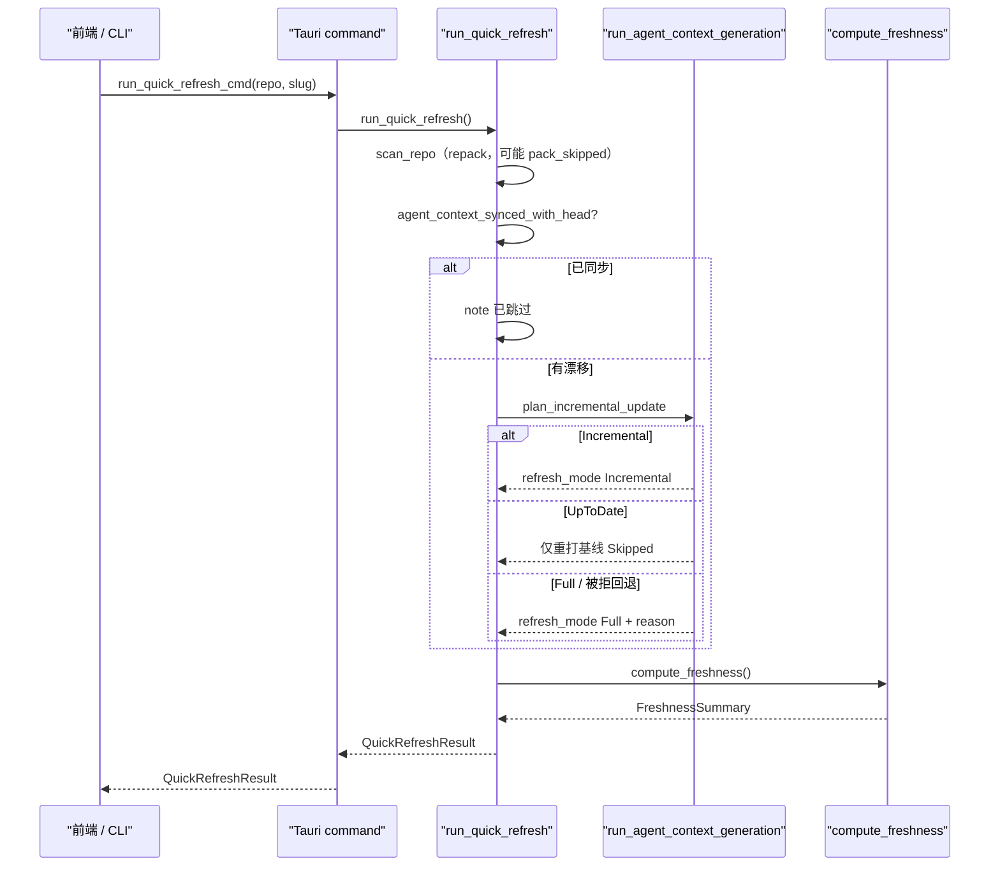
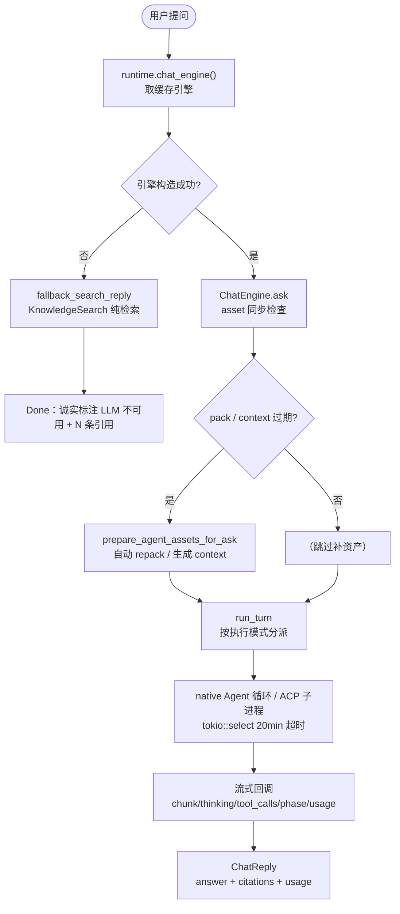
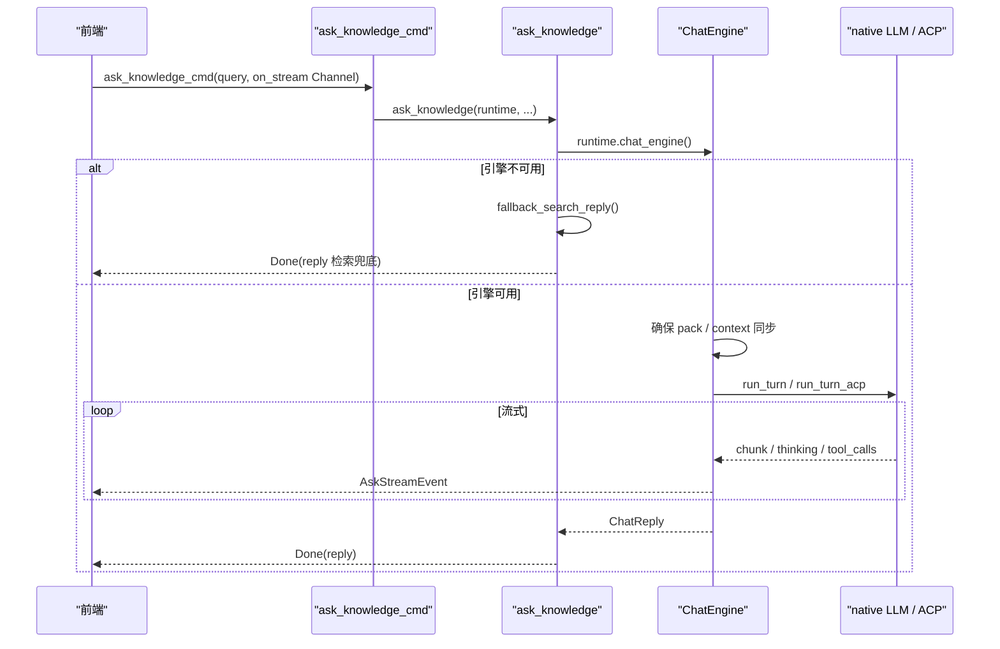
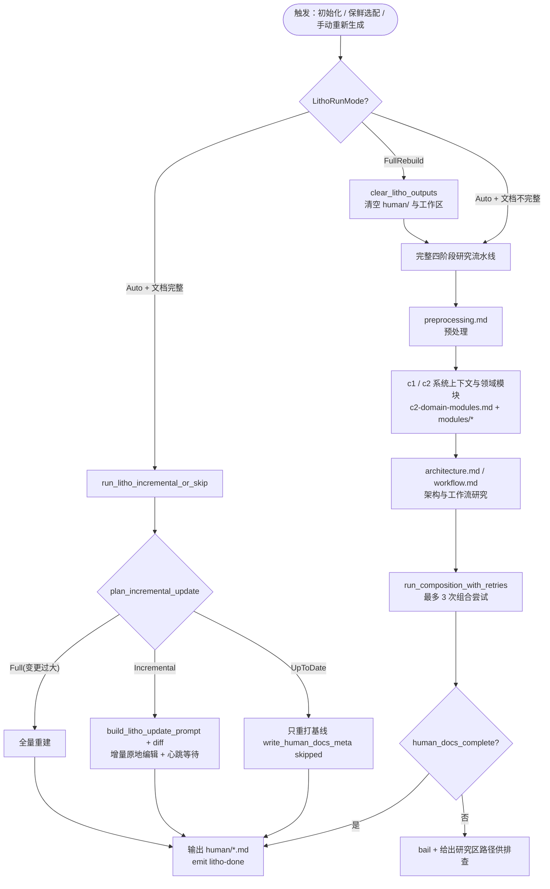
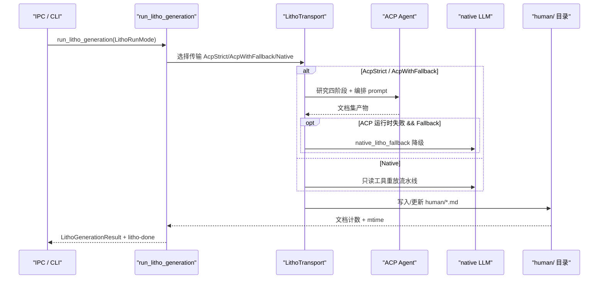
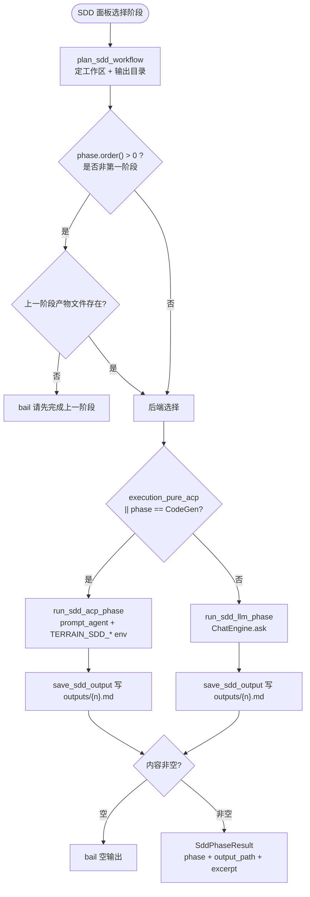
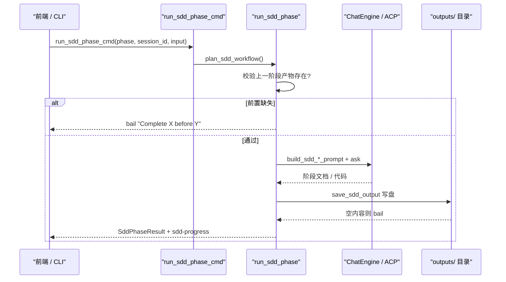

# 核心工作流

## 1. 工作流概述

### 1.1 系统架构与工作流理念

Terrain 的工作流可以这样理解：它是一座**文档工厂**。原料是**你的 Git 仓库**；`terrain-core` 是**离线车间**（扫描、打包、检索、记账，不需要外部能源）；`terrain-agent` 是需要外部能源（LLM/ACP）的**装配线**（写人类文档、写 Agent 上下文、回答问题、跑 SDD）；`.terrain/` 是**仓库内的成品库与半成品架**——成品（`human/`、`agent/context.md`）入库，半成品（`.litho-agent/` 研究稿、会话 JSON、基线 meta）留在架上等下次续做；前端则是**订单看板**，用来下订单（命令）和收进度（事件流）。

一条产线的骨架可以画成三层的漏斗：入口接收意图，中间是"过滤前置条件 → 增量优先"的决策走廊，出口把结果以文件的形式落盘并把进度事件抛给 UI。**过滤器的本质**是每个阶段都用"是否需要跑"的前置条件过滤掉冗余工作——已同步的跳过、不完整才生成——这是 Terrain 能在分钟级完成保鲜、而不必每次都付全量生成成本的根本原因。

```mermaid
flowchart LR
    subgraph 输入层
        A[{用户意图<br/>初始化/刷新/问答/SDD}] --> B[{命令封装<br/>CLI / IPC}]
    end
    subgraph 处理层
        C[{过滤前置条件<br/>是否已同步/就绪}] --> D[{增量优先<br/>Incremental 或 Full 或 Skipped}]
        D --> E[{执行后端<br/>native LLM / ACP / 离线}]
    end
    subgraph 输出层
        F[{落盘到 .terrain/ 或 ~/.terrain/}] --> G[{进度事件 + notes + 结果 JSON}]
    end
    输入层 --> 处理层 --> 输出层
```

### 1.2 核心执行路径

Terrain 有五条主要产线，每条产线都有明确的入口函数、触发方式与后端依赖。它们共享同一套过滤器骨架，但取舍刻意分歧——初始化要齐活儿（scan → Litho → context），快速保鲜就刻意跳过最贵的 Litho，SDD 对阶段顺序绝不妥协。

| # | 工作流 | 入口函数 | 触发方式 | 是否调用 LLM/ACP |
|---|--------|----------|----------|------------------|
| 1 | 项目初始化 | `run_project_initialization`（`terrain-agent/src/workflows/init.rs:98`） | 添加仓库 / 点击初始化；IPC `initialize_project_cmd` | 是（Litho + 上下文） |
| 2 | 快速保鲜 | `run_quick_refresh`（`terrain-agent/src/workflows/quick_refresh.rs:22`） | 点击快速刷新；IPC `run_quick_refresh_cmd` | 是（上下文；Litho 可选） |
| 3 | 知识问答 | `ask_knowledge`（`terrain-agent/src/workflows/ask.rs:11`） | DeepWiki 提问；IPC `ask_knowledge_cmd` | 是（可降级为纯检索） |
| 4 | Litho 文档生命周期 | `prepare_litho_generation` / `run_litho_generation`（`terrain-agent/src/litho.rs:121,721`） | 初始化自动 / 保鲜选配 / 手动重新生成 | 是 |
| 5 | SDD 标准化开发 | `run_sdd_phase`（`terrain-agent/src/workflows/sdd.rs:14`） | SDD 面板逐阶段执行；IPC `run_sdd_phase_cmd` | 是（文档阶段 native，CodeGen 强制 ACP） |

依赖关系：**1 → 4 → 3**——先有文档，才能生成上下文，问答效果才好；**2** 是 1 的轻量重复；**5** 消费 1/2 产出的知识资产。

---

## 2. 主要工作流

### 2.1 项目初始化（Init）

#### 流程图

项目初始化是 Terrain 唯一"全量建库"的流程。它的步骤顺序不是随意定的：repack 必须在 context/Litho 之前（两者都需要源码索引当底料），Litho 必须在 context 之前（context 是 Litho 文档的浓缩摘要）。另一个关键细节是，任何可选环节的失败都不会让整条链崩溃——ACP 不可用时 Litho 被跳过并写进 `notes`，流程继续。



#### 时序图

时序图把上图中的阶段调用顺序落到具体组件交互上。`run_agent_context_if_needed` 内部会先做前置门禁（纯 ACP 需 ACP 可用、hybrid 需 LLM ready），任一不满足就只押 notes 静默退出，绝不把失败甩给下游。



#### 阶段说明

| 阶段 | 执行者 | 输入 | 输出 | 说明 |
|------|-------|------|------|------|
| 扫描 + 索引 | `ProjectScanner`（`terrain-core/src/ingest/mod.rs:52-109`） | 仓库路径 + slug | `ScanReport`（含 repomix 包） | 依次跑 GitScanner、OpenApiImporter、maybe_pack_agent_assets |
| 是否需要 Litho | `litho_human_complete_with_research`（`workflows/init.rs:133`） | human/ 目录 + litho 工作区 | 布尔判定 | human/ 已齐则跳过，节省昂贵生成 |
| 生成人类文档 | `run_litho_generation`（`workflows/init.rs:139-172`） | LithoRunMode::Auto + 进度回调 | `LithoGenerationResult` | hybrid/ACP 可用才执行；纯 ACP 且不可用 → notes 提示 |
| 生成/刷新上下文 | `run_agent_context_if_needed`（`workflows/init.rs:16-94`） | context 状态 + force_refresh | `AgentContextGenerationResult` | 先门禁 + 补 pack；`force_refresh = litho_ran` 强制全量 |
| 汇总 | `run_project_initialization` | 各阶段结果 | `ProjectInitResult`（`ipc/workflows.rs:69-79`） | `scan_files_written`、`repack_tokens`、`agent_context_generated`、`human_doc_count`、`litho_ran`、`notes` |

**关键点**：初始化是**幂等**的——已完成的部分会被过滤器跳过，`notes` 逐条说明"跳过/生成/失败原因"。

### 2.2 快速保鲜（Quick Refresh）

#### 流程图

快速保鲜与初始化的差异是**默认跳过 Litho**（Litho 是最慢阶段，只有显式开启 `incremental_human_docs` 才增量更新；`quick_refresh.rs:162-164` 注释："从头生成属于初始化，不属于快速保鲜"）。它的取舍策略是"扫描 + repack + context 增量刷新必须做，Litho 看开关"，并在最后把各种去向（`Incremental/Full/Skipped` + reason）翻译成用户能看懂的一句话。



#### 时序图

保鲜流程把"增量优先"贯彻到底：`plan_incremental_update` 先看基线是否 up-to-date；小改动走增量、改动太大走全量、没有任何变化就只重打基线。若增量回复不合格会被 `reject_incremental_document` 拒绝并回退全量——宁可多花一份全量成本，也不让好文档被烂增量覆盖。



#### 阶段说明

| 阶段 | 执行者 | 输入 | 输出 | 说明 |
|------|-------|------|------|------|
| 扫描 + 重打包 | `scan_repo`（`quick_refresh.rs:34-56`） | 仓库 + slug | repomix 包 / `pack_skipped` | 与 HEAD 同步时 pack 被跳过 |
| 上下文门禁 | `agent_execution_ready`（`quick_refresh.rs:59`） | acp 设置 + model_config | ok/Err | 前置失败只记 notes |
| 上下文增量刷新 | `run_agent_context_generation(force_full=false)`（`quick_refresh.rs:58-160`） | 同步判定 + force_full=false | refresh_mode + reason | 内部 `plan_incremental_update` 三态 |
| 可选 Litho 增量 | `run_litho_generation`（`quick_refresh.rs:165-238`） | `incremental_refresh && incremental_human_docs` | 增量/全量/跳过文案 | human 文档未完整时宁可跳过 |
| 新鲜度 | `compute_freshness`（`quick_refresh.rs:240`） | paths + slug + repo | `FreshnessSummary` | 收尾统一落账 |

### 2.3 知识问答（Ask / DeepWiki）

#### 流程图

Ask 的核心气质是**降级不崩溃**：LLM 不可用就不是错误页，而是纯检索答案。可用路径里，先补资产（pack/context 过期自动生成），再跑一轮对话，把每次增量以事件形式推给前端。



#### 时序图

注意时序图中 `alt` 分支把"引擎可用/不可用"画成两条完全不同的路径——这在架构上意味着 `fallback_search_reply` 与问答共享同一套 `KnowledgeSearch` 引擎，降级不是"偷懒"，而是复用能力。



#### 阶段说明

| 阶段 | 执行者 | 输入 | 输出 | 说明 |
|------|-------|------|------|------|
| 取 ChatEngine | `runtime.chat_engine()`（`ask.rs:21-31`） | Runtime | ChatEngine / Err | 失败即走 `fallback_search_reply` |
| 检索兜底 | `fallback_search_reply`（`ask.rs:79`） | query + KnowledgeSearch | ChatReply（检索答案） | 复用 search 引擎，前 5 条转 `SourceCitation` |
| 资产就绪 | `prepare_agent_assets_for_ask`（`chat/mod.rs:127-146`） | pack/context 同步判定 | 无（同步阻塞） | 发 `PreparingPack` / `PreparingContext` phase |
| 一轮对话 | `run_turn`（`chat/mod.rs:148-203`） | AgentExecution 模式 | 工具/文本增量 | native 走 Agent 循环，acp 走 `run_turn_acp` |
| 流式转发 | `ask.rs:33-76` | on_event 回调 | `AskStreamEvent` 序列 | 以 `Done { reply }` 收尾 |

### 2.4 Litho 人类文档生命周期

#### 流程图

Litho 是 Terrain 最复杂的流程，本质是**"研究 → 编排"的两段式流水线 + 三态生命周期管理**。它的传输层决定"谁来干活"：纯 ACP（`opencode` 子进程）、hybrid 先 ACP 后 native 降级、或纯 native（只有只读路径受限工具）。完整集检测、稳定 tick、墙钟超时构成它的质量围栏。



#### 时序图

传输层的降级是运行时的、可见的：hybrid 模式下 ACP 在运行时失败会自动切到内置 LLM，但**墙钟超时不触发降级**（重跑一遍 45 分钟是错的）。全量生成用 doc_poll 轮询文档数，检测到完整集后连续 10 个稳定 tick 就提前收工；增量用 heartbeat 不做提前完成启发。



#### 阶段说明

| 阶段 | 执行者 | 输入 | 输出 | 说明 |
|------|-------|------|------|------|
| 预备 | `prepare_litho_generation`（`litho.rs:121-152`） | paths + ACP 设置 | `LithoGenerationJob` | 含将注入 subprocess 的 env |
| 生命周期三态 | `LithoRunMode`（`litho.rs:21-38`） | Auto / FullRebuild | 模式选择 | `from_force_refresh(bool)` 生成 |
| 传输选择 | `LithoTransport`（`litho.rs:52-119`） | execution 模式 + ACP 探测 | 三态传输对象 | 降级对用户可见（进度事件 + 日志） |
| 研究流水线 | 四阶段（`LITHO_CORE_RESEARCH_FILES`） | 源码 | `.litho-agent/` 研究稿 | preprocessing → c1/c2 → architecture/workflow |
| 编排重试 | `run_composition_with_retries`（`litho.rs:663-712`） | 研究稿 | 完整 human 文档集 | 最多 `MAX_COMPOSITION_ATTEMPTS=3` 次 |
| 质量围栏 | `await_litho_turn_with_doc_poll` / `with_heartbeat` | 文档数 / 增量心跳 | 提前结束 / 超时 | 3s 轮询 + 10 稳定 tick；45min 墙钟 |

### 2.5 SDD 标准化开发

#### 流程图

SDD 的气质与前两者截然相反——它不信"尽力而为"，只信"流程纪律"。上一阶段产物文件不存在，入口直接拒绝，没有任何通融；四阶段输出文件就是依赖声明。



#### 时序图

后端分派的关键语义：**CodeGen 阶段必须走 ACP**——写代码需要 shell 能力，native 只有只读工具。ACP 路径用 `build_sdd_phase_prompt` + `sdd_acp_config` 把 `TERRAIN_SDD_SKILL` / `TERRAIN_SDD_WORKSPACE` / `TERRAIN_SDD_OUTPUT_DIR` / `TERRAIN_HUMAN_OUTPUT_DIR` 四个环境变量注入子进程。



#### 阶段说明

| 阶段 | 执行者 | 输入 | 输出 | 说明 |
|------|-------|------|------|------|
| 规划工作区 | `plan_sdd_workflow`（`sdd.rs:25-29`） | paths + slug + session_id | `SddPlan` | skill 目录、工作区、输出目录、`skill_ready` |
| 前置校验 | `sdd.rs:31-45` | phase + 上一阶段路径 | ok/bail | `is_file()` 一次 stat |
| 后端选择 | `sdd.rs:52-68` | execution 模式 + phase | ACP/LLM 分派 | `execution_pure_acp || phase == CodeGen` 走 ACP |
| Prompt 构建 | `build_sdd_llm_prompt` / `build_sdd_phase_prompt`（`assets/sdd.rs:311,405`） | 前序工件 + 草稿 + 反馈 | 完整 prompt | LLM 版追加"只回 markdown 将直接落盘" |
| 落盘与校验 | `save_sdd_output`（`assets/sdd.rs:176`） | 输出内容 | outputs/{n}.md | `is_sdd_local_path` 白名单 + 非空校验 |

---

## 3. 并发与异步模型

Terrain 的并发模型可以概括为三条：**入口全 async、长活单独 spawn、共享状态加锁**。Tauri 命令是 `async` 的，前端调用不会阻塞 UI；进度通过 emit 异步回推——因此"初始化 30 分钟"也不会冻结窗口，而是持续显示 `litho-progress`。

- **Tokio 异步模型**：所有工作流入口都是 `async fn`；扫描、打包、LLM 调用、ACP 进程全部 `await`。长任务用 `tokio::spawn` 跑成独立任务，再用 `tokio::select!` 与轮询/心跳竞速：`await_litho_turn_with_doc_poll`（`litho.rs:359-459`）与 `await_litho_turn_with_heartbeat`（`litho.rs:243-270`）。阻塞型工作（ccusage 用量解析）用 `tokio::task::spawn_blocking` 隔离（`src-tauri/src/commands/usage.rs:14`）。
- **共享状态**：`Runtime` 用 `Mutex<Option<Arc<ChatEngine>>>` 缓存引擎、`RwLock<ModelConfig>` 存配置，`Arc` 让多个并发工作流共享同一引擎，设置变更时 `invalidate_chat_engine` 令下次重建。Ask 剧本把回调包进全局 `Mutex`（`ask.rs:19`），事件串行化避免乱序。
- **去重与节流**：`tool_session_cache.rs` 以 `session_id:tool:fingerprint` 为键缓存工具响应，重复调用返回 `duplicate_call: true`；`throttle.rs` 默认 `DEFAULT_CALL_COOLDOWN = 200ms`，`ThrottledLlm`/`ThrottledTool`/`ThrottledLlmStream` 三件套分别包装模型、工具与流。
- **超时墙**：Ask `1200s`、LLM 探测 `12s`、Litho 墙钟 `45min`、文档轮询 `3s/6s`。

## 4. 错误处理策略

Terrain 的容错观可以用一句话概括：**"局部失败不中断全局"，而"坏结果绝不覆盖好资产"**。可选增强阶段失败时降级 + 记 note，主流程照走；一旦涉及写盘，就上最严格的一致性约束。

- **分层错误类型**：核心层用 thiserror 的 `CoreError`（`terrain-core/src/error.rs`，语义化错误如 `InvalidDoc`）；应用/编排层统一 `anyhow::Result` 附加上下文；IPC 边界把错误转成 `String`（`map_err(e.to_string())` / `ipc_string`）返回前端。
- **局部失败不中断全局**：初始化中 ACP 不可用 → 不生成 Litho，仅向 `notes` 追加提示、继续生成上下文（`init.rs:36-56,163-171`）；快速保鲜中上下文刷新失败 → 捕获 `Err(e)` 写 notes、继续算新鲜度（`quick_refresh.rs:127-134,221-228`）；Ask 中引擎不可用 → `fallback_search_reply` 检索兜底。
- **防止"坏结果覆盖好资产"**：`reject_incremental_document` 校验增量结果必须是基线超集，否则先尝试从磁盘恢复 Agent 的就地编辑、再回退全量（`agent_context.rs:124-179`）；全量生成后仍为空则 `bail!` 且明确"原文件保持不变"；上下文需 ≥500 字符且 ≥4 个 `##` 段才算就绪；Litho 组合 3 次重试仍不完整则 bail 并给出研究区路径。
- **超时是保护而非重试信号**：Litho 墙钟超时会 `agent_handle.abort()` 并 bail（`litho.rs:244-250,360-367`）；超时**不**触发 ACP→native 降级——"重跑 45 分钟是错的"。检测到完整文档集但 Agent 迟迟不结束，连续 10 个稳定 tick 后主动结束等待。
- **前置检查与显式报错**：`agent_execution_ready` 在生成前统一校验执行条件；SDD 阶段强制顺序，缺上一阶段产物直接报错并指名阶段；LLM 探测 `PROBE_TIMEOUT=12s`，状态写进 `LlmStatus.ready/message` 供 UI 提示。