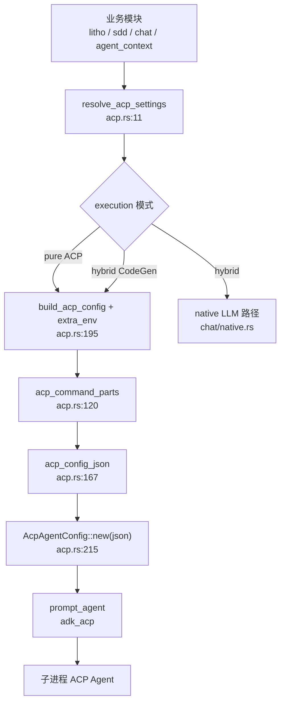

# ACP协议领域

**模块路径**：`crates/terrain-agent/src/acp.rs`  
**生成日期**：2026-07-15

---

## 这个模块在做什么

ACP（Agent Client Protocol）协议模块是 Terrain 与**外部 coding agent**（默认 OpenCode）之间的桥梁。Terrain 擅长知识资产管理与提示词编排，但不打算在进程内复刻完整的文件编辑、终端与多轮 agent 循环——这些重活交给 ACP Agent，通过 stdio JSON 配置启动子进程，用 `adk_acp::prompt_agent` 发送一次性 prompt 并等待完整响应。

可以把 ACP 模块想象成「外包调度台」：Terrain 负责把任务描述、工作目录和环境变量打包好，交给专业的外部 Agent 执行，自己只等结果回来。

---

## 核心功能点

1. **设置解析与命令拼装**——`resolve_acp_settings`（`acp.rs:11-15`）从用户设置加载；`acp_spawn_command`（`33-47` 行）按优先级合并 `command` 字段、`TERRAIN_ACP_COMMAND` 环境变量、或 `binary + args`。

2. **可用性检测**——`acp_available`（`49-53` 行）取命令首 token 检查 PATH；`agent_execution_ready`（`82-107` 行）按执行模式验证 ACP 和/或 LLM 是否就绪。

3. **执行模式分流**——`execution_pure_acp`（`72-74` 行）表示 Litho/SDD/Ask 全走外部 Agent；`execution_uses_native_llm`（`77-79` 行）表示 hybrid——SDD 文档阶段与 Agent 上下文走原生 LLM，CodeGen 等仍走 ACP。

4. **跨平台进程配置**——`acp_command_parts`（`120-156` 行）刻意不用 `shell_words::split`（注释 `117-119` 行）；`acp_config_json`（`167-192` 行）生成 stdio JSON，由 `tokio::process::Command` 直接执行，绕过 shell 转义陷阱。

5. **工作目录与环境注入**——`build_acp_config`（`195-223` 行）合并 PATH、调用方 `extra_env`（如 `TERRAIN_LITHO_WORKSPACE`）、`auto_approve` 与 `working_dir`。

---

## 关键组件

ACP 模块是纯配置与路由层，被 Litho、SDD、Chat、Agent 上下文共同依赖。

| 组件/类型 | 文件路径 | 核心职责 |
|---------|---------|---------|
| `resolve_acp_settings` | `crates/terrain-agent/src/acp.rs:11-15` | 加载用户 ACP 配置 |
| `acp_spawn_command` | `crates/terrain-agent/src/acp.rs:33-47` | 人类可读的启动命令字符串 |
| `acp_available` | `crates/terrain-agent/src/acp.rs:49-53` | 检测 Agent 二进制是否在 PATH |
| `execution_pure_acp` | `crates/terrain-agent/src/acp.rs:72-74` | 判断是否纯 ACP 模式 |
| `execution_uses_native_llm` | `crates/terrain-agent/src/acp.rs:77-79` | 判断是否 hybrid 模式 |
| `agent_execution_ready` | `crates/terrain-agent/src/acp.rs:82-107` | 校验当前模式的后端就绪 |
| `acp_command_parts` | `crates/terrain-agent/src/acp.rs:120-156` | 解析为 (binary, args) 并 resolve 可执行路径 |
| `acp_config_json` | `crates/terrain-agent/src/acp.rs:167-192` | 序列化 stdio ACP 配置 JSON |
| `build_acp_config` | `crates/terrain-agent/src/acp.rs:195-223` | 构建 `adk_acp::AcpAgentConfig` |

---

## 内部数据流

各业务模块调用 ACP 时的共同模式：解析设置 → 拼装 env → 构建 config → `prompt_agent`。

**关键步骤说明**：

1. **Litho 环境变量**：`litho_acp_config` 注入 `TERRAIN_LITHO_SKILL`、`TERRAIN_HUMAN_OUTPUT_DIR`、`TERRAIN_LITHO_WORKSPACE`（`litho.rs:412-421`）。
2. **SDD 环境变量**：`sdd_acp_config` 注入 `TERRAIN_SDD_SKILL`、`TERRAIN_SDD_WORKSPACE`、`TERRAIN_SDD_OUTPUT_DIR`（`sdd.rs:187-198`）。
3. **Ask 环境变量**：`run_turn_acp` 注入 `TERRAIN_ASK_SKILL`、`TERRAIN_KNOWLEDGE_ROOT`、`TERRAIN_PROJECT_SLUG`（`chat/acp.rs:59-76`）。
4. **Feature 门控**：无 `opencode` feature 时 `build_acp_config` panic（`acp.rs:225-232`），编译期剥离 ACP 依赖。

---

## 关键接口与扩展点

- **自定义 Agent**：通过设置 `command` 或 `TERRAIN_ACP_COMMAND` 替换默认 OpenCode 启动方式，无需改 Rust。
- **二进制解析**：`resolve_executable`（`acp.rs:152-154`）尝试定位完整路径，支持非 PATH 安装。
- **auto_approve**：`settings.auto_approve` 默认 true（`acp.rs:216-218`），可关闭以要求用户确认 Agent 工具操作。
- **Ask/Arch Skill 目录**：`default_ask_acp_skill_dir` / `default_agent_arch_acp_skill_dir`（`55-61` 行）解耦 ACP 模式下的 CLI 指引文档。

---

## 与其他模块的交互

| 交互模块 | 方向 | 接口/协议 | 说明 |
|---------|------|---------|------|
| Litho文档生成 | 被依赖 | `build_acp_config` + Litho env | 四阶段文档生成委托外部 Agent |
| SDD工作流 | 被依赖 | `sdd_acp_config` | CodeGen 阶段走 ACP |
| Chat引擎 | 被依赖 | `run_turn_acp` | 纯 ACP 模式问答 |
| Agent上下文 | 被依赖 | `agent_context_acp_config` | 纯 ACP 模式上下文生成 |
| 模型配置 | 依赖 | `AcpSettings` | 执行模式与二进制配置来源 |

---

## 跨模块协作场景

**在 Litho 文档生成中**：本模块负责把研究产物路径和输出目录通过环境变量注入 ACP 子进程，让外部 Agent 读取 `.terrain/.litho-agent/` 并写入 `.terrain/human/`。

**在 SDD CodeGen 阶段中**：`run_sdd_acp_phase` 通过 `sdd_acp_config` 启动 Agent，由外部 Agent 在真实仓库中编辑代码，Terrain 只等待完成信号。

**在 DeepWiki 问答（纯 ACP 模式）中**：`run_turn_acp` 把知识根路径和项目 slug 注入子进程，Agent 通过 `terrain tools` CLI 间接访问三层知识。

---

## 性能考量

- **子进程隔离**：每次 `prompt_agent` 启动独立 ACP 会话，崩溃不影响 Terrain 主进程——以进程创建开销换取稳定性。
- **JSON 配置绕过 shell**：避免 Windows 上 `shell_words` 破坏路径（`acp.rs:117-119、161-166`），减少启动失败重试。
- **PATH 显式传递**：`build_acp_config` 复制当前 `PATH` 到子进程 env（`206-208` 行），防止 GUI 启动的 Terrain 子进程找不到 node/opencode。
- **Hybrid 减负**：`AcpNative` 模式下仅重任务（Litho、CodeGen）走子进程，轻量文档起草用 in-process LLM（`acp.rs:76-79`），降低延迟与资源占用。

---

## 实现亮点

`acp_command_parts` 刻意放弃 shell 分词，改用显式 JSON 配置驱动子进程——这在 Windows 路径含空格、分号 PATH 等场景下显著提升了启动成功率，是跨平台 ACP 集成的关键设计决策。
