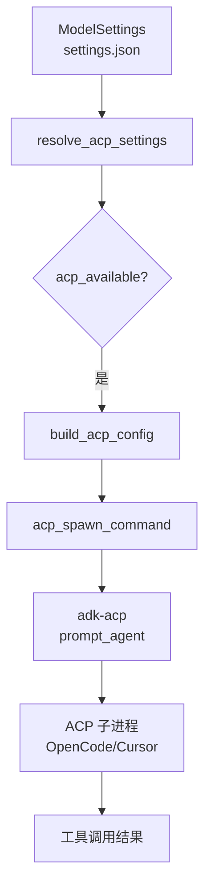

# ACP 协议

**模块路径**：`crates/terrain-agent/src/acp.rs`  
**生成日期**：2026-07-22

---

## 这个模块在做什么

ACP（Agent Client Protocol）协议模块是 Terrain 与外部 Coding Agent（OpenCode、Cursor CLI 等）之间的"通信桥梁"。Terrain 本身不实现完整的 Agent 工具调用能力，而是把重工具调用任务委托给专门的 ACP 子进程——就像把复杂加工外包给专业工厂，自己专注于知识管理和流程编排。

这个模块封装了 ACP 二进制发现、配置构建、子进程启动和可用性检测，让上层工作流（Litho、SDD CodeGen、Ask）无需关心 ACP 协议细节。

## 核心功能点

1. **ACP 配置解析**——`resolve_acp_settings` 从 `ModelSettings` 提取 ACP 二进制路径、参数和执行模式。
2. **子进程启动**——`acp_spawn_command` 构建完整的 ACP 启动命令，`build_acp_config` 生成 `AcpAgentConfig`。
3. **可用性检测**——`acp_available` 检测配置的 ACP 二进制是否可执行。
4. **执行模式判断**——`execution_uses_native_llm`、`execution_pure_acp`、`execution_uses_acp` 根据 `AgentExecution`/`AskExecution` 枚举路由。
5. **Windows 补丁**——`agent-client-protocol-tokio-patched` 隐藏 CREATE_NO_WINDOW，避免闪黑窗口。

## 关键组件

| 组件/类型 | 文件路径 | 核心职责 |
|---------|---------|---------|
| `resolve_acp_settings` | `acp.rs` | 解析 ACP 配置 |
| `acp_spawn_command` | `acp.rs` | 构建启动命令字符串 |
| `build_acp_config` | `acp.rs` | 生成 adk-acp 配置 |
| `acp_available` | `acp.rs` | 检测 ACP 可用性 |
| `AcpSettings` | `settings.rs` | ACP 配置结构 |
| `AgentExecution` | `settings.rs` | 执行模式枚举 |
| tokio patch | `crates/agent-client-protocol-tokio-patched/` | Windows 控制台隐藏 |

## 内部数据流

## 关键接口与扩展点

- `DEFAULT_ACP_BINARY = "opencode"`：默认 ACP 二进制
- `DEFAULT_ACP_ARGS`：默认启动参数
- `AgentExecution` 枚举：`AcpNative`（混合）、`AcpOnly`、`NativeOnly`
- `AskExecution` 枚举：控制 Ask 模式的执行策略

## 与其他模块的交互

| 交互模块 | 方向 | 接口/协议 | 说明 |
|---------|------|---------|------|
| litho.rs | 被调用 | `acp_spawn_command` | Litho ACP 生成 |
| chat/acp.rs | 被调用 | `build_acp_config` | Ask ACP 模式 |
| workflows/sdd | 被调用 | ACP 配置 | SDD CodeGen |
| settings.rs | 依赖 | `AcpSettings` | 配置来源 |

## 跨模块协作场景

**在 Litho 生成中**：`prepare_litho_generation` 调用 `acp_spawn_command` 获取命令，`run_litho_generation` 通过 `prompt_agent` 启动 ACP 子进程执行四阶段流水线。

**在 SDD CodeGen 中**：CodeGen 阶段强制使用 ACP 模式，让外部 Agent 直接修改仓库文件。

## 性能考量

- ACP 子进程启动有 ~1-2s 固定开销
- Litho 使用长生命周期 ACP 会话（轮询至完成），避免重复启动
- Windows patch 消除每次调用的控制台闪烁

## 实现亮点

本地 patch `agent-client-protocol-tokio` 解决 Windows 平台体验问题，体现了"先修用户体验、再等上游"的务实工程态度。
