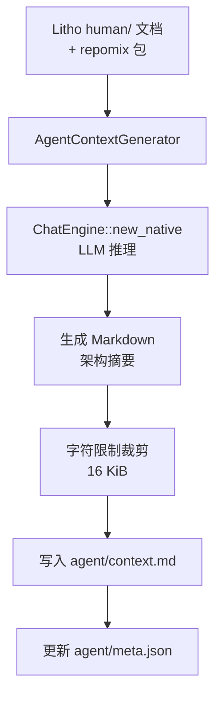

# Agent 上下文

**模块路径**：`crates/terrain-agent/src/agent_context.rs`  
**生成日期**：2026-07-22

---

## 这个模块在做什么

Agent 上下文模块负责生成 `agent/context.md`——这是 Terrain 知识体系中面向 AI 的"压缩地图"。如果说 `human/` 文档是给人类读的完整技术文章，那么 `context.md` 就是给 Agent 的"14 KiB 速查卡"：包含项目概览、架构设计、模块地图和代码映射索引，让 Agent 在几秒内建立对项目的宏观理解。

这个模块的存在解决了 AI 助手"上下文窗口有限"的核心矛盾：不可能把整个代码库塞进 prompt，但 Agent 又需要足够的架构认知来做出正确决策。`context.md` 就是这个平衡点。

## 核心功能点

1. **上下文生成**——`run_agent_context_generation` 调用 LLM 基于 Litho 文档和 repomix 包生成压缩架构摘要。
2. **存在性检测**——`agent_context_exists` 检查 `context.md` 是否已生成且有效。
3. **字符限制**——生成结果受 `AGENT_CONTEXT_SAVE_MAX_CHARS = 16 * 1024`（`context_layers.rs:6`）硬限制。
4. **分段结构**——输出按 `##` 标题分段，支持 `read-context --section` 按需读取。
5. **AgentContextGenerator**——`context_generator.rs` 封装生成逻辑和 prompt 构建。

## 关键组件

| 组件/类型 | 文件路径 | 核心职责 |
|---------|---------|---------|
| `run_agent_context_generation` | `agent_context.rs` | 主入口，编排生成流程 |
| `AgentContextGenerator` | `context_generator.rs` | 生成器封装 |
| `agent_context_exists` | `agent_context.rs` | 检测 context 是否存在 |
| `ContextSection` | `context_layers.rs:15` | 分段数据结构 |
| `ContextOverview` | `context_layers.rs:21` | 宏观概览结构 |
| `split_context_sections` | `context_layers.rs:31` | Markdown 分段解析 |
| `agent_context_ready` | `terrain-core/assets/agent_context.rs` | 就绪状态检测 |

## 内部数据流

## 关键接口与扩展点

- Macro 层预载限制：`AGENT_CONTEXT_ASK_OVERVIEW_MAX_CHARS = 4500`（`context_layers.rs:9`）
- 工具分段读取：`AGENT_CONTEXT_TOOL_SECTION_MAX_CHARS = 3500`（`context_layers.rs:12`）
- `is_macro_section`：识别概览/架构/模块地图等宏观段落

## 与其他模块的交互

| 交互模块 | 方向 | 接口/协议 | 说明 |
|---------|------|---------|------|
| chat/mod.rs | 依赖 | `ChatEngine::new_native` | LLM 推理 |
| workflows/init | 被调用 | `run_agent_context_generation` | 初始化流程 |
| context_layers | 依赖 | 分段/限制常量 | 层级定义 |
| workflows/ask | 消费 | context.md 预载 | Ask Macro 层 |

## 跨模块协作场景

**在项目初始化中**：扫描和 Litho 完成后，`init.rs` 检查 `agent_context_ready`，若缺失则调用 `run_agent_context_generation`。

**在 DeepWiki 问答中**：新鲜度 ≥ 50 时，ChatEngine 预载 `context.md` 的 Macro 层（前 4500 字符）作为系统上下文。

## 性能考量

- 16 KiB 硬限制确保 Macro 预载不消耗过多 token
- 分段读取避免一次性加载全文
- 依赖 Litho 文档质量——context 生成效果很大程度上取决于 human/ 文档的完整性

## 实现亮点

三层检索中 Macro 层的精确字符预算控制（4500 预载 + 3500 分段读取），在"足够宏观"和"节省 token"之间取得平衡。
