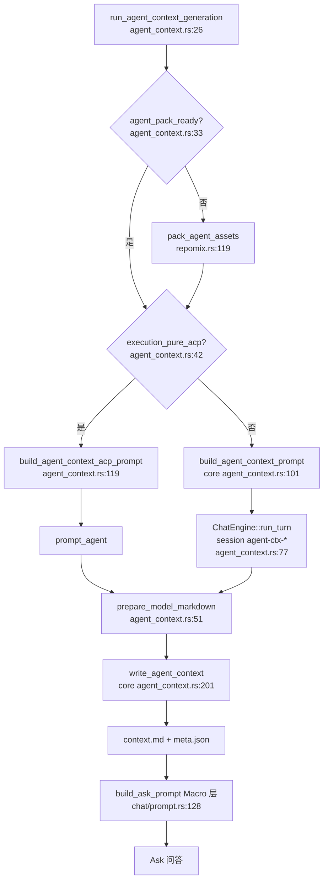

# Agent上下文领域

**模块路径**：`crates/terrain-core/src/assets/agent_context.rs` + `crates/terrain-agent/src/agent_context.rs`  
**生成日期**：2026-07-15

---

## 这个模块在做什么

Agent 上下文模块负责生成并维护 `agent/context.md`——一份**面向 AI Agent 的架构速查手册**，与 Litho 人类文档互补：Litho 写给人看的长文，context.md 写给 Agent 看的紧凑宏观层（项目概览、模块地图、核心流程、代码映射索引等），严格限制体积、禁止粘贴大段源码。

模块横跨 `terrain-core`（prompt 契约、就绪判定、分层读取、持久化）与 `terrain-agent`（调用 LLM 或 ACP 生成、与 Chat 引擎共享 `run_turn` 路径）。Ask 模式下的 Macro/Meso/Micro 三层检索策略，正是围绕这份 context 设计的。

---

## 核心功能点

1. **就绪与新鲜度启发式**——`agent_context_ready`（`agent_context.rs:17-29`）要求 body ≥500 字符且至少 4 个 `##` 章节；`agent_context_fresh`（`32-57` 行）还要求 Git 干净且 `baseline_git_head` 与当前 HEAD 一致。

2. **生成 Prompt 拼装**——`build_agent_context_prompt`（`101-192` 行）预加载 agent-arch skill 摘录、项目索引、repomix 目录树、人类 `1.概述.md` 摘要、以及 `terrain-meta.json` 收集结果，并硬性要求 ≤14000 字符产出。

3. **分层读取契约**——`context_layers.rs` 定义 Macro 预加载上限 4500 字符（`AGENT_CONTEXT_ASK_OVERVIEW_MAX_CHARS`，`9` 行）、工具分段上限 3500 字符（`12` 行）、持久化上限 16 KiB（`6` 行）；`build_context_overview` 供 Ask prompt 注入。

4. **双通道生成**——`run_agent_context_generation`（`agent_context.rs:26-66`）在 `execution_pure_acp` 时走 `run_agent_context_acp`（`94-107` 行），否则用 `ChatEngine::run_turn` + `build_agent_context_prompt`（`68-91` 行）。

5. **持久化与规范化**——`write_agent_context`（`core agent_context.rs:201-244`）经 `prepare_model_markdown`、`normalize_context_headings`（去掉 `## 1.` 编号）、`enforce_context_max_size` 后落盘，并写 `AgentContextMeta` sidecar。

6. **Ask 集成**——`build_ask_prompt`（`chat/prompt.rs:128-160`）在 freshness 允许时预加载 macro overview；否则 withheld 并提示用户运行「快速保鲜」。

---

## 关键组件

Agent 上下文生成与消费链路涉及 core 契约层、agent 执行层与 chat 注入层。

| 组件/类型 | 文件路径 | 核心职责 |
|---------|---------|---------|
| `agent_context_ready` | `crates/terrain-core/src/assets/agent_context.rs:17-29` | 检测 context.md 是否达到可用阈值 |
| `agent_context_fresh` | `crates/terrain-core/src/assets/agent_context.rs:32-57` | Git 基准比对判断是否需要重生 |
| `build_agent_context_prompt` | `crates/terrain-core/src/assets/agent_context.rs:101-192` | 原生/ACP 共用的生成提示词 |
| `write_agent_context` | `crates/terrain-core/src/assets/agent_context.rs:201-244` | 规范化、限容、写盘与 meta |
| `read_agent_context_status` | `crates/terrain-core/src/assets/agent_context.rs:59-99` | 返回路径、摘要、章节数等状态 |
| `split_context_sections` | `crates/terrain-core/src/assets/context_layers.rs:31-66` | 按 `##` 标题拆分 body |
| `build_context_overview` | `crates/terrain-core/src/assets/context_layers.rs` | 构建 Ask Macro 层概览 |
| `run_agent_context_generation` | `crates/terrain-agent/src/agent_context.rs:26-66` | 生成流程主编排 |
| `build_agent_context_acp_prompt` | `crates/terrain-agent/src/agent_context.rs:119-153` | ACP 模式追加 CLI 指引 |
| `agent_context_acp_config` | `crates/terrain-agent/src/agent_context.rs:156-187` | 注入 TERRAIN_AGENT_* 环境变量 |

---

## 内部数据流

从触发增长到 Ask 消费，context.md 经历「依赖检查 → 生成 → 分层 → 注入」。

**关键步骤说明**：

1. **Meta 注入**：`collect_project_meta` + `persist_meta_inputs`（`agent_context.rs:130-131`）把开发者声明的模块根、文件输入写入 prompt 的 `## Developer meta` 块。
2. **特殊 session**：`session_id = agent-ctx-{slug}`（`agent_context.rs:75`）触发 `run_turn_native` 跳过 `build_ask_prompt`（`native.rs:138-142`），避免 Ask 规则污染生成任务。
3. **标题规范化**：`normalize_context_headings`（`agent_context.rs:195-198`）统一 `## 1. Title` → `## Title`，保证 `read_agent_context(section=…)` 工具契约一致。
4. **Freshness 门控 Ask**：`macro_preload` 为 false 时不注入 overview（`prompt.rs:148-153`），防止过期架构误导回答。

---

## 关键接口与扩展点

- **Skill 契约**：`default_agent_arch_skill_dir` 与预加载 `SKILL.md` 前 6000 字符（`agent_context.rs:116-122`）定义必需章节列表（`168-175` 行），换 skill 即可调整输出结构。
- **terrain-meta.json**：仓库级 `module_roots` 与 inputs（`project_meta.rs`）优先于纯目录推断，适合 monorepo 自定义模块边界。
- **ACP CLI 发现**：ACP prompt 引导用 `terrain tools grep-pack` 而非读 live repo（`agent_context.rs:139-141`），与 Ask ACP 模式一致。
- **调试文件**：`last-agent-context-raw.md` / `sanitized`（`agent_context.rs:50-52`）便于对比模型原文与落盘结果。

---

## 与其他模块的交互

| 交互模块 | 方向 | 接口/协议 | 说明 |
|---------|------|---------|------|
| 知识资产管理 | 依赖 | `pack_agent_assets`、`collect_project_meta` | 生成前确保 repomix 与 meta 就绪 |
| Chat引擎 | 被依赖 | `build_context_overview`、`read_agent_context` | Macro/Meso 层数据来源 |
| ACP协议 | 依赖 | `agent_context_acp_config` | 纯 ACP 模式生成 |
| 新鲜度追踪 | 被依赖 | `agent_context_fresh` | 评分与 Ask 预加载门控 |
| Litho文档生成 | 协作 | `1.概述.md` 摘要 | 生成 prompt 引用人类文档 |

---

## 跨模块协作场景

**在项目初始化中**：扫描与 Litho 完成后，`run_agent_context_generation` 作为收尾步骤产出 `context.md`，与 repomix pack 共同构成 Agent 可用的知识基线。

**在 DeepWiki 问答中**：`build_ask_prompt` 在 freshness ≥50 时预加载 `build_context_overview` 作为 Macro 层；Meso 层通过 `read_agent_context(section)` 工具按需拉取章节。

**在 ACP 工具访问中**：外部 Agent 通过 `terrain tools read-context` 读取与 UI 相同的分层 context，保证跨入口知识一致性。

---

## 性能考量

- **宏观层控体积**：生成硬限 14000 字符、保存硬限 16 KiB（`agent_context.rs:161-162`、`context_layers.rs:6`），确保每次 Ask 预加载不会占满上下文窗口。
- **按需 Meso/Micro**：完整 context 不整包注入 Ask；仅 `build_context_overview` 截取宏观章节（`prompt.rs:134`），细节通过 `read_agent_context(section)` 与 grep pack 按需拉取。
- **Pack 前置一次**：生成前确保 repomix 存在（`agent_context.rs:33-40`），目录树来自 meta 而非实时遍历仓库。
- **Freshness 避免无效重生**：`agent_context_fresh` 在 dirty working tree 时返回 false（`agent_context.rs:41-42`），提示用户先 commit 或手动刷新，避免每次 Ask 都触发 LLM 重写 context。

---

## 实现亮点

`split_context_sections` + `build_context_overview` 把一份 context.md 拆成「宏观预载」与「按需分段」两层，既保证 Ask 首轮有足够架构背景，又避免整包注入撑爆 token 预算——这是 Macro/Meso/Micro 三层检索策略在磁盘侧的物理实现。
