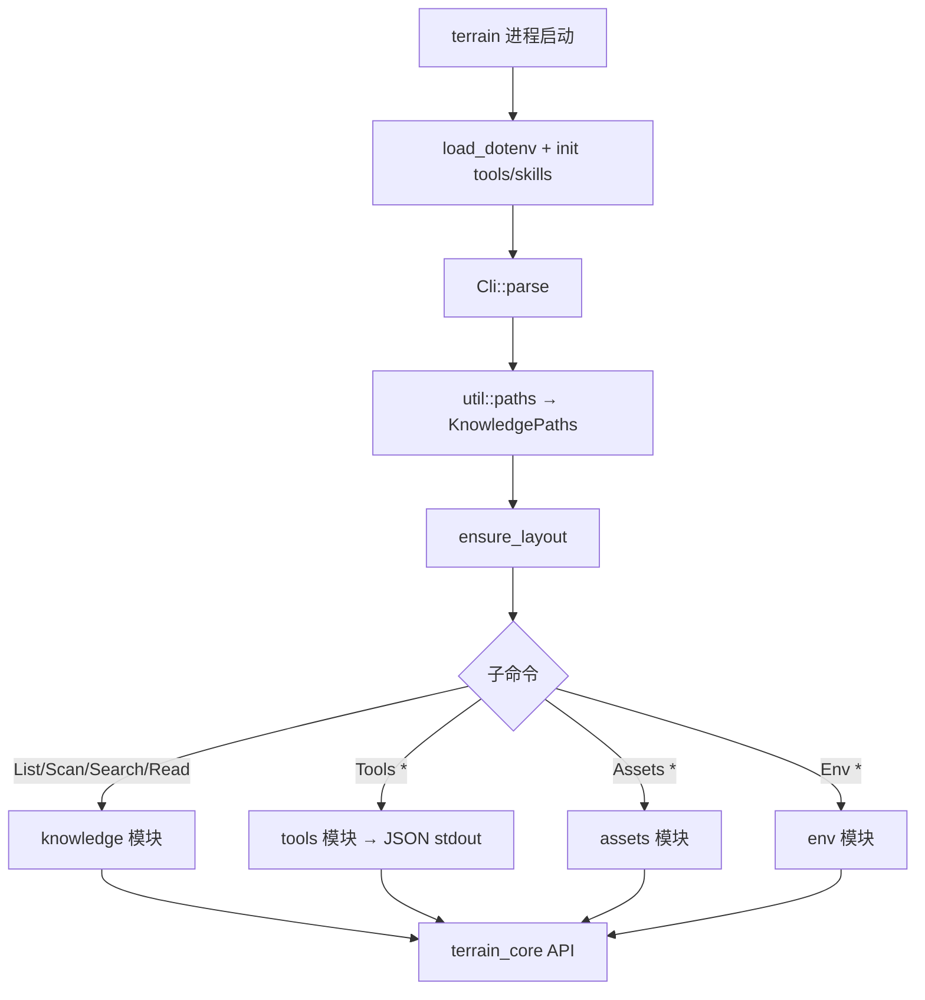

# CLI接口领域

**模块路径**：`crates/terrain-cli/`  
**生成日期**：2026-07-15

---

## 这个模块在做什么

`terrain-cli` 是 Terrain 的命令行门面，把 `terrain-core` 的路径/扫描/搜索/资产能力和 `terrain-agent` 的 LLM/ACP 编排暴露为可脚本化的子命令。它服务两类用户：本地开发者用 `scan`、`search`、`assets` 管理知识库；外部 ACP Agent（如 OpenCode）用 `terrain tools` 子命令以 **JSON stdout** 协议读取知识、检索 repomix、查询新鲜度。

启动时加载 dotenv、初始化 bundled tools 与 preset skills，保证 CLI 与桌面应用共享同一套工具链发现逻辑。

---

## 核心功能点

1. **六组顶层命令** — `List`、`Scan`、`Search`、`Read`、`Tools`、`Assets`、`Env`（`cli.rs:24-60`）。

2. **全局 `--repo-path`** — 覆盖 workspace 仓库解析，与 `TERRAIN_REPO_PATH` 互补。

3. **知识操作** — `knowledge.rs` 封装 list/scan/search/read，统一 `print_json` 输出。

4. **ACP JSON 工具** — `tools.rs` 实现 `list-projects`、`grep-pack`、`read-pack-file`、`read-context`、`search`、`freshness` 等。

5. **资产生成** — `assets.rs` 覆盖 repomix pack、Litho plan/run、agent context、register、repair-context。

6. **环境集成** — `env.rs` 提供 Skills/AGENTS.md 的 status/plan/apply。

---

## 关键组件

| 组件/类型 | 文件路径 | 核心职责 |
|---------|---------|---------|
| `Cli` / `Commands` | `crates/terrain-cli/src/cli.rs:5-216` | clap 命令树定义 |
| `main` | `crates/terrain-cli/src/main.rs:10-16` | 入口 + 初始化 |
| `commands::run` | `crates/terrain-cli/src/commands/mod.rs:10-30` | 命令分发 |
| `knowledge` | `crates/terrain-cli/src/commands/knowledge.rs:10-49` | list/scan/search/read |
| `tools` | `crates/terrain-cli/src/commands/tools.rs:12+` | ACP JSON 工具集 |
| `assets` | `crates/terrain-cli/src/commands/assets.rs` | 资产生成与注册 |
| `env` | `crates/terrain-cli/src/commands/env.rs` | 环境集成 |
| `util` | `crates/terrain-cli/src/util.rs` | paths、print_json、repo 解析 |

---

## 内部数据流

---

## 关键接口与扩展点

- **新 ACP 工具** — 在 `ToolsCommands` 增加变体并在 `tools::run` 实现；Agent 侧 tool schema 需同步更新。
- **输出格式** — 当前统一 JSON；可增加 `--format table` 面向人类终端。
- **异步命令** — `commands::run` 已是 async；长时 Litho/SDD 可输出 NDJSON 流。

---

## 与其他模块的交互

| 交互模块 | 方向 | 接口/协议 | 说明 |
|---------|------|---------|------|
| terrain-core | 依赖 | 全部公共 API | 路径、扫描、搜索、资产 |
| terrain-agent | 依赖 | Litho/SDD/Chat | 资产生成与编排 |
| ACP协议 | 被依赖 | `terrain tools` JSON | 外部 Agent 唯一推荐入口 |
| 桌面UI | 互补 | 共享 core/agent | CLI 适合 CI/脚本，UI 适合交互 |

---

## 跨模块协作场景

**在 CI 流水线中**：`terrain scan` → `terrain assets pack-agent` → 提交 `.terrain/` 变更，实现知识资产与代码同步版本化。

**在外部 Agent 集成中**：配置 ACP 模式，让 Agent 调用 `terrain tools` 而非 `grep`/`read` 活仓库，遵循三层知识访问模型。

---

## 性能考量

- **JSON 序列化** — 大文档 `read` 可能产生数 MB stdout，管道消费方需注意缓冲。
- **无连接池** — 每次 CLI 调用独立进程，无 ChatEngine 缓存；适合 Agent 单次 tool call。
- **并行 scan** — `scan` 走 `ProjectScanner` async 路径，是 CLI 中最重的 IO+CPU 操作之一。

---

## 实现亮点

`terrain tools` 的 JSON stdout 协议是外部 Agent 访问 Terrain 知识的**唯一推荐入口**——所有输出经 `serde_json` 序列化，Agent 侧无需解析人类可读文本，直接消费结构化数据。
