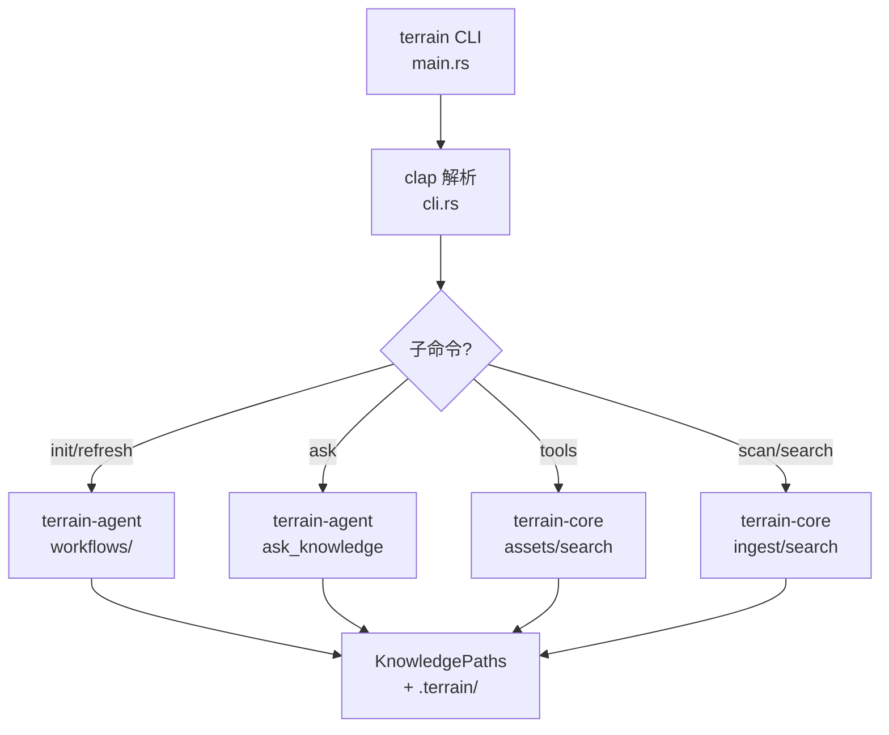

# CLI 接口

**模块路径**：`crates/terrain-cli/`  
**生成日期**：2026-07-22

---

## 这个模块在做什么

CLI 接口是 Terrain 的"无头通道"——它让开发者和 CI/CD 流水线在不启动桌面应用的情况下使用 Terrain 的全部能力。CLI 与桌面共享 `terrain-core` 和 `terrain-agent` crate，确保行为一致性。特别重要的是 `terrain tools` 子命令，它为 ACP 模式的外部 Agent 提供 JSON 格式的知识检索工具。

## 核心功能点

1. **命令树定义**——`cli.rs` 使用 clap 定义完整的命令层次结构。
2. **项目命令**——`commands/project.rs` 实现项目概览、备注、移除等。
3. **Ask 命令**——`commands/ask.rs` 实现 DeepWiki 问答（含流式 NDJSON 输出）。
4. **SDD 命令**——`commands/sdd.rs` 实现 SDD 四阶段工作流。
5. **Tools 命令**——`commands/tools.rs` 实现 ACP 模式的 JSON 工具集。
6. **Assets 命令**——`commands/assets.rs` 实现 Litho/context/pack 资产生成。
7. **Env 命令**——`commands/env.rs` 实现环境集成。

## 关键组件

| 组件/类型 | 文件路径 | 核心职责 |
|---------|---------|---------|
| `Cli` / `Commands` | `cli.rs:16-102` | 顶层命令枚举 |
| `main.rs` | `terrain-cli/src/main.rs` | CLI 入口 |
| `commands/tools.rs` | CLI tools 实现 | ACP JSON 工具 |
| `commands/init.rs` | 项目初始化 | `terrain init` |
| `commands/ask.rs` | DeepWiki 问答 | `terrain ask query` |
| `commands/sdd.rs` | SDD 工作流 | `terrain sdd run` |
| `commands/assets.rs` | 资产生成 | `terrain assets` |
| `commands/env.rs` | 环境集成 | `terrain env` |
| `commands/settings.rs` | 设置管理 | `terrain settings` |

## 内部数据流

## 与其他模块的交互

| 交互模块 | 方向 | 接口/协议 | 说明 |
|---------|------|---------|------|
| terrain-agent | 依赖 | 工作流函数 | init/ask/sdd |
| terrain-core | 依赖 | 资产/搜索/ingest | 核心能力 |
| ACP Agent | 被调用 | `terrain tools` JSON | 外部 Agent 工具 |

## 跨模块协作场景

**ACP 模式**：外部 Agent 通过 `terrain tools grep-pack` → `terrain tools read-pack-file` 三层检索知识，输出 JSON 到 stdout。

**CI/CD**：`terrain refresh` 在 merge 后更新知识资产，`terrain init` 用于首次 onboarding。

## 性能考量

- CLI 无 Tauri 开销，启动更快
- `terrain tools` 输出纯 JSON，适合程序化解析
- 流式 Ask 通过 `--stream` 标志输出 NDJSON

## 实现亮点

CLI 与桌面共享同一套 Rust crate，零重复实现——这是 Terrain "Core 无 UI 依赖"架构原则的直接体现。
