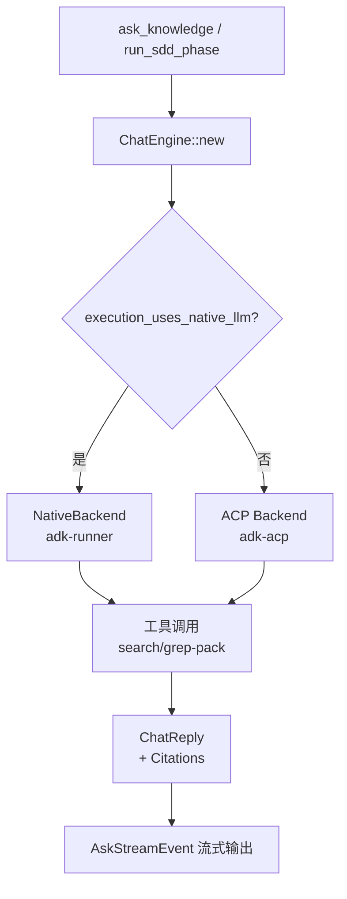

# Chat 引擎

**模块路径**：`crates/terrain-agent/src/chat/`  
**生成日期**：2026-07-22

---

## 这个模块在做什么

Chat 引擎是 Terrain 的"对话中枢"——所有需要 LLM 推理的场景（DeepWiki 问答、SDD 文档阶段、Agent 上下文生成）都通过 `ChatEngine` 统一路由。它的核心设计是**双后端策略**：轻量文档生成走 Native LLM 直连（低延迟、无子进程开销），需要工具调用的重任务走 ACP 子进程（隔离执行、完整工具生态）。

可以把 ChatEngine 想象成一个"智能前台"：它接待所有对话请求，根据任务类型和配置决定派给内部专家（Native LLM）还是外包团队（ACP Agent），同时管理三层知识检索的上下文注入。

## 核心功能点

1. **双后端路由**——`ChatEngine::with_settings`（`chat/mod.rs:72`）根据 `AgentExecution` 枚举构建 Native 或 ACP 后端。
2. **Native 直连推理**——`chat/native.rs` 通过 adk-runner 调用 adk-model，用于 SDD Requirements/TechDesign 和 context 生成。
3. **ACP 子进程推理**——`chat/acp.rs` 通过 adk-acp 启动外部 Agent，用于 Ask 纯 ACP 模式和 SDD CodeGen。
4. **流式回答处理**——`sanitize_answer_text` 调用 `prepare_chat_markdown` 清理输出；`finalize_usage` 估算 token 用量。
5. **工具调用追踪**——`chat/tracker.rs` 记录 `ChatToolCallRecord`，桌面 UI 通过 `ToolCallTrace.svelte` 展示。

## 关键组件

| 组件/类型 | 文件路径 | 核心职责 |
|---------|---------|---------|
| `ChatEngine` | `chat/mod.rs:53` | 对话引擎主结构，路由与上下文管理 |
| `NativeBackend` | `chat/native.rs` | adk-runner Native LLM 后端 |
| ACP 后端 | `chat/acp.rs` | adk-acp 子进程后端 |
| `ChatReply` | `chat/types.rs` | 回答结构（文本 + 引用 + 用量） |
| `ChatToolCallRecord` | `chat/types.rs` | 工具调用记录 |
| `build_native_backend` | `chat/native.rs` | 构建 Native 后端实例 |

## 内部数据流

## 关键接口与扩展点

- `ChatEngine::new_native`（`mod.rs:66`）：强制 Native 模式，用于混合工作负载
- `ASK_TIMEOUT = 1200s`：Ask 超时保护
- `CHAT_APP_NAME = "terrain"`：adk session 标识

## 与其他模块的交互

| 交互模块 | 方向 | 接口/协议 | 说明 |
|---------|------|---------|------|
| workflows/ask | 被调用 | `ChatEngine::ask` | DeepWiki 问答 |
| workflows/sdd | 被调用 | `ChatEngine` | SDD 各阶段推理 |
| agent_context | 被调用 | `ChatEngine::new_native` | context 生成 |
| terrain-core/search | 依赖 | `KnowledgeSearch` | 知识检索工具 |
| acp.rs | 依赖 | `resolve_acp_settings` | ACP 配置解析 |

## 跨模块协作场景

**在 DeepWiki 问答中**：`ask_knowledge` 创建 `ChatEngine`，预载 Macro 层后发起推理，工具调用通过 `KnowledgeSearch` 和 `grep_pack` 检索知识。

**在 SDD 工作流中**：Requirements/TechDesign 用 `ChatEngine::new_native`，CodeGen 用 ACP 模式。

## 性能考量

- Native 模式避免子进程启动开销（~1-2s）
- ACP 模式提供完整工具生态但增加延迟
- Token 用量估算 fallback（`finalize_usage`）在无 provider 统计时使用字符/4 启发式

## 实现亮点

`execution_uses_native_llm` / `execution_pure_acp` 的组合模式让同一 `ChatEngine` 结构服务不同执行策略，避免为每种模式维护独立引擎实现。
