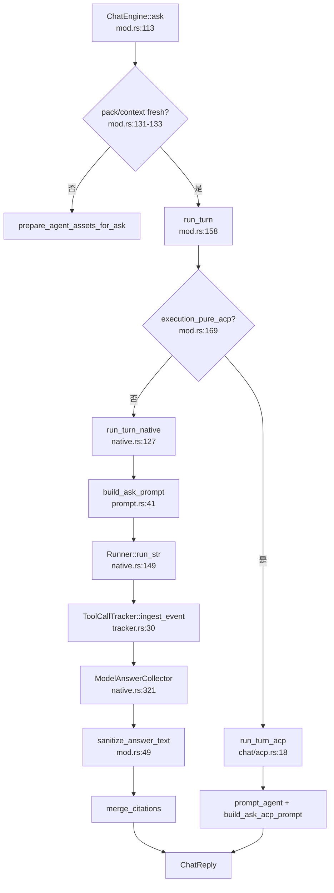

# Chat引擎领域

**模块路径**：`crates/terrain-agent/src/chat/`  
**生成日期**：2026-07-15

---

## 这个模块在做什么

Chat 引擎是 Terrain「Ask」问答体验的心脏。它把用户的自然语言问题，路由到两种截然不同的执行后端：一是基于 ADK Runner 的**原生 LLM + 函数工具**模式，Agent 在进程内调用 `grep_agent_pack`、`read_agent_context` 等工具检索知识；二是**纯 ACP 模式**，把整个问答委托给外部 OpenCode Agent，通过 `terrain tools` CLI 子进程间接访问同一套知识资产。

无论哪条路径，引擎都负责三件大事：在提问前确保 agent pack / context 新鲜、把宏观/中观/微观三层上下文注入提示词、以及把流式事件翻译成前端可消费的 `ChatReply`。

---

## 核心功能点

1. **双后端路由**——`ChatEngine::with_settings`（`mod.rs:72-103`）根据 `AgentExecution` 决定初始化 `NativeBackend` 还是仅校验 ACP 可用；`run_turn`（`158-195` 行）分流到 `run_turn_acp` 或 `run_turn_native`。

2. **提问前资产保鲜**——`ask`（`113-155` 行）在绑定项目时检查 `agent_pack_fresh` 与 `agent_context_fresh`，过期则调用 `prepare_agent_assets_for_ask` 自动重建。

3. **三层提示词注入**——`build_ask_prompt`（`prompt.rs:41-169`）按 Macro（架构概览）、Meso（`read_agent_context` 分段）、Micro（`grep_agent_pack`）组织规则。

4. **原生流式会话**——`run_turn_native`（`native.rs:127-292`）通过 ADK `Runner::run_str` 消费 SSE 事件流，用 `ToolCallTracker` 跟踪工具调用。

5. **引用合并**——两端均在答案生成后调用 `extract_source_citations` 与 `merge_citations`。

---

## 关键组件

| 组件/类型 | 文件路径 | 核心职责 |
|---------|---------|---------|
| `ChatEngine` | `crates/terrain-agent/src/chat/mod.rs:53-229` | 对外统一的问答入口与后端选择 |
| `build_ask_prompt` | `crates/terrain-agent/src/chat/prompt.rs:41-169` | 拼装 Macro/Meso/Micro 三层上下文提示词 |
| `NativeBackend` | `crates/terrain-agent/src/chat/native.rs:43-87` | ADK Runner + InMemorySessionService |
| `run_turn_native` | `crates/terrain-agent/src/chat/native.rs:127-292` | 流式消费 LLM 事件、跟踪工具、收集答案 |
| `run_turn_acp` | `crates/terrain-agent/src/chat/acp.rs:18-134` | 委托外部 ACP Agent 完成问答 |
| `ToolCallTracker` | `crates/terrain-agent/src/chat/tracker.rs:8-179` | 解析 FunctionCall/Response，去重 partial 调用 |
| `ChatReply` / `ChatPhase` | `crates/terrain-agent/src/chat/types.rs:54-71` | 序列化给前端的回复结构与阶段枚举 |
| `ModelAnswerCollector` | `crates/terrain-agent/src/chat/native.rs:321-390` | 工具执行后选取最终答案段落 |

---

## 内部数据流

---

## 关键接口与扩展点

- **执行模式**：`AgentExecution::Acp` / `AcpNative` 控制是否混用 LLM 与 ACP。
- **`ChatContextGenerator`**：实现 `AgentContextGenerator` trait，在 ADK Agent 构建时注入资产保鲜逻辑。
- **Freshness 门控**：`macro_preload` 由 `resolve_freshness_summary` 决定，低分时 withheld 宏观概览。

---

## 与其他模块的交互

| 交互模块 | 方向 | 接口/协议 | 说明 |
|---------|------|---------|------|
| ACP协议 | 依赖 | `build_acp_config` | 纯 ACP 模式问答 |
| Agent上下文 | 依赖 | `read_agent_context`、`build_context_overview` | Macro/Meso 层数据来源 |
| 知识资产管理 | 依赖 | `grep_repomix_pack`、`read_agent_pack_file` | Micro 层源码检索 |
| 新鲜度追踪 | 依赖 | `resolve_freshness_summary` | 信任块与宏观预加载门控 |
| SDD工作流 | 被依赖 | `ChatEngine::ask` | SDD 文档阶段复用 Chat 引擎 |
| 源码引用 | 被依赖 | `extract_source_citations` | 回答中的可点击引用 |

---

## 跨模块协作场景

**在 DeepWiki 问答中**：本模块是端到端路径的核心。`ask` 先通过新鲜度模块判断信任级别，再通过 Agent 上下文模块获取 Macro 层概览，最后通过知识资产模块的 grep/read 工具深入源码。

**在 SDD 文档阶段中**：`run_sdd_llm_phase` 复用 `ChatEngine::ask`，session_id 格式为 `sdd-{project}-{session}-{phase}`，隔离各阶段 LLM 会话防止上下文污染。

**在 Agent 上下文生成中**：特殊 session `agent-ctx-{slug}` 触发 `run_turn_native` 跳过 `build_ask_prompt`，避免 Ask 规则污染生成任务。

---

## 性能考量

- **宏观预加载减工具调用**：freshness 允许时，`build_context_overview` 直接注入 prompt，避免首轮 `read_agent_context` 往返。
- **目录树截断**：`ASK_INJECT_DIR_TREE_MAX_CHARS = 2000`，防止 repomix 目录结构撑爆上下文窗口。
- **流式输出**：工具执行期间静默收集文本，结束后只推送最终段。
- **Partial 去重**：`ToolCallTracker` 合并流式 FunctionCall 碎片，避免 UI 工具列表闪烁。

---

## 实现亮点

`ModelAnswerCollector` 解决了工具调用场景下「最终答案选取」的难题——LLM 在工具执行前后可能输出多段文本，收集器在工具执行后优先取最后一段模型文本作为最终答案，避免把工具中间结果展示给用户。
