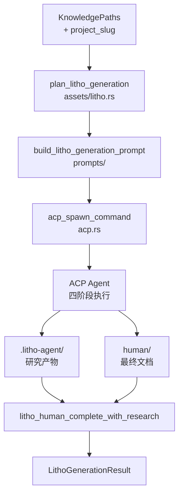

# Litho 文档生成

**模块路径**：`crates/terrain-agent/src/litho.rs`  
**生成日期**：2026-07-22

---

## 这个模块在做什么

Litho 文档生成是 Terrain 知识工厂的"印刷车间"——它把前序扫描和研究的结构化信息，编排成一套完整的人类可读 C4 架构文档。如果说 `ProjectScanner` 是原材料分拣，那么 Litho 就是把这些原材料交给 AI Agent 进行深度研究、撰写和排版，最终产出 `1.概述.md` 到 `6.数据库概览.md` 以及 `4.Deep-Exploration/` 下的模块深度文档。

Litho 采用纯 Agent 四阶段流水线（预处理→C4 研究→编排→输出），中间研究产物持久化在 `.terrain/.litho-agent/`，支持中断恢复——这与 deepwiki-rs 的 Memory 作用域机制平行，但使用文件系统而非内存。

## 核心功能点

1. **生成计划构建**——`prepare_litho_generation`（`litho.rs:20`）调用 `plan_litho_generation` 分析仓库状态，构建 `LithoPlan` 和 ACP prompt，检查 skill 目录是否就绪。
2. **ACP 子进程执行**——`run_litho_generation` 通过 `acp_spawn_command` 启动外部 Agent，执行四阶段文档生成流水线。
3. **进度轮询**——`prompt_agent_with_doc_poll`（`litho.rs:84`）spawn ACP 子进程后循环检测 `human/` 和 `.litho-agent/` 的 Markdown 文件计数，通过 `LithoProgress` 事件回调通知 UI。
4. **完整性检测**——`litho_human_complete_with_research` 验证六份标准文档和 Deep-Exploration 模块是否全部生成。
5. **编排补充**——若首次 ACP 会话未产出完整文档，`build_litho_composition_prompt` 触发补充编排（最多 3 次尝试）。

## 关键组件

| 组件/类型 | 文件路径 | 核心职责 |
|---------|---------|---------|
| `prepare_litho_generation` | `litho.rs:20` | 构建 Litho 生成计划与 prompt |
| `run_litho_generation` | `litho.rs` | 执行完整 Litho 流水线 |
| `prompt_agent_with_doc_poll` | `litho.rs:84` | ACP 子进程 + 文件轮询 |
| `LithoGenerationJob` | `crates/terrain-core/src/ipc/workflows.rs` | 生成任务数据结构 |
| `LithoPlan` | `crates/terrain-core/src/assets/litho.rs` | 计划详情（skill 路径、输出目录） |
| `build_litho_generation_prompt` | `crates/terrain-core/src/prompts/` | 构建 ACP prompt 文本 |

## 内部数据流

**关键步骤说明**：
1. `plan_litho_generation` 分析仓库，确定 skill 目录、输出路径、meta 输入
2. ACP Agent 按 SKILL.md 四阶段流水线执行，研究产物写入 `TERRAIN_LITHO_WORKSPACE`
3. 轮询检测文档计数变化，稳定 10 个 tick 后判定完成
4. 墙钟超时默认 45 分钟（`TERRAIN_LITHO_TIMEOUT_SECS`）

## 关键接口与扩展点

- **Skill 目录**：通过 `TERRAIN_LITHO_SKILL` 环境变量或 preset_skills 指定 Litho 技能
- **超时配置**：`TERRAIN_LITHO_TIMEOUT_SECS` 环境变量
- **轮询参数**：`POLL_INTERVAL_SECS=3`、`POLL_INTERVAL_STABLE_SECS=6`、`STABLE_TICKS=10`

## 与其他模块的交互

| 交互模块 | 方向 | 接口/协议 | 说明 |
|---------|------|---------|------|
| terrain-core/assets/litho | 依赖 | `plan_litho_generation` | 计划与 prompt 构建 |
| acp.rs | 依赖 | `acp_spawn_command` | ACP 子进程启动 |
| workflows/init | 被调用 | `run_litho_generation` | 项目初始化中触发 |
| preset_skills | 依赖 | skill 目录 | Litho 四阶段执行指南 |

## 跨模块协作场景

**在项目初始化中**：`workflows/init.rs` 在扫描完成后检查 `litho_human_complete_with_research`，若不完整则调用 `run_litho_generation`，进度通过 `on_litho_progress` 回调传递。

**在桌面 UI 中**：`generate_human_docs_cmd` / `run_litho_generation_cmd`（`src-tauri/src/commands/workflows.rs`）触发独立 Litho 生成。

## 性能考量

- 轮询退避：文档计数稳定后从 3s 增至 6s 间隔
- 墙钟超时保护：超时 abort ACP 子进程
- 最多 3 次编排补充尝试（`MAX_COMPOSITION_ATTEMPTS`）

## 实现亮点

研究产物文件系统持久化策略——与 deepwiki-rs Memory 作用域等效，但支持跨会话恢复，是 Litho 相比一次性 LLM 调用的核心优势。
