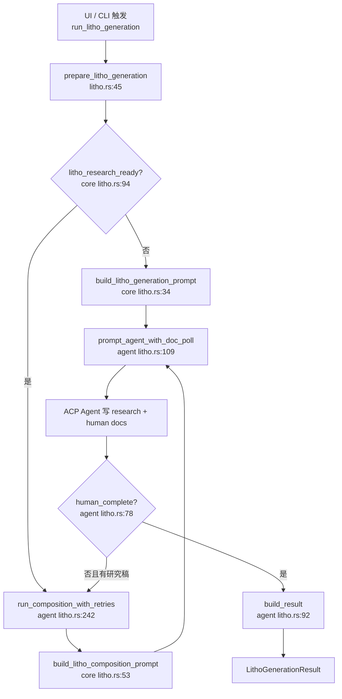

# Litho文档生成领域

**模块路径**：`crates/terrain-agent/src/litho.rs` + `crates/terrain-core/src/assets/litho.rs`  
**生成日期**：2026-07-15

---

## 这个模块在做什么

Litho 文档生成是 Terrain 将「冷冰冰的源码仓库」转化为「人类可读知识库」的核心流水线。它不直接在 Rust 里写 Markdown，而是扮演**编排者**的角色：规划输出路径、拼装 ACP Agent 提示词、轮询磁盘上的产出物，并在研究稿已就绪时自动切换到「仅编排」阶段，避免重复跑昂贵的 C4 研究。

可以把这套机制理解成一条四阶段文档工厂——预处理 → C4 研究 → 编排合成 → 输出校验——其中 `terrain-core` 负责「合同与质检」，`terrain-agent` 负责「启动外部 Agent 并盯着进度条」。

---

## 核心功能点

1. **生成计划与提示词拼装**——`plan_litho_generation`（`crates/terrain-core/src/assets/litho.rs:17-31`）解析 Litho skill 目录、人类输出目录与工作区路径，生成 `LithoPlan`；`build_litho_generation_prompt` 和 `build_litho_composition_prompt` 分别驱动全量四阶段与仅 phase 3/4 的续跑场景。

2. **研究完成度与产出质检**——`LITHO_CORE_RESEARCH_FILES` 定义六份核心研究稿；`litho_research_ready` 要求核心稿齐全且 `modules/` 下至少有一份模块深度报告；`litho_human_complete_with_research` 校验人类文档集完整性。

3. **ACP 驱动的异步生成**——`run_litho_generation`（`litho.rs:289-402`）是主入口：检查 skill 就绪、可选 `force_refresh` 清理旧产出、根据研究就绪状态决定走全量生成还是仅编排。

4. **文档轮询与早停**——`prompt_agent_with_doc_poll`（`litho.rs:109-212`）在 Agent 会话进行的同时，每 3–6 秒统计 human/research 目录下的 `.md` 数量；完整文档集落盘且连续 10 次无变化时主动 abort 会话。

5. **编排阶段重试**——`run_composition_with_retries`（`litho.rs:242-285`）最多重试 3 次，直到 `litho_human_complete_with_research` 通过。

---

## 关键组件

以下组件分工明确：`terrain-core` 管契约与质检，`terrain-agent` 管执行与进度。

| 组件/类型 | 文件路径 | 核心职责 |
|---------|---------|---------|
| `LithoPlan` / `plan_litho_generation` | `crates/terrain-core/src/assets/litho.rs:17-31` | 汇总 skill、仓库、人类输出与工作区路径 |
| `build_litho_generation_prompt` | `crates/terrain-core/src/assets/litho.rs:34-50` | 四阶段全量生成的 ACP 提示词 |
| `litho_research_ready` | `crates/terrain-core/src/assets/litho.rs:94-105` | 判断 C4 研究是否足以进入编排 |
| `litho_human_complete_with_research` | `crates/terrain-core/src/assets/litho.rs:131-155` | 校验人类文档集是否完整 |
| `prepare_litho_generation` | `crates/terrain-agent/src/litho.rs:45-68` | 组装 plan、prompt 与 ACP 启动命令 |
| `prompt_agent_with_doc_poll` | `crates/terrain-agent/src/litho.rs:109-212` | 轮询磁盘产出并支持早停 |
| `run_litho_generation` | `crates/terrain-agent/src/litho.rs:289-402` | 主异步入口，串联生成与编排 |
| `litho_acp_config` | `crates/terrain-agent/src/litho.rs:405-423` | 注入 `TERRAIN_LITHO_*` 环境变量 |

---

## 内部数据流

**关键步骤说明**：

1. **计划阶段**：`plan_litho_generation` 通过 `resolve_litho_skill_dir` 定位 skill，失败时回退 `default_litho_skill_dir`。
2. **全量生成**：Agent 被指示将研究稿写入 `TERRAIN_LITHO_WORKSPACE`，最终文档写入 `TERRAIN_HUMAN_OUTPUT_DIR`。
3. **早停逻辑**：`human_complete` 连续稳定 10 次后 abort，墙钟超时默认 45 分钟。

---

## 关键接口与扩展点

- **Skill 目录**：通过 `resolve_litho_skill_dir` / `TERRAIN_LITHO_SKILL` 环境变量替换默认 preset skill。
- **研究必备清单**：修改 `LITHO_CORE_RESEARCH_FILES` 可扩展「研究就绪」判定条件。
- **人类文档清单**：`LITHO_REQUIRED_HUMAN_FILES` 控制完成度检查的文件集合。

---

## 与其他模块的交互

| 交互模块 | 方向 | 接口/协议 | 说明 |
|---------|------|---------|------|
| ACP协议 | 依赖 | `build_acp_config`、`prompt_agent` | 长时文档生成委托外部 Agent |
| 项目初始化 | 被依赖 | `run_litho_generation` | 初始化流程的子步骤 |
| 知识资产管理 | 依赖 | `plan_litho_generation` | 路径规划与 skill 解析 |
| Agent上下文 | 被依赖 | Litho 产出 `human/` | 上下文生成读取人类文档摘要 |

---

## 跨模块协作场景

**在项目初始化中**：本模块在扫描完成后按需启动。`project_init.rs` 调用 `litho_human_complete_with_research` 判断是否需要运行；Litho 成功后 `force_refresh` Agent 上下文，确保新文档反映到 `context.md`。

**在 Litho 断点续传中**：研究产物持久化在 `.litho-agent/` 后，再次触发时 `litho_research_ready` 为真，直接走 `run_composition_with_retries` 仅执行编排阶段，显著缩短二次运行时间。

---

## 性能考量

- **轮询而非阻塞**：`tokio::select!` 在 Agent 会话与定时轮询间切换，UI 能实时看到进度。
- **自适应轮询间隔**：有产出变化时 3 秒一轮，稳定后降至 6 秒。
- **跳过重复研究**：`litho_research_ready` 为真时直接走编排，避免重复 C4 分析。
- **早停防挂起**：完整文档集落盘后主动终止 ACP 会话，以磁盘事实为准。

---

## 实现亮点

ACP 轮询早停机制是 Litho 稳定性的关键设计——不信任 Agent 的结束信号，而是以磁盘产出为唯一完成判据。连续 10 次轮询无变化且文档集完整时才 abort，既避免了 Agent 挂起，又给最后的文件写入留出缓冲时间。
