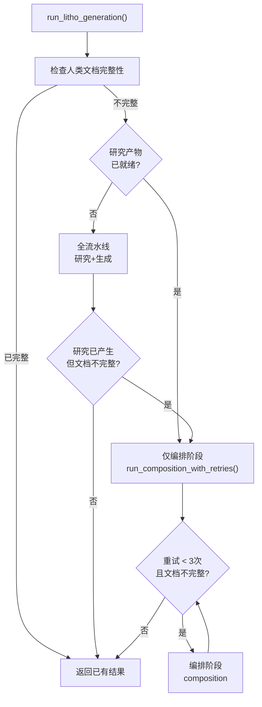

# Litho 文档生成领域

**模块路径**：`crates/terrain-agent/src/litho.rs`
**生成日期**：2026-06-14
**分析置信度**：9/10

---

## 这个模块在做什么

Litho 文档生成是 Terrain 的"旗舰功能"——它编排了一个全自动流水线，通过 ACP Agent（OpenCode）分析源码目录，生成 C4 模型的架构文档。核心设计理念是"可恢复流水线"：研究中间产物持久化到文件系统，即使 LLM 调用中途超时，再次运行可以从断点继续。

你可以把 Litho 比作"自动化的学术论文写作"：先阅读大量资料（源码扫描），整理笔记（研究产物），然后组织成一篇文章（编排输出）。如果写了一半中断了，笔记还在，下次可以从整理笔记的环节继续，不需要重新阅读。

---

## 核心功能点

1. **准备阶段**——`prepare_litho_generation()`（`crates/terrain-agent/src/litho.rs:40`）构建 `LithoPlan`，生成 ACP Agent Prompt。这个过程是纯本地计算，不涉及 LLM。

2. **全流水线执行**——`run_litho_generation()`（`crates/terrain-agent/src/litho.rs:269`）协调完整的生成流程：检查就绪状态 → 选择流水线路径（研究+生成 / 仅编排）→ 输出验证。

3. **轮询检测**——`prompt_agent_with_doc_poll()`（`crates/terrain-agent/src/litho.rs:94`）每隔 3 秒检查研究目录和人类文档目录的写入进度。检测到"稳定状态"（连续 10 次无变化）或超时（默认 45 分钟）时自动终止。

4. **编排重试**——`run_composition_with_retries()`（`crates/terrain-agent/src/litho.rs:222`）最多 3 次编排重试，每次重新调用 ACP Agent 补齐缺失文档。

5. **恢复支持**——`litho_research_ready()`（`crates/terrain-core/src/assets/litho.rs:113`）检测 6 个核心研究报告是否齐全。研究产物齐全时跳过预处理和研究，直接进入编排（节约 50%+ LLM token）。

---

## 关键组件

| 组件/类型 | 文件路径 | 核心职责 |
|---------|---------|---------|
| `LithoGenerationJob` | `crates/terrain-agent/src/litho.rs:18` | 生成作业描述（plan + prompt + acp_command + status） |
| `LithoProgress` | `crates/terrain-agent/src/litho.rs:27` | 进度事件结构（stage + message） |
| `LithoGenerationResult` | `crates/terrain-agent/src/litho.rs:33` | 生成结果（plan + response_excerpt + doc_count + complete） |
| `prompt_agent_with_doc_poll()` | `crates/terrain-agent/src/litho.rs:94` | ACP Agent 调用 + 轮询等待（核心编排函数） |
| `run_composition_with_retries()` | `crates/terrain-agent/src/litho.rs:222` | 编排阶段重试逻辑 |

---

## 内部数据流

**关键步骤说明**：
1. 准备阶段：`prepare_litho_generation()` 在 `crates/terrain-agent/src/litho.rs:40` — 纯本地计算
2. 全流水线路径：通过 ACP Agent 执行 SKILL.md 中定义的四阶段流水线
3. 编排路径：仅执行 composition 和 output 阶段
4. 轮询等待：每 3 秒检查一次，最多 45 分钟

---

## 关键接口与扩展点

**核心接口**：`run_litho_generation(paths, project_slug, repo_path, acp_settings, on_progress)` — `on_progress` 让调用者（CLI/UI）实时掌握进度。

**配置扩展**：
- 超时时间：通过 `TERRAIN_LITHO_TIMEOUT_SECS` 环境变量调整
- Skill 路径：通过 `TERRAIN_LITHO_SKILL` 环境变量自定义文档生成逻辑

**容错机制**：
- 墙钟超时 45 分钟自动中止
- 稳定检测（10 次轮询无变化）提前结束等待
- 编排最多重试 3 次

---

## 与其他模块的交互

| 交互模块 | 方向 | 接口/协议 | 说明 |
|---------|------|---------|---------|
| 知识资产管理 | 依赖 | `plan_litho_generation()`, `litho_research_ready()` | 使用资产模块的计划和检测功能 |
| ACP 协议 | 依赖 | `acp_spawn_command()`, `build_acp_config()` | 通过 ACP 协议与 OpenCode 通信 |
| 项目初始化 | 被依赖 | `run_litho_generation()` | 初始化流水线调用本模块生成人类文档 |

---

## 性能考量

- **轮询间隔**：3 秒，平衡检测精度和 IO 开销
- **超时策略**：默认 45 分钟（2700 秒），大型项目可调整
- **研究缓存**：研究产物持久化后，后续运行跳过预处理和研究阶段
- **编排重试**：最多 3 次，避免无限重试浪费 token

---

> **分析置信度说明**：9/10 — 完整阅读了 litho.rs 全部 407 行源码，包含所有阶段逻辑和容错机制。
