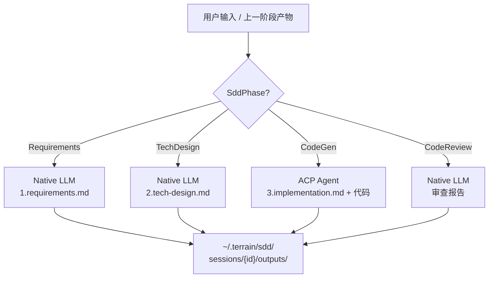

# SDD 工作流

**模块路径**：`crates/terrain-agent/src/workflows/sdd.rs`  
**生成日期**：2026-07-22

---

## 这个模块在做什么

SDD（Standardized Development Definition）工作流是 Terrain 的"标准化开发路径"——它把"从需求到代码审查"这一常见但混乱的开发过程，规范为四个顺序阶段，每个阶段产出可审查的 Markdown 文档。就像登山路线上的路标，SDD 告诉开发者和 AI Agent"现在在哪一站、下一站该做什么、这一站要留下什么痕迹"。

四个阶段分别使用不同的执行引擎：轻量文档阶段（需求、设计、审查）走 Native LLM，代码生成阶段委托 ACP Agent 直接修改仓库——这种"轻重分离"策略平衡了速度和能力。

## 核心功能点

1. **阶段执行**——`run_sdd_phase` 根据 `SddPhase` 枚举路由到对应阶段的 prompt 和引擎。
2. **Requirements 阶段**——Native LLM 基于用户输入生成 `1.requirements.md`。
3. **Tech Design 阶段**——Native LLM 基于需求文档生成 `2.tech-design.md`。
4. **CodeGen 阶段**——ACP Agent 基于设计文档修改仓库并生成 `3.implementation.md`。
5. **Code Review 阶段**——Native LLM 审查代码变更生成审查报告。

## 关键组件

| 组件/类型 | 文件路径 | 核心职责 |
|---------|---------|---------|
| `run_sdd_phase` | `workflows/sdd.rs` | SDD 阶段执行入口 |
| `SddPhase` | `crates/terrain-core/src/ipc/workflows.rs` | 阶段枚举 |
| `SddProgress` | `terrain-core/ipc/workflows.rs` | 进度事件 |
| `SddPhaseResult` | `terrain-core/ipc/workflows.rs` | 阶段结果 |
| SDD prompt | `crates/terrain-core/src/prompts/` | 各阶段 prompt 模板 |
| SDD 资产 | `crates/terrain-core/src/assets/sdd.rs` | 产物路径管理 |

## 内部数据流

## 与其他模块的交互

| 交互模块 | 方向 | 接口/协议 | 说明 |
|---------|------|---------|------|
| chat/mod.rs | 依赖 | `ChatEngine` | Native/ACP 推理 |
| terrain-core/sessions | 依赖 | 会话持久化 | 阶段状态管理 |
| acp.rs | 依赖 | ACP 配置 | CodeGen 子进程 |
| SddWorkflowPanel.svelte | 消费 | Tauri IPC | 桌面 UI |

## 跨模块协作场景

**在桌面 UI 中**：`SddWorkflowPanel.svelte` 展示四阶段进度，`run_sdd_phase_cmd` 触发各阶段执行，会话管理通过 `create_sdd_session_cmd` 等命令。

## 性能考量

- Native 阶段响应快（无子进程开销）
- CodeGen 阶段依赖 ACP Agent 能力，耗时最长
- 会话产物存储在本地 `~/.terrain/sdd/`，不版本化

## 实现亮点

四阶段顺序执行 + 每阶段独立产物的模式，让开发者可以在任意阶段暂停、审查、修改后再继续——这是"可审查的 AI 开发"的核心实践。
