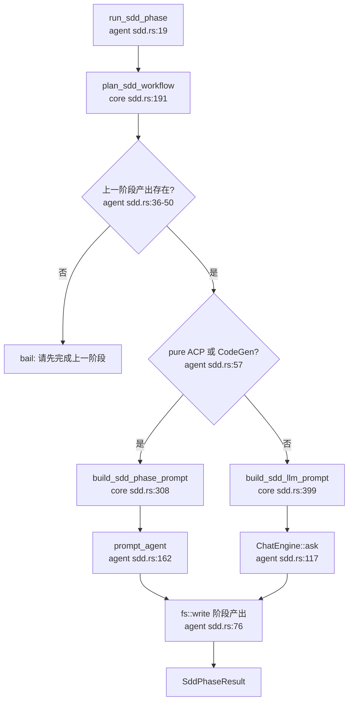

# SDD工作流领域

**模块路径**：`crates/terrain-agent/src/sdd.rs` + `crates/terrain-core/src/assets/sdd.rs`  
**生成日期**：2026-07-15

---

## 这个模块在做什么

SDD（Structured Design & Development）工作流模块把「从需求到代码」拆成四个有序阶段：需求澄清 → 技术设计 → 代码生成 → 智能 Code Review。它既是 Terrain 产品里「规范驱动开发」的用户旅程，也是一套可恢复的会话状态机——每个阶段产出一份 Markdown 落盘，下一阶段自动读取前置产物作为上下文。

`terrain-core` 侧管理会话元数据、路径规划与提示词模板；`terrain-agent` 侧负责按阶段调度 LLM 或 ACP Agent，并强制阶段依赖。

---

## 核心功能点

1. **四阶段状态机**——`plan_sdd_workflow`（`crates/terrain-core/src/assets/sdd.rs:191-215`）绑定到具体输出路径；`get_sdd_status` 扫描 `outputs/` 目录，计算 `current_phase` 与每阶段 `ready` 标志。

2. **会话生命周期**——`create_sdd_session` 生成 slug+时间戳 ID，写入 `meta.json` 并设为 active；`list_sdd_sessions` / `delete_sdd_session` 支持多需求并行。

3. **阶段提示词**——`build_sdd_phase_prompt` 为每个阶段拼装 skill 路径、仓库根、前置产出与人类编辑草稿；CodeGen 阶段指示 Agent 直接改仓库。

4. **双执行通道**——`run_sdd_phase` 在 `execution_pure_acp` 或 `SddPhase::CodeGen` 时走 ACP，其余文档阶段可走原生 `ChatEngine::ask`。

5. **阶段门禁**——`run_sdd_phase` 在 `phase.order() > 0` 时检查上一阶段输出文件是否存在，防止跳步执行。

---

## 关键组件

| 组件/类型 | 文件路径 | 核心职责 |
|---------|---------|---------|
| `create_sdd_session` | `crates/terrain-core/src/assets/sdd.rs:99-129` | 创建带 meta 的 SDD 会话目录 |
| `plan_sdd_workflow` | `crates/terrain-core/src/assets/sdd.rs:191-215` | 汇总 skill、workspace、output、agent pack 路径 |
| `build_sdd_phase_prompt` | `crates/terrain-core/src/assets/sdd.rs:308-397` | 按阶段生成 ACP/LLM 提示词 |
| `get_sdd_status` | `crates/terrain-core/src/assets/sdd.rs:221-277` | 返回阶段进度与 active session |
| `run_sdd_phase` | `crates/terrain-agent/src/sdd.rs:19-99` | 单阶段执行入口与落盘 |
| `run_sdd_llm_phase` | `crates/terrain-agent/src/sdd.rs:101-131` | 通过 ChatEngine 起草文档 |
| `run_sdd_acp_phase` | `crates/terrain-agent/src/sdd.rs:134-166` | 通过 ACP Agent 起草或写代码 |
| `sdd_acp_config` | `crates/terrain-agent/src/sdd.rs:180-199` | 注入 `TERRAIN_SDD_*` 环境变量 |

---

## 内部数据流

---

## 关键接口与扩展点

- **Skill 替换**：`resolve_sdd_skill_dir` 允许自定义各阶段模板与检查清单。
- **输出路径约束**：`save_sdd_output` 强制路径在 `~/.terrain/sdd/` 下，防止误写仓库外文件。
- **LLM vs ACP 切换**：仅改 `AgentExecution` 设置即可让文档阶段走原生 LLM、代码阶段仍走 ACP。

---

## 与其他模块的交互

| 交互模块 | 方向 | 接口/协议 | 说明 |
|---------|------|---------|------|
| Chat引擎 | 依赖 | `ChatEngine::ask` | SDD 文档阶段复用问答引擎 |
| ACP协议 | 依赖 | `prompt_agent` | CodeGen 阶段委托外部 Agent |
| Litho文档生成 | 依赖 | `human_output_dir` | TechDesign 阶段引用 Litho 人类文档 |
| 知识资产管理 | 依赖 | `agent_pack_path` | 设计阶段对齐 repomix 索引 |

---

## 跨模块协作场景

**在 SDD TechDesign 阶段中**：`build_sdd_phase_prompt` 注入 `human_output_dir` 与 `agent_pack_path`，让设计稿能对齐 Litho 产出与 repomix 索引，确保技术设计与架构文档一致。

**在 SDD CodeGen 阶段中**：即使 hybrid 模式下文档走 LLM，代码实现仍委托外部 ACP Agent，利用 ACP 的文件编辑与 shell 能力，而非在 Terrain 进程内模拟。

**在人类反馈回路中**：`user_input` 非空时追加 `## Human feedback`；已有草稿时追加 `## Current draft`，支持「在编辑器改完再让 AI 修订」。

---

## 性能考量

- **增量上下文**：每阶段只读取 `order() < 当前阶段` 的前置文件，避免把整个 SDD 历史塞进单次 prompt。
- **会话级 Chat ID**：隔离各阶段 LLM 会话，防止上下文污染。
- **状态缓存于磁盘**：阶段完成度由文件存在性判定，重启后状态自然恢复。

---

## 实现亮点

SDD 的「人类反馈 + 草稿修订」回路设计让 AI 辅助开发更像协作而非一次性生成——用户可以在编辑器中修改 AI 草稿，再带着修改意见让 AI 基于草稿迭代，而不是每次都从零开始。
