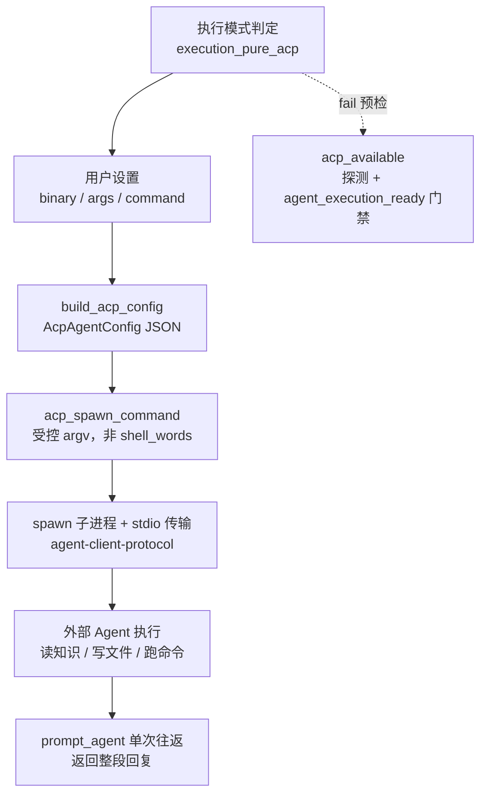

# ACP 集成领域

**模块路径**：`crates/terrain-agent/src/acp.rs`
**生成日期**：2026-09-21

---

## 概述

ACP（Agent Client Protocol）集成模块是 Terrain 与外部编码 Agent（opencode、Claude Code、Codex 等）之间的"接线盒"。Terrain 本身并不写代码、也不常驻任何 LLM 会话——当某个任务需要一个能**改仓库文件、跑 shell 命令**的真实 Agent 时（比如 Litho 文档生成、SDD 的 CodeGen 阶段、纯 ACP 模式的 Ask），它会把一份 JSON 配置顺着 stdio 交给外部 Agent 子进程，等它干活，再回收它的回复。这个模块负责的就是这条链路的全部机械细节：命令怎么拼、配置怎么写、子进程怎么起、Availability 怎么探测、以及"哪个负载该走 ACP、哪个该留在本地 LLM"的决策函数。

可以把它想成酒店前台的**贵宾通道预约**：你不需要自己研究贵宾怎样从大门走到房间，前台（`build_acp_config`）把路线、房间号、服务偏好一次性写在一张卡片上交给对接人（外部 Agent），并全程盯着"人是否按时到岗"（`acp_available` / `agent_execution_ready`）。它的工程难点不在脑洞，而在细节——尤其是**跨平台命令解析的安全**：直接套 `shell_words` 会把用户配置里的 `; rm -rf` 之类的注入当字面量分割执行，因此这里刻意避开这一陷阱，全程用 JSON stdio 传递配置。

---

## 核心功能点

1. **执行模式判定（`execution_pure_acp`）**：`crates/terrain-agent/src/acp.rs:71`。由 `AgentExecution` 派生"这个任务是否必须走 ACP"——纯 ACP 模式下所有智能负载都是外部代理的，hybrid（`AcpNative`）模式下原生 LLM 兜底；兼容旧 `native` 值反序列化（`settings.rs:300-307`）。

2. **配置构造（`build_acp_config`）**：`acp.rs` 周边。把用户设置（binary / args / command / auto_approve）归一化为 `adk_acp::AcpAgentConfig`，供 `prompt_agent` 一次性往返调用。`command` 字段优先级最高，按 `command > env > binary+args` 三级解析（`acp.rs:106-140`）。

3. **命令解析与安全（`acp_spawn_command` / `acp_command_parts`）**：避开 `shell_words` 的转义与 `;` 陷阱，用受控的参数字段构造 spawn 命令。`acp_command_parts` 从配置拆出可执行的 argv——这是"跨平台、不可注入"的实现核心。

4. **可用性探测（`acp_available`）**：`crates/terrain-agent/src/acp.rs:48`。检查 binary 是否在 PATH、是否支持 ACP 协议，输出 `{available, spawn_command}` 供 `settings check-acp` 与 UI 展示。注意：预检无法发现"二进制在 PATH 但不支持 ACP"，真正识别要靠运行时一轮往返（见架构 ADR-3）。

5. **执行就绪门禁（`agent_execution_ready`）**：`crates/terrain-agent/src/acp.rs:85`。把 ACP 可用性与 LLM 配置合起来判定"当前执行环境是否 ready"，是所有生成型工作流（init / quick_refresh / SDD / Litho）的前置门禁，不满足就记 notes 静默跳过。

6. **SDD 专用 ACP 配置（`sdd_acp_config`）**：在 `workflows/sdd.rs:176`。把 `TERRAIN_SDD_SKILL`、`TERRAIN_SDD_WORKSPACE`、`TERRAIN_SDD_OUTPUT_DIR`、`TERRAIN_HUMAN_OUTPUT_DIR` 灌进环境变量后用 `build_acp_config` 生成配置，让外部 Agent 在受控路径内工作。

---

## 关键组件

下面这些组件构成 ACP 模块的完整生命周期：命令来自配置合成，配置交给子进程 spawn，可用性由探测函数把关，而"谁走 ACP"由执行模式判定函数说了算。

| 组件/类型 | 文件路径 | 核心职责 |
|---------|---------|---------|
| `AgentExecution` | `crates/terrain-core/src/settings.rs:38:51` | 执行模式枚举（`Acp` / `AcpNative`），派生 `execution_pure_acp` |
| `build_acp_config` | `crates/terrain-agent/src/acp.rs` | 用户设置 → `adk_acp::AcpAgentConfig` |
| `acp_spawn_command` | `crates/terrain-agent/src/acp.rs` | 安全的 spawn 命令构造（跨平台 argv） |
| `acp_command_parts` | `crates/terrain-agent/src/acp.rs` | 从配置拆出可执行参数字段 |
| `acp_available` | `crates/terrain-agent/src/acp.rs:48` | 探活与 ACP 协议支持检查 |
| `agent_execution_ready` | `crates/terrain-agent/src/acp.rs:85` | 执行环境就绪门禁（ACP + LLM 合判） |
| `execution_pure_acp` / `execution_uses_native_llm` | `crates/terrain-agent/src/acp.rs:71 :76` | 负载分流决策函数 |
| `sdd_acp_config` | `crates/terrain-agent/src/workflows/sdd.rs:176` | SDD 专用 ACP 配置（注入 4 个 `TERRAIN_SDD_*` env） |
| `Terrain enV ACP 常量` | `crates/terrain-agent/src/acp.rs` | `TERRAIN_ACP_BINARY` / `TERRAIN_ACP_ARGS` / `TERRAIN_ACP_COMMAND` 覆盖解析 |

---

## 内部数据流

一次 ACP 往返的完整链路：配置环境下发到子进程，子进程执行并改盘，返回整段回复给调用方。注意 `prompt_agent` 是"一次性往返"（单会话把整个任务做完）而非多轮流式交互，这与 native Agent 循环的交互模型刻意不同。

**关键步骤说明**：
1. 分流（`acp.rs:71`）：纯 ACP 或 CodeGen 阶段（SDD）→ 走 ACP；hybrid 其余场景 → native LLM。
2. 配置合成（`acp.rs:106-140`）：解析优先级 `command > env > binary+args`，把三元组统一落进 `AcpAgentConfig`。
3. 安全 spawn（`acp_command_parts`）：不引入 shell 解析，避免配置中的特殊字符被当成命令分隔符执行。
4. 一次性往返（`adk-acp` 的 `prompt_agent`）：整个阶段做完再返回，避免多轮 token 膨胀；代价是运行中不可中途干预。

---

## 关键接口与扩展点

- **`build_acp_config(settings, extra_env)`**：生成 `AcpAgentConfig`。SDD 与 Litho 通过传入不同 `extra_env` 注入各自需要的环境变量，实现"同一套机制、不同任务场景"。
- **`agent_execution_ready(acp, model_config) -> Result<()>`**：所有生成型工作流的前置门禁（`commands/assets.rs:140` 也直接使用）。
- **扩展「新的外部 Agent」**：默认 binary 是 `opencode acp`，可通过 `TERRAIN_ACP_BINARY` / `TERRAIN_ACP_ARGS` 或设置文件里的 `command` 指向其他 ACP 兼容二进制，无需改代码。协议侧由 `agent-client-protocol` 1.3.0 保证兼容性。

---

## 与其他模块的交互

| 交互模块 | 方向 | 接口/协议 | 说明 |
|---------|------|---------|------|
| `settings` | 依赖 | `AcpSettings`（`crates/terrain-core/src/settings.rs:50-74`） | binary/args/command/agent_execution/auto_approve |
| `chat`（ChatEngine） | 被调用 | `run_turn_acp` | 纯 ACP 模式的 Ask 走 ACP 子进程并记录工具调用 |
| `litho` | 被调用 | `LithoTransport::AcpStrict / AcpWithFallback` | Litho 文档生成首选 ACP，运行时失败可降级 native |
| `sdd`（workflows/sdd.rs） | 被调用 | `run_sdd_acp_phase` + `sdd_acp_config` | CodeGen 阶段强制 ACP |
| `agent_context` | 被调用 | `run_agent_context_generation`（纯 ACP 时 engine=None） | 上下文生成也可委托 ACP |
| `model` | 互补 | `LlmProvider` | ACP 与 native LLM 是"互斥可切换"的两个后端 |
| `src-tauri` | 消费 | `check_acp` / `acp_spawn_command_cmd` | GUI 探活与命令行展示 |
| `terrain-core` | 依赖 | `shell_path`、skill 目录解析 | PATH 探测与 skill 定位 |

---

## 跨模块协作场景

**在「SDD CodeGen 阶段」中**：`run_sdd_phase` 判定 `phase == CodeGen` 后调用 `run_sdd_acp_phase`（`workflows/sdd.rs:130`）。它先用 `sdd_acp_config` 校验 `skill_ready`，再注入四个 `TERRAIN_SDD_*` 环境变量构造 ACP 配置，最后 `prompt_agent` 单次往返让外部 Agent 在受控的工作区里真改仓库文件并写 `3.implementation.md` 摘要。之所以 CodeGen 必须走 ACP 而不是 native LLM，是因为本地 ChatEngine 只有只读工具——写代码需要 shell 能力，这条语义边界直接决定了 prompt 形态与输出契约。

**在「Litho 文档生成」中**：`LithoTransport` 选择 `AcpStrict` / `AcpWithFallback` / `Native` 三态。hybrid 模式下 ACP 在运行时失败会自动切到内置 LLM（`litho.rs:499-528`），降级对用户可见（`native_litho_fallback`）。这里有一个刻意的不对称：**墙钟超时不触发降级**（`acp_failure_warrants_fallback`，`litho.rs:462-470`）——因为重跑一遍 45 分钟是错的。

---

## 性能考量

- **`prompt_agent` 单会话往返**：避免多轮 token 膨胀，整个阶段一次完成；代价是 ACP 负载不可中途干预（Litho/SDD 的进度靠"轮询产物文件数"而非事件流观测）。
- **预检与门禁前置**：`acp_available` / `agent_execution_ready` 都在任何昂贵生成之前执行（`init.rs:35-57`、`quick_refresh.rs:59`），让用户带着 notes 而非错误离开。
- **spawn 开销可接受**：外部 Agent 冷启动一次数百毫秒，但对分钟级的 Litho/SDD 任务占比可忽略。
- **探测无副作用**：`settings check-acp` 只做文件系统与 PATH 探测，不发射任何子进程的完整工作负载。

---

## 实现亮点

1. **避开 `shell_words` 的安全纪律**：直接套 shell 分词会把用户配置里的特殊字符当命令执行符，`acp_command_parts` 用受控 argv 构造从根源上切除注入面——这是真实跨平台项目里最容易翻车又被系统化解决的点。
2. **"运行时识别优于启动前预检"**：ADR-3 明确承认"二进制在 PATH 但不支持 ACP"无法预检，因此 hybrid 模式把降级设计为运行时行为，且降级透明可见。
3. **双后端互斥切换的语义边界清晰**：`execution_pure_acp` / `execution_uses_native_llm` 两个纯函数把"哪个负载走 ACP"从业务代码里剥出来，切换执行模式无需改动工作流代码。