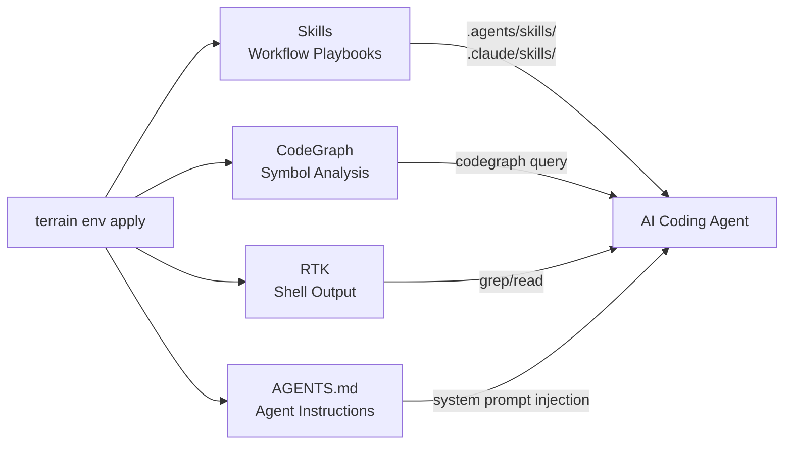
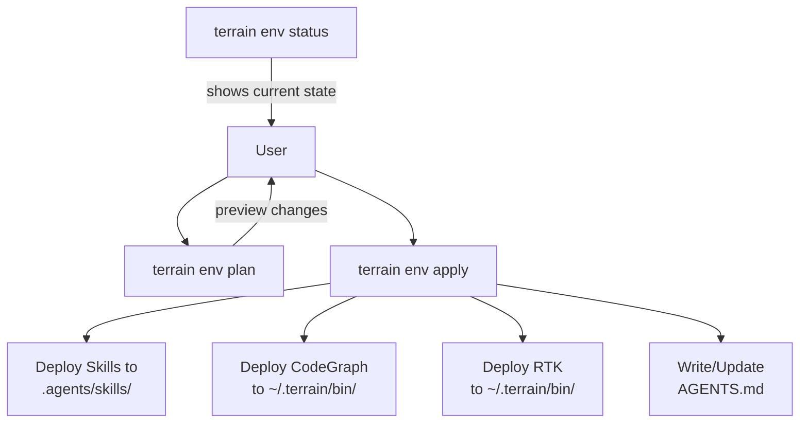

# Agent Tools Ecosystem — Skills, CodeGraph, RTK

## What this module does

The Agent Tools Ecosystem is Terrain's standardized deployment layer for AI coding agent toolchains. It solves a deceptively hard problem: when an external coding agent (Claude, Codex, Cursor, etc.) opens a project, how does it know what the project is, where to look, and how to work efficiently? The answer is **Skills** (workflow playbooks), **CodeGraph** (symbol relationship analysis), and **RTK** (token-efficient shell output) — all deployed into the repository by `terrain env apply`.

Think of this ecosystem as the **onboarding packet** you hand to a new team member on their first day: here are the rules, here are the tools, here's how to navigate the codebase. Except the "team member" is an AI agent with a context window, and the "onboarding packet" is machine-optimized.

---

## The three tools



### Skills — Workflow Playbooks

Skills are Markdown files that teach an AI agent how to perform specific tasks within Terrain's knowledge architecture. They live in `.agents/skills/` and `.claude/skill/` (conventional paths for different agent frameworks).

| Skill | Purpose |
|-------|---------|
| `terrain-knowledge-skill` | Guides the agent through `.terrain/`'s layered knowledge: context → private knowledge → human docs → repomix → codegraph |
| `repomix-context-skill` | Teaches the agent how to grep and read the repomix source pack |
| `codegraph-skill` | Explains symbol relationship queries: callers, callees, impact analysis |
| `rtk-skill` | Shows the agent how to prefix shell commands with `rtk` for 60–90% token reduction |

Skills are loaded by the agent's skill tool (if available) or injected into the system prompt via `AGENTS.md`. They encode **conventions**, not code — the agent reads them to understand how to navigate the project.

### CodeGraph — Symbol Analysis

CodeGraph provides call-graph and dependency analysis for a repository. It indexes source code into a symbol database and exposes queries:

- **`query`** — find all callers of a function, all implementations of a trait, all references to a type
- **`sync`** — re-index the repository after code changes
- **`status`** — check index freshness

The tool lives at `~/.terrain/bin/codegraph` (or falls back to `bunx codegraph` / `npx codegraph`).

**Trust caveat:** `codegraph status` can report "up to date" even when the index is stale. Terrain includes an independent drift detection mechanism (`freshness/codegraph.rs`) that cross-validates against Git history. Always run `terrain tools codegraph-drift --project <slug>` before trusting CodeGraph results.

### RTK — Token-Efficient Shell

RTK (Reduce To Korrectness) wraps shell commands to strip banners, colors, timestamps, and other noise that inflates token counts without adding information. A typical `git status` produces ~800 tokens; `<rtk> git status` produces ~150.

Usage: prefix any shell command with `~/.terrain/bin/rtk` (or `<rtk>` in natural language prompts).

---

## Deployment — `terrain env apply`

The `env` command group orchestrates toolchain deployment:



### Status → Plan → Apply

1. **`terrain env status`** probes the current state: are Skills deployed? Is CodeGraph installed? Is `AGENTS.md` current?
2. **`terrain env plan`** shows what would change — which steps would execute and which would be skipped.
3. **`terrain env apply`** executes the plan, deploying only what's missing or outdated.

The catalog of deployable steps is defined in `assets/env/catalog.rs` and managed by `assets/env/apply.rs`. Each step has an ID, a description, and an executor.

### What gets deployed

| Artifact | Location | Purpose |
|----------|----------|---------|
| Skills | `.agents/skills/`, `.claude/skills/` | Agent workflow playbooks |
| CodeGraph binary | `~/.terrain/bin/codegraph` | Symbol analysis tool |
| RTK binary | `~/.terrain/bin/rtk` | Token-efficient shell wrapper |
| Terrain CLI | `~/.terrain/bin/terrain` | CLI for JSON-output agent tools |
| `AGENTS.md` | Project root | System instructions injected into agent context |

### Bundled tools and preset skills

The desktop app and CLI ship with pre-packaged binaries and Skill files:

- **`bundled_tools.rs`** — extracts platform-specific binaries from embedded resources at startup
- **`preset_skills.rs`** — deploys Skill playbooks from the repository's `.agents/skills/` and `.claude/skills/` directories

Both use the `integrations/` module (`integrations/mod.rs:12-21`) for initialization, discovery, and resolution.

---

## Integration paths — `~/.terrain/bin/`

All agent tools follow a conventional path structure:

| Tool | Convention | Fallback |
|------|-----------|----------|
| RTK | `~/.terrain/bin/rtk` | `bunx @terrain-ai/rtk` or `npx @terrain-ai/rtk` |
| CodeGraph | `~/.terrain/bin/codegraph` | `bunx codegraph` or `npx codegraph` |
| Terrain CLI | `~/.terrain/bin/terrain` | `bunx @terrain-ai/cli` or `npx @terrain-ai/cli` |

The local manifest at `.terrain/env/agent-tools.json` (generated, not committed) records what's deployed on this machine. The `agent_tools_deploy.rs` module manages the deployment lifecycle.

On Windows, tools live at `%USERPROFILE%\.terrain\bin\` with `.exe` suffixes, but the `~/.terrain/bin/` convention works in Git Bash and PowerShell 7+.

---

## Trust model

When multiple knowledge sources exist, Terrain enforces a strict priority:

```
repomix source code > codegraph > agent/context.md > human docs
```

This means:
1. **Source code** (in the repomix pack) is always authoritative for code questions
2. **CodeGraph** provides call-graph context but may be stale
3. **Agent context** (`agent/context.md`) provides architectural overview but is generated, not verified
4. **Human docs** (`human/`) are narrative and may be aspirational rather than factual

The freshness scoring system (`freshness/`) quantifies this trust. When `freshness_score < 70`, the agent should cross-check with repomix. When `freshness_score < 50`, agent context is considered unreliable and only repomix source slices should be used.

---

## AGENTS.md — Managed agent instructions

`AGENTS.md` at the project root is Terrain's mechanism for communicating with AI coding agents that read it as part of their system prompt. It contains:

- IPC type conventions (Rust → TypeScript type generation via ts-rs)
- Knowledge asset locations and Git collaboration rules
- Tool usage instructions (RTK prefix, CodeGraph queries)
- Skill loading recommendations
- Freshness thresholds and trust priorities

`AGENTS.md` is **generated and managed** by `terrain env apply` (`assets/env/agents_md.rs`). It should not be hand-edited — any custom instructions should be placed in a separate file that Terrain doesn't manage.

---

## Key source files

| File | Lines | Role |
|------|-------|------|
| `terrain-core/src/integrations/mod.rs` | 25 | Re-exports all integration functionality |
| `terrain-core/src/agent_tools_deploy.rs` | — | Tool deployment lifecycle |
| `terrain-core/src/bundled_tools.rs` | — | Binary extraction and discovery |
| `terrain-core/src/preset_skills.rs` | — | Skill playbook management |
| `terrain-core/src/assets/env/catalog.rs` | — | Integration step catalog |
| `terrain-core/src/assets/env/apply.rs` | — | Step execution |
| `terrain-core/src/assets/env/agents_md.rs` | — | AGENTS.md generation |

---

## Design principles

1. **Convention over configuration.** `~/.terrain/bin/` is the universal tool location. No per-project config needed.
2. **Graceful degradation.** If a tool isn't installed, the skill documents how to fall back to `bunx`/`npx`.
3. **Idempotent deployment.** `terrain env apply` is safe to run repeatedly — it only deploys what's missing or changed.
4. **Transparent trust.** The freshness system explicitly quantifies how much to trust each knowledge layer, rather than treating all knowledge as equally reliable.
