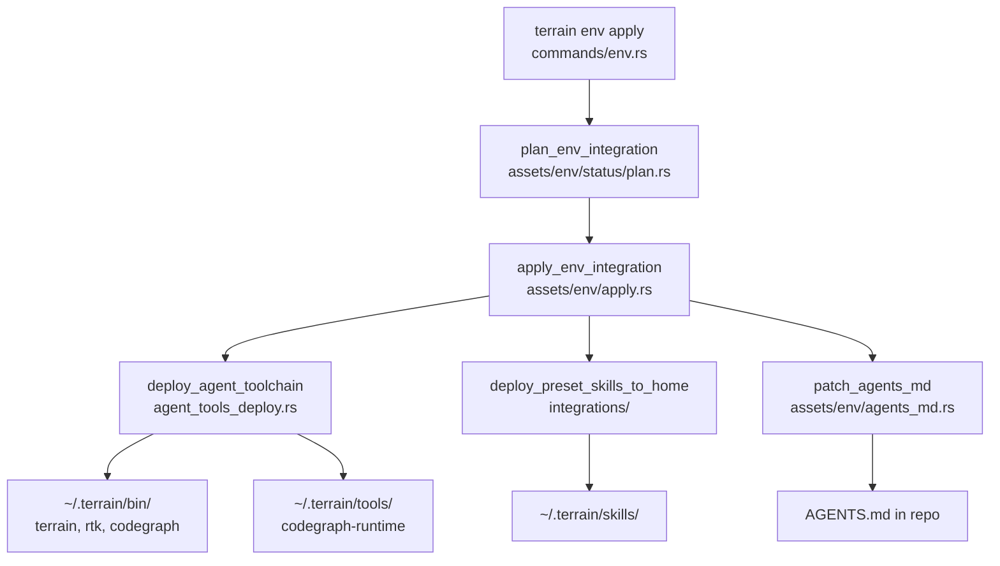

# agent-tools Domain

**Module path:** `crates/terrain-core/src/agent_tools_deploy.rs`, `integrations/`, `assets/env/`  
**Generated:** 2026-08-24

---

## What This Module Does

The agent-tools subsystem solves a practical deployment problem: external coding agents (Claude Code, Codex, OpenCode) need to call `terrain tools`, `codegraph`, and `rtk` from their shell, but app bundles and npm packages aren't automatically on the agent's PATH. This module materializes bundled binaries into `~/.terrain/bin/` — symlinks on Unix, fingerprinted copies on Windows — so agents can discover and invoke them reliably.

Think of it as building the on-ramps onto Terrain's "roads" — without this, agents would know about the knowledge map but couldn't drive to it.

---

## Core Capabilities

1. **Toolchain deployment** — `deploy_agent_toolchain` (`agent_tools_deploy.rs:71`) creates `terrain`, `rtk`, and `codegraph` entries in `~/.terrain/bin/`
2. **CodeGraph runtime** — Deploys `codegraph-runtime` wrapper to `~/.terrain/tools/` with platform-specific launcher scripts
3. **RTK deployment** — Materializes the RTK token-optimization binary from app bundle
4. **Terrain CLI sidecar** — Resolves bundled `terrain` executable next to app via `resolve_sidecar_next_to_exe` (`integrations/`)
5. **Full env integration** — `apply_env_integration` (`assets/env/apply.rs`) orchestrates Skills + tools + AGENTS.md in dependency order
6. **Env catalog** — `env-catalog/catalog.json` defines installable components with IDs, dependencies, and probe commands

---

## Key Components

| Component / Type | File path | Core responsibility |
|-----------------|-----------|---------------------|
| `deploy_agent_toolchain` | `crates/terrain-core/src/agent_tools_deploy.rs:71` | Main toolchain deploy entry |
| `AgentToolPaths` | `agent_tools_deploy.rs:39-46` | Resolved paths after deployment |
| `DeployOptions` | `agent_tools_deploy.rs:33-36` | Force vs gap-fill deployment mode |
| `agent_bin_dir` | `agent_tools_deploy.rs:59-63` | Returns `~/.terrain/bin/` path |
| `bundled_tools.rs` | `crates/terrain-core/src/bundled_tools.rs` | Discover bundled sidecar binaries |
| `apply_env_integration` | `crates/terrain-core/src/assets/env/apply.rs` | Full env apply with progress |
| `plan_env_integration` | `crates/terrain-core/src/assets/env/status/plan.rs` | Plan install steps with status |
| `patch_agents_md` | `crates/terrain-core/src/assets/env/agents_md.rs` | Inject managed AGENTS.md snippets |
| `deploy_preset_skills_to_home` | `crates/terrain-core/src/integrations/mod.rs` | Copy preset skills to `~/.terrain/skills/` |

---

## Internal Data Flow

**Key steps:**
1. `plan_env_integration` probes current status of each catalog component
2. `apply_env_integration` executes steps in dependency order (terrain-knowledge → repomix → codegraph → rtk)
3. `deploy_agent_toolchain_with_options` creates symlinks (Unix) or fingerprinted copies (Windows)
4. `patch_agents_md` adds managed snippets pointing agents to knowledge-first workflow

---

## Key Interfaces and Extension Points

- **Env catalog**: `env-catalog/catalog.json` defines components; add new entries for additional tools
- **`DeployOptions.force`**: Reinstall even when fingerprints match (useful after app update)
- **`invalidate_env_status_cache`**: Force re-probe of component status after manual changes
- **Platform handling**: Unix symlinks vs Windows copy-with-fingerprint in `agent_tools_deploy.rs`

---

## Interactions with Other Modules

| Module | Direction | Interface | Description |
|--------|-----------|-----------|-------------|
| terrain-cli | Invoked by | `commands/env.rs` | CLI `env apply/plan/status` |
| desktop-app | Invoked by | `run_env_integration_cmd` | GUI env integration panel |
| bundled_tools | Depends on | `bundled_terrain_cli`, `bundled_rtk` | Source binaries from app bundle |
| preset_skills | Depends on | `deploy_preset_skills_to_home` | Skills deployed alongside tools |

---

## Role in Core Business Flows

**In agent onboarding**: `terrain env apply` is the one-command setup that makes a repo agent-ready — Skills, tools, and AGENTS.md snippets installed in correct dependency order.

**In ACP integration**: Deployed `terrain` binary enables `terrain tools` JSON API from any agent shell.

**In CodeGraph usage**: Deployed `codegraph` wrapper enables symbol queries; `codegraph_drift` in freshness module tracks index staleness.

---

## Performance Considerations

- **Unix symlinks**: Cheap, always track the latest bundled sidecar without copy overhead
- **Windows fingerprint skip**: `FileFingerprint` (size + mtime) avoids unnecessary copies when binary unchanged
- **Locked file fallback**: Graceful handling when `terrain.exe` is in use by a running agent
- **Status cache**: `invalidate_env_status_cache_for_repo` avoids re-probing on every UI render

---

## Implementation Highlights

- **Windows CREATE_NO_WINDOW**: Patched `agent-client-protocol-tokio` prevents console flash when spawning ACP agents (`Cargo.toml:53-58`)
- **CodeGraph wrapper script**: `CODEGRAPH_WRAPPER_CMD` on Windows redirects to runtime directory (`agent_tools_deploy.rs:28-30`)
- **Manifest output**: `AgentToolPaths` serialized to JSON for agent discovery of deployed tool locations
- **Probe commands**: Each catalog entry defines how to verify successful installation (`assets/env/status/probe.rs`)
