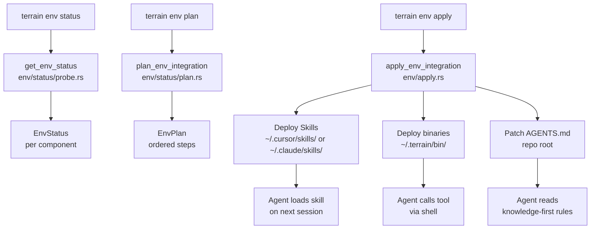

# agent-tools Domain

**Module path**: `preset_skills/`, `env-catalog/`, `packages/`, `npm/`
**Generated**: 2026-08-22

---

## What This Module Does

The agent-tools domain is Terrain's "gear locker" — everything the platform deploys into a developer's environment to make AI coding agents more effective. This includes preset Skills (structured LLM workflow instructions for Litho, SDD, Ask, and architecture tasks), AGENTS.md snippets that teach agents the knowledge-first workflow, and bundled CLI tools (CodeGraph for symbol queries, RTK for shell output compression, terrain CLI for knowledge access).

Think of it this way: Terrain generates the map (knowledge assets), but agent-tools builds the roads (navigation conventions) and equips the travelers (agent toolchains). Without this domain, agents would have the knowledge files but no standardized way to find and use them.

---

## Core Capabilities

1. **Preset Skills** — Structured workflow instructions in `preset_skills/` that agents load for specific tasks (Litho doc generation, SDD phases, Ask Q&A, architecture context).

2. **Environment catalog** — `env-catalog/` defines installable components with dependency ordering and status probing.

3. **Bundled CLI tools** — `packages/` ships CodeGraph, RTK, and terrain CLI binaries for macOS and Windows.

4. **AGENTS.md injection** — Managed snippets in `env-catalog/agents-md/` that get patched into the repository root, pointing agents to knowledge layers.

5. **Deployment orchestration** — `apply_env_integration` installs components in dependency order: terrain-knowledge → repomix → codegraph → rtk.

6. **npm distribution** — `npm/packages/` provides cross-platform binary shims (`@terrain-ai/cli`, `@terrain-ai/rtk`) for npm-based installs.

---

## Key Components

| Component / Type | File Path | Responsibility |
|----------------|-----------|----------------|
| Litho skill | `preset_skills/litho-documents-skill/SKILL.md` | Four-phase C4 doc generation workflow |
| SDD skill | `preset_skills/sdd-workflow-skill/SKILL.md` | Four-phase SDD development workflow |
| Ask skill | `preset_skills/terrain-ask-skill/SKILL.md` | Knowledge-grounded Q&A playbook |
| Architecture skill | `preset_skills/agent-architecture-skill/SKILL.md` | Agent context generation workflow |
| Context skill | `preset_skills/agent-context-skill/SKILL.md` | Context.md generation instructions |
| Env catalog | `env-catalog/skills/` | Skill install manifests |
| AGENTS.md fragments | `env-catalog/agents-md/` | Managed agent instruction snippets |
| `apply_env_integration` | `crates/terrain-core/src/assets/env/apply.rs` | Deploy skills, tools, AGENTS.md |
| `plan_env_integration` | `crates/terrain-core/src/assets/env/status/plan.rs` | Diff current vs desired state |
| `deploy_agent_toolchain` | `crates/terrain-core/src/agent_tools_deploy.rs` | Binary deployment to `~/.terrain/bin/` |
| `bundled_tools.rs` | `crates/terrain-core/src/bundled_tools.rs` | Resolve sidecar binaries next to app exe |
| CodeGraph package | `packages/codegraph/` | Symbol graph CLI wrapper |
| RTK package | `packages/rtk/` | Shell output token compressor |
| terrain CLI npm | `npm/packages/cli/` | Cross-platform terrain binary shim |

---

## Internal Data Flow

**Key steps:**
1. `get_env_status` probes each catalog component (installed? version? path?)
2. `plan_env_integration` computes the diff between current and desired state
3. `apply_env_integration` executes plan steps in dependency order with progress callbacks
4. Skills are copied to the agent's skill directory (Cursor, Claude, etc.)
5. Binaries are deployed to `~/.terrain/bin/` and added to PATH
6. AGENTS.md fragments are merged into the repo root file

---

## Key Interfaces and Extension Points

- **Env catalog JSON** — New installable components are defined in `env-catalog/` manifests
- **`resolve_preset_skill_dir`** — Searches app bundle → home directory → repo for skill locations
- **`resolve_sidecar_next_to_exe`** — Finds bundled binaries adjacent to the Tauri app executable
- **npm platform shims** — `npm/packages/cli-darwin-arm64/` etc. provide pre-built binaries per platform
- **Skill SKILL.md format** — Standard Cursor/Claude skill structure with frontmatter and references/

---

## Interactions with Other Modules

| Module | Direction | Interface | Description |
|--------|-----------|-----------|-------------|
| terrain-core | Integrated via | `assets/env/`, `agent_tools_deploy.rs` | Core executes deployment |
| terrain-agent | Uses skills | Litho, SDD, Ask, context skills | Agent loads skills for workflows |
| External agents | Consumes | Skills + AGENTS.md + tools | Claude Code, Codex, OpenCode |
| Desktop app | Initializes | `preset_skills.rs`, `bundled_tools.rs` | App setup deploys bundled resources |

---

## Role in Core Business Flows

**In Litho generation**: The Litho document skill (`preset_skills/litho-documents-skill/`) is the instruction set the ACP agent follows during the four-phase pipeline. `resolve_litho_skill_dir` in terrain-core finds the skill directory, and `build_litho_generation_prompt` embeds its path in the ACP prompt.

**In SDD workflow**: The SDD skill defines phase-specific instructions. `resolve_sdd_skill_dir` provides the path, and `build_sdd_phase_prompt` constructs the per-phase prompt.

**In agent onboarding**: `terrain env apply` is the one-command setup that makes a repository agent-ready. It installs the knowledge-first AGENTS.md snippet, deploys search tools, and places Skills where the agent's IDE expects them.

---

## Performance Considerations

- Env status probing is cached (`invalidate_env_status_cache` on apply)
- Bundled tools initialized once on app startup (`init_app_bundled_tools`)
- Skill directories resolved at plan time, not on every workflow invocation
- npm shims are thin wrappers — no runtime overhead beyond binary spawn

---

## Implementation Highlights

The dependency ordering in env integration (terrain-knowledge → repomix → codegraph → rtk) reflects a deliberate bootstrapping sequence: agents first learn *where* knowledge lives (terrain-knowledge skill), then *how* to search source (repomix skill), then *how* to query symbols (codegraph), and finally *how* to save tokens on shell output (rtk). Each skill builds on the conventions established by the previous one, creating a coherent agent workflow rather than a bag of unrelated tools.

The ACP tokio patch (`crates/agent-client-protocol-tokio-patched/`) hides the console window on Windows when spawning ACP agents, preventing a black terminal flash on every Litho or SDD delegation — a small UX detail that matters when agents spawn subprocesses frequently.
