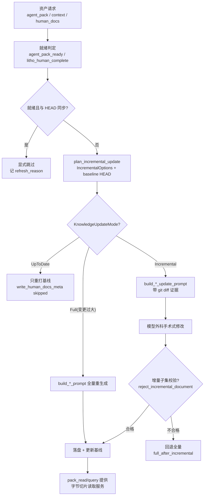

# 知识资产工厂（assets）领域

**模块路径**：`crates/terrain-core/src/assets/`（repomix、agent_context、context_layers、litho、sdd、ask、incremental、env、project_meta、query、pack_read、mod）
**生成日期**：2026-09-21

---

## 概述

assets 模块是 Terrain 的"知识工厂"——它不产出知识内容本身（那些由 terrain-agent 里的 LLM/ACP 完成），而是负责**一切都好管起来的骨架**：判定某类资产是否就绪、规划该怎么生成、构建喂给模型的 prompt、把模型产物安全写盘，并提供 pack 的字节级读取缓存。可以说，从 `agent/repomix.md` 到 `human/*.md` 到 `agent/context.md`，凡是 `.terrain/` 里需要"先判断再生成再落盘"环节的资产，决策与执行细节都收敛在这个模块里。

把它想成工厂的车**间调度中心**：它知道每台机器（repomix、agent_context、litho、sdd、ask、env）该什么时候开、原料（源码、Git diff、前序工件）从哪来、成品放哪个货架（`.terrain/` 的哪个子目录）。它最重要的设计哲学是——**让一切智能环节可被"增量 + 显式跳过"驱动**：能增量就增量、能跳过就跳过，避免每次提交都付全量生成成本。这也是整个系统"增量优先、失败保守回退"架构原则的主要载体。

---

## 核心功能点

1. **打包与就绪判定（`assets/repomix.rs`）**——`pack_agent_assets` 用内嵌 `repomix-core` 把源码打成 `agent/repomix.md` + `agent/meta.json`（`AgentPackMeta`：token 统计、baseline git HEAD）；`agent_pack_ready` 判定包是否已生成且与 HEAD 同步。它是 Ask 中观/微观检索的物理底座。

2. **人类文档生成规划（`assets/litho.rs`）**——`plan_litho_generation` 产出 `LithoPlan`（skill 目录、输出目录、工作区、就绪标志）；`litho_human_complete_with_research` 判定 human/ 文档集是否完整（含研究区 `.litho-agent/` 是否齐备）；常量 `LITHO_CORE_RESEARCH_FILES` 定义研究检查点文件名清单。`write_human_docs_meta` 落盘人类文档基线。

3. **增量更新计划（`assets/incremental.rs`）**——`plan_incremental_update` 输入基线 HEAD + `IncrementalOptions` 输出 `KnowledgeUpdateMode`：`UpToDate` / `Incremental` / `Full`。变更文件数超 `incremental_max_changed_files`（默认 60）时返回 `Full { reason: "too_many_changed_files" }`。这是"增量优先"决策的单一真源。

4. **Agent 上下文资产（`assets/agent_context.rs`）**——`build_agent_context_prompt` 与 `build_agent_context_update_prompt` 构建生成/增量更新 prompt；`write_agent_context` 落盘；`agent_context_recorded_baseline_head` 维护基线；`agent_context_synced_with_head` 判定与 HEAD 同步。`context_layers.rs` 提供宏观/中观/微观三层切分。

5. **SDD 资产（`assets/sdd.rs`）**——`plan_sdd_workflow` 产出 `SddPlan`（skill 目录/工作区/输出目录/`skill_ready`）；`build_sdd_phase_prompt` / `build_sdd_llm_prompt` 构建阶段 prompt；session CRUD（`create_sdd_session` 等）；`save_sdd_output` 用 `is_sdd_local_path` 白名单校验后安全写盘。

6. **Ask 会话资产（`assets/ask.rs`）**——`create/list/load/save/set_active/delete/discard` 全套会话 CRUD；`save_ask_messages` 以 `serde_json::Value` 原样写 `messages.json`；`prune_old_sessions` 把 Ask 会话裁到 `MAX_ASK_SESSIONS=50`。

7. **Pack 字节级读取缓存（`assets/pack_read.rs`）**——`read_agent_pack_file` 带缓存索引的字节偏移切片（≤150 行），`grep_agent_pack` 在 pack 代码块内做正则检索并还原 `file_path`+`file_line`。

8. **环境集成资产（`assets/env/*.rs`）**——catalog 载入内置 `env-catalog/catalog.json`，status 探测本机安装状态，plan/apply 计算并执行按依赖顺序的变更方案，`agents_md.rs` patch 受管理的 `AGENTS.md` 片段。

9. **项目元数据（`assets/project_meta.rs`）**——发现 `terrain-meta.json`（模块提示/ADR/术语），把人工维护的私域规范并进资产生成上下文。

---

## 关键组件

这些组件覆盖"判定—规划—写盘—读取"四个环节，是 Terrain 离线的"状态层"。

| 组件/类型 | 文件路径 | 核心职责 |
|---------|---------|---------|
| `pack_agent_assets` / `agent_pack_ready` | `crates/terrain-core/src/assets/repomix.rs` | repomix 打包 + 就绪/同步判定 |
| `plan_litho_generation` | `crates/terrain-core/src/assets/litho.rs` | 生成 `LithoPlan`（skill/输出/工作区） |
| `litho_human_complete_with_research` | `crates/terrain-core/src/assets/litho.rs` | human/ + 研究区完整性判定 |
| `plan_incremental_update` | `crates/terrain-core/src/assets/incremental.rs` | 增量三态计划（UpToDate/Incremental/Full） |
| `build_agent_context_prompt` / `write_agent_context` | `crates/terrain-core/src/assets/agent_context.rs` | context 生成 prompt 与落盘 |
| `plan_sdd_workflow` / `build_sdd_phase_prompt` | `crates/terrain-core/src/assets/sdd.rs` | SDD 工作流计划与阶段 prompt |
| `save_sdd_output` / `is_sdd_local_path` | `crates/terrain-core/src/assets/sdd.rs:176` / `paths.rs:207` | SDD 产物安全写盘（路径白名单） |
| `save_ask_messages` / `create_ask_session` | `crates/terrain-core/src/assets/ask.rs:259,150` | Ask 会话持久化（messages/meta/active） |
| `read_agent_pack_file` | `crates/terrain-core/src/assets/pack_read.rs` | pack 字节级切片（带缓存索引） |
| `grep_agent_pack` | `crates/terrain-core/src/assets/query.rs:58` | pack 代码块内 grep + 行号还原 |
| env status/plan/apply | `crates/terrain-core/src/assets/env/{status,plan,apply}.rs` | 环境集成探测、计划、应用 |
| `discover_project_meta` | `crates/terrain-core/src/assets/project_meta.rs` | `terrain-meta.json` 发现与解析 |

---

## 内部数据流

以一个"要一份 Agent 上下文"为例，看 assets 是如何编排决策的。注意两条关键分叉：**同步则跳过**（不付任何模型成本）、**增量不合格则回退全量**（宁可多花成本也不让烂结果落盘）。

**关键步骤说明**：
1. 就绪过滤（repomix.rs）：`agent_pack_ready` / `litho_human_complete_with_research` 在生成前先问"要不要生成"。这是成本的第一个闸门。
2. 增量计划（incremental.rs：`plan_incremental_update`）：以 Git HEAD 为基线，用 diff 证据喂模型做局部修补；变更过大自动回退 `Full`。
3. 写盘约束（sdd.rs `save_sdd_output` + `paths.rs is_sdd_local_path`）：SDD 产物只允许落在 `~/.terrain/sdd/` 白名单内，杜绝模型输出路径越界写盘。
4. 读取服务（pack_read.rs / query.rs）：生成完 pack 之后的检索与切片都走这里，`grep_repomix_pack` 返回带 `file_path`+`file_line` 的可定位命中。

---

## 关键接口与扩展点

- **`plan_incremental_update(baseline_head, options) -> KnowledgeUpdateMode`**：整个系统增量语义的单一真源，任何"要不要重跑"的决策都可复用。
- **`build_*_prompt` 系列**：`build_litho_generation_prompt` / `build_litho_composition_prompt` / `build_sdd_phase_prompt` / `build_agent_context_prompt`——"如何引导模型"收口一处，`prompts/mod.rs:3-6` 只是薄 re-export 门面。新增任务类型只需在 assets 下添一个 prompt 构建器。
- **`pack_read` / `query` 两个读取接口**：`read_agent_pack_file`（按路径读切片）与 `grep_repomix_pack`（按正则 grep）是 Agent 检索的孪生工具，都由 tools.rs 暴露给模型。
- **新增资产类型**：在 `assets/` 下加子模块 + 在 `AssetGenerationPlan` / `KnowledgeUpdateMode` 枚举上扩展即可，外围工作流不变。

---

## 与其他模块的交互

| 交互模块 | 方向 | 接口/协议 | 说明 |
|---------|------|---------|------|
| `ingest` | 被依赖 | `maybe_pack_agent_assets` | 扫描后顺带触发 repomix 打包 |
| `freshness` | 依赖 | Git 变更集 / 基线 | 增量计划需要 diff 证据与基线 HEAD |
| `settings` | 依赖 | `KnowledgeSettings` / `IncrementalOptions` | 增量偏好、`incremental_max_changed_files` |
| `preset_skills` | 依赖 | `resolve_sdd_skill_dir` / `default_sdd_skill_dir` | SDD skill 目录定位（`skill_ready`） |
| `paths` / `doc` | 依赖 | `KnowledgePaths` / `write_doc` | 路径解析与文档读写 |
| `terrain-agent`（litho / agent_context / workflows） | 消费 | `plan_litho_generation` / `build_*_prompt` | 所有 LLM 环节的离线决策底座 |
| `tools` | 消费 | `read_agent_pack_file` / `grep_repomix_pack` | Ask 微层检索工具 |
| `src-tauri` / `terrain-cli` | 消费 | `plan_assets_cmd` / `assets plan` 等 | 规划不执行的流水线命令 |

---

## 跨模块协作场景

**在「项目初始化」中**：`run_project_initialization` 先经 `ProjectScanner` 扫描，随即 `maybe_pack_agent_assets`（本模块）产出 repomix 包；`litho_human_complete_with_research`（本模块）判定 human/ 是否已齐，不齐才调 Litho；随后 `run_agent_context_if_needed` 用 `agent_pack_ready` 判定、用 `plan_incremental_update` 决定 context 走增量还是全量。整条流水线的"要不要跑、跑增量还是全量、产物落哪"全部由 assets 的决策函数拍板，terrain-agent 只负责驱动模型。

**在「Ask 问答的微观检索层」中**：Agent 调 `grep_repomix_pack`（query.rs）在 `agent/repomix.md` 里定位代码块、拿到 `file_path`+`file_line`，再调 `read_agent_pack_file`（pack_read.rs）取字节切片。两个接口都来自本模块，构成"先定位、后切片"的两段式检索，其字节定位性能由 pack_read 的缓存索引保障（而不是每次全扫 1MB 文件）。

**在「SDD 四阶段」中**：`plan_sdd_workflow` 产出 `SddPlan`，`build_sdd_llm_prompt` / `build_sdd_phase_prompt` 为每阶段拼 prompt（只带前序工件 + 当前草稿），`save_sdd_output` 白名单落盘——assets 负责全部"纸面管理"，terrain-agent 的 `run_sdd_phase` 只做执行调度。

---

## 性能考量

- **增量优先省 token**：`plan_incremental_update` 直接让"零 token 的保鲜"成为常态——repack 可跳过、context 可跳过、Litho 可跳过，每段都由 HEAD 比对兜底。
- **pack_read 缓存索引**：对 ~1MB 的 repomix pack 不做线性全扫，`read_agent_pack_file` 用缓存的字节偏移定位，是 Agent 微观检索的性能基石。
- **只 stat 不读正文**：SDD 的 `build_phase_infos` 判定阶段完成度只做 `is_file()` + 读 mtime，不读四个 md 的内容；大文件只在 prompt 拼装时按需 `read_to_string`。
- **本地优先**：所有决策（就绪/增量/跳过）都是纯文件系统 + Git 元数据操作，不触网、不调模型，成本可忽略。

---

## 实现亮点

1. **"文件系统即状态机"**：SDD 阶段进度就是 `outputs/` 下有没有对应文件（`assets/sdd.rs:287`），删文件即回退进度——没有数据库、没有额外状态字段，与"文件系统是真理"的 Unix 精神一脉相承。
2. **增量守恒的保守校验**：`reject_incremental_document` 要求增量结果必须是基线超集，否则先尝试从磁盘恢复 Agent 的就地编辑、再回退全量（`agent_context.rs:124-179`）——把"LLM 用摘要覆盖整篇好文档"的可能安全事故焊死。
3. **路径即权限域**：`save_sdd_output` 的 `is_sdd_local_path` 白名单（`paths.rs:207`）让"目录即权限域"充当数据库式的写权限约束。
4. **规划与执行彻底分离**：`plan_litho_generation` / `plan_sdd_workflow` / `plan_incremental_update` 都只产出"计划"不执行，让 CLI/Tauri 能提供"只看要做什么"的只读命令（`assets plan`），也让执行层可以把计划当上下文喂给模型。