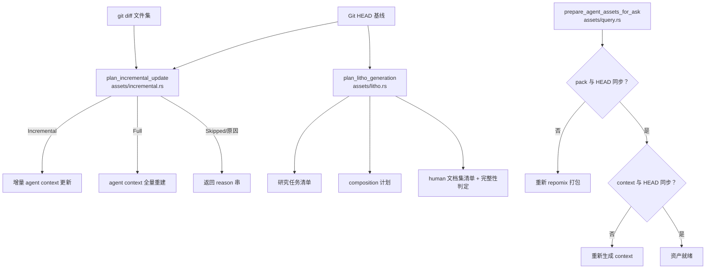

# assets（知识资产生成）领域

**模块路径**：`crates/terrain-core/src/assets/`
**生成日期**：2026-09-15

---

## 这个模块在做什么

assets 模块是 Terrain 知识工厂的"打包机 + 双车间调度器"。它的核心使命是把"源码仓库当前的状态"转化为"Agent 与人类可消费的知识文件"——并且决定每一种资产该在何时生成、以何方式更新。如果你把 Terrain 比作一条汽车生产线，assets 就是那个决定"这批零件该进哪个车间、用全新材料还是只换变更部分"的调度中心。

这个模块之所以关键，是因为它同时管理着四种截然不同的知识资产：repomix 源码索引（供 Agent grep）、agent context 分层摘要（供 Agent 问答）、human C4 文档（供人类阅读）和 env 工具链配置（供 Agent 部署）。每种资产的生成时机、增量策略和完整性判定都不同，但它们共享同一个 `KnowledgePaths` 路径中央账本。

---

## 核心功能点

1. **repomix 打包**：把源码折叠成带行号的 Markdown 包（`agent/repomix.md`），供 Agent 用 `grep-pack`/`read-pack-file` 检索。`baseline_matches_head` 检查当前 HEAD 是否与 pack 生成时的基线一致，不一致则需要重打。核心实现在 `crates/terrain-core/src/assets/repomix.rs`。

2. **agent context 生成**：按 `context_layers`（`ContextSection` + `AGENT_CONTEXT_*_MAX_CHARS`）从模块扫描里组织分层摘要，写 `context.md` 并做 HEAD baseline 标记。16KiB 上下文上限确保输出精炼。核心实现在 `crates/terrain-core/src/assets/agent_context.rs`。

3. **Litho 编排**：`plan_litho_generation` 生成"定义文件 × N + 研究任务清单 × M + 四阶段 composition + human 文档集清单"的完整计划；`litho_human_complete_with_research` 判断文档集是否已齐（含研究产物）。核心实现在 `crates/terrain-core/src/assets/litho.rs`。

4. **增量更新决策**：`plan_incremental_update` 依据 git diff 把变更文件分组进 `KnowledgeUpdateMode`（Incremental/Full/Skipped/UpToDate），返回 reason 串（`full_after_incremental_untrustworthy` / `recovered_from_disk` / `up_to_date`）以便诊断。核心实现在 `crates/terrain-core/src/assets/incremental.rs`。

5. **Ask 前资产准备**：`prepare_agent_assets_for_ask` 在每次问答前确保 pack/context 与 HEAD 同步，实现"带着最新地图再上路"的设计哲学。核心实现在 `crates/terrain-core/src/assets/query.rs`。

---

## 关键组件

| 组件/类型 | 文件路径 | 核心职责 |
|---------|---------|---------|
| `KnowledgeAssets` | `crates/terrain-core/src/assets/mod.rs` | 模块入口，组织所有资产生成子模块 |
| `AgentPackReport` | `crates/terrain-core/src/assets/repomix.rs` | pack 元信息（files/tokens/baseline） |
| `AgentContextConfig` | `crates/terrain-core/src/assets/agent_context.rs` | context 生成配置（尺寸/章节上限） |
| `ContextSection` | `crates/terrain-core/src/assets/agent_context.rs` | context 分章节抽象（标题 + 内容 + 截断） |
| `LithoPlan` / `LithoStage` | `crates/terrain-core/src/assets/litho.rs` | 文档生成编排与阶段定义 |
| `KnowledgeUpdateMode` | `crates/terrain-core/src/assets/incremental.rs` | 增量/全量/跳过/已同步 |
| `KnowledgeUpdateReason` | `crates/terrain-core/src/assets/incremental.rs` | 决策原因（可上报 UI/CLI） |

---

## 内部数据流

**关键步骤说明**：
1. **增量决策**（`plan_incremental_update`）：由 `assets/incremental.rs` 处理，根据 git diff 文件数与 `incremental_max_changed_files` 阈值决定 Incremental 或 Full
2. **Litho 计划**（`plan_litho_generation`）：由 `assets/litho.rs` 处理，定义研究阶段与编排阶段的任务清单
3. **Ask 前同步**（`prepare_agent_assets_for_ask`）：由 `assets/query.rs` 处理，确保 pack 和 context 都与当前 HEAD 一致

---

## 关键接口与扩展点

assets 模块的核心扩展点在于"新增知识资产"：只需在 `assets/mod.rs` 加一个组装步骤，将其纳入 `litho_human_complete_with_research` 判定或增量 reason 体系，即可被 Init/Refresh 流程自动覆盖。

`KnowledgeUpdateMode` 枚举是增量策略的插桩点——新增一种更新模式（如"仅更新特定章节"）只需扩展枚举变体和 `plan_incremental_update` 的判定逻辑。

---

## 与其他模块的交互

| 交互模块 | 方向 | 接口/协议 | 说明 |
|---------|------|---------|------|
| ingest | 被依赖 | `ProjectScanner.scan_repo` | scan 的产出是 assets 的输入 |
| freshness | 依赖 | `baseline_matches_head` | assets 检查基线是否需要重打 |
| chat | 被依赖 | `prepare_agent_assets_for_ask` | Ask 前确保资产就绪 |
| workflows | 被依赖 | `run_litho_generation` | workflows 调用 assets 的 Litho 计划 |
| settings | 依赖 | `KnowledgeSettings` | 增量策略参数从 settings 读取 |
| env | 被依赖 | `assets/env/mod.rs` | env 是 assets 的子模块 |

---

## 跨模块协作场景

> 本模块在核心业务流程中的角色

**在项目初始化中**：assets 是核心调度器。具体参与：
- `ingest.scan_repo` 扫描完成后，`plan_litho_generation` 定义 Litho 的研究与编排计划
- `run_litho_generation` 根据计划驱动 ACP Agent 生成 `human/` 文档集
- `run_agent_context_if_needed` 生成 `agent/context.md`，与 pack 一起构成 Agent 可消费的知识

**在 DeepWiki Ask 中**：assets 作为"守门人"确保知识最新。具体参与：
- `prepare_agent_assets_for_ask` 在每次 turn 前检查 pack/context 与 HEAD 的同步状态
- 不同步时自动补齐，确保 LLM 回答基于最新知识

**在快速刷新中**：assets 的增量策略是性能关键。具体参与：
- `plan_incremental_update` 根据 git diff 决定增量/全量/跳过
- 增量 context 更新只处理变更部分，全量重建仅在 diff 不可信时触发

---

## 性能考量

- **repomix in-sync 跳过**：未变更时不重新打包源码，节省最耗时的 IO 操作
- **增量 agent context**：按 git diff 分组，只更新变更部分；`incremental_max_changed_files=60` 阈值防止"增量吃到撑"
- **Litho 启发式提前结束**：检测文档集完整后立即结束等待，避免无谓空转
- **16KiB context 上限**：确保输出精炼，减少 LLM 消费的 token 数

---

## 实现亮点

- **Litho 完整性判定**（`litho_human_complete_with_research`）：不仅检查文档文件是否存在，还检查研究产物是否齐全，实现了"续传"能力——ACP 中途失败时产物仍在 `.litho-agent/`，下次可从断点继续
- **增量 reason 体系**（`KnowledgeUpdateReason`）：每个决策都附带稳定的 reason 字符串（如 `full_after_incremental_untrustworthy`），便于 UI 展示和 CI 日志诊断
- **Ask 前同步的"带着最新地图再上路"**：不是在 Init 时一次性同步，而是在每次问答前动态检查，确保即使用户在两次 Ask 之间提交了代码，回答也基于最新知识
