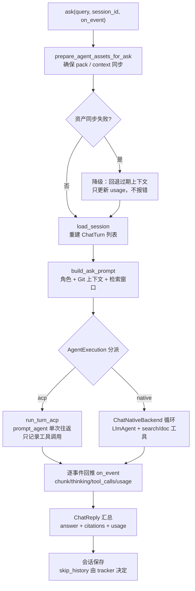

# ChatEngine（问答引擎）领域

**模块路径**：`crates/terrain-agent/src/chat/`（mod.rs、native.rs、acp.rs、prompt.rs、tracker.rs、types.rs）
**生成日期**：2026-09-21

---

## 概述

ChatEngine 是 Terrain 的**问答引擎**：用户在前端 DeepWiki 输入框（或 CLI `terrain ask`）提问，它把问题翻译给一个 LLM（本地内置运行时或外部 ACP Agent），然后以流式的方式把思考、工具调用、最终答案一行行推回界面。真正复杂的地方不是"调用一个模型"——而是它同时是一层**资源保障层**（开始回答前必须先确保知识资产就绪）、一条**双后端分派总闸**（native 循环 vs ACP 子进程）、以及一个**流式事件分型系统**（chunk/thinking/tool_calls/phase/usage）。

把它想成一家**餐厅的传菜主管**：客人点菜（提问）后，他先确认厨房（pack/context）备好了料，再按后厨配置（落在 native 还是外包给 ACP）指挥烹饪，最后一道道地把菜（`AskStreamEvent`：思考、步骤、引用、用量）端上桌。它既不种菜也不摆盘，但整条出品线的节奏和质量都由它把住。资产保障的语义细节值得单独强调：`prepare_agent_assets_for_ask` 会**自动**补齐过期资产，且补齐过程以 `PreparingPack` / `PreparingContext` 阶段事件对用户可见——"回答问题前顺手把知识库刷到最新"是 ChatEngine 对"答案质量"的保底承诺。

---

## 核心功能点

1. **资产保障（`prepare_agent_assets_for_ask`）**：`chat/mod.rs:127-147`。提问前确保 pack 与 context 与 HEAD 同步，缺哪个补哪个；同步判定分别是 `agent_pack_ready`（无包则先 repack）与 `agent_context_synced_with_head`（落后则生成/增量更新）。对齐失败时诚实降级：回复无 citations 并标注信息过期。

2. **一轮对话分派（`run_turn`）**：`chat/mod.rs:148-203`。`run_turn` 按 `AgentExecution` 把 Agent 循环分派到 ACP（`run_turn_acp`）或 native 实现（`ChatNativeBackend`）。`run_turn_acp` 走 `prompt_agent` 单次往返，全过程不给中间事件，只记录工具调用供 usage 展示。

3. **native 循环实现（ChatNativeBackend）**：`chat/native.rs`。构建 `ChatNativeAgent` 输入（system 提示 + query + session 历史），跑 `LlmAgent` 循环，把搜索/文档工具的执行结果流式转成事件。`chat_engine_run_native_for_test` 是受控的测试入口。

4. **Prompt 构建（`build_ask_prompt`）**：`chat/prompt.rs`。用项目角色、Git 上下文、pack 检索窗口拼出 DeepWiki 版 system prompt；`build_tool_descriptions` 生成工具描述集。`WINDOW` 检索窗口取知识包前 120 行（metapack.metadata 带标题）。

5. **流式事件（`AskStreamEvent`）**：`chat/types.rs` 与 `crates/terrain-core/src/ipc/workflows.rs:621`。枚举 `Chunk`/`Thinking`/`ToolCall`/`DocSchema`/`Phase`/`Usage`/`Status` 以 `serde_json::Value` 载荷存在；ChatEngine 用 `let ... = event` 降级解构，保证解析安全。

6. **会话活动指针（`tracker.rs`）**：把询问同一 session 的恢复指针交给会话存储；会话末尾保存时由 tracker 明确 skip history 写盘（`mark_skip_history` / `resume_at_history`）。API 层面由 ChatEngine 私有序列化单元维护。

7. **会话重建（`load_session`）**：`chat/mod.rs:219-237`。读取会话历史但跳过 `skip_history` 标记的消息，组装成 `ChatTurn` 列表供 native / acp 重建 `ChatAgentContext`。

---

## 关键组件

| 组件/类型 | 文件路径 | 核心职责 |
|---------|---------|---------|
| `ChatEngine` | `crates/terrain-agent/src/chat/mod.rs:54-237` | 核心引擎：合成系统提示、轮次分派、资产保障、会话一致性 |
| `ChatNativeBackend` | `crates/terrain-agent/src/chat/native.rs` | native LLM 循环实现与测试入口 |
| `run_turn_acp` | `crates/terrain-agent/src/chat/acp.rs` | ACP 子进程单次往返 + 工具调用记录 |
| `build_ask_prompt` / `build_tool_descriptions` | `crates/terrain-agent/src/chat/prompt.rs` | DeepWiki system prompt 与工具描述集 |
| `AskStreamEvent` | `crates/terrain-core/src/ipc/workflows.rs:621` | 流式事件类型（Status/Phase/Chunk/Thinking/ToolCall/Usage/DocSchema） |
| `ChatReply` 别名 | `crates/terrain-core/src/ipc/workflows.rs:664` | `ChatReply → AskKnowledgeReply`（ts-rs rename） |
| `load_session` | `crates/terrain-agent/src/chat/mod.rs:219` | 会话历史重建（跳过 skip_history） |
| `prepare_agent_assets_for_ask` | `crates/terrain-agent/src/chat/mod.rs:127` | 问答前的资产自动同步 |

---

## 内部数据流

一次完整 Ask 的结构：资产保障、拆轮次、按后端分派、逐事件回推、最后收尾成 ChatReply。图中两条特判路径是 ChatEngine 的"降级承诺"——引擎构造失败走纯检索，资产同步失败回退过期上下文（只更新 usage）。

**关键步骤说明**：
1. 资产保障（mod.rs:127）：补资产是"问答正确性"的前提，但失败不阻断——回退过期上下文让用户至少得到部分价值。
2. 轮次分派（mod.rs:148）：`run_turn` 是唯一总闸，native/acp 的差异对会话模型不可见。
3. 流式回推：事件在 `Channel` 上以序列化 JSON 传输，UI 无需关心后端是哪种。
4. 收尾：`Done { reply }` 事件终结流；reply 里的 citations 直接由检索 window 组装。

---

## 关键接口与扩展点

- **`ChatEngine::ask(query, session_id, on_event) -> ChatReply`**：问答主入口。`Runtime.chat_engine()` 返回缓存的共享引擎；构造失败由上层 `fallback_search_reply` 降级。
- **`AgentExecution` 模式切换**：纯 ACP / hybrid（AcpNative）由 `settings.rs` 控制，切换后 `Runtime` 自动重建引擎。
- **扩展「新工具」**：工具描述拼进 `build_tool_descriptions`，执行端走 `knowledge_tools.rs:82-174` 或 `tools.rs`；无需改动 ChatEngine 循环。
- **流式协议扩展**：新增事件类型在 `AskStreamEvent` 枚举上加变体，前端 `stores/chat.svelte` + `components/ChatMessageList.svelte` 按需渲染即可。

---

## 与其他模块的交互

| 交互模块 | 方向 | 接口/协议 | 说明 |
|---------|------|---------|------|
| `model` | 依赖 | `build_llm` / `LlmProvider` | native 后端的模型构造与探活 |
| `acp` | 依赖 | `build_acp_config` / `agent_execution_ready` | ACP 后端的配置与门禁 |
| `assets` | 依赖 | `agent_pack_ready` / `agent_context_synced_with_head` | ask 前的资产保障判定 |
| `sessions` | 依赖 | `save_ask_messages` / `create_ask_session` | 会话持久化（写 `messages.json` 与 active 指针） |
| `knowledge`（tools） | 依赖 | `KnowledgeSearch` / `read_agent_pack_file` | 中观/微观检索工具 |
| `workflows/ask` | 被调用 | `ask_knowledge` | 上层把 `fallback_search_reply` 与 ChatEngine 拼成 Ask 流程 |
| `runtime` | 被缓存 | `Mutex<Option<Arc<ChatEngine>>>` | 进程级共享引擎，配置变更即失效 |
| `src-tauri` | 消费 | `ask_knowledge_cmd` | GUI 问答 IPC（流式 Channel） |
| `terrain-cli` | 消费 | `ask` 子命令（`commands/ask.rs`） | CLI 问答（`terrain ask --message`） |

---

## 跨模块协作场景

**在「Ask 完整流程」中**：`ask_knowledge`（workflows/ask.rs:11）先取 `runtime.chat_engine()`，失败即 `fallback_search_reply` 纯检索兜底；成功后调 `ChatEngine.ask`。`ChatEngine::ask` 内部先 `prepare_agent_assets_for_ask` 同步资产（发 `PreparingPack` / `PreparingContext` phase 事件），再 `run_turn` 分派，最后把 `ChatReply` 通过 `Done` 事件送出。会话 CRUD 由 UserService 的 `create_ask_session` 等在 `ask_knowledge_cmd` 内负责，`ChatEngine` 自身只负责"当前这一轮怎么答"。

**在「SDD 文档阶段」中**：`run_sdd_llm_phase`（workflows/sdd.rs:114）不直接调 ChatEngine，而是用 `build_sdd_llm_prompt` 构造 prompt 后调用 `ask_knowledge`——复用同一引擎但注入不同的 prompt 契约（"只回 markdown 将直接落盘"）。这印证了"提示词工程即公共接口"：相同引擎，不同 system 指令，产出完全不同形态（聊天 vs 文档）的输出。

---

## 性能考量

- **`tokio::select!` 20 分钟超时**：Ask 单轮有 `ASK_TIMEOUT_S = 1200` 墙钟，防止 LLM 挂死拖死 UI。
- **增量/节流**：`ThrottledLlm`/`ThrottledTool`（200ms 冷却）在 native 后端生效，降低 429；`tool_session_cache` 对重复调用返回缓存并标注 `duplicate_call: true`。
- **会话裁量**：Ask 会话在 `MAX_ASK_SESSIONS = 50` 阈值下由 `prune_old_sessions` 裁剪，避免知识目录无限膨胀。
- **字节切片读取**：微观检索 `read_agent_pack_file` 走 pack_read 的缓存索引，不做全文件线性扫。

---

## 实现亮点

1. **"降级即价值"的资产保障**：`prepare_agent_assets_for_ask` 同步失败不报错，而是回退过期上下文并只为 usage 买单（mod.rs:127-146）——把"最坏情况"从整段拒绝训练成一个尴尬但不中断的答案。
2. **双后端对会话层无感**：native 与 acp 在 `run_turn` 之下被完全封装，`load_session` 重建的 `ChatTurn` 对两种后端都可用，会话恢复与后端选择正交。
3. **懒解码的流式健壮性**：事件以 `serde_json::Value` 传输、`let ... = event` 安全降级，前端未来加字段不破坏既有渲染。
4. **`ChatReply → AskKnowledgeReply` 的 ts-rs rename**：IPC 类型真源在 Rust，靠生成物重命名保证前端可读性，杜绝手写漂移。