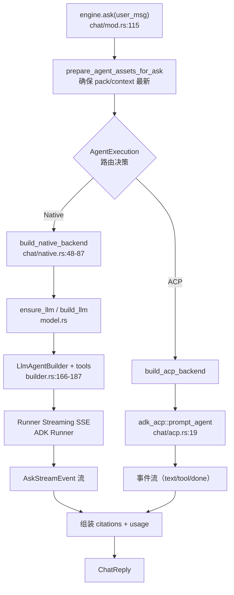

# chat（执行层 / ChatEngine）领域

**模块路径**：`crates/terrain-agent/src/chat/`
**生成日期**：2026-09-15

---

## 这个模块在做什么

chat 模块是 Terrain 知识工厂的"一线工人班组"——它负责真正去调用 LLM 或 ACP 子进程来回答问题、执行任务。如果把 assets 模块比作"调度中心"，chat 就是"执行车间"：调度中心说"这个任务需要调用模型"，chat 就安排工人（Native ADK 或 ACP 子进程）去干活。

这个模块的核心设计是"双后端路由"：Native ADK 后端适合多轮对话、低延迟场景（工人在工厂内部，沟通成本低），ACP 子进程后端适合需要深度工具调用的复杂推理（外包给专业公司，能力更强但沟通成本高）。`ChatEngine` 是统一入口，根据 `AgentExecution` 配置自动选择班次。

---

## 核心功能点

1. **双后端路由**：`ChatEngine`（`chat/mod.rs:54`）根据 `AgentExecution` 配置（`execution_pure_acp` 或 `execution_uses_native_llm`）自动选择执行后端。Ask 前 `prepare_agent_assets_for_ask` 确保 pack/context 与 HEAD 同步。核心实现在 `crates/terrain-agent/src/chat/mod.rs:115`。

2. **Native 会话**：多轮对话、内存会话（`InMemorySessionService`）、流式 SSE。自带五个知识工具：`grep_agent_pack`/`read_agent_pack_file`/`read_agent_context`/`search_knowledge`/`read_doc`，以及 `resolve_project_from_paths`。核心实现在 `crates/terrain-agent/src/chat/native.rs:128`。

3. **ACP 会话**：`adk_acp::prompt_agent` 单发会话，传入 `TERRAIN_PROJECT_SLUG`/`TERRAIN_KNOWLEDGE_ROOT` 等环境变量，结果以 JSON 事件回调。核心实现在 `crates/terrain-agent/src/chat/acp.rs:19`。

4. **可靠性保障**：`ThrottledLlm` 200ms 冷却减少 429、`ASK_TIMEOUT=1200s` 墙钟超时、一次 turn 后按引用组装 `ChatReply`（citations + tool_calls + usage）。核心实现在 `crates/terrain-agent/src/throttle.rs` 和 `chat/mod.rs:33`。

5. **会话持久化**：Ask sessions 可保存/恢复到 `~/.terrain/ask/`，ID 由全局增量计数产生，攒到 active 上限时被 older-first 逐出。核心实现在 `crates/terrain-agent/src/chat/tracker.rs`。

---

## 关键组件

| 组件/类型 | 文件路径 | 核心职责 |
|---------|---------|---------|
| `ChatEngine` | `crates/terrain-agent/src/chat/mod.rs:54` | Ask 统一入口 + 路由决策 |
| `NativeBackend` | `crates/terrain-agent/src/chat/native.rs:43-46` | Native 后端（ADK Runner + session_service） |
| `ModelConfig` | `crates/terrain-agent/src/model.rs:20` | 生效的 LLM 配置（provider/model/endpoint/api_mode） |
| `AskStreamEvent` | `crates/terrain-agent/src/chat/types.rs` | 流式事件联合（chunk/thinking/tool_calls/phase/usage/done） |
| `ChatReply` | `crates/terrain-agent/src/schema/ipc/chat.rs` | 最终回答（answer + citations + tool_calls + usage） |
| `LlmAgentBuilder` | `crates/terrain-agent/src/builder.rs:159` | Agent 构建器：工具注册、max_iterations=50、max_output_tokens=64000 |
| `ThrottledLlm` | `crates/terrain-agent/src/throttle.rs` | LLM 调用节流（200ms 会话间冷却） |

---

## 内部数据流

**关键步骤说明**：
1. **资产同步**（`prepare_agent_assets_for_ask`）：由 `assets/query.rs` 处理，确保 pack 和 context 与 HEAD 一致
2. **Native 执行**（`run_turn_native`）：由 `chat/native.rs:128` 处理，ADK Runner 流式执行，会话状态存内存
3. **ACP 执行**（`run_turn_acp`）：由 `chat/acp.rs:19` 处理，`prompt_agent` 单发会话，环境变量注入

---

## 关键接口与扩展点

**扩展新执行后端**：先加 `AgentExecution` 枚举分支与 `build_*_backend` 函数，然后在 `run_turn` 路由中添加分支。工具注册在 `builder.rs:166-187` 的 tools 列表中。

**扩展知识工具**：在 `builder.rs` 的 tools 列表中添加新工具，Native 后端自动可用；ACP 后端通过 `terrain tools` CLI 子进程暴露。

---

## 与其他模块的交互

| 交互模块 | 方向 | 接口/协议 | 说明 |
|---------|------|---------|------|
| workflows | 依赖 | `ask_knowledge` / `run_sdd_*` | workflows 调用 ChatEngine 执行 Ask 和 SDD |
| assets | 依赖 | `prepare_agent_assets_for_ask` | Ask 前确保资产就绪 |
| settings | 依赖 | `ModelConfig` / `AcpSettings` | 路由决策和 LLM 配置来源 |
| litho | 被依赖 | Litho 编排提示用环境 | Litho 的 ACP 会话由 chat 驱动 |

---

## 跨模块协作场景

> 本模块在核心业务流程中的角色

**在 DeepWiki Ask 中**：chat 是核心执行者。具体参与：
- `engine.ask` 先同步资产，再根据配置路由到 Native 或 ACP
- Native 后端注册五个知识工具，让 Agent 能直接 grep/read/search 知识库
- 流式事件（AskStreamEvent）通过 Tauri Channel 实时推给前端

**在 SDD 四阶段开发中**：chat 分工参与。具体参与：
- requirements/tech-design/code-review 阶段：Native LLM 逐段生成文档
- code-gen 阶段：ACP 子进程在仓库中编写代码，注入 `TERRAIN_SDD_*` 环境变量

**在 Litho 文档生成中**：chat 提供 ACP 执行通道。具体参与：
- `run_litho_generation` 通过 ACP 子进程执行四阶段研究与编排
- 墙钟超时（45min）和进度轮询由 workflows 层控制

---

## 性能考量

- **ThrottledLlm 200ms 冷却**：所有 LLM 调用间强制 200ms 间隔，减少 429 错误
- **ASK_TIMEOUT=1200s**：单次 Ask 会话的墙钟上限，超时则 abort 并报错
- **InMemorySessionService**：会话状态存内存而非磁盘，低延迟但重启丢失
- **older-first 逐出**：active 会话数超限时，最早关闭的会话被逐出

---

## 实现亮点

- **双后端无缝降级**：LLM 不可用 → `fallback_search_reply`（纯检索）；ACP 不可用但有 LLM → 自动退回 Native；两者都没有 → 明确报错。三层降级确保"总有一个能用"
- **Native 会话的五个知识工具**：`grep_agent_pack`/`read_agent_pack_file`/`read_agent_context`/`search_knowledge`/`read_doc` 让 Native Agent 能直接访问知识库，无需通过 CLI 子进程
- **会话持久化与续传**：Ask sessions 可保存到 `~/.terrain/ask/`，支持跨会话恢复；ACP 中途失败时产物仍在 `.litho-agent/`，下次可续传
