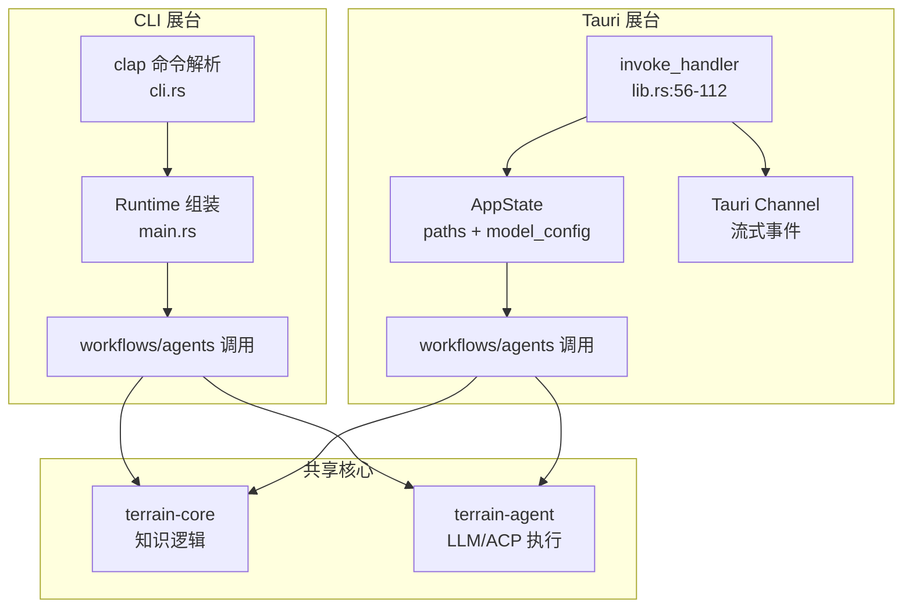

# cli 与 tauri（两个面向用户的网关）领域

**模块路径**：`crates/terrain-cli/` + `src-tauri/`
**生成日期**：2026-09-15

---

## 这个模块在做什么

CLI 和 Tauri 是 Terrain 的"两个展台"——CLI 是无头展台（脚本化、CI 友好、输出供 Agent 消费），Tauri 壳是交互展台（GUI、托盘、IPC 命令面）。它们的关系就像一家餐厅的"外卖窗口"和"堂食大厅"：外卖窗口（CLI）追求效率和自动化，堂食大厅（Tauri）追求体验和交互，但厨房（core/agent）是同一套。

这个设计的关键约束是**绝不复刻业务**：CLI 子命令和 Tauri IPC 命令都是对 core/agent 的薄封装，不包含任何独立的业务逻辑。新增功能时，先在 core/agent 落地，然后 CLI 加子命令 + Tauri 加命令（+ ts-rs 类型），保证两种形态行为一致、类型一致。

---

## 核心功能点

**CLI 侧（`crates/terrain-cli/`）**

1. **15 个无头子命令**：通过 `clap` 定义（`crates/terrain-cli/src/cli.rs`），全局 `--repo-path` 可覆盖仓库路径。所有输出面向脚本（`terrain tools` 子命令输出 JSON，`terrain ask --stream` 输出 NDJSON）。核心实现在 `crates/terrain-cli/src/cli.rs`。

2. **命令到 workflow 的扁平映射**：每个子命令直接调用对应的 workflow 函数，无额外业务逻辑。如 `terrain init` → `run_project_initialization`，`terrain ask query` → `ask_knowledge`。核心实现在 `crates/terrain-cli/src/main.rs`。

**Tauri 侧（`src-tauri/`）**

3. **约 60 个 IPC 命令**：`invoke_handler`（`src-tauri/src/lib.rs:56-112`）覆盖 bootstrap、list/scan/init/remove project、search/read document、freshness、litho、agent context、SDD、Ask、env、usage、settings、util 等。流式输出走 Tauri Channel（AskStreamEvent）+ `listen` 进度事件。核心实现在 `src-tauri/src/lib.rs`。

4. **启动即检查**：bootstrap 时探测 env 集成、preset skills、bundled tools 就地初始化，避免用户手动配置。核心实现在 `src-tauri/src/lib.rs` 的 bootstrap 逻辑。

5. **Usage 子窗口**：托盘/用量监控收集 token 用量（usage probe/snapshot）并展示。核心实现在 `src-tauri/src/tray.rs`。

---

## 关键组件

| 组件/类型 | 文件路径 | 核心职责 |
|---------|---------|---------|
| CLI `main.rs` | `crates/terrain-cli/src/main.rs` | 入口：Runtime 组装 + 命令分发 |
| CLI `cli.rs` | `crates/terrain-cli/src/cli.rs` | clap 定义（15 个顶层子命令） |
| Tauri `lib.rs` | `src-tauri/src/lib.rs` | AppState/Runtime 初始化、invoke_handler（约 60 个命令） |
| `AppState` | `src-tauri/src/lib.rs` | 持有共享 paths + model_config + agent_executor |
| Tauri 命令分组 | `src-tauri/src/<cmd>.rs` | assets/knowledge/project/workflows/chat/sessions/settings/env/usage/util |
| 捆绑初始化 | `src-tauri/src/env_catalog.rs`、`preset_skills.rs`、`bundled_tools.rs` | 首启时部署 CATALOG、skills、bin |
| Tray | `src-tauri/src/tray.rs` | 系统托盘 + Usage 窗口 |

---

## 内部数据流

**关键步骤说明**：
1. **CLI 命令分发**：由 `crates/terrain-cli/src/main.rs` 处理，每个子命令直接调用 workflow 函数
2. **Tauri 命令分发**：由 `src-tauri/src/lib.rs:56-112` 处理，从 AppState 取服务后调用对应命令函数
3. **流式输出**：Tauri 用 Channel 推送 AskStreamEvent，CLI 用 NDJSON stdout

---

## 关键接口与扩展点

**CLI 新增子命令**：在 `cli.rs` 加 clap 子命令定义 → 在对应 `src/xxx.rs` 实现命令函数 → 在 `main.rs` 注册分发。

**Tauri 新增 IPC 命令**：在 `src-tauri/src/<cmd>.rs` 加命令函数（从 state 取服务）→ 在 `lib.rs` 的 `invoke_handler` 中注册 → 前端 `invoke` 调用。

**双网关一致性保证**：两种形态共享同一个 `Runtime` 构造，新增功能必须在 core/agent 落地后才能被两种形态使用。

---

## 与其他模块的交互

| 交互模块 | 方向 | 接口/协议 | 说明 |
|---------|------|---------|------|
| workflows | 被依赖 | `run_project_initialization` / `ask_knowledge` 等 | CLI/Tauri 是 workflows 的调用者 |
| core | 被依赖 | `KnowledgePaths` / `KnowledgeSearch` 等 | CLI/Tauri 直接调用 core 的检索/保鲜功能 |
| settings | 被依赖 | `ModelSettings` / `AcpSettings` | CLI/Tauri 提供设置读写界面 |
| env | 被依赖 | `plan_env_integration` / `apply_env_integration` | UI Env 面板和 CLI env 命令 |

---

## 跨模块协作场景

> 本模块在核心业务流程中的角色

**在项目初始化中**：两个网关都触发 Init 流程。具体参与：
- 桌面端：用户点击"添加项目" → Tauri invoke → `run_project_initialization`
- CLI：`terrain init <path>` → `run_project_initialization`
- 两者调用同一个 workflow，行为完全一致

**在 DeepWiki Ask 中**：两个网关都消费 Ask 流式输出。具体参与：
- 桌面端：invoke + Tauri Channel 接收 AskStreamEvent → 实时渲染
- CLI：`terrain ask query --stream` → NDJSON stdout → Agent/流水线消费

**在环境集成中**：两个网关都触发 Env 流程。具体参与：
- 桌面端：Env 面板 → `plan_env_integration` → `apply_env_integration` + ProgressEvent 进度推送
- CLI：`terrain env plan|apply` → 同样逻辑，输出 JSON

---

## 性能考量

- **CLI 无额外开销**：子命令直接调用 workflow，无 GUI 渲染成本
- **Tauri Channel 流式**：Ask 事件通过 Channel 实时推送，无需前端轮询
- **Bootstrap 一次性**：Tauri 首启时探测并部署环境，后续启动跳过已集成的步骤
- **Usage 子窗口独立**：用量监控不阻塞主窗口

---

## 实现亮点

- **"绝不复刻业务"原则**：CLI 和 Tauri 都是 core/agent 的薄封装，确保两种形态行为一致、类型一致——这是"单一真源"理念在用户界面层的延伸
- **Tauri 启动即部署**：bootstrap 时自动探测并部署 env 集成、preset skills、bundled tools，让用户"开箱即用"而非"先读文档再配置"
- **NDJSON 输出**：`terrain ask --stream` 和 `terrain tools` 的 JSON/NDJSON 输出设计，让外部 Agent 和 CI 流水线可以方便地消费 Terrain 的能力
