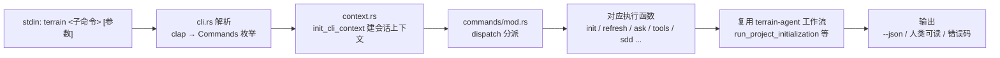

# 命令行工具（CLI）领域

**模块路径**：`crates/terrain-cli/src/`（cli.rs、main.rs、commands/*、util.rs）
**生成日期**：2026-09-21

---

## 概述

`terrain-cli` 是 Terrain 的命令行形态——桌面 GUI 的"孪生兄弟"。它不引入任何自己的业务逻辑，而是把 `terrain-agent` 的工作流与 `terrain-core` 的离线能力重新暴露成 15 个子命令。这意味着 CLI 与 GUI 永远行为一致：同一个 `run_project_initialization`/`ask_knowledge`，前端点按钮调 IPC，终端打 `terrain init`——底层是同一份代码，只是外壳不同。

把它想成**同一座图书馆的两扇门**：GUI 是装修豪华的阅览室（有目录卡片检索），CLI 是直通书库的密道（`terrain read-doc path` 一纸检索单直达）。CLI 的价值在自动化：CI/CD 里合入后刷知识、脚本里批量查 pack、外部 Agent 通过 `terrain tools` 九个 JSON 命令消费同一份知识资产——这些场景没有窗口、没有鼠标，只有 stdout。整个 CLI 的气质从 `SddPhaseArg` 的 `--phase`/`--project` 参数就能感受：**一切可自动化，一切可 JSON**。

---

## 核心功能点

1. **参数解析与分派（`cli.rs`）**：clap 定义 `Cli`/`Commands` 枚举；`commands/mod.rs` 提供 `dispatch()` 把枚举 → 实际执行函数。子命令按三个领域组织：**资产**（copy-skill、init、refresh、scan、agent-context、litho）、**工具**（tools、pack-meta、grep-pack、read-pack-file、read-context、search、read-doc、freshness、codegraph-drift）、**问答与管理**（ask、processes、sessions、sdd、env、settings、probe）。

2. **会话上下文（`context.rs`）**：范式的核心——命令之间通过 `init_context`（Tauri 桌面）或 `init_cli_context`（终端）共享 `SessionContext`（项目、回传库、可用性）。`UsageWindow ↔ App` 都复用同一个 context 骨架。

3. **工具套件（`commands/tools.rs`）**：**九个 JSON 命令**构成完整的 Agent API——`tools list-projects`、`tools pack-meta`、`tools grep-pack`、`tools read-pack-file`、`tools read-context`、`tools search`、`tools read-doc`、`tools freshness`、`tools codegraph-drift`，全部输出结构化 JSON。

4. **资产导入（`commands/assets.rs`）**：`copy-skill` 把 `.claude/` / `.agents/` skill 拷进项目的 `.terrain/` 知识结构；`import` 从磁盘/URL 导入资产库。

5. **SDD（`commands/sdd.rs`）**：`sdd` 子命令带 `SddPhaseArg`（`--phase requirement/design/implementation/code-review`）+ `--project` + `--input`。`commands/sdd.rs` 校验 `phase` 是否在枚举内。

6. **Settings 与健康检查（`commands/settings.rs`）**：`settings` 子命令带 `--json` 输出；`check-acp` / `probe-llm` 做环境探活。

---

## 关键组件

| 组件/类型 | 文件路径 | 核心职责 |
|---------|---------|---------|
| `Cli` / `Commands` 枚举 | `crates/terrain-cli/src/cli.rs` | clap 定义的参数模型与子命令枚举 |
| `dispatch` | `crates/terrain-cli/src/commands/mod.rs` | 枚举 → 执行函数分派 |
| `init_cli_context` | `crates/terrain-cli/src/context.rs` | 终端会话上下文（项目、回传库、可用性） |
| `init_context` | `crates/terrain-cli/src/context.rs` | Tauri 桌面会话上下文 |
| `tools` 九连 JSON 命令 | `crates/terrain-cli/src/commands/tools.rs` | Agent API：list-projects/pack-meta/grep-pack/read-pack-file/read-context/search/read-doc/freshness/codegraph-drift |
| `SddPhaseArg` | `crates/terrain-cli/src/cli.rs` | `--phase` 枚举（requirement/design/implementation/code-review） |
| `CopySkillArgs` / `ImportArgs` | `crates/terrain-cli/src/cli.rs` | 资产导入的参数模型 |

---

## 内部数据流

CLI 的生命周期是一条清晰的命令管线：解析 → 建上下文 → 分派 → 执行 → 序列化输出。`--json` 开关在前两层（参数解析与输出）影响行为，中间的执行路径完全复用。

**关键步骤说明**：
1. 解析（cli.rs）：`Cli::parse()` 把 argv 变成强类型枚举，非法参数在进入任何业务逻辑前被 clap 拒绝。
2. 上下文（context.rs）：`init_cli_context` 需要 `--project`（slug）定位知识目录，工具子命令借此复用完整项目状态。
3. 分派（commands/mod.rs）：`dispatch` 用可读的 `match` 语句把一个 `SubCommandInput` 分到什么 `Box<dyn Execute>`。
4. 复用（指向 `terrain-cli` 依赖）：四个后台子命令（scan/context/litho）与 GUI 走完全相同的 agent 工作流函数。
5. 输出：`status!` 宏统一生成人类可读状态块，`--json` 走结构化序列化。

---

## 关键接口与扩展点

- **`terrain <cmd> --json` 输出** 与 **`terrain tools` JSON API**：两类结构化接口是"脚本/Agent 消费"的入口，任何新命令都可复用 `--json` 约定。
- **扩展「新子命令」**：① `cli.rs` `Commands` 枚举加变体；② `commands/mod.rs` `dispatch` 加分支；③ 新 `commands/xxx.rs` 实现执行。三处即可，无需触碰外层。
- **`terrain` 15 个命令的 `--help`**：clap 自动生成，作为命令能力的自描述文档。
- **可脚本化**：`SddPhaseArg` 的 `--project`/`--input` 让 SDD 的某个阶段也能脱离 GUI 单独执行，支持 pipeline 式调用。

---

## 与其他模块的交互

| 交互模块 | 方向 | 接口/协议 | 说明 |
|---------|------|---------|------|
| `terrain-agent` | 依赖 | `run_project_initialization` / `run_quick_refresh` | 四个后台命令复用同一套工作流 |
| `terrain-core` | 依赖 | `ProjectScanner` / `KnowledgePaths` | 扫描、路径解析、会话/models 等离线能力 |
| `runtime` | 依赖 | `ask_knowledge` / 模型探测 | CLI ask 走与 GUI 相同的引擎 |
| 其他 crate | 依赖 | sch 域 / ipc / questions | 配置、启示模块与问题解析 |

---

## 跨模块协作场景

**在「自动化刷新一个仓库」中**：CI 里执行 `terrain refresh --project org/repo`——先在 context.rs 初始化项目上下文，然后 dispatch 到 refresh，refresh 内部调用 `run_quick_refresh`，后者复用 `ProjectScanner`、`agent_context`、`freshness`、可选 `litho` 的完整能力。这条链与 GUI 的"快速刷新"按钮完全重叠：**同一座文档工厂，两扇进厂的门**。

**在「外部 Agent 消费知识」中**：Agent 在工具调用里跑 `terrain tools search --project <slug> --query "..." --json`，得到 JSON 命中集合，再 `terrain tools read-pack-file --project <slug> --path src/lib/mod.ts --json` 取源码切片——与桌面 Ask 中模型用内建 Rust 工具做检索走的是**不同的外壳、相同的索引**。

---

## 性能考量

- **worker 池**：`main.rs` 用 `tokio` 的 worker 池调度异步命令，CLI 起步不会因默认 8 线程配置浪费。
- **数据即服务**：工具子命令的输出直接采核心库的既有查询结果（raw/已解析的输入/事件），不重复实现检索，因此 CLI 的存储开销与 GUI 一致。
- **子进程考虑**：CLI 本身是轻壳，重活全在 crate 调用内——不需要跨进程传递，省去序列化与 IPC 成本（GUI shell 与 core 通过 invoke 交互，CLI 直接内存调用）。

---

## 实现亮点

1. **同源双形态**：CLI 与 GUI 共享 `terrain-agent` 工作流，是"一份代码两个操控入口"的最直接证据；`SessionContext` 在两种形态间复用，连桌面窗口都能用一个 context 骨架初始化。
2. **`terrain tools` 是完整的 Agent API**：九个 JSON 命令把内部知识检索能力按协议化对外开放，让"外部 Agent + Terrain 共享同一份索引"成为可脚本化的现实。
3. **clap 强类型参数天花板**：`SddPhaseArg` 枚举 + `--project` 强制校验，减少了 shell 拼错参数导致的隐性错误；`--json` 统一开关让所有命令天然可融入流水线。
4. **水平依赖隔离**：CLI 不直接 import GUI 的 tauri 代码，只面向 `terrain-agent`/`terrain-core` 公共接口——Future 上桌面与终端形态可自由演进互不干扰。