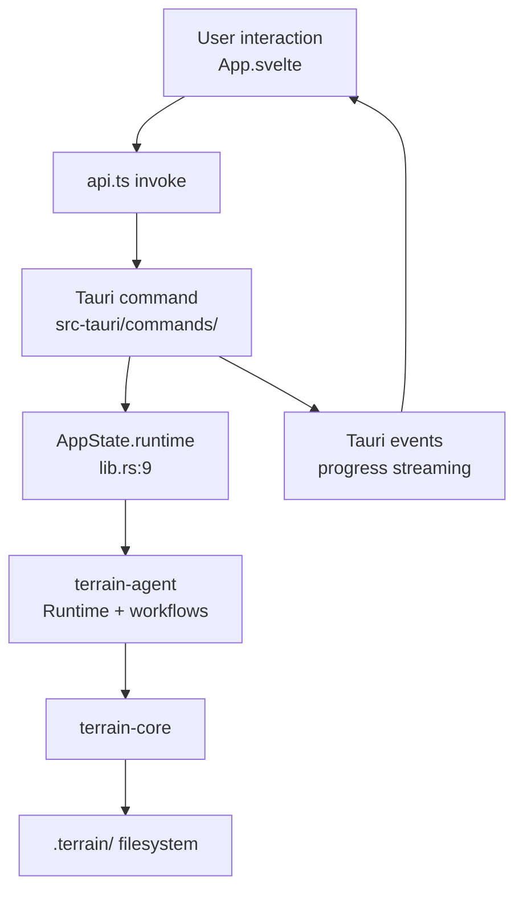

# desktop-app Domain

**Module path**: `src-tauri/src/` and `src/`
**Generated**: 2026-08-22

---

## What This Module Does

The desktop-app domain is Terrain's user-facing shell — a Tauri 2 native application with a Svelte 5 frontend that wraps all backend capabilities in a polished GUI. It is the bridge between human developers and Terrain's Rust backend: every button click in the UI becomes a Tauri `invoke` call to a Rust command, which delegates to terrain-agent or terrain-core. The desktop app also manages system tray integration, bundled tool initialization, and streaming progress events for long-running operations like Litho generation.

Without this layer, Terrain would be CLI-only. The desktop app makes knowledge browsing (Litho Book reader), DeepWiki Ask, SDD workflow, project management, and settings configuration accessible to developers who prefer graphical interfaces.

---

## Core Capabilities

1. **Tauri IPC command layer** — 30+ invoke commands in `src-tauri/src/commands/` wrapping terrain-agent workflows and terrain-core queries.

2. **Svelte 5 frontend** — Reactive UI with runes for state management, covering Ask/DeepWiki, SDD, Litho doc reader, project overview, env integration, usage monitoring, and settings.

3. **App bootstrap optimization** — `appBootstrap.ts` singleton deduplicates the `bootstrapApp` IPC call across main and usage windows.

4. **Streaming progress** — Long-running operations (Litho, SDD, init) emit Tauri events rather than blocking invoke returns.

5. **System tray** — Quick access to Usage monitor and main window toggle.

6. **Type-safe IPC** — Rust types exported via ts-rs to `src/lib/generated/`, ensuring frontend-backend contract consistency.

---

## Key Components

### Tauri Backend (`src-tauri/src/`)

| Component / Type | File Path | Responsibility |
|----------------|-----------|----------------|
| `AppState` | `src-tauri/src/lib.rs:9` | Holds `Runtime` and `ModelConfig` |
| `commands/workflows.rs` | `src-tauri/src/commands/workflows.rs` | Init, Litho, quick refresh IPC |
| `commands/knowledge.rs` | `src-tauri/src/commands/knowledge.rs` | Search, read, Ask IPC |
| `commands/sessions.rs` | `src-tauri/src/commands/sessions.rs` | Ask/SDD session management |
| `commands/assets.rs` | `src-tauri/src/commands/assets.rs` | Pack, plan, generate assets |
| `commands/env.rs` | `src-tauri/src/commands/env.rs` | Environment integration IPC |
| `commands/settings.rs` | `src-tauri/src/commands/settings.rs` | Model settings, clipboard, image export |
| `tray.rs` | `src-tauri/src/tray.rs` | System tray menu and window management |
| `preset_skills.rs` | `src-tauri/src/preset_skills.rs` | Resolve bundled skill directories |
| `bundled_tools.rs` | `src-tauri/src/bundled_tools.rs` | Initialize bundled CLI tools on startup |

### Svelte Frontend (`src/`)

| Component / Type | File Path | Responsibility |
|----------------|-----------|----------------|
| `App.svelte` | `src/App.svelte` | Main application shell and navigation |
| `api.ts` | `src/lib/api.ts` | Tauri invoke wrappers for all commands |
| `appBootstrap.ts` | `src/lib/appBootstrap.ts` | Singleton bootstrap cache |
| `DeepWikiPanel.svelte` | `src/lib/components/DeepWikiPanel.svelte` | Ask Q&A interface |
| `HumanDocTree.svelte` | `src/lib/components/HumanDocTree.svelte` | Litho doc browser |
| `ProjectOverviewPanel.svelte` | `src/lib/components/ProjectOverviewPanel.svelte` | Freshness and doc counts |
| `SettingsPanel.svelte` | `src/lib/components/SettingsPanel.svelte` | LLM/ACP configuration |
| `errorFormat.ts` | `src/lib/errorFormat.ts` | Error summary + detail formatting |
| `askShareImage.ts` | `src/lib/askShareImage.ts` | Ask answer PNG export pipeline |

---

## Internal Data Flow

**Key steps:**
1. User action in Svelte component calls a function from `api.ts`
2. `api.ts` invokes the corresponding Tauri command via `@tauri-apps/api/core`
3. Tauri command handler accesses `AppState` (managed state) and calls terrain-agent/core
4. Long operations emit progress events listened to by `App.svelte` via `@tauri-apps/api/event`
5. Results return through invoke Promise resolution to update Svelte reactive state

---

## Key Interfaces and Extension Points

- **Tauri capabilities ACL** — `src-tauri/capabilities/` defines which IPC commands and shell permissions are allowed
- **Generated types** — `bun run gen:types` exports Rust structs to `src/lib/generated/` via terrain-ts-export
- **i18n** — `src/lib/i18n/` provides zh-CN and en locales; `applyLocale` sets UI language from settings
- **Lazy-loaded panels** — Vite code-splitting loads SDD, Env, Help panels on demand

---

## Interactions with Other Modules

| Module | Direction | Interface | Description |
|--------|-----------|-----------|-------------|
| terrain-agent | Depends on | `Runtime`, workflow functions | All execution delegated to agent |
| terrain-core | Depends on | IPC types, search, freshness | Direct calls for read-only operations |
| Tauri plugins | Depends on | dialog, shell | File picker, shell command execution |
| Frontend (src/) | Contains | Svelte components | UI layer within same domain |

---

## Role in Core Business Flows

**In project initialization**: User clicks "Initialize" → `initializeProject` in `api.ts` → `commands/workflows.rs` → `run_project_initialization`. Progress bar updates via Tauri events.

**In Litho generation**: "Generate docs" button → `runLithoGeneration` → streams `LithoProgress` events. UI shows stage name and waiting message during ACP polling.

**In Ask Q&A**: `DeepWikiPanel.svelte` sends questions via `ask_knowledge_cmd`, listens for `AskStreamEvent` chunks (thinking, tool calls, answer text), and renders citations with source drawer navigation.

**In Ask share export**: `askShareImage.ts` mounts an off-screen `AskShareCard`, paginates long answers, rasterizes to PNG via native canvas, and copies to clipboard via `copy_image_to_clipboard` Tauri command.

---

## Performance Considerations

- `loadAppBootstrap()` deduplicates bootstrap IPC — shared across main and usage windows
- Vite `modulePreload` filters mermaid chunk to reduce first-screen preload size
- `scheduleIdle` defers non-critical UI updates to browser idle periods
- Human doc tree uses `findHumanOverviewDoc()` to locate overview doc in any supported language

---

## Implementation Highlights

The error display pipeline (`errorFormat.ts` → `ErrorNotice.svelte` → `StatusBanner.svelte`) provides a consistent pattern across all panels: errors have a short summary for the banner and an expandable detail section for debugging. Ask errors additionally carry `isError` and `errorDetail` fields on `ChatMessage` (`types.client.ts`), allowing the DeepWiki panel to distinguish LLM failures from network issues.
