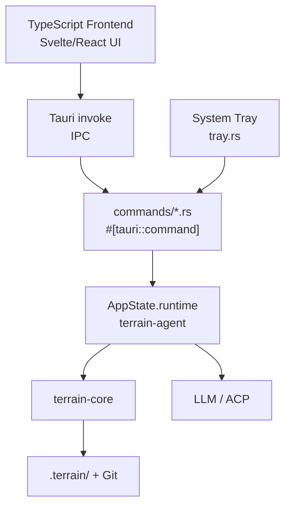

# desktop-app Domain

**Module path:** `src-tauri/`  
**Generated:** 2026-08-24

---

## What This Module Does

The desktop app is Terrain's visual control panel — a Tauri 2 shell that wraps the same `terrain-agent` runtime powering the CLI in a native GUI. It provides the project list with freshness scores, the Litho Book document reader, DeepWiki Ask chat, SDD workflow panels, settings management, and one-click environment integration.

If terrain-cli is the loading dock for scripts and automation, the desktop app is the mission control room for human developers who prefer clicking over typing.

---

## Core Capabilities

1. **Tauri IPC bridge** — 50+ `#[tauri::command]` handlers in `src-tauri/src/commands/` expose agent/core operations to the TypeScript frontend
2. **App bootstrap** — `bootstrap_app` returns project list, settings, and LLM/ACP status on startup
3. **Project management** — Initialize, scan, remove projects; save remarks; view freshness overviews
4. **Knowledge UI backend** — Search, read docs, trigger Litho generation, list human docs
5. **Ask session management** — Create, list, load, save, delete Ask chat sessions with streaming
6. **SDD session management** — Create, run, delete SDD workflow sessions per project
7. **System tray** — Background access and application lifecycle (`tray.rs`)
8. **Bundled resources** — Preset skills, env catalog, and bundled tools initialized at app startup

---

## Key Components

| Component / Type | File path | Core responsibility |
|-----------------|-----------|---------------------|
| `AppState` | `src-tauri/src/lib.rs:10` | Holds `Runtime` with paths and model config |
| `run` | `src-tauri/src/lib.rs:35` | Tauri builder, plugin init, command registration |
| `commands/` | `src-tauri/src/commands/` | IPC command implementations (13 files) |
| `tray.rs` | `src-tauri/src/tray.rs` | System tray menu and run event handling |
| `preset_skills.rs` | `src-tauri/src/preset_skills.rs` | Bundle preset skills into app resources |
| `env_catalog.rs` | `src-tauri/src/env_catalog.rs` | Bundle env catalog for `env apply` |
| `bundled_tools.rs` | `src-tauri/src/bundled_tools.rs` | Bundle CLI sidecars (terrain, RTK) |
| `terrain-ts-export` | `crates/terrain-ts-export/` | TypeScript type generation for IPC payloads |

---

## Internal Data Flow

**Key steps:**
1. `commands::init_paths()` resolves `KnowledgePaths` at startup (`lib.rs:42`)
2. Frontend calls `bootstrap_app` to get initial state
3. Long operations (Litho, init) emit `ProgressEvent` via IPC callbacks
4. Ask chat streams `AskStreamEvent` chunks to the UI

---

## Key Interfaces and Extension Points

- **Command registration**: New features add handler in `commands/` and register in `lib.rs:56-112`
- **Tauri plugins**: Dialog and shell plugins initialized at setup (`lib.rs:46-47`)
- **TypeScript types**: `terrain-ts-export` crate generates IPC payload types with `ts-rs`
- **Mobile entry point**: `#[cfg_attr(mobile, tauri::mobile_entry_point)]` on `run()` (`lib.rs:34`)

---

## Interactions with Other Modules

| Module | Direction | Interface | Description |
|--------|-----------|-----------|-------------|
| terrain-agent | Depends on | `Runtime`, all workflow functions | All AI operations via shared runtime |
| terrain-core | Depends on | Paths, freshness, search | Direct core calls for some IPC commands |
| TypeScript UI | Frontend | Tauri invoke API | React/Svelte frontend in app bundle |
| Tauri plugins | Depends on | dialog, shell | File picker, open in explorer |

---

## Role in Core Business Flows

**In project initialization**: `initialize_project_cmd` calls `run_project_initialization` with progress streaming to the UI.

**In Litho generation**: `generate_human_docs_cmd` and `run_litho_generation_cmd` trigger ACP Litho with `force_refresh` support for the "regenerate" button.

**In DeepWiki Ask**: `ask_knowledge_cmd` streams chunks, tool calls, and citations to the chat panel.

**In env integration**: `run_env_integration_cmd` executes `apply_env_integration` with progress events.

---

## Performance Considerations

- IPC calls are async; long Litho operations stream progress rather than blocking the UI
- Clipboard plugins (`copy_image_to_clipboard`, `copy_text_to_clipboard`) for doc export
- `save_png_files` for diagram/screenshot export from the UI
- Tracing initialized at `info,terrain=debug,terrain_core=debug` level (`lib.rs:38-40`)

---

## Implementation Highlights

- **Shared runtime with CLI**: `AppState` wraps the same `Runtime` struct used by terrain-cli, ensuring consistent behavior
- **Resource bundling**: Preset skills, env catalog, and tools are copied from app bundle at startup, not fetched from network
- **Freshness display**: `compute_freshness_cmd` and `read_project_freshness_cached_cmd` power the project list freshness badges
- **Open in explorer**: `open_repo_folder_cmd` and `open_local_path_cmd` use `open_path_in_file_manager` (core)
